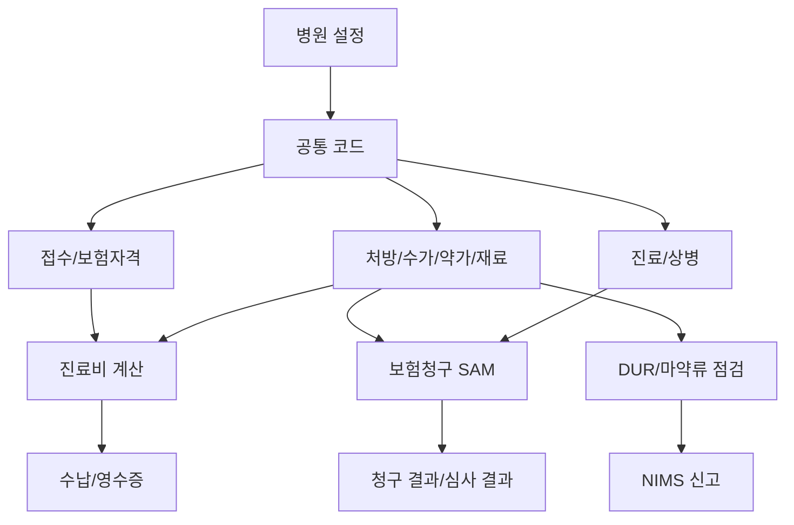
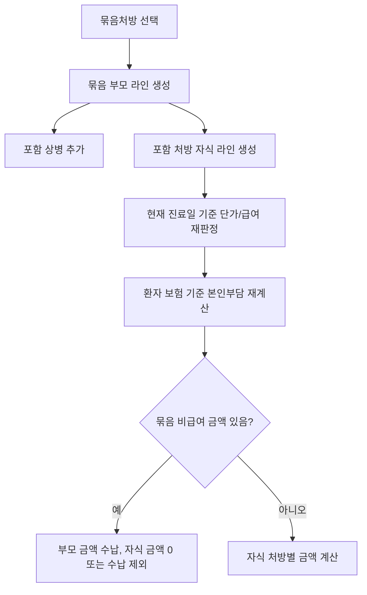
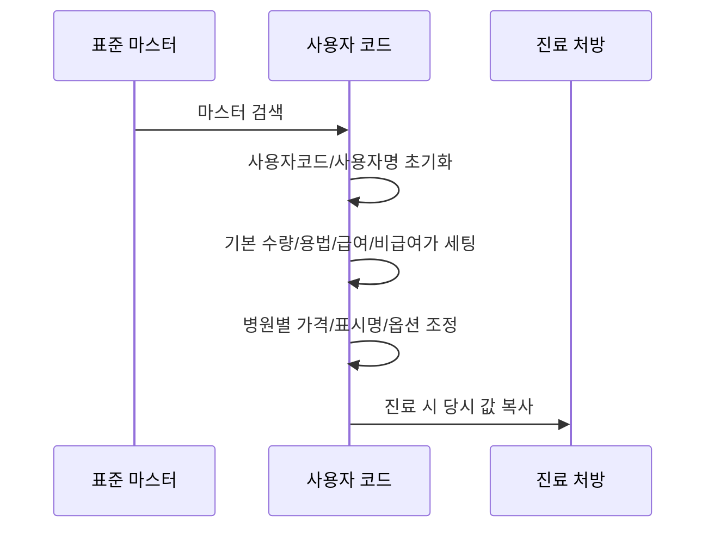
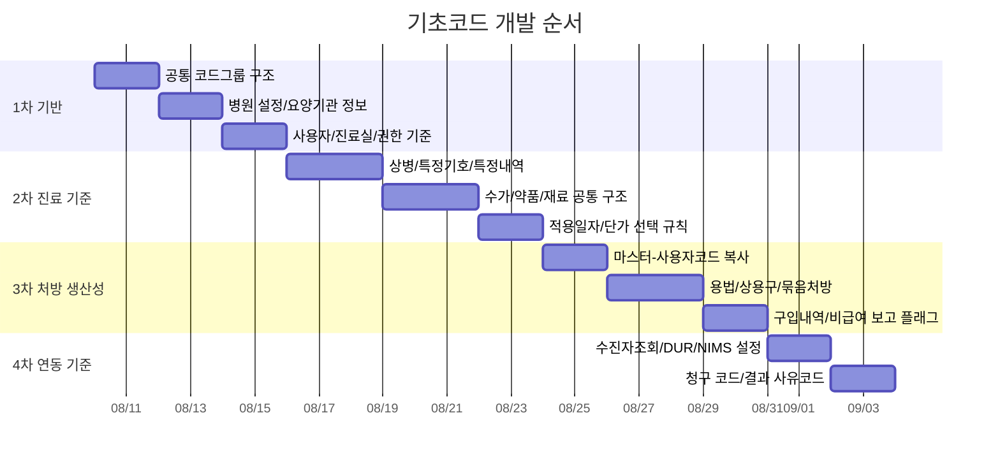

# Base Code Domain

대상: 피부/성형외과 EMR 개발팀  
목적: 접수, 진료, 처방, 수납, 청구, DUR, NIMS가 공통으로 참조하는 기초코드와 병원 설정을 개발언어에 종속되지 않는 형태로 정리한다.

## 1. 기초코드의 위치

기초코드는 단순 콤보박스 목록이 아니다. EMR에서는 기초코드가 다음 업무의 판단 기준이 된다.

개발 기준:

- 기준정보는 발생 데이터와 분리한다.
- 진료 발생 시에는 당시 코드명, 급여구분, 단가, 본인부담률, 항/목번호를 진료 데이터에 복사한다.
- 이후 마스터 코드가 변경되어도 과거 진료와 청구 금액이 바뀌면 안 된다.
- 적용일자가 있는 코드는 조회일이 아니라 진료일 기준으로 유효 값을 선택한다.

## 2. 기초코드 분류

| 분류 | 의미 | 대표 데이터 | 사용 업무 |
|---|---|---|---|
| 공통 코드그룹 | 화면 선택값과 업무 구분값 | 보험자, 진료과, 결제수단, 접수구분, 본인부담률, 항번호, 목번호 | 전 화면 |
| 병원 설정 | 요양기관 단위 고정 설정 | 요양기관기호, 사업자번호, 대표자, 주소, 종별가산, 청구 작성자, DUR/NIMS/자격조회 설정 | 자격조회, DUR, 청구, 출력 |
| 사용자/진료실 코드 | 병원 내부 운영 단위 | 진료실, 진료과, 의사/직원, 권한 | 접수, 진료 대기, 출력 |
| 진료 기준 마스터 | 실제 처방/청구 대상 | 상병, 약품, 수가, 치료재료, 원료약, 자체조제약, 성분명 | 진료, 계산, 청구 |
| 보험/청구 코드 | 심평원/보험 청구 판단 코드 | 특정기호, 특정내역, 의약분업 예외, 조정사유, 반송사유 | SAM 생성/수신 |
| 운영 보조 코드 | 업무 편의/운영 기준 | 묶음처방, 용법, 상용구, 공휴일, 공지, 우편번호 | 진료 입력, 출력, CRM |

## 3. 공통 코드그룹

공통 코드그룹은 `부모코드 + 자식코드` 구조로 관리한다. 화면에서는 코드명으로 보이지만, 저장과 외부 연동에는 코드값이 사용된다.

필수 저장 필드:

| 필드 | 뜻 | 규칙 |
|---|---|---|
| 코드그룹ID | 코드 묶음 식별자 | 예: 보험자구분, 진료과, 수납수단, 항번호 |
| 코드 | 실제 업무 코드 | 외부 연동 코드와 다르면 매핑 필드가 추가로 필요하다 |
| 코드명 | 화면 표시명 | 사용자가 이해하는 이름 |
| 부모코드 | 상위 그룹 또는 상위 코드 | 계층형 코드에 필요 |
| 정렬순서 | 화면 표시 순서 | 업무 빈도 높은 값 우선 |
| 삭제/사용여부 | 코드 사용 가능 여부 | 과거 데이터 때문에 물리 삭제보다 미사용 처리 |
| 비고/설명 | 코드 사용 조건 | 계산/청구 예외가 있으면 반드시 기록 |

대표 코드그룹:

| 코드그룹 | 뜻 | 주요 사용처 |
|---|---|---|
| 보험자 유형 | 건강보험, 의료급여, 일반, 자동차/산재 성격 구분 | 접수, 계산, 청구 분리 |
| 본인부담률 유형 | 30%, 50%, 80%, 90%, 100/100, 선별급여 등 | 처방 급여구분, 환자부담 계산, SAM |
| 진료과 | 병원 진료과목 | 자격조회, 청구, DUR |
| 접수/방문 유형 | 초진, 재진, 예약, 현장, 상담 등 | 접수 통계, 진료대기 |
| 결제수단 | 현금, 카드, 계좌, 복합결제 등 | 수납, 영수증, 마감 |
| 진료결과 | 계속, 종료, 회송, 사망 등 | 청구 명세서 |
| 항번호/목번호 | 청구 항목 분류 | 처방 라인, SAM 처방 레코드 |
| 의약분업 예외 | 원내 조제/투약 예외 사유 | 약 처방, 처방전, SAM 특정내역 |
| DUR 취소 사유 | 점검 취소/재점검 사유 | DUR 취소 전문 |
| NIMS 코드 | 마약/향정, 입출고, 보고구분, 저장소 등 | 마약류 구매/투약/조제 신고 |

개발 주의:

- 코드값은 화면명 변경과 무관하게 안정적으로 유지한다.
- 외부기관 코드와 병원 내부 코드가 다르면 매핑 테이블을 둔다.
- 보험/청구/마약류 관련 코드는 임의 삭제를 막고 변경 이력을 남긴다.

## 4. 병원 설정

병원 설정은 요양기관 단위로 하나의 기준값 세트를 가진다. 접수 화면에 보이지 않더라도 청구, DUR, 수진자조회, 출력에서 사용된다.

필수 저장 필드:

| 필드 | 뜻 | 사용 업무 |
|---|---|---|
| 요양기관기호 | 병원을 식별하는 기관 코드 | 수진자조회, DUR, SAM 청구, NIMS |
| 병원명 | 요양기관명 | 출력물, 청구 |
| 진료과 | 병원 대표 진료과 | 자격조회, DUR, 청구 |
| 사업자등록번호 | 세무/영수증 기준 번호 | 영수증, 병원 정보 |
| 대표자명/생년월일 | 청구 작성자 검증과 기관 정보 | SAM 청구, 문서 출력 |
| 전화/FAX | 병원 연락처 | 출력물, 청구 보조 |
| 주소/우편번호 | 병원 소재지 | 출력물, 청구 |
| 요양기관 종별 | 의원/병원/종합병원 등 | 종별가산, 상대가치점수 단가 |
| 종별가산률 | 진료일 기준 가산률 | 수가 계산 |
| 상대가치점수 단가 | 진료일 기준 점수당 단가 | 수가 계산 |
| 의약분업 예외지역 여부 | 병원이 예외지역인지 여부 | 약 처방 원내외 판단 |
| 심평원 지원 코드 | 본원/서울/부산/대구/광주/대전/수원/창원 등 | SAM 청구 |
| 청구 S/W 업체코드 | 청구 프로그램 공급자 코드 | SAM 청구, DUR |
| 대행청구 사용 여부 | 대행청구 여부 | SAM 청구 작성자 정보 |
| 대행청구기관 코드/명 | 대행기관 정보 | SAM 청구 |
| 청구 작성자명/생년월일 | 직접 또는 대행 청구 작성자 | SAM 청구 |
| 수진자조회 승인번호/URL | 자격조회 연동 정보 | 수진자조회 |
| DUR 승인번호 | DUR 연동 승인번호 | DUR 점검/취소 |
| NIMS API URL/기관 설정 | 마약류 연동 기준 | NIMS 구매/투약/조제 |
| 직인 경로 | 병원 직인 이미지 | 출력물 |
| 영문 병원명/주소 | 영문 출력물 | 영문 진단서/확인서 |

적용일자 설정:

| 설정 | 기준 |
|---|---|
| 종별가산률 | 진료일 이하 중 가장 최근 적용일 |
| 상대가치점수 단가 | 진료일 이하 중 가장 최근 적용일 |
| 의료급여/건강보험별 가산률 | 보험자 유형별로 별도 선택 |

## 5. 처방 기준코드 공통 구조

처방 기준코드는 실제 진료 입력의 출발점이다. 약품, 수가, 치료재료, 원료약, 자체조제약, 성분명, 묶음처방이 모두 처방 후보가 된다.

공통 필드:

| 필드 | 뜻 | 규칙 |
|---|---|---|
| 마스터ID | 심평원/공급자 기준 마스터 식별자 | 표준 마스터와 병원 사용자코드를 연결 |
| 사용자코드ID | 병원별 사용자 코드 식별자 | 병원에서 등록한 코드는 별도 ID 필요 |
| 표준코드 | 심평원/약가/수가/재료 코드 | 청구와 외부연동 기준 |
| 사용자코드 | 병원 내부 검색/표시 코드 | 마스터 복사 시 표준코드로 초기화 가능 |
| 표준명 | 마스터 명칭 | 외부 고시 기준 |
| 사용자명 | 병원 표시명 | 진료 화면 검색/출력 |
| 처방유형 | 약품/수가/재료/원료약/자체약/성분/묶음 | 계산과 청구 레코드 분기 |
| 항번호 | 청구 항 분류 | SAM 처방 레코드 |
| 목번호 | 청구 목 분류 | SAM 처방 레코드 |
| 급여 가능 여부 | 보험 처방 가능 여부 | 보험자 유형과 함께 급여/비급여 결정 |
| 기본 본인부담률 | 코드 단위 부담률 | 선별/100/100 등 별도 부담률 판단 |
| 처방전 출력 여부 | 원외처방전 표시 대상 여부 | 처방전/라벨 |
| 적용일자 목록 | 일자별 단가/급여/명칭 이력 | 진료일 기준 선택 |

적용일자 필드:

| 필드 | 뜻 | 규칙 |
|---|---|---|
| 적용일 | 해당 단가/급여 기준 시작일 | 진료일 이하 최신 행 선택 |
| 적용명 | 해당 시점의 명칭 | 과거 명칭 보존 |
| 급여기준 | 급여/비급여/삭제 등 | 삭제 상태면 신규 처방 제한 |
| 본인부담률 | 코드별 환자부담률 | 없으면 보험자/환자 기준 계산 |
| 급여단가 | 보험 계산 단가 | 유형별 세부 필드에서 산정 |
| 비급여단가 | 비급여 수납 단가 | 병원별 조정 가능 |

## 6. 약품 코드

약품 코드는 처방, DUR, 마약류, 원외처방전, 청구에 모두 연결된다.

필수 저장 필드:

| 필드 | 뜻 | 사용처 |
|---|---|---|
| 약품코드 | 약가/청구 코드 | 처방, SAM, DUR |
| 주성분코드 | DUR 점검 기준 성분 | DUR 병용/중복/금기 |
| 투여경로 | 내복/외용/주사 등 | 처방 기본값, DUR, NIMS |
| 제약회사 | 공급/표시 정보 | 약품 검색 |
| 단위/규격 | 처방 수량 단위 | 처방전, 청구 |
| 전문/일반 구분 | 전문의약품 여부 | 처방 관리 |
| 의약품동등성/저가대체 | 대체 가능 여부 | 처방 안내 |
| 퇴장방지 여부 | 사용장려비 대상 | 청구 추가 레코드 |
| 희귀의약품 여부 | 특수 약제 여부 | DUR/청구 확인 |
| 의약분업 예외코드 목록 | 원내 조제 가능 사유 | 원내 처방, SAM 특정내역 |
| 임의조제불가/마약류 구분 | 마약/향정/기타 | NIMS, 의료쇼핑 방지 |
| 기본 1회량/1일횟수/총일수 | 처방 입력 기본값 | 진료 입력 |
| 기본 용법 | 복약 지시 | 처방전 |
| 원외 여부 | 기본 원외처방 여부 | 처방전, 약국 조제 |
| 비급여 보고 대상 여부 | 비급여 보고 포함 여부 | 매년 비급여 보고 |

약품 단가 적용 규칙:

| 구분 | 규칙 |
|---|---|
| 급여 약품 | 실구입가가 있으면 상한가와 실구입가 중 낮은 금액을 기준으로 사용할 수 있다 |
| 비급여 약품 | 비급여단가를 사용한다 |
| 삭제 적용일 | 신규 처방은 제한하되 과거 처방 조회를 위해 이력은 보존한다 |
| 구입가 초기화 | 마스터를 사용자코드로 복사할 때 실구입가는 병원 값이 아니므로 비운다 |
| 마약/향정 판정 | 적용일자 상세의 임의조제불가 구분이 마약/향정이면 처방 코드에도 마약류 구분을 세팅한다 |

## 7. 수가 코드

수가 코드는 진찰료, 검사료, 처치료, 수술료 등 의료행위 기준이다.

필수 저장 필드:

| 필드 | 뜻 | 사용처 |
|---|---|---|
| 수가코드 | 행위 청구 코드 | 처방, SAM |
| 수가명 | 행위명 | 진료 입력, 출력 |
| 산정명/산정코드 | 같은 수가의 산정 세부 구분 | 청구, 진료 표시 |
| 항번호/목번호 | 청구 분류 | SAM |
| 상대가치점수 | 급여 수가 산정 기준 | 진료비 계산 |
| 의원/병원급 단가 | 종별별 단가 | 계산 |
| 종별가산 여부 | 가산 적용 가능 여부 | 계산 |
| 중복인정 여부 | 같은 수가 반복 산정 가능 여부 | 처방 검증 |
| 수술 여부 | 수술 행위 여부 | 청구/통계 |
| 공상/보훈 등 특수 여부 | 특수 보험 처리 | 청구 |
| 기본 1일횟수/총일수 | 진료 입력 기본값 | 처방 입력 |
| 수탁기관 코드 | 위탁검사 기관 | 위탁검사, 특정내역 |
| 검사부서/면허번호 | 검사/청구 보조 정보 | 청구, 출력 |
| 비급여 보고 대상 여부 | 비급여 보고 포함 여부 | 비급여 보고 |

수가 기본 생성 규칙:

- 신규 수가 사용자코드는 기본 `1일횟수=1`, `총일수=1`로 시작한다.
- 신규 수가의 적용일자는 오늘 날짜, 기본 급여기준은 비급여로 시작한다.
- 마스터 수가를 사용자코드로 복사할 때 비급여단가는 현재 급여단가로 초기화할 수 있다.
- 산정명이 있으면 사용자 표시명에 산정명을 붙여 구분한다.

## 8. 치료재료 코드

치료재료는 급여/비급여 처치 재료, 시술 재료, 소모품 계산에 사용된다.

필수 저장 필드:

| 필드 | 뜻 | 사용처 |
|---|---|---|
| 치료재료코드 | 청구 재료 코드 | 처방, SAM |
| 규격/단위 | 재료 규격 | 처방, 출력 |
| 제조/수입사 | 공급 정보 | 재료 관리 |
| 품질/등급 | 재료 품질 정보 | 청구/관리 |
| 실구입가 | 병원 구입 단가 | 급여 재료 계산 |
| 상한가 | 보험 상한 금액 | 급여 재료 계산 |
| 비급여단가 | 비급여 수납 금액 | 수납 |
| 구입내역 | 구입일, 수량, 금액, 단가 | 구입내역 통보, 단가 계산 |
| 중복가능 여부 | 같은 재료 반복 인정 여부 | 처방 검증 |
| 비급여 보고 대상 여부 | 보고 대상 여부 | 비급여 보고 |

기본 생성 규칙:

- 신규 치료재료는 기본 `항번호=08`, `목번호=01`로 시작한다.
- 기본 `1일횟수=1`, `총일수=1`이다.
- 마스터 복사 시 비급여단가는 상한가로 초기화하고 실구입가는 병원 값이 아니므로 비운다.
- 구입내역 기반으로 생성된 적용일자 행은 별도 표시가 필요하다.

## 9. 원료약/자체조제약/성분명

| 유형 | 뜻 | 핵심 필드 | 개발 기준 |
|---|---|---|---|
| 원료약 | 병원 조제에 쓰는 원료 약품 | 원료코드, 성분, 규격, 단위, 단가, 구입내역, 용법 | 기본 항번호는 약제 계열이며 1회량/1일횟수/총일수를 가진다 |
| 자체조제/제제약 | 병원이 자체 조제 또는 제제한 약 | 자체약코드, 조제구분, 규격, 단위, 효능, 용법, 구입내역 | 비급여 기본으로 시작하고 구입내역을 관리한다 |
| 성분명 | 성분 처방 또는 일반명 검색 기준 | 성분코드, 투여경로, 기본 수량, 용법 | 원외처방 성격이 강하며 약품 코드와 구분한다 |

기본 생성 규칙:

- 원료약과 자체조제약은 기본 `1회량=1`, `1일횟수=3`, `총일수=3`으로 시작한다.
- 기본 급여기준은 비급여이다.
- 원료약/자체조제약의 본인부담률은 일반 처방 본인부담률과 별도로 보지 않는다.
- 성분명 코드는 원외처방만 가능하다는 전제로 처리한다.

## 10. 상병 코드

상병 코드는 진료 기록이면서 청구 명세서의 기준이다.

필수 저장 필드:

| 필드 | 뜻 | 사용처 |
|---|---|---|
| 상병코드 | KCD 질병분류 코드 | 진료 상병, 청구 |
| 사용자 상병코드 | 병원 검색/표시 코드 | 진료 입력 |
| 상병명/영문명 | 진단명 | 진단서, 영문 출력 |
| 진료과 | 상병 관련 진료과 | 검색/통계 |
| 적용일자 | 상병 유효 시작일 | 진료일 기준 검증 |
| 불완전/주상병 불가 여부 | 청구 제한 기준 | 진료 입력 검증 |
| 성별/연령 제한 | 환자 조건 검증 | 진료 입력 검증 |
| 감염병/특수분류 | 신고/경고 기준 | 진료 입력 |

개발 기준:

- 같은 진료에 같은 상병코드를 중복 등록하지 않는다.
- 주상병은 최소 1개가 필요하다.
- 산정특례가 있는 환자는 주상병과 특례 상병코드를 비교해 특정기호 자동 적용 여부를 판단한다.

## 11. 특정기호와 특정내역

| 구분 | 뜻 | 저장 필드 | 사용처 |
|---|---|---|---|
| 특정기호 | 산정특례, 본인부담특례, 제도상 특수 청구 기호 | 코드, 명칭, 시작일, 종료일, 유형, 산정특례 연결코드 | 환자 보험, 진료 상병, 청구 |
| 특정내역 | 명세서/줄번호/처방전 단위로 청구에 추가하는 상세정보 | 코드, 명칭, 상세값, 발생단위, 처방라인ID, 비고 | SAM E 레코드 |
| 의약분업 예외코드 | 원내 조제/투약 예외 사유 | 코드, 명칭, 예외 설명 | 약 처방, 청구 특정내역 |
| 반송/불능 사유코드 | 청구 결과 사유 | 코드, 명칭 | 청구 결과 분석, 재청구 |
| 심사조정 사유코드 | 삭감/조정 사유 | 코드, 명칭, 상세사유 | 심사결과, 이의신청 |

특정내역 발생단위:

| 단위 | 뜻 | 매핑 |
|---|---|---|
| 명세서 | 진료 청구 건 전체에 붙는 특정내역 | 명세서 ID |
| 줄번호 | 처방 라인에 붙는 특정내역 | 처방라인 ID |
| 처방내역 줄번호 | 원외처방전 라인에 붙는 특정내역 | 처방전 라인 |
| 처방내역 | 처방전 전체에 붙는 특정내역 | 처방전 ID |

## 12. 용법, 진료실, 수탁기관, 공휴일

| 코드 | 뜻 | 필수 필드 | 사용처 |
|---|---|---|---|
| 용법 | 복약 지시 문구 | 용법코드, 명칭, 상세내용 | 약 처방, 처방전 |
| 진료실 | 대기/진료 배정 공간 | 진료실ID, 명칭, 색상, 진료과 | 접수, 대기실, 진료 |
| 수탁기관 | 외부 검사기관 | 기관코드, 명칭, 종별, 종별가산, 적용일자별 등급 | 위탁검사, 청구 특정내역 |
| 공휴일 | 휴일 정보 | 날짜, 명칭 | 예약, 진료일 검증, 가산 판단 |
| 상용구 | 진료기록 문구 | 코드, 제목, 내용 | 진료기록, 출력 |
| 공지 | 시스템/기관 공지 | 제목, 내용, 공지일, URL, 공지여부 | 운영 안내 |

## 13. 묶음처방 코드

묶음처방은 피부/성형외과에서 자주 쓰이는 패키지/세트 시술의 기준이 된다.

필수 저장 필드:

| 필드 | 뜻 | 규칙 |
|---|---|---|
| 묶음ID | 묶음처방 식별자 | 내부 식별자 |
| 묶음코드 | 병원 표시/검색 코드 | 사용자코드로 사용 |
| 묶음명 | 세트명 | 진료 입력 표시 |
| 설명 | 묶음 설명 | 상담/진료 보조 |
| 묶음그룹 | 상위 분류 | 시술군/진료군 관리 |
| 항번호/목번호 | 묶음 부모 라인의 청구 분류 | 비급여 패키지 수납 시 사용 |
| 비급여 수납금액 | 묶음 전체 금액 | 자식 처방 금액 처리와 연결 |
| 포함 상병 | 묶음 적용 시 자동 추가할 상병 | 진료 입력 |
| 포함 처방 | 묶음 적용 시 자동 추가할 수가/약/재료 | 진료 입력, 계산 |
| 정렬순서 | 표시 순서 | 검색/선택 화면 |

묶음처방 적용 규칙:

개발 주의:

- 묶음의 자식 처방은 부모와 연결되어야 한다.
- 자식 처방은 현재 진료일 기준으로 다시 단가를 선택한다.
- 과거 묶음을 복사할 때도 현재 보험과 진료일 기준으로 급여 여부를 재판정한다.

## 14. 마스터 코드와 사용자 코드

EMR의 처방 코드는 표준 마스터를 그대로 쓰는 것이 아니라 병원별 사용자 코드로 복사해서 사용한다.

마스터에서 사용자코드로 복사할 때 공통 규칙:

| 항목 | 규칙 |
|---|---|
| CurrentIsMaster | 사용자코드로 전환되면 마스터 상태가 아니다 |
| 사용자코드 | 기본값은 표준코드 |
| 사용자명 | 기본값은 표준명 |
| 내부 ID | 신규 사용자코드로 저장되도록 초기화 |
| 수량 기본값 | 각 처방유형의 신규 생성 기본값을 따른다 |
| 급여구분 | 적용일자 기준 급여이면 급여 처방, 아니면 비급여 처방 |
| 본인부담률 | 코드의 본인부담률이 있으면 본인부담률 코드로 변환 |
| 비급여단가 | 약/재료는 상한가, 수가는 급여단가, 원료약은 현재 단가로 초기화 가능 |
| 실구입가 | 병원 사용자 값이므로 마스터 복사 시 비운다 |
| 마약류 구분 | 마약/향정이면 NIMS와 의료쇼핑 방지 대상 플래그를 세팅한다 |

약품 복사 예외:

| 조건 | 처리 |
|---|---|
| 기본 약품 | `1회량=1`, `1일횟수=3`, `총일수=3`, 원외처방 기본 |
| 주사 계열 | `1회량=1`, `1일횟수=1`, `총일수=1`, 원내처방 기본 |
| 원내 주사 코드 | 필요한 경우 주사 행위코드 기본값 부여 |
| 외용 계열 | `1회량=1`, `1일횟수=1`, `총일수=1`, 원외처방 가능 |
| 마약/향정 | 마약류 구분 자동 세팅 |

## 15. 구입내역과 가중평균

약품, 원료약, 자체조제약, 치료재료는 병원 구입내역이 단가와 신고에 영향을 줄 수 있다.

구입내역 필드:

| 필드 | 뜻 | 규칙 |
|---|---|---|
| 구입일 | 품목을 구입한 날짜 | 적용일자 생성 기준 |
| 구입량 | 구매 수량 | 단가 계산 |
| 구입금액 | 총 구매금액 | 단가 계산 |
| 개별단가 | 구입금액 / 구입량 | 자동 계산 |
| 신고여부 | 구입내역 통보 여부 | 치료재료/약제 구입내역 통보와 연결 |

가중평균/구입단가 개발 기준:

- 구입내역은 처방 적용일자와 분리 저장한다.
- 구입내역이 단가에 반영되면 자동 생성된 적용일자 행인지 표시한다.
- 보험 청구나 구입내역 통보가 끝난 구입내역은 임의 수정/삭제를 제한한다.
- 치료재료와 자체조제약은 구입내역 통보 문서와 연결될 수 있다.

## 16. 기초코드 개발 순서

우선순위:

| 순서 | 개발 범위 | 완료 기준 |
|---|---|---|
| 1 | 공통 코드그룹 | 접수/진료/수납/청구 화면에서 필요한 선택값을 코드로 저장 가능 |
| 2 | 병원 설정 | 요양기관기호, 청구 작성자, DUR/NIMS/자격조회 설정 저장 가능 |
| 3 | 상병/특정기호 | 진료 상병과 산정특례/특정내역 연결 가능 |
| 4 | 처방 기준코드 | 수가/약품/재료/원료약/자체약을 검색하고 진료에 복사 가능 |
| 5 | 적용일자 단가 | 진료일 기준 급여/비급여/단가 선택 가능 |
| 6 | 마스터→사용자코드 | 표준 마스터를 병원 코드로 복사하고 기본값 자동 세팅 가능 |
| 7 | 묶음처방 | 세트 처방을 상병/처방으로 확장 가능 |
| 8 | 구입내역 | 구매 내역과 단가/통보/신고 연결 가능 |
| 9 | 외부연동 설정 | 수진자조회, DUR, NIMS, SAM에서 병원 설정 참조 가능 |

## 17. 테스트 시나리오

| 시나리오 | 확인 |
|---|---|
| 공통 코드 비활성화 | 신규 입력에서는 숨기고 과거 데이터 조회에서는 명칭이 유지되는가 |
| 병원 설정 저장 | 요양기관기호와 청구 작성자 정보가 SAM 생성에 반영되는가 |
| 수가 적용일자 | 같은 수가라도 진료일에 따라 단가가 다르게 선택되는가 |
| 약품 마스터 복사 | 사용자코드, 기본 수량, 원외 여부, 비급여가, 마약류 구분이 자동 세팅되는가 |
| 치료재료 복사 | 항/목 기본값과 상한가 기반 비급여가가 세팅되는가 |
| 상병 등록 | 주상병 중복/불완전/성별/연령 제한을 검증하는가 |
| 특정기호 | 환자 산정특례와 상병 기준으로 특정기호가 연결되는가 |
| 묶음처방 | 부모/자식 관계가 유지되고 현재 진료일 기준으로 단가가 재판정되는가 |
| 구입내역 | 구입량/구입금액으로 개별단가가 계산되고 적용일자와 연결되는가 |
| 위탁검사 | 수탁기관 코드가 있으면 위탁검사 특정내역 생성 대상이 되는가 |
| DUR 설정 | 병원 DUR 승인번호와 공급자 코드가 DUR 요청에 들어가는가 |
| NIMS 설정 | 병원 마약류 설정과 약품 마약류 구분이 신고 대상 추출에 쓰이는가 |

## 18. 현재 소스 기준 확인 위치

| 영역 | 기준 파일 |
|---|---|
| 코드 저장소 등록 | `Data/UBerSoft.EMR.Data/Module.cs` |
| 공통 코드 컨텍스트 | `Data/UBerSoft.EMR.Data/CodeContext.cs` |
| 코드그룹 조회 | `Data/UBerSoft.EMR.Data/Repositories/Codes/CodeRepository.cs` |
| 읽기전용 청구 사유 코드 | `Data/UBerSoft.EMR.Data/Repositories/Codes/ReadOnlyCodeRepository.cs` |
| 병원 설정 | `Data/UBerSoft.EMR.Data.Models/Codes/Hospital.cs`, `Data/UBerSoft.EMR.Data/Repositories/Codes/HospitalRepository.cs` |
| 처방 기준 공통 | `Data/UBerSoft.EMR.Data.Models/Codes/Primitive/Prescribe.cs`, `Data/UBerSoft.EMR.Data.Models/Codes/Primitive/PrescribeApplyDate.cs` |
| 마스터 코드 저장소 | `Data/UBerSoft.EMR.Data/Repositories/MasterRepositoryBase.cs`, `Data/UBerSoft.EMR.Data/Repositories/Codes/PrescribeRepositoryBase.cs` |
| 마스터→사용자코드 전환 | `Data/UBerSoft.EMR.Data/Services/Codes/Concrete/MasterToUserService.cs` |
| 약품 코드 | `Data/UBerSoft.EMR.Data.Models/Codes/Drug.cs`, `Data/UBerSoft.EMR.Data.Models/Codes/DrugApplyDate.cs`, `Data/UBerSoft.EMR.Data/Controllers/Codes/Concreate/DrugPriceController.cs` |
| 수가 코드 | `Data/UBerSoft.EMR.Data.Models/Codes/MedicalAction.cs`, `Data/UBerSoft.EMR.Data.Models/Codes/MedicalActionApplyDate.cs`, `Data/UBerSoft.EMR.Data/Controllers/Codes/Concreate/MedicalActionController.cs` |
| 치료재료 코드 | `Data/UBerSoft.EMR.Data.Models/Codes/TreatmentMaterial.cs`, `Data/UBerSoft.EMR.Data.Models/Codes/TreatmentMaterialApplyDate.cs`, `Data/UBerSoft.EMR.Data/Controllers/Codes/Concreate/TreatmentMaterialPriceController.cs` |
| 원료약/자체조제약/성분명 | `Data/UBerSoft.EMR.Data.Models/Codes/Material.cs`, `Data/UBerSoft.EMR.Data.Models/Codes/SelfDrug.cs`, `Data/UBerSoft.EMR.Data.Models/Codes/Component.cs` |
| 상병/특정기호/특정내역 | `Data/UBerSoft.EMR.Data.Models/Codes/Disease.cs`, `Data/UBerSoft.EMR.Data.Models/Codes/SpecificCode.cs`, `Data/UBerSoft.EMR.Data.Models/Codes/SpecificDetail.cs` |
| 묶음처방 | `Data/UBerSoft.EMR.Data.Models/Codes/Bundles/Bundle.cs`, `Data/UBerSoft.EMR.Data/Repositories/Codes/BundleRepository.cs` |
| 엑셀 입출력 | `Data/UBerSoft.EMR.Data/Repositories/Codes/ExcelRepository.cs` |
