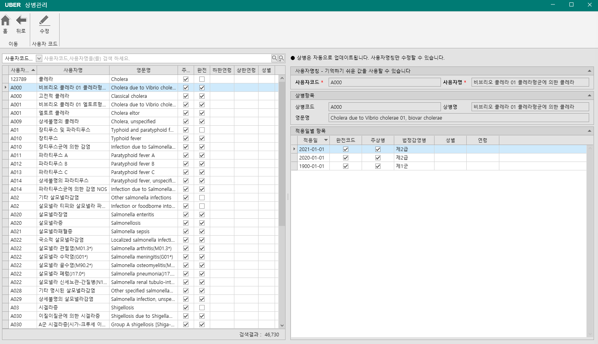
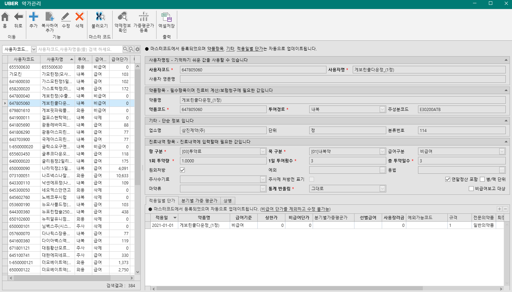
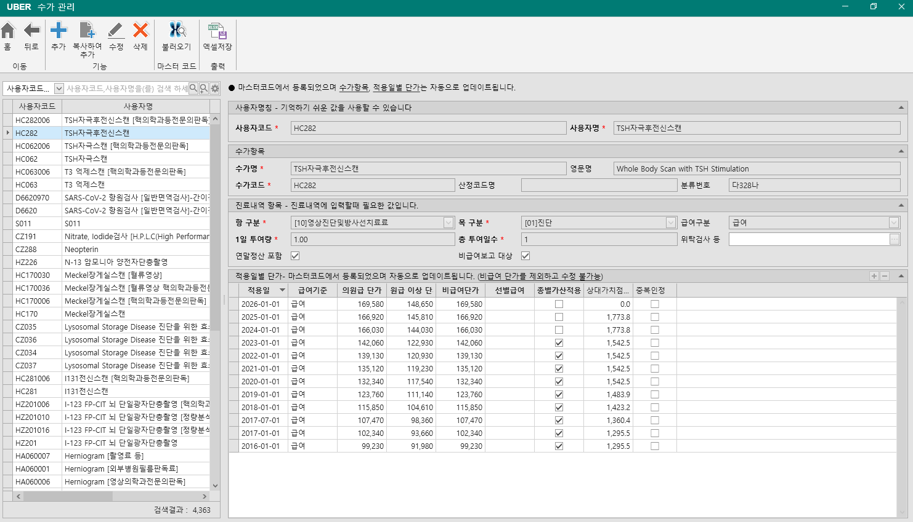
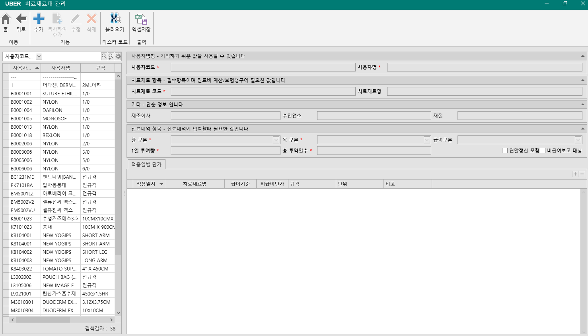
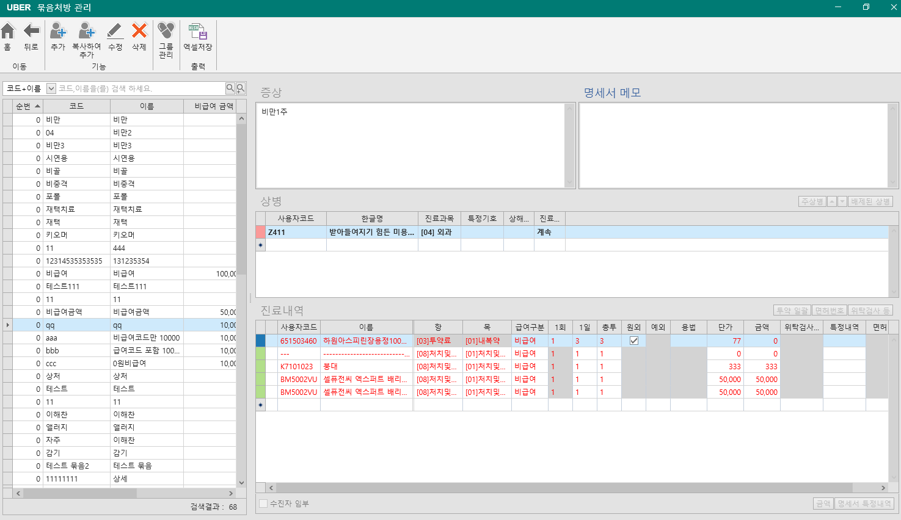

# 기초자료 화면 개발 요구사항

목적: 기초자료 화면 스크린샷 기준으로 청구 S/W 개발에 필요한 필드, 기능, 필수 여부를 정리한다.

작성 방식: 짧게 쓴다. 화면에 보이는 항목과 개발에 필요한 데이터만 쓴다.

필수 기준:

| 구분 | 기준 |
| --- | --- |
| 필수 | 청구 S/W 기본 업무, 청구자료 생성, 진료비 계산, 보험청구에 필요 |
| 조건부 | 병원 운영 방식이나 계약 기능에 따라 필요 |
| 비필수 | 청구 S/W 핵심 기능 없이도 운영 가능 |
## 1. 기초코드 - 상병관리

### 1.1 화면 개요

| 항목 | 내용 |
| --- | --- |
| 화면명 | 상병관리 |
| 화면 위치 | 기초자료 > 처방코드 > 상병 |
| 화면 목적 | 진료에 사용할 상병코드 조회, 사용자명칭 관리 |
| 사용 시점 | 진료 상병 입력 전, 상병명칭 보정 시 |
| 청구 S/W 필수 여부 | 필수 |
| 이유 | 보험청구 명세서의 상병코드, 주상병, 특정기호 판단 기준 |

### 1.2 화면 구성

| 영역 | 필수 여부 | 설명 |
| --- | --- | --- |
| 상단 이동 버튼 | 필수 | 홈, 뒤로 |
| 수정 버튼 | 조건부 | 사용자코드/사용자명 수정 |
| 좌측 상병 목록 | 필수 | 상병 검색/선택 |
| 우측 사용자명칭 | 조건부 | 병원에서 기억하기 쉬운 명칭 관리 |
| 우측 상병항목 | 필수 | 표준 상병코드/상병명/영문명 확인 |
| 우측 적용일별 항목 | 필수 | 진료일 기준 상병 속성 확인 |

### 1.3 상단 기능 버튼

| 버튼 | 필수 여부 | 기능 |
| --- | --- | --- |
| 홈 | 조건부 | 기초자료 홈으로 이동 |
| 뒤로 | 조건부 | 이전 화면으로 이동 |
| 수정 | 조건부 | 사용자코드/사용자명 수정 |

개발 규칙:

| 규칙 | 필수 여부 |
| --- | --- |
| 상병 마스터는 자동 업데이트 대상 | 필수 |
| 사용자가 표준 상병코드/상병명/영문명 직접 수정 불가 | 필수 |
| 사용자가 수정 가능한 값은 사용자코드/사용자명 중심 | 필수 |
| 수정은 기초자료 권한 필요 | 필수 |

### 1.4 상병 검색 영역

| 항목 | 필수 여부 | 설명 |
| --- | --- | --- |
| 검색조건 | 필수 | 사용자코드, 사용자명, 영문명 |
| 검색어 | 필수 | 상병 검색어 |
| 일반 검색 | 필수 | 검색어로 시작하는 항목 조회 |
| 확장 검색 | 필수 | 검색어가 포함된 항목 조회 |
| 검색결과 건수 | 필수 | 전체 검색 결과 건수 표시 |

개발 규칙:

| 규칙 | 필수 여부 |
| --- | --- |
| 기본 정렬은 사용자코드 오름차순 | 필수 |
| 목록은 페이징 처리 | 필수 |
| 진료실 상병 검색과 동일한 기준자료 사용 | 필수 |
| 진료실 설정에 따라 완전코드만 검색 가능해야 함 | 조건부 |

### 1.5 상병 목록 컬럼

| 컬럼 | 필수 여부 | 설명 |
| --- | --- | --- |
| 사용자코드 | 필수 | 병원에서 사용하는 상병 검색/입력 코드 |
| 사용자명 | 필수 | 병원에서 표시할 상병명 |
| 영문명 | 조건부 | 표준 영문 상병명 |
| 주상병 | 필수 | 주상병으로 입력 가능한지 여부 |
| 완전 | 필수 | 청구 가능한 완전코드 여부 |
| 하한연령 | 필수 | 사용 가능한 최소 연령 |
| 상한연령 | 필수 | 사용 가능한 최대 연령 |
| 성별 | 필수 | 사용 가능한 성별 제한 |

청구 규칙:

| 규칙 | 필수 여부 |
| --- | --- |
| 완전코드가 아니면 청구 상병으로 사용 제한 | 필수 |
| 주상병 불가 코드는 주상병으로 선택 제한 | 필수 |
| 성별 제한이 맞지 않으면 진료/청구 전 경고 | 필수 |
| 연령 제한이 맞지 않으면 진료/청구 전 경고 | 필수 |

### 1.6 사용자명칭 필드

| 필드 | 필수 여부 | 설명 |
| --- | --- | --- |
| 사용자코드 | 필수 | 병원에서 입력하기 쉬운 상병 코드 |
| 사용자명 | 필수 | 병원에서 보기 쉬운 상병 명칭 |

개발 규칙:

| 규칙 | 필수 여부 |
| --- | --- |
| 사용자코드는 중복 방지 | 필수 |
| 사용자명은 표준 상병명과 다르게 저장 가능 | 조건부 |
| 진료실 검색은 사용자코드/사용자명을 우선 사용 | 필수 |
| 표준 코드가 업데이트되어도 사용자명칭은 유지 | 필수 |

### 1.7 상병항목 필드

| 필드 | 필수 여부 | 설명 |
| --- | --- | --- |
| 상병코드 | 필수 | 표준 KCD 상병코드 |
| 상병명 | 필수 | 표준 한글 상병명 |
| 영문명 | 조건부 | 표준 영문 상병명 |

개발 규칙:

| 규칙 | 필수 여부 |
| --- | --- |
| 상병코드는 청구 명세서 상병코드로 사용 | 필수 |
| 상병명은 진료기록/출력물 표시 기준 | 필수 |
| 표준 상병항목은 자동 업데이트로 관리 | 필수 |
| 사용자는 표준 상병항목 직접 수정 불가 | 필수 |

### 1.8 적용일별 항목

| 컬럼 | 필수 여부 | 설명 |
| --- | --- | --- |
| 적용일 | 필수 | 해당 상병 속성이 적용되는 시작일 |
| 완전코드 | 필수 | 청구 가능한 완성 상병코드 여부 |
| 주상병 | 필수 | 주상병 사용 가능 여부 |
| 법정감염병 | 조건부 | 감염병 등급/구분 |
| 성별 | 필수 | 남/여/공통 제한 |
| 연령 | 필수 | 사용 가능 연령 범위 |

개발 규칙:

| 규칙 | 필수 여부 |
| --- | --- |
| 진료일 기준 가장 가까운 과거 적용일 데이터를 사용 | 필수 |
| 적용일이 여러 건이면 최신 적용일 우선 | 필수 |
| 적용일별 값은 상병 마스터 업데이트로 갱신 | 필수 |
| 사용자가 적용일별 항목 직접 수정 불가 | 필수 |

### 1.9 저장 데이터

| 데이터 | 필수 여부 | 설명 |
| --- | --- | --- |
| Disease | 필수 | 상병 기본정보 |
| DiseaseApplyDate | 필수 | 적용일별 상병 속성 |
| DiseaseCategory | 조건부 | 상병 분류 검색 |
| TreatmentDisease | 필수 | 진료에 선택된 상병 |
| SpecificationDisease | 필수 | 청구 명세서 상병 |

주요 필드:

| 필드 | 필수 여부 | 설명 |
| --- | --- | --- |
| DiseaseId | 필수 | 상병 내부 식별자 |
| UserCode | 필수 | 사용자코드 |
| UserName | 필수 | 사용자명 |
| Code | 필수 | 표준 상병코드 |
| Name | 필수 | 표준 상병명 |
| EnglishName | 조건부 | 영문명 |
| ApplyDate | 필수 | 적용일 |
| IsPerfectCode | 필수 | 완전코드 여부 |
| CanMajor | 필수 | 주상병 가능 여부 |
| InfectiousDisease | 조건부 | 법정감염병 구분 |
| Sex | 필수 | 성별 제한 |
| LowLimitAge | 필수 | 하한연령 |
| UpperLimitAge | 필수 | 상한연령 |

### 1.10 진료/청구 연계

| 업무 | 사용값 | 필수 여부 |
| --- | --- | --- |
| 진료실 상병 검색 | UserCode, UserName, Code, Name | 필수 |
| 진료 상병 저장 | DiseaseId, DiseaseUserCode, IsMajor, DepartmentCode | 필수 |
| 주상병 검증 | CanMajor | 필수 |
| 완전코드 검증 | IsPerfectCode | 필수 |
| 성별 검증 | Sex | 필수 |
| 연령 검증 | LowLimitAge, UpperLimitAge | 필수 |
| 청구 명세서 생성 | Code, DepartmentCode, IsMajor, SpecificCode | 필수 |
| 감염병/통계 | InfectiousDisease | 조건부 |

### 1.11 청구 S/W 완성 기준

| 항목 | 필수 여부 | 완료 기준 |
| --- | --- | --- |
| 상병 검색 | 필수 | 사용자코드/사용자명/영문명으로 검색 가능 |
| 상병 선택 | 필수 | 진료실에서 상병 선택 가능 |
| 적용일 기준 속성 조회 | 필수 | 진료일 기준 완전코드/주상병/성별/연령 판단 |
| 사용자명칭 수정 | 조건부 | 병원별 사용자코드/사용자명 저장 가능 |
| 표준 상병 보호 | 필수 | 표준 코드/명칭 임의 수정 불가 |
| 완전코드 검증 | 필수 | 청구 전 불완전 상병 차단 |
| 주상병 검증 | 필수 | 주상병 불가 코드 차단 |
| 성별/연령 검증 | 필수 | 환자 정보와 상병 제한 비교 |
| 청구 상병 매핑 | 필수 | TreatmentDisease에서 SpecificationDisease 생성 |

### 1.12 개발 순서

| 순서 | 작업 | 필수 여부 |
| --- | --- | --- |
| 1 | 상병 마스터 저장 구조 구현 | 필수 |
| 2 | 적용일별 상병 속성 저장 구조 구현 | 필수 |
| 3 | 상병 검색/목록 구현 | 필수 |
| 4 | 사용자코드/사용자명 수정 구현 | 조건부 |
| 5 | 진료실 상병 선택 연계 | 필수 |
| 6 | 진료일 기준 적용일 선택 로직 구현 | 필수 |
| 7 | 완전코드/주상병 검증 구현 | 필수 |
| 8 | 성별/연령 검증 구현 | 필수 |
| 9 | 청구 명세서 상병 매핑 구현 | 필수 |
| 10 | 상병 자동 업데이트 반영 | 필수 |

### 1.13 예외 처리

| 상황 | 처리 | 필수 여부 |
| --- | --- | --- |
| 사용자코드 없음 | 저장 차단 | 필수 |
| 사용자명 없음 | 저장 차단 | 필수 |
| 사용자코드 중복 | 저장 차단 | 필수 |
| 상병코드 없음 | 진료 선택 차단 | 필수 |
| 진료일 기준 적용일 없음 | 상병 선택 또는 청구 차단 | 필수 |
| 완전코드 아님 | 청구 전 오류 | 필수 |
| 주상병 불가 | 주상병 지정 차단 | 필수 |
| 성별 제한 불일치 | 진료/청구 전 경고 또는 차단 | 필수 |
| 연령 제한 불일치 | 진료/청구 전 경고 또는 차단 | 필수 |
| 표준 상병 업데이트 실패 | 기존 데이터 유지, 업데이트 오류 기록 | 필수 |

## 2. 기초코드 - 사용자 약가 관리

### 2.1 화면 개요

| 항목 | 내용 |
| --- | --- |
| 화면명 | 약가관리 |
| 화면 위치 | 기초자료 > 처방코드 > 약가 |
| 화면 목적 | 진료에 사용할 약품코드, 급여/비급여 단가, 처방 기본값 관리 |
| 사용 시점 | 약 처방 전, 약가 신규 등록/수정 시 |
| 청구 S/W 필수 여부 | 필수 |
| 이유 | 진료비 계산, DUR, 원외처방전, 보험청구 명세서 약제 내역의 기준 데이터 |

### 2.2 화면 구성

| 영역 | 필수 여부 | 설명 |
| --- | --- | --- |
| 상단 이동 버튼 | 필수 | 홈, 뒤로 |
| 상단 기능 버튼 | 필수 | 추가, 복사하여 추가, 수정, 삭제 |
| 마스터코드 버튼 | 필수 | 불러오기, 약제정보 확인, 가중평균가 등록 |
| 출력 버튼 | 비필수 | 엑셀저장 |
| 좌측 약가 목록 | 필수 | 사용자 약가 검색/선택 |
| 우측 사용자명칭 | 필수 | 사용자코드/사용자명/사용자 영문명 |
| 우측 약품항목 | 필수 | 약품명, 약품코드, 투여경로, 주성분코드 |
| 우측 기타 | 조건부 | 업소명, 단위, 분류번호 |
| 우측 진료내역 항목 | 필수 | 항/목, 투약량, 급여구분, 원외처방, 용법 |
| 우측 적용일별 단가 | 필수 | 진료일 기준 단가/급여상태 |
| 분기별 가중 평균가 탭 | 조건부 | 실구입가/가중평균가 관리 |
| 상병 탭 | 조건부 | 약품 처방 시 자동 추가 상병 |

### 2.3 상단 기능 버튼

| 버튼 | 필수 여부 | 기능 |
| --- | --- | --- |
| 홈 | 조건부 | 기초자료 홈으로 이동 |
| 뒤로 | 조건부 | 이전 화면으로 이동 |
| 추가 | 필수 | 사용자 약가 신규 등록 |
| 복사하여 추가 | 조건부 | 선택 약가를 복사해 신규 등록 |
| 수정 | 필수 | 선택 약가 수정 |
| 삭제 | 필수 | 선택 약가 삭제 또는 사용중지 |
| 불러오기 | 필수 | 마스터 약가에서 사용자 약가로 등록 |
| 약제정보 확인 | 조건부 | 외부 약제정보 조회 |
| 가중평균가 등록 | 조건부 | 엑셀의 약품별 가중평균가 반영 |
| 엑셀저장 | 비필수 | 목록 엑셀 출력 |

개발 규칙:

| 규칙 | 필수 여부 |
| --- | --- |
| 마스터에서 등록된 약품은 약품항목, 기타, 적용일별 단가 자동 업데이트 | 필수 |
| 마스터 등록 약품은 비급여단가 외 주요 고시값 직접 수정 제한 | 필수 |
| 사용자 약가 신규 등록은 코드 중복 방지 | 필수 |
| 삭제는 기존 진료/청구 사용 이력이 있으면 물리삭제 금지 | 필수 |

### 2.4 약가 검색 영역

| 항목 | 필수 여부 | 설명 |
| --- | --- | --- |
| 검색조건 | 필수 | 사용자코드, 사용자명 |
| 검색어 | 필수 | 약품 검색어 |
| 일반 검색 | 필수 | 검색어로 시작하는 항목 조회 |
| 확장 검색 | 조건부 | 검색어 포함 조회 |
| 설정 | 조건부 | 검색 조건/표시 옵션 |
| 검색결과 건수 | 필수 | 전체 검색 결과 건수 표시 |

### 2.5 약가 목록 컬럼

| 컬럼 | 필수 여부 | 설명 |
| --- | --- | --- |
| 사용자코드 | 필수 | 병원에서 사용하는 약품 입력 코드 |
| 사용자명 | 필수 | 병원에서 표시할 약품명 |
| 투여경로 | 필수 | 내복, 외용, 주사 등 |
| 급여구분 | 필수 | 급여, 비급여, 삭제 등 |
| 급여단가 | 필수 | 진료일 기준 급여 계산 단가 |

청구 규칙:

| 규칙 | 필수 여부 |
| --- | --- |
| 급여 약품은 청구 명세서 약제 내역 대상 | 필수 |
| 비급여 약품은 환자수납에는 포함, 보험청구 금액에는 제외 | 필수 |
| 삭제 상태 약품은 신규 처방 제한 | 필수 |
| 진료일 기준 적용일별 단가를 사용 | 필수 |

### 2.6 사용자명칭 필드

| 필드 | 필수 여부 | 설명 |
| --- | --- | --- |
| 사용자코드 | 필수 | 병원 입력용 약품 코드 |
| 사용자명 | 필수 | 병원 표시용 약품명 |
| 사용자 영문명 | 조건부 | 영문 처방전/출력물용 명칭 |

개발 규칙:

| 규칙 | 필수 여부 |
| --- | --- |
| 사용자코드는 중복 불가 | 필수 |
| 사용자명은 처방 입력 화면 표시 기준 | 필수 |
| 사용자 영문명은 영문 처방전 출력 시 사용 | 조건부 |

### 2.7 약품항목 필드

| 필드 | 필수 여부 | 설명 |
| --- | --- | --- |
| 약품명 | 필수 | 표준 약품명 |
| 약품코드 | 필수 | 표준 약품코드. 보통 9자리 |
| 투여경로 | 필수 | 내복, 외용, 주사 구분 |
| 주성분코드 | 조건부 | DUR/성분 검증/통계에 사용 |

개발 규칙:

| 규칙 | 필수 여부 |
| --- | --- |
| 약품코드는 DUR 요청과 보험청구 약제 코드에 사용 | 필수 |
| 투여경로는 처방전, DUR, 통계 구분에 사용 | 필수 |
| 마스터 등록 약품은 약품명/약품코드 자동 업데이트 | 필수 |

### 2.8 기타 필드

| 필드 | 필수 여부 | 설명 |
| --- | --- | --- |
| 업소명 | 조건부 | 제약사/업체명 |
| 단위 | 조건부 | 정, mL, vial 등 표시 단위 |
| 분류번호 | 조건부 | 약효분류번호 |

### 2.9 진료내역 항목 필드

| 필드 | 필수 여부 | 설명 |
| --- | --- | --- |
| 항 구분 | 필수 | 청구 항 코드. 약품은 보통 투약료/주사료 계열 |
| 목 구분 | 필수 | 청구 목 코드. 내복약, 외용약, 주사 등 |
| 급여구분 | 필수 | 처방 기본 급여구분 |
| 1회 투약량 | 필수 | 1회 처방 수량 |
| 1일 투여횟수 | 필수 | 하루 투여 횟수 |
| 총 투약일수 | 필수 | 전체 투약 일수 |
| 원외처방 | 필수 | 원외처방전 출력 대상 여부 |
| 예외 | 조건부 | 원내 조제/의약분업 예외 코드 |
| 용법 | 조건부 | 복용/사용 방법 |
| 주사수기료 | 조건부 | 주사 약품 처방 시 연결 수가 |
| 주사제 처방전 표기 | 조건부 | 주사제를 처방전에 표시할지 여부 |
| 연말정산 포함 | 조건부 | 연말정산/소득공제 자료 포함 여부 |
| 병/팩 단위 | 조건부 | 병/팩 단위 처방 여부 |
| 마약류 | 조건부 | NIMS 보고 대상 구분 |
| 통계 반올림 | 필수 | 통계/재고 사용량 반올림 방식 |
| 비급여보고 대상 | 조건부 | 비급여 보고 대상 여부 |

개발 규칙:

| 규칙 | 필수 여부 |
| --- | --- |
| 항 구분과 목 구분은 SAM 청구 내역 생성에 사용 | 필수 |
| 원외처방 약품은 처방전 출력 대상 | 필수 |
| 원외처방이면 예외 코드는 비워야 함 | 필수 |
| 주사 항/목이면 주사수기료 기본값 처리 필요 | 조건부 |
| 마약류 구분이 있으면 NIMS 보고 대상 판단에 사용 | 필수 |

### 2.10 적용일별 단가 탭

| 컬럼 | 필수 여부 | 설명 |
| --- | --- | --- |
| 적용일 | 필수 | 단가/급여상태 적용 시작일 |
| 약품명 | 필수 | 적용일 기준 약품명 |
| 급여기준 | 필수 | 급여, 비급여, 삭제 등 |
| 상한가 | 필수 | 보험 급여 상한 금액 |
| 비급여단가 | 필수 | 비급여 환자 수납 단가 |
| 분기별가중평균가 | 조건부 | 구입가 기반 가중평균가 |
| 선별급여 | 조건부 | 본인부담률 코드 |
| 사용장려금 | 조건부 | 퇴장방지 등 사용장려비 |
| 예외가능코드 | 조건부 | 의약분업 예외 가능 코드 |
| 규격 | 조건부 | 약품 규격 |
| 전문의약품 | 조건부 | 일반/전문 의약품 구분 |
| 퇴장방지 | 조건부 | 퇴장방지 의약품 구분 |
| 임의조제 | 조건부 | 임의조제 불가 구분 |
| 청구규격 | 조건부 | 청구용 규격 |
| 비고 | 비필수 | 참고 사항 |

단가 규칙:

| 규칙 | 필수 여부 |
| --- | --- |
| 진료일 기준 가장 가까운 과거 적용일 단가 사용 | 필수 |
| 급여 단가는 실구입가가 없으면 상한가 사용 | 필수 |
| 실구입가가 있으면 상한가와 실구입가 중 낮은 금액 사용 | 필수 |
| 퇴장방지 사용장려금이 있으면 급여단가 계산에 반영 | 필수 |
| 비급여는 비급여단가 사용 | 필수 |
| 마스터 등록 약품은 비급여단가를 제외하고 직접 수정 제한 | 필수 |

### 2.11 분기별 가중 평균가 탭

| 컬럼 | 필수 여부 | 설명 |
| --- | --- | --- |
| 최초구입분 | 조건부 | 최초 구입분 여부 |
| 적용일 | 조건부 | 가중평균가 적용일 |
| 가중평균가 | 조건부 | 분기별 가중평균가 |
| 구입 분기 | 조건부 | 적용일 기준 분기 표시 |

개발 규칙:

| 규칙 | 필수 여부 |
| --- | --- |
| 최초구입분이 아니면 적용일은 2/1, 5/1, 8/1, 11/1만 허용 | 조건부 |
| 가중평균가는 1 이상이어야 함 | 조건부 |
| 엑셀 등록 시 `약품별가중평균가` 시트 기준 검증 | 조건부 |
| 적용일은 월 1일로 보정 | 조건부 |

### 2.12 상병 탭

| 컬럼 | 필수 여부 | 설명 |
| --- | --- | --- |
| 사용자코드 | 조건부 | 약품과 연결할 상병 사용자코드 |
| 한글명 | 조건부 | 연결 상병명 |
| 처방시 선택하도록 창띄움 | 조건부 | 연결 상병이 여러 개일 때 선택창 표시 |

개발 규칙:

| 규칙 | 필수 여부 |
| --- | --- |
| 약품 처방 시 연결 상병을 자동 추가 가능 | 조건부 |
| 연결 상병이 여러 개이고 선택 옵션이 켜져 있으면 선택창 표시 | 조건부 |
| 연결 상병은 진료 상병에 중복 추가하지 않음 | 필수 |

### 2.13 저장 데이터

| 데이터 | 필수 여부 | 설명 |
| --- | --- | --- |
| Drug | 필수 | 약품 기본정보/처방 기본값 |
| DrugApplyDate | 필수 | 적용일별 급여상태/단가/규격 |
| DrugAvgApplyDate | 조건부 | 분기별 가중평균가 |
| DrugDisease | 조건부 | 약품 연결 상병 |
| TreatmentPrescribe | 필수 | 진료에 입력된 약 처방 |
| SpecificationPrescribe | 필수 | 청구 명세서 약제 내역 |
| SpecificationPrescribeReport | 조건부 | 원외처방전 청구 내역 |

주요 필드:

| 필드 | 필수 여부 | 설명 |
| --- | --- | --- |
| DrugId | 필수 | 약품 내부 식별자 |
| UserCode | 필수 | 사용자코드 |
| UserName | 필수 | 사용자명 |
| EnglishName | 조건부 | 사용자 영문명 |
| DrugCode | 필수 | 표준 약품코드 |
| Name | 필수 | 표준 약품명 |
| InjectType | 필수 | 투여경로 |
| MajorComponent | 조건부 | 주성분코드 |
| Company | 조건부 | 업소명 |
| Unit | 조건부 | 단위 |
| DivisionNumber | 조건부 | 분류번호 |
| ClauseCode | 필수 | 항 구분 |
| ItemCode | 필수 | 목 구분 |
| PrescribePayType | 필수 | 급여구분 |
| OneTime | 필수 | 1회 투약량 |
| OneDay | 필수 | 1일 투여횟수 |
| TotalDays | 필수 | 총 투약일수 |
| OutClinic | 필수 | 원외처방 여부 |
| ExceptionCode | 조건부 | 예외 코드 |
| Usage | 조건부 | 용법 |
| InjectionMedicalActionCode | 조건부 | 주사수기료 코드 |
| IsIncomeDeduction | 조건부 | 연말정산 포함 여부 |
| IsBottlePack | 조건부 | 병/팩 단위 여부 |
| NarcoticType | 조건부 | 마약류 구분 |
| StateRoundType | 필수 | 통계 반올림 구분 |
| IsNonpayReportTarget | 조건부 | 비급여보고 대상 여부 |
| ApplyDate | 필수 | 적용일 |
| PayType | 필수 | 적용일별 급여기준 |
| MaxPrice | 필수 | 상한가 |
| NonpayPrice | 필수 | 비급여단가 |
| PurchasePrice | 조건부 | 실구입가/가중평균가 |
| PromotePrice | 조건부 | 사용장려금 |
| PatientPayRateCode | 조건부 | 선별급여 코드 |
| Standard | 조건부 | 규격 |
| AskingStandard | 조건부 | 청구규격 |

### 2.14 진료/청구/DUR 연계

| 업무 | 사용값 | 필수 여부 |
| --- | --- | --- |
| 진료실 약 검색 | UserCode, UserName, DrugCode, Name | 필수 |
| 진료 처방 생성 | DrugId, ClauseCode, ItemCode, OneTime, OneDay, TotalDays | 필수 |
| 진료비 계산 | PayType, MaxPrice, PurchasePrice, NonpayPrice, PromotePrice | 필수 |
| 원외처방전 | DrugCode, DrugName, Usage, OutClinic | 필수 |
| DUR 점검 | DrugCode, DrugName, Ingredient, OneTime, OneDay, TotalDays | 필수 |
| SAM 청구 | DrugCode, ClauseCode, ItemCode, Amount, Days, PayType | 필수 |
| NIMS 보고 | NarcoticType, DrugCode, 처방/투약 수량 | 조건부 |
| 비급여 보고 | IsNonpayReportTarget, NonpayPrice | 조건부 |

### 2.15 청구 S/W 완성 기준

| 항목 | 필수 여부 | 완료 기준 |
| --- | --- | --- |
| 약가 검색 | 필수 | 사용자코드/사용자명 검색 가능 |
| 마스터 약가 불러오기 | 필수 | 표준 약품을 사용자 코드로 등록 가능 |
| 사용자 약가 등록 | 필수 | 사용자코드/사용자명/처방 기본값 저장 가능 |
| 적용일별 단가 관리 | 필수 | 진료일 기준 단가 선택 가능 |
| 급여/비급여 계산 | 필수 | 급여단가와 비급여단가 분리 적용 |
| 원외처방 처리 | 필수 | 처방전 출력 대상 구분 가능 |
| DUR 연계 | 필수 | 약품코드 기준 DUR 점검 가능 |
| 청구 약제 내역 생성 | 필수 | SAM D/처방 내역으로 매핑 가능 |
| 마약류 구분 | 조건부 | NIMS 보고 대상 식별 가능 |
| 비급여보고 대상 | 조건부 | 비급여 보고 대상 약품 표시 가능 |
| 가중평균가 등록 | 조건부 | 분기별 가중평균가 반영 가능 |

### 2.16 개발 순서

| 순서 | 작업 | 필수 여부 |
| --- | --- | --- |
| 1 | 약품 기본정보 저장 구조 구현 | 필수 |
| 2 | 사용자코드/사용자명 구조 구현 | 필수 |
| 3 | 적용일별 단가 구조 구현 | 필수 |
| 4 | 약가 검색/목록 구현 | 필수 |
| 5 | 마스터 약가 불러오기 구현 | 필수 |
| 6 | 처방 기본값 저장 구현 | 필수 |
| 7 | 진료일 기준 단가 선택 로직 구현 | 필수 |
| 8 | 급여/비급여 계산 로직 연결 | 필수 |
| 9 | DUR 요청 데이터 연결 | 필수 |
| 10 | 원외처방전 출력 데이터 연결 | 필수 |
| 11 | SAM 청구 약제 내역 매핑 | 필수 |
| 12 | 마약류/NIMS 대상 판단 연결 | 조건부 |
| 13 | 가중평균가 엑셀 등록 | 조건부 |
| 14 | 연결 상병 자동 추가 | 조건부 |

### 2.17 예외 처리

| 상황 | 처리 | 필수 여부 |
| --- | --- | --- |
| 사용자코드 없음 | 저장 차단 | 필수 |
| 사용자명 없음 | 저장 차단 | 필수 |
| 약품코드 없음 | 저장 차단 | 필수 |
| 투여경로 없음 | 저장 차단 | 필수 |
| 항/목 없음 | 진료 처방 제한 | 필수 |
| 투약량/횟수/일수 없음 | 저장 차단 | 필수 |
| 적용일별 단가 없음 | 진료 처방 제한 | 필수 |
| 급여인데 상한가 없음 | 보험청구 전 오류 | 필수 |
| 비급여인데 비급여단가 없음 | 수납 전 오류 | 필수 |
| 삭제 상태 약품 처방 | 신규 처방 차단 | 필수 |
| 원외처방인데 예외 코드 존재 | 저장 시 예외 코드 제거 | 필수 |
| 마스터 약가 업데이트 실패 | 기존 약가 유지, 업데이트 오류 기록 | 필수 |
| 가중평균가 적용일 오류 | 저장 차단 | 조건부 |

## 3. 기초코드 - 사용자 수가 관리

### 3.1 화면 개요

| 항목 | 내용 |
| --- | --- |
| 화면명 | 수가 관리 |
| 메뉴 위치 | 기초자료 > 사용자 수가 |
| 목적 | 진료실에서 사용할 수가코드와 처방 기본값 관리 |
| 청구 S/W 필수 여부 | 필수 |
| 주요 영향 | 진료비 계산, 수납, SAM 청구, 비급여 보고 |

### 3.2 화면 구성

| 영역 | 필수 여부 | 설명 |
| --- | --- | --- |
| 상단 기능 버튼 | 필수 | 이동, 등록, 수정, 삭제, 마스터 불러오기, 엑셀 저장 |
| 좌측 사용자 수가 목록 | 필수 | 등록된 사용자 수가 검색/선택 |
| 사용자명칭 | 필수 | 병원 내부에서 사용할 사용자코드/사용자명 |
| 수가항목 | 필수 | 표준 수가코드, 수가명, 산정코드 정보 |
| 진료내역 항목 | 필수 | 진료실 처방 입력 시 기본값 |
| 적용일별 단가 | 필수 | 진료일 기준 단가 및 가산 기준 |

### 3.3 상단 기능

| 기능 | 필수 여부 | 설명 |
| --- | --- | --- |
| 홈 | 필수 | 메인 화면 이동 |
| 뒤로 | 필수 | 이전 화면 이동 |
| 추가 | 필수 | 사용자 수가 신규 등록 |
| 복사하여 추가 | 필수 | 선택 수가를 복사해 신규 코드 생성 |
| 수정 | 필수 | 사용자명칭, 처방 기본값, 단가 수정 |
| 삭제 | 필수 | 사용자 수가 사용 중지 또는 삭제 |
| 불러오기 | 필수 | 마스터 수가에서 사용자 수가로 등록 |
| 엑셀저장 | 비필수 | 목록 엑셀 내보내기 |

### 3.4 검색/목록

| 항목 | 필수 여부 | 설명 |
| --- | --- | --- |
| 검색조건 | 필수 | 사용자코드, 사용자명 기준 검색 |
| 검색어 | 필수 | 코드 또는 명칭 일부 입력 |
| 검색 버튼 | 필수 | 목록 재조회 |
| 설정 버튼 | 비필수 | 검색조건/목록 설정 |
| 검색결과 수 | 비필수 | 조회된 사용자 수가 건수 표시 |

### 3.5 좌측 목록 필드

| 필드 | 뜻 | 필수 여부 |
| --- | --- | --- |
| 사용자코드 | 병원에서 실제 처방 입력 시 사용하는 코드 | 필수 |
| 사용자명 | 병원에서 실제 처방 입력 시 표시되는 이름 | 필수 |

### 3.6 사용자명칭 필드

| 필드 | 뜻 | 필수 여부 | 규칙 |
| --- | --- | --- | --- |
| 사용자코드 | 병원 내부 처방 코드 | 필수 | 중복 불가 |
| 사용자명 | 병원 내부 표시명 | 필수 | 진료실 검색명으로 사용 |

### 3.7 수가항목 필드

| 필드 | 뜻 | 필수 여부 | 규칙 |
| --- | --- | --- | --- |
| 수가명 | 표준 수가명 | 필수 | 마스터 수가 불러오기 시 자동 입력 |
| 영문명 | 영문 수가명 | 비필수 | 영문 출력/검색 보조 |
| 수가코드 | 건강보험 수가코드 | 필수 | SAM 청구 코드 기준 |
| 산정코드명 | 가산/산정 코드 설명 | 조건부 | 산정코드가 있는 경우 표시 |
| 분류번호 | 수가 분류번호 | 조건부 | 수가 분류 및 검색 보조 |

### 3.8 진료내역 항목 필드

| 필드 | 뜻 | 필수 여부 | 청구 영향 |
| --- | --- | --- | --- |
| 항 구분 | 진료행위 대분류 | 필수 | SAM 항 구분 |
| 목 구분 | 진료행위 세부분류 | 필수 | SAM 목 구분 |
| 급여구분 | 급여/비급여 구분 | 필수 | 계산 및 청구 대상 판단 |
| 1일 투여량 | 하루 시행 수량 | 필수 | 금액 계산 수량 |
| 총 투여일수 | 시행 일수 | 필수 | 금액 계산 일수 |
| 위탁검사 등 | 위탁검사/공동이용/개방병원 정보 | 조건부 | 위탁검사 청구, 종별가산 제외 판단 |
| 연말정산 포함 | 연말정산 의료비 포함 여부 | 조건부 | 영수증/연말정산 자료 |
| 비급여보고 대상 | 비급여 보고 대상 여부 | 조건부 | 매년 비급여 보고 |

### 3.9 적용일별 단가 필드

| 필드 | 뜻 | 필수 여부 | 규칙 |
| --- | --- | --- | --- |
| 적용일 | 단가 적용 시작일 | 필수 | 진료일과 가장 가까운 과거 적용일 사용 |
| 급여기준 | 급여/비급여/삭제 등 상태 | 필수 | 급여면 청구 대상, 비급여면 청구 제외 |
| 의원급 단가 | 의원급 요양기관 단가 | 필수 | 의원 청구 계산 기준 |
| 병원급 이상 단가 | 병원급 이상 요양기관 단가 | 조건부 | 병원급 이상인 경우 사용 |
| 비급여단가 | 비급여 환자부담 단가 | 조건부 | 비급여 계산 기준 |
| 선별급여 | 선별급여 본인부담 코드 | 조건부 | 선별급여 청구 시 필요 |
| 종별가산적용 | 요양기관 종별가산 적용 여부 | 조건부 | 체크 시 급여 계산에 종별가산 반영 |
| 상대가치점수 | 상대가치 점수 | 조건부 | 단가 산정/검증 기준 |
| 중복인정 | 같은 수가 중복 산정 가능 여부 | 조건부 | 동일 진료내역 중복 입력 검증 |

### 3.10 단가 적용 규칙

| 규칙 | 필수 여부 | 설명 |
| --- | --- | --- |
| 진료일 기준 단가 선택 | 필수 | 진료일보다 작거나 같은 적용일 중 가장 최신 단가 사용 |
| 급여 수가 계산 | 필수 | 급여기준이 급여이면 의원급/병원급 단가 사용 |
| 비급여 수가 계산 | 필수 | 급여기준이 비급여이면 비급여단가 사용 |
| 종별가산 | 조건부 | 보험 진료이고 종별가산적용이 체크된 경우 계산 |
| 위탁검사 종별가산 제외 | 조건부 | 위탁검사 정보가 있으면 종별가산 적용하지 않음 |
| 상대가치점수 계산 | 조건부 | 단가가 직접 없을 때 상대가치점수와 점수당 단가로 계산 가능 |
| 마스터 자동 업데이트 | 필수 | 마스터 등록 수가는 수가항목/적용일별 단가 자동 업데이트 |
| 사용자 수정 제한 | 필수 | 마스터 자동 업데이트 항목은 비급여단가 등 허용 필드만 수정 |

### 3.11 위탁검사 등 처리

| 항목 | 필수 여부 | 설명 |
| --- | --- | --- |
| 수탁기관 기호 | 조건부 | 실제 검사를 수행한 기관 코드 |
| 의뢰일 | 조건부 | 위탁검사 의뢰일 |
| 공동이용/개방병원 구분 | 조건부 | 시설/장비 공동이용 또는 개방병원 진료 여부 |
| 진료실 반영 | 필수 | 수가 선택 시 기본 위탁검사 정보 표시 |
| 청구 반영 | 조건부 | 위탁검사 관련 청구 코드/가산 코드 생성에 사용 |
| 계산 반영 | 조건부 | 위탁검사이면 종별가산 제외 |

### 3.12 저장 데이터

| 데이터 | 주요 필드 | 필수 여부 |
| --- | --- | --- |
| 사용자 수가 기본정보 | UserCode, UserName | 필수 |
| 표준 수가 정보 | MedicalActionCode, MedicalActionName, EnglishName, ComputeName, DivisionNumber | 필수 |
| 처방 기본값 | ClauseCode, ItemCode, PayType, OneDayAmount, TotalDays | 필수 |
| 위탁검사 정보 | ConsignmentCode, CommissionedDate, TestDepartment | 조건부 |
| 비급여 보고 정보 | IsNonpayReportTarget | 조건부 |
| 적용일별 단가 | ApplyDate, Price, PriceOverHospital, NonpayPrice, PatientPayRateCode | 필수 |
| 가산/검증 정보 | OneTwoType, RelativeValuePoint, IsDuplicate | 조건부 |

### 3.13 진료/수납/청구 연계

| 업무 | 사용값 | 필수 여부 |
| --- | --- | --- |
| 진료실 수가 검색 | UserCode, UserName, MedicalActionCode | 필수 |
| 진료 처방 생성 | 항 구분, 목 구분, 급여구분, 투여량, 투여일수 | 필수 |
| 진료비 계산 | 진료일, 급여기준, 단가, 종별가산 여부 | 필수 |
| 수납 | 계산금액, 본인부담금, 비급여금액 | 필수 |
| SAM 청구 | 수가코드, 항/목 구분, 수량, 일수, 금액 | 필수 |
| 위탁검사 청구 | 수탁기관, 의뢰일, 관련 산정코드 | 조건부 |
| 비급여 보고 | 비급여보고 대상, 비급여단가 | 조건부 |

### 3.14 청구 S/W 완성 기준

| 항목 | 필수 여부 | 완료 기준 |
| --- | --- | --- |
| 사용자 수가 등록 | 필수 | 사용자코드/사용자명 저장 가능 |
| 마스터 수가 불러오기 | 필수 | 표준 수가를 사용자 수가로 등록 가능 |
| 진료 입력 기본값 | 필수 | 항/목/급여구분/수량/일수 자동 입력 |
| 적용일별 단가 | 필수 | 진료일 기준 단가 선택 가능 |
| 종별가산 계산 | 필수 | 보험 진료에서 종별가산 적용/제외 가능 |
| 위탁검사 처리 | 조건부 | 위탁검사 입력 시 청구/계산에 반영 |
| 비급여 처리 | 필수 | 비급여단가로 계산하고 SAM 청구 제외 가능 |
| 선별급여 처리 | 조건부 | 선별급여 코드가 청구자료에 반영 |
| 중복 산정 검증 | 조건부 | 중복인정 여부에 따라 동일 수가 입력 제어 |
| 엑셀 저장 | 비필수 | 사용자 수가 목록 출력 가능 |

### 3.15 개발 순서

| 순서 | 작업 | 필수 여부 |
| --- | --- | --- |
| 1 | 사용자 수가 기본 테이블 구현 | 필수 |
| 2 | 적용일별 단가 테이블 구현 | 필수 |
| 3 | 항/목/급여구분 코드 연결 | 필수 |
| 4 | 사용자 수가 검색/목록 구현 | 필수 |
| 5 | 마스터 수가 불러오기 구현 | 필수 |
| 6 | 사용자코드 중복 검증 구현 | 필수 |
| 7 | 진료실 처방 기본값 연결 | 필수 |
| 8 | 진료일 기준 단가 선택 로직 구현 | 필수 |
| 9 | 급여/비급여 계산 로직 연결 | 필수 |
| 10 | 종별가산 적용/제외 로직 구현 | 필수 |
| 11 | 위탁검사 입력/청구 연계 구현 | 조건부 |
| 12 | SAM 수가 내역 매핑 구현 | 필수 |
| 13 | 비급여보고 대상 연결 | 조건부 |
| 14 | 엑셀 저장 구현 | 비필수 |

### 3.16 예외 처리

| 상황 | 처리 | 필수 여부 |
| --- | --- | --- |
| 사용자코드 없음 | 저장 차단 | 필수 |
| 사용자명 없음 | 저장 차단 | 필수 |
| 수가코드 없음 | 저장 차단 | 필수 |
| 항 구분 없음 | 진료 입력 제한 | 필수 |
| 목 구분 없음 | 진료 입력 제한 | 필수 |
| 적용일별 단가 없음 | 진료 입력 제한 | 필수 |
| 급여 수가인데 급여단가 없음 | 계산/청구 전 오류 | 필수 |
| 비급여 수가인데 비급여단가 없음 | 수납 전 오류 | 필수 |
| 적용일 중복 | 저장 차단 | 필수 |
| 삭제 상태 수가 | 신규 처방 차단 | 필수 |
| 중복인정 불가 수가 중복 입력 | 저장 또는 계산 전 경고 | 조건부 |
| 위탁검사인데 수탁기관 없음 | 청구 전 오류 | 조건부 |
| 선별급여인데 선별급여 코드 없음 | 청구 전 오류 | 조건부 |

## 4. 기초코드 - 사용자 치료재료대 관리

### 4.1 화면 개요

| 항목 | 내용 |
| --- | --- |
| 화면명 | 치료재료대 관리 |
| 메뉴 위치 | 기초자료 > 사용자 치료재료대 |
| 목적 | 진료실에서 사용할 치료재료 코드와 단가 관리 |
| 청구 S/W 필수 여부 | 필수 |
| 주요 영향 | 진료비 계산, 수납, SAM 청구, 영수증, 비급여 보고 |

### 4.2 화면 구성

| 영역 | 필수 여부 | 설명 |
| --- | --- | --- |
| 상단 기능 버튼 | 필수 | 이동, 등록, 수정, 삭제, 마스터 불러오기, 엑셀 저장 |
| 좌측 사용자 치료재료 목록 | 필수 | 등록된 사용자 치료재료 검색/선택 |
| 사용자명칭 | 필수 | 병원 내부에서 사용할 사용자코드/사용자명 |
| 치료재료 항목 | 필수 | 표준 치료재료 코드와 명칭 |
| 기타 | 조건부 | 제조사, 수입업소, 재질 |
| 진료내역 항목 | 필수 | 진료실 처방 입력 시 기본값 |
| 적용일별 단가 | 필수 | 진료일 기준 급여/비급여 단가 |

### 4.3 상단 기능

| 기능 | 필수 여부 | 설명 |
| --- | --- | --- |
| 홈 | 필수 | 메인 화면 이동 |
| 뒤로 | 필수 | 이전 화면 이동 |
| 추가 | 필수 | 사용자 치료재료 신규 등록 |
| 복사하여 추가 | 조건부 | 선택 치료재료를 복사해 신규 등록 |
| 수정 | 필수 | 사용자명칭, 처방 기본값, 단가 수정 |
| 삭제 | 필수 | 사용자 치료재료 사용 중지 또는 삭제 |
| 불러오기 | 필수 | 마스터 치료재료에서 사용자 코드로 등록 |
| 엑셀저장 | 비필수 | 목록 엑셀 내보내기 |

### 4.4 검색/목록

| 항목 | 필수 여부 | 설명 |
| --- | --- | --- |
| 검색조건 | 필수 | 사용자코드, 사용자명 기준 검색 |
| 검색어 | 필수 | 코드 또는 명칭 일부 입력 |
| 검색 버튼 | 필수 | 목록 재조회 |
| 설정 버튼 | 비필수 | 검색조건/목록 설정 |
| 검색결과 수 | 비필수 | 조회된 사용자 치료재료 건수 표시 |

### 4.5 좌측 목록 필드

| 필드 | 뜻 | 필수 여부 |
| --- | --- | --- |
| 사용자코드 | 병원에서 실제 처방 입력 시 사용하는 치료재료 코드 | 필수 |
| 사용자명 | 병원에서 실제 처방 입력 시 표시되는 이름 | 필수 |
| 규격 | 치료재료 규격 | 필수 |

### 4.6 사용자명칭 필드

| 필드 | 뜻 | 필수 여부 | 규칙 |
| --- | --- | --- | --- |
| 사용자코드 | 병원 내부 처방 코드 | 필수 | 중복 불가 |
| 사용자명 | 병원 내부 표시명 | 필수 | 진료실 검색명으로 사용 |

### 4.7 치료재료 항목 필드

| 필드 | 뜻 | 필수 여부 | 규칙 |
| --- | --- | --- | --- |
| 치료재료 코드 | 표준 치료재료 코드 | 필수 | SAM 청구 코드 기준 |
| 치료재료명 | 표준 치료재료명 | 필수 | 마스터 불러오기 시 자동 입력 |

### 4.8 기타 필드

| 필드 | 뜻 | 필수 여부 | 설명 |
| --- | --- | --- | --- |
| 제조회사 | 치료재료 제조사 | 조건부 | 재료 식별/출력 보조 |
| 수입업소 | 수입 치료재료 수입사 | 조건부 | 재료 식별/출력 보조 |
| 재질 | 치료재료 재질 | 조건부 | 재료 식별/검색 보조 |

### 4.9 진료내역 항목 필드

| 필드 | 뜻 | 필수 여부 | 청구 영향 |
| --- | --- | --- | --- |
| 항 구분 | 치료재료 청구 대분류 | 필수 | SAM 항 구분 |
| 목 구분 | 치료재료 청구 세부분류 | 필수 | SAM 목 구분 |
| 급여구분 | 급여/비급여 구분 | 필수 | 계산 및 청구 대상 판단 |
| 1일 투여량 | 하루 사용 수량 | 필수 | 금액 계산 수량 |
| 총 투여일수 | 사용 일수 | 필수 | 금액 계산 일수 |
| 연말정산 포함 | 연말정산 의료비 포함 여부 | 조건부 | 영수증/연말정산 자료 |
| 비급여보고 대상 | 비급여 보고 대상 여부 | 조건부 | 매년 비급여 보고 |

### 4.10 적용일별 단가 필드

| 필드 | 뜻 | 필수 여부 | 규칙 |
| --- | --- | --- | --- |
| 적용일자 | 단가 적용 시작일 | 필수 | 진료일과 가장 가까운 과거 적용일 사용 |
| 치료재료명 | 적용일 기준 치료재료명 | 필수 | 고시 변경 시 명칭 보존 |
| 급여기준 | 급여/비급여/삭제 등 상태 | 필수 | 급여면 청구 대상, 비급여면 청구 제외 |
| 비급여단가 | 비급여 환자부담 단가 | 조건부 | 비급여 계산 기준 |
| 규격 | 적용일 기준 규격 | 필수 | 청구/출력 식별값 |
| 단위 | 적용일 기준 단위 | 필수 | 수량 산정 기준 |
| 비고 | 참고사항 | 비필수 | 운영 메모 |

### 4.11 화면에는 숨겨져도 필요한 단가 데이터

| 데이터 | 뜻 | 필수 여부 | 규칙 |
| --- | --- | --- | --- |
| 상한가 | 건강보험 급여 상한금액 | 조건부 | 급여 치료재료 청구 기준 |
| 실구입가 | 병원이 실제 구매한 금액 | 조건부 | 급여 계산 시 상한가와 비교 |
| 청구단가 | 실제 청구에 사용할 단가 | 필수 | 실구입가가 있으면 `상한가`와 `실구입가` 중 낮은 값 |
| 중복인정 | 같은 치료재료 중복 산정 가능 여부 | 조건부 | 동일 재료 중복 입력 검증 |

### 4.12 단가 적용 규칙

| 규칙 | 필수 여부 | 설명 |
| --- | --- | --- |
| 진료일 기준 단가 선택 | 필수 | 진료일보다 작거나 같은 적용일 중 가장 최신 단가 사용 |
| 급여 치료재료 계산 | 필수 | 급여기준이 급여이면 청구단가 사용 |
| 비급여 치료재료 계산 | 필수 | 급여기준이 비급여이면 비급여단가 사용 |
| 실구입가 반영 | 조건부 | 실구입가가 있으면 상한가보다 높게 청구하지 않음 |
| 마스터 자동 업데이트 | 필수 | 마스터 등록 항목은 치료재료항목/기타/적용일별 단가 자동 업데이트 |
| 사용자 수정 제한 | 필수 | 마스터 자동 업데이트 항목은 허용 필드만 수정 |

### 4.13 저장 데이터

| 데이터 | 주요 필드 | 필수 여부 |
| --- | --- | --- |
| 사용자 치료재료 기본정보 | UserCode, UserName | 필수 |
| 표준 치료재료 정보 | TreatmentMaterialCode, TreatmentMaterialName | 필수 |
| 기타 정보 | Company, ImportCompany, Quality | 조건부 |
| 처방 기본값 | ClauseCode, ItemCode, PayType, OneDayAmount, TotalDays | 필수 |
| 비급여 보고 정보 | IsNonpayReportTarget | 조건부 |
| 적용일별 단가 | ApplyDate, Name, PayType, MaxPrice, NonpayPrice, Standard, Unit, Note | 필수 |
| 구매/청구 단가 | PurchasePrice, ChargePrice | 조건부 |
| 검증 정보 | IsDuplicate | 조건부 |

### 4.14 진료/수납/청구 연계

| 업무 | 사용값 | 필수 여부 |
| --- | --- | --- |
| 진료실 치료재료 검색 | UserCode, UserName, TreatmentMaterialCode, Standard | 필수 |
| 진료 처방 생성 | 항 구분, 목 구분, 급여구분, 사용량, 사용일수 | 필수 |
| 진료비 계산 | 진료일, 급여기준, 청구단가, 비급여단가 | 필수 |
| 수납 | 급여 본인부담금, 비급여금액 | 필수 |
| 영수증 | 치료재료대 금액 | 필수 |
| SAM 청구 | 치료재료 코드, 항/목 구분, 수량, 일수, 금액 | 필수 |
| 비급여 보고 | 비급여보고 대상, 비급여단가, 명칭 | 조건부 |

### 4.15 청구 S/W 완성 기준

| 항목 | 필수 여부 | 완료 기준 |
| --- | --- | --- |
| 사용자 치료재료 등록 | 필수 | 사용자코드/사용자명 저장 가능 |
| 마스터 치료재료 불러오기 | 필수 | 표준 치료재료를 사용자 코드로 등록 가능 |
| 진료 입력 기본값 | 필수 | 항/목/급여구분/사용량/일수 자동 입력 |
| 적용일별 단가 | 필수 | 진료일 기준 단가 선택 가능 |
| 실구입가 계산 | 조건부 | 급여 재료 청구단가가 상한가를 넘지 않음 |
| 비급여 처리 | 필수 | 비급여단가로 계산하고 SAM 청구 제외 가능 |
| 규격/단위 관리 | 필수 | 처방, 출력, 청구자료에 동일하게 반영 |
| 중복 산정 검증 | 조건부 | 중복인정 여부에 따라 동일 재료 입력 제어 |
| 비급여보고 대상 | 조건부 | 비급여 보고 대상 재료 표시 가능 |
| 엑셀 저장 | 비필수 | 사용자 치료재료 목록 출력 가능 |

### 4.16 개발 순서

| 순서 | 작업 | 필수 여부 |
| --- | --- | --- |
| 1 | 사용자 치료재료 기본 테이블 구현 | 필수 |
| 2 | 적용일별 단가 테이블 구현 | 필수 |
| 3 | 실구입가/청구단가 구조 구현 | 조건부 |
| 4 | 항/목/급여구분 코드 연결 | 필수 |
| 5 | 사용자 치료재료 검색/목록 구현 | 필수 |
| 6 | 마스터 치료재료 불러오기 구현 | 필수 |
| 7 | 사용자코드 중복 검증 구현 | 필수 |
| 8 | 진료실 처방 기본값 연결 | 필수 |
| 9 | 진료일 기준 단가 선택 로직 구현 | 필수 |
| 10 | 급여/비급여 계산 로직 연결 | 필수 |
| 11 | SAM 치료재료 내역 매핑 구현 | 필수 |
| 12 | 영수증 치료재료대 금액 연결 | 필수 |
| 13 | 비급여보고 대상 연결 | 조건부 |
| 14 | 엑셀 저장 구현 | 비필수 |

### 4.17 예외 처리

| 상황 | 처리 | 필수 여부 |
| --- | --- | --- |
| 사용자코드 없음 | 저장 차단 | 필수 |
| 사용자명 없음 | 저장 차단 | 필수 |
| 치료재료 코드 없음 | 저장 차단 | 필수 |
| 항 구분 없음 | 진료 입력 제한 | 필수 |
| 목 구분 없음 | 진료 입력 제한 | 필수 |
| 적용일별 단가 없음 | 진료 입력 제한 | 필수 |
| 급여 치료재료인데 상한가 없음 | 계산/청구 전 오류 | 필수 |
| 비급여 치료재료인데 비급여단가 없음 | 수납 전 오류 | 필수 |
| 적용일 중복 | 저장 차단 | 필수 |
| 규격 없음 | 저장 전 확인 | 조건부 |
| 단위 없음 | 저장 전 확인 | 조건부 |
| 삭제 상태 치료재료 | 신규 처방 차단 | 필수 |
| 중복인정 불가 치료재료 중복 입력 | 저장 또는 계산 전 경고 | 조건부 |

## 5. 기초코드 - 묶음처방 관리

### 5.1 화면 개요

| 항목 | 내용 |
| --- | --- |
| 화면명 | 묶음처방 관리 |
| 메뉴 위치 | 기초자료 > 묶음처방 |
| 목적 | 자주 사용하는 상병, 진료내역, 증상, 메모를 한 세트로 저장 |
| 청구 S/W 필수 여부 | 조건부 |
| 주요 영향 | 진료실 입력, 진료비 계산, 수납, SAM 청구 |

### 5.2 화면 구성

| 영역 | 필수 여부 | 설명 |
| --- | --- | --- |
| 상단 기능 버튼 | 필수 | 이동, 등록, 복사등록, 수정, 삭제, 그룹 관리, 엑셀 저장 |
| 좌측 묶음처방 목록 | 필수 | 묶음코드 검색/선택 |
| 묶음코드 정보 | 필수 | 순번, 코드, 이름, 그룹, 비급여 묶음금액 |
| 기초코드 검색 | 필수 | 묶음에 넣을 상병/수가/약가/재료 검색 |
| 증상 | 조건부 | 진료기록 증상 기본 문구 |
| 명세서 메모 | 조건부 | 청구 명세서 메모 기본 문구 |
| 상병 | 필수 | 묶음 적용 시 자동 입력될 상병 |
| 진료내역 | 필수 | 묶음 적용 시 자동 입력될 처방/행위/재료 |

### 5.3 상단 기능

| 기능 | 필수 여부 | 설명 |
| --- | --- | --- |
| 홈 | 필수 | 메인 화면 이동 |
| 뒤로 | 필수 | 이전 화면 이동 |
| 추가 | 필수 | 묶음처방 신규 등록 |
| 복사하여 추가 | 필수 | 선택 묶음처방을 복사해 신규 등록 |
| 수정 | 필수 | 묶음 정보, 상병, 진료내역 수정 |
| 삭제 | 필수 | 묶음처방 삭제 또는 사용 중지 |
| 그룹 관리 | 조건부 | 묶음처방 그룹 등록/수정 |
| 엑셀저장 | 비필수 | 묶음처방 목록 내보내기 |

### 5.4 검색/목록

| 항목 | 필수 여부 | 설명 |
| --- | --- | --- |
| 검색조건 | 필수 | 코드, 이름 기준 검색 |
| 검색어 | 필수 | 코드 또는 이름 일부 입력 |
| 검색 버튼 | 필수 | 목록 재조회 |
| 검색결과 수 | 비필수 | 조회된 묶음처방 건수 표시 |

### 5.5 좌측 목록 필드

| 필드 | 뜻 | 필수 여부 |
| --- | --- | --- |
| 순번 | 목록 표시 순서 | 필수 |
| 코드 | 묶음처방 코드 | 필수 |
| 이름 | 묶음처방 이름 | 필수 |
| 비급여 금액 | 묶음 전체 비급여 수납금액 | 조건부 |

### 5.6 묶음코드 정보 필드

| 필드 | 뜻 | 필수 여부 | 규칙 |
| --- | --- | --- | --- |
| 순번 | 목록 정렬 순서 | 필수 | 낮은 순번부터 표시 |
| 코드 | 묶음처방 식별 코드 | 필수 | 중복 불가, 최대 30자 |
| 이름 | 묶음처방 표시명 | 필수 | 최대 200자 |
| 그룹 | 묶음처방 분류 | 조건부 | 그룹 관리 화면에서 관리 |
| 비급여 묶음금액 | 묶음 전체 비급여 금액 | 조건부 | 입력 시 하위 진료내역 금액보다 우선 |
| 항 구분 | 묶음금액 영수증 항목 | 조건부 | 비급여 묶음금액 입력 시 필요 |
| 목 구분 | 묶음금액 영수증 세부항목 | 조건부 | 항 구분에 따라 선택 |
| 설명 | 묶음처방 설명 | 비필수 | 운영 메모 |

### 5.7 증상/명세서 메모

| 필드 | 뜻 | 필수 여부 | 사용 위치 |
| --- | --- | --- | --- |
| 증상 | 진료기록에 들어갈 기본 증상 | 조건부 | 진료실 차트 |
| 명세서 메모 | 청구 명세서에 들어갈 메모 | 조건부 | SAM 명세서 메모 |

### 5.8 상병 그리드 필드

| 필드 | 뜻 | 필수 여부 | 설명 |
| --- | --- | --- | --- |
| 사용자코드 | 사용자 상병 코드 | 필수 | 병원에서 쓰는 상병 코드 |
| 한글명 | 상병 한글명 | 필수 | 진료기록/청구 표시 |
| 진료과목 | 상병 적용 진료과 | 조건부 | 청구 진료과 구분 |
| 특정기호 | 산정특례 등 특정기호 | 조건부 | 청구 특정기호 |
| 상해 | 상해외인/상해구분 | 조건부 | 사고/상해 청구 시 사용 |
| 진료 | 진료 계속/종결 등 상태 | 조건부 | 상병 상태 표시 |

### 5.9 상병 기능

| 기능 | 필수 여부 | 설명 |
| --- | --- | --- |
| 주상병 | 필수 | 선택 상병을 주상병으로 지정 |
| 위로/아래로 | 조건부 | 상병 순서 변경 |
| 배제된 상병 | 조건부 | 청구 제외 상병 지정 |

### 5.10 진료내역 그리드 필드

| 필드 | 뜻 | 필수 여부 | 설명 |
| --- | --- | --- | --- |
| 사용자코드 | 사용자 처방 코드 | 필수 | 약가/수가/재료/묶음 코드 |
| 이름 | 처방명 | 필수 | 진료실 표시명 |
| 항 | 항 구분 | 필수 | SAM 항 구분 |
| 목 | 목 구분 | 필수 | SAM 목 구분 |
| 급여구분 | 급여/비급여 | 필수 | 계산/청구 대상 판단 |
| 1회 | 1회 투여량/사용량 | 필수 | 금액 계산 수량 |
| 1일 | 1일 횟수 | 필수 | 금액 계산 횟수 |
| 총투 | 총 투여일수/사용일수 | 필수 | 금액 계산 일수 |
| 원외 | 원외처방 여부 | 조건부 | 처방전 출력/DUR 대상 |
| 예외 | 예외 코드 | 조건부 | 의약분업 예외 등 |
| 용법 | 약 복용/사용 방법 | 조건부 | 처방전/DUR |
| 단가 | 단가 | 필수 | 진료일 기준 단가 |
| 금액 | 계산금액 | 필수 | 수납/청구 금액 |
| 위탁검사 등 | 위탁검사/공동이용 정보 | 조건부 | 위탁검사 청구 |
| 특정내역 | 줄번호 특정내역 | 조건부 | SAM 특정내역 |
| 면허 | 의사/처방자 면허번호 | 조건부 | 줄번호 단위 면허 필요 시 |

### 5.11 진료내역 기능

| 기능 | 필수 여부 | 설명 |
| --- | --- | --- |
| 투약 일괄 | 조건부 | 1일/총투를 여러 줄에 일괄 적용 |
| 면허번호 | 조건부 | 줄번호 단위 면허번호 입력 |
| 위탁검사 등 | 조건부 | 줄번호 단위 위탁검사 정보 입력 |
| 금액 | 필수 | 묶음처방 기준 진료비 계산 |
| 명세서 특정내역 | 조건부 | 묶음 처방의 명세서 특정내역 입력 |
| 수진자 임부 | 조건부 | DUR 임부금기 점검에 사용 |

### 5.12 묶음금액 계산 규칙

| 규칙 | 필수 여부 | 설명 |
| --- | --- | --- |
| 묶음금액 없음 | 필수 | 하위 진료내역별 금액을 그대로 계산 |
| 비급여 묶음금액 있음 | 필수 | 하위 진료내역 금액을 무시하고 묶음금액을 비급여 수납금액으로 계산 |
| 묶음금액 항/목 | 조건부 | 묶음금액이 있으면 영수증 표시용 항/목 구분 필요 |
| 급여 청구 | 필수 | 하위 진료내역 중 급여 항목은 청구자료로 생성 |
| 비급여 청구 제외 | 필수 | 비급여 항목은 수납에는 반영하고 SAM 청구에서는 제외 |

### 5.13 진료실 적용 규칙

| 규칙 | 필수 여부 | 설명 |
| --- | --- | --- |
| 묶음 선택 | 필수 | 진료실에서 묶음코드 검색 후 선택 |
| 상병 전개 | 필수 | 묶음에 저장된 상병을 현재 진료에 추가 |
| 진료내역 전개 | 필수 | 묶음에 저장된 처방/행위/재료를 현재 진료에 추가 |
| 증상 반영 | 조건부 | 저장된 증상을 진료기록에 입력 |
| 명세서 메모 반영 | 조건부 | 저장된 명세서 메모를 청구 명세서에 입력 |
| 진료일 기준 재계산 | 필수 | 적용 시점의 진료일 기준으로 단가 재조회 |
| 진찰료 제외 저장 | 조건부 | 진료에서 묶음을 만들 때 진찰료 항목은 제외 가능 |

### 5.14 저장 데이터

| 데이터 | 주요 필드 | 필수 여부 |
| --- | --- | --- |
| 묶음처방 기본정보 | Ordinal, Code, Name, BundleGroup, Description | 필수 |
| 비급여 묶음금액 | ReceiveNonpayMoney, ClauseCode, ItemCode | 조건부 |
| 증상/메모 | Symptom, SpecificationMemo | 조건부 |
| 상병 목록 | DiseaseCode, DiseaseName, MajorType, Department, SpecificCode, InjuryType, ExceptYn | 필수 |
| 진료내역 목록 | PrescribeCode, PrescribeName, ClauseCode, ItemCode, PayType, Quantity, Days, Price, Amount | 필수 |
| 처방 부가정보 | OutClinic, ExceptionCode, Usage, CommissionedInfo, SpecificDetail, LicenseNumber | 조건부 |
| DUR 부가정보 | IsPregnant | 조건부 |

### 5.15 진료/수납/청구 연계

| 업무 | 사용값 | 필수 여부 |
| --- | --- | --- |
| 진료실 묶음 검색 | Code, Name, BundleGroup | 필수 |
| 진료 차트 작성 | Symptom, Diseases, Prescribes | 필수 |
| DUR 점검 | 약 처방, 원외 여부, 임부 여부 | 조건부 |
| 진료비 계산 | 하위 진료내역 금액 또는 비급여 묶음금액 | 필수 |
| 수납 | 비급여 묶음금액, 하위 비급여금액, 급여 본인부담금 | 필수 |
| SAM 청구 | 하위 급여 진료내역, 상병, 특정내역, 위탁검사 정보 | 필수 |
| 출력물 | 처방전, 영수증, 명세서 관련 메모 | 조건부 |

### 5.16 청구 S/W 완성 기준

| 항목 | 필수 여부 | 완료 기준 |
| --- | --- | --- |
| 묶음처방 등록 | 필수 | 코드/이름/순번 저장 가능 |
| 묶음처방 검색 | 필수 | 코드/이름으로 검색 가능 |
| 상병 저장 | 필수 | 주상병/부상병/배제상병 구분 저장 가능 |
| 진료내역 저장 | 필수 | 약/수가/재료를 여러 줄로 저장 가능 |
| 진료실 전개 | 필수 | 묶음 선택 시 상병과 진료내역이 현재 진료에 추가 |
| 단가 재계산 | 필수 | 묶음 저장 당시 금액이 아니라 진료일 기준 금액으로 계산 |
| 비급여 묶음금액 | 조건부 | 입력 시 하위 금액 대신 묶음금액으로 수납 가능 |
| 특정내역/면허/위탁검사 | 조건부 | 줄번호 단위 부가정보 저장 가능 |
| 명세서 메모 | 조건부 | 청구 명세서 메모로 반영 가능 |
| 그룹 관리 | 조건부 | 묶음처방 분류 관리 가능 |

### 5.17 개발 순서

| 순서 | 작업 | 필수 여부 |
| --- | --- | --- |
| 1 | 묶음처방 기본 테이블 구현 | 필수 |
| 2 | 묶음 그룹 테이블 구현 | 조건부 |
| 3 | 묶음 상병 테이블 구현 | 필수 |
| 4 | 묶음 진료내역 테이블 구현 | 필수 |
| 5 | 증상/명세서 메모 저장 구현 | 조건부 |
| 6 | 묶음처방 검색/목록 구현 | 필수 |
| 7 | 기초코드 검색 연결 | 필수 |
| 8 | 상병 추가/순서/주상병/배제상병 구현 | 필수 |
| 9 | 진료내역 추가/수량/일수/급여구분 구현 | 필수 |
| 10 | 비급여 묶음금액 계산 규칙 구현 | 조건부 |
| 11 | 진료실 묶음 전개 로직 구현 | 필수 |
| 12 | 진료일 기준 단가 재계산 구현 | 필수 |
| 13 | SAM 청구자료 매핑 검증 | 필수 |
| 14 | DUR/처방전/수납 연계 검증 | 조건부 |
| 15 | 엑셀 저장 구현 | 비필수 |

### 5.18 예외 처리

| 상황 | 처리 | 필수 여부 |
| --- | --- | --- |
| 코드 없음 | 저장 차단 | 필수 |
| 이름 없음 | 저장 차단 | 필수 |
| 코드 중복 | 저장 차단 | 필수 |
| 순번 없음 | 기본값 0 또는 저장 차단 | 필수 |
| 비급여 묶음금액이 있는데 항/목 없음 | 수납 전 오류 | 조건부 |
| 상병 없음 | 저장 가능하나 진료 적용 시 경고 | 조건부 |
| 진료내역 없음 | 저장 가능하나 진료 적용 시 경고 | 조건부 |
| 삭제된 기초코드 포함 | 진료 적용 시 제외 또는 경고 | 필수 |
| 급여 항목 단가 없음 | 계산/청구 전 오류 | 필수 |
| 비급여 항목 단가 없음 | 수납 전 오류 | 필수 |
| 원외 약인데 용법 없음 | 처방전 출력 전 오류 | 조건부 |
| 위탁검사인데 수탁기관 없음 | 청구 전 오류 | 조건부 |
| 특정내역 필수 항목 누락 | 청구 전 오류 | 조건부 |
