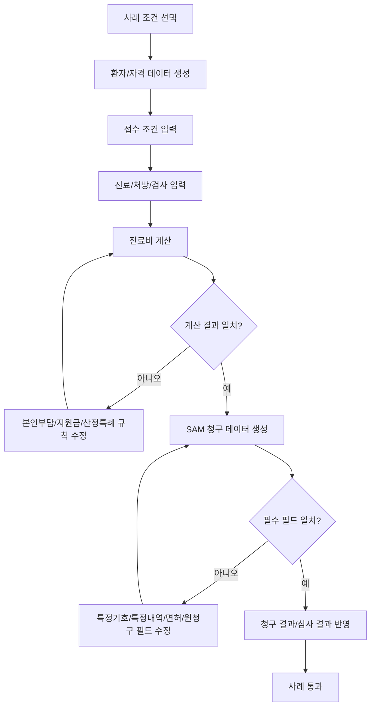

# 청구소프트웨어 인증 사례집 정리

대상: 신규업체용 의과 외래 의원 사례  
기준 파일: `1.2_신규업체용_의과_외래_사례(의원)-66개.hwpx`  
서식버전: 092

## 1. 문서의 의미

이 사례집은 청구소프트웨어 인증을 받을 때 사용하는 테스트 시나리오이다.

검사항목 문서가 `무엇을 구현해야 하는가`를 말한다면, 사례집은 `그 구현이 맞는지 어떤 환자/진료/처방/금액으로 검증하는가`를 말한다.

## 2. 개발팀이 보는 방식

사례 하나는 보통 다음 데이터 묶음으로 구성된다.

| 묶음 | 의미 | 개발 확인 위치 |
|---|---|---|
| 특이사항 | 이 사례가 검증하려는 핵심 조건 | 테스트 조건 |
| 환자/보험 정보 | 보험종별, 의료급여 종별, 차상위, 산정특례, 장애인 등 | 환자/접수/수진자조회 |
| 후순위 환자/보험 정보 | 보훈, 공상구분 | 인증 범위 확인 후 확장 |
| 상병 정보 | 주상병, 부상병, 진료과, 면허정보 | 진료/상병 |
| 진료내역 | 수가, 약품, 재료, 원내/원외, 항번호/목번호 | 진료/처방 |
| 금액 계산 | 요양급여비용총액, 본인부담금, 청구액, 지원금 | 진료비 계산 |
| 특정기호/특정내역 | 산정특례, 예외코드, 줄단위/명세서단위 특정내역 | SAM 청구 |
| 청구 결과 | 추가청구, 보완청구 등 원청구와의 연결 | SAM 청구/결과 |

## 3. 사례군 요약

| 사례군 | 주제 | 쉽게 말하면 |
|---|---|---|
| 사례 1 계열 | 보훈위탁기관 | 후순위. 보훈 환자는 일반 건강보험 환자와 금액을 나누는 방식이 다르다. 보훈청구액, 보훈본인부담금, 100분의100미만 보훈금액을 검증한다. |
| 사례 2 | 공상, 원료약, 성분명 | 공상은 후순위. 다만 원료약/성분명 처방 코드는 일반 처방 검증에도 필요하다. |
| 사례 3 계열 | 건강보험 외래 본인부담 | 나이, 토요가산, 정신요법, 원내/원외, 100분의100미만 항목에 따라 본인부담금이 달라지는지 본다. |
| 사례 4 계열 | 위탁검사, 산정특례, 퇴장방지 | 외부 검사기관 단가, 산정특례 특정기호, 퇴장방지의약품 사용장려금과 특정내역을 검증한다. |
| 사례 5 계열 | 차상위 1종 | 차상위 희귀/중증/암/화상 등 산정특례 대상자의 본인부담 계산을 검증한다. |
| 사례 6 계열 | 차상위 2종, 장애인 | 차상위 만성질환, 18세 미만, 장애인, CT/MRI, 원내/원외 처방 조건을 검증한다. |
| 사례 7 계열 | 지원금/특정기호 | 희귀질환, 긴급지원, 잠복결핵 등 지원금과 특정기호/특정내역을 검증한다. |
| 사례 8 계열 | 의료급여 | 의료급여 1종/2종, 장애인, 원내조제/원외처방, 특수장비, 행려환자 본인부담을 검증한다. |
| 사례 9 | 특정내역 중심 | 특정기호와 특정내역이 청구 명세서에 맞게 들어가는지 본다. |
| 사례 10 계열 | 수량/면허/특수재료 | 1회 투약량 자릿수, 의사 면허번호, 마취의사, 특수재료 관련 청구를 검증한다. |
| 사례 11 계열 | 추가청구 | 원청구 이후 누락된 항목을 추가청구할 때 본인부담과 원청구 연결을 검증한다. |
| 사례 12 | 자릿수/치료재료 최종 검증 | 단가, 조정금액, 치료재료 코드처럼 청구 파일 생성 직전의 숫자/코드 형식을 검증한다. |

## 4. 사례별 1차 목록

| 사례 | 핵심 주제 | 개발 확인 포인트 |
|---|---|---|
| 사례 1 | 보훈위탁기관 기본 | 후순위. 보훈청구액, 보훈본인부담금, 진료비총액, 100분의100미만 보훈청구액 |
| 사례 1-1 | 보훈 공상구분 4 | 후순위. 건강보험 보훈국비 환자, 본인부담 0원 처리 |
| 사례 1-2 | 보훈 공상구분 7 | 후순위. 무자격 보훈국비 환자, 청구액/본인부담 처리 |
| 사례 1-3 | 보훈 상이등급 7급, 보험자 4 | 후순위. 전상군경 일반질환, 본인부담 10% 계산 |
| 사례 1-4 | 보훈 상이등급 7급, 보험자 7 | 후순위. 무자격 전상군경 일반질환, 보훈 금액 분리 |
| 사례 2 | 공상/원료약/성분명 | 공상은 후순위. 원료약/성분명 처방전 코드는 우선 구현 |
| 사례 3 | 건강보험 외래 계산 기본 | 요양급여비용총액1/2, 본인부담, 100분의100미만 총액/부담/청구액 |
| 사례 3-1-1 | 6세 이상 65세 미만, 토요가산 | 일반 외래 30% 본인부담, 토요가산 |
| 사례 3-1-2 | 6세 이상 65세 미만, 정신요법 | 정신요법 본인부담 경감 |
| 사례 3-1-3 | 65세 이상, 토요가산 | 65세 이상 외래 정액/정률 기준 |
| 사례 3-1-4 | 65세 이상, 정신요법 | 고령자 정신요법 본인부담 경감 |
| 사례 3-1-5 | 1세 미만 | 소아 외래 본인부담, 의약분업지역 |
| 사례 3-1-6 | 1세 이상 6세 미만 | 소아 외래 본인부담, 의약분업지역 |
| 사례 3-1-7 | 6세 미만, 정신요법 | 소아 정신요법 본인부담 경감 |
| 사례 3-1-8 | 만성질환관리제 | AA250 산정, 진찰료 경감, 토요가산 |
| 사례 3-1-9 | 촉탁의 원외처방 | 촉탁의/협약의료기관 관리, 원외처방 |
| 사례 3-1-10 | 촉탁의 원내조제 | 촉탁의, 의약분업예외지역 확인, 원내조제 |
| 사례 3-2-1 | U항 | 100분의100 본인부담금총액, 요양급여비용총액2 |
| 사례 3-3 | 100분의100미만 항목 | A/B/D/E항 본인부담률 50/80/30/90 적용 |
| 사례 4 | 위탁검사/산정특례/퇴장방지 | 수탁기관 단가, 특정기호, 퇴장방지 사용장려금, JS002 |
| 사례 4-1-1 | 산정특례 미적용일 | 산정특례 적용기간 밖 진료 |
| 사례 4-2-1 | 희귀/중증난치 산정특례 | 등록 산정특례 본인부담 |
| 사례 4-2-2 | 산정특례 + 6세 미만 | 산정특례와 소아 본인부담 조건 동시 적용 |
| 사례 4-3-1 | 공상 특수 조건 | 후순위. 공상 산정, 특정기호/특정내역, CT |
| 사례 4-3-2 | 결핵 V000 | 본인부담 제외 대상 결핵 특정기호 |
| 사례 5-1 | 차상위 C | 차상위 1종 본인부담 |
| 사례 5-2 | 차상위 C + 희귀/중증난치 | 차상위 1종 산정특례 |
| 사례 5-3 | 차상위 C + 중증질환 | 차상위 1종 암/화상 등 중증질환 |
| 사례 6 | 차상위 2종 기본 | 차상위 2종/장애인/원내외/의료급여성 조건 |
| 사례 6-1-1 | 동일상병 복수 진료과, 원외 | 정형외과+재활의학과, 원외처방 |
| 사례 6-1-2 | 동일상병 복수 진료과, 원내 | 정형외과+재활의학과, 원내 주사 |
| 사례 6-1-3 | 차상위 2종 1세 미만 | 공상구분 E/F, 소아 본인부담 |
| 사례 6-1-4 | 차상위 2종 1세 미만 + CT/MRI | 특수장비 본인부담 |
| 사례 6-1-5 | 차상위 E 원내직접조제 | 원외처방 없이 원내조제/투약 |
| 사례 6-1-6 | 차상위 E + CT/MRI | 특수장비 본인부담 |
| 사례 6-1-7 | 차상위 E 촉탁의 원외 | 촉탁의 원외처방 |
| 사례 6-1-8 | 차상위 E 촉탁의 원내 | 촉탁의 원내조제 |
| 사례 6-2-1 | 차상위 장애인 F 원내 | 장애인 만성질환 원내조제/투약 |
| 사례 6-2-2 | 차상위 장애인 F 원외 | 장애인 만성질환 원외처방 |
| 사례 6-2-3 | 차상위 장애인 F 처방 없음 | 원내조제/원외처방 모두 없음 |
| 사례 6-2-4 | 차상위 장애인 F + CT/MRI | 특수장비 본인부담 |
| 사례 6-2-5 | 차상위 장애인 F 촉탁의 원외 | 촉탁의 원외처방 |
| 사례 6-2-6 | 차상위 장애인 F 촉탁의 원내 | 촉탁의 원내조제 |
| 사례 7-1 | 지원금 기본 | 희귀질환/긴급지원 등 지원금, 특정기호/특정내역 |
| 사례 7-2 | 지원금 변형 | 원문 세부 조건 확인 필요 |
| 사례 7-3 | 잠복결핵 F009 | 잠복결핵 검진지원 특정기호 |
| 사례 7-4 | 지원금 특정내역 | 특정기호/특정내역 기재 |
| 사례 7-5 | 지원금 복합 | 지원금과 특정내역 동시 검증 |
| 사례 8-1 | 의료급여 1종 암 | 등록 암환자, 원내/원외, 지원금 |
| 사례 8-2 | 의료급여 1종 원내조제 | 원내조제 O, 원외처방 X, 본인부담 발생횟수 |
| 사례 8-3 | 의료급여 1종 처방 없음 | 원내조제 X, 원외처방 X |
| 사례 8-4 | 의료급여 특수장비 | 보장시설기호, CT/MRI 등 특수장비 |
| 사례 8-5 | 예약검사만 실시 | 의사 진찰 없이 예약 검사만 수행 |
| 사례 8-6 | 의료급여 소아/장애인 원내 | 원내조제 O, 원외처방 X |
| 사례 8-7 | 의료급여 처방 없음 | 원내조제 X, 원외처방 X |
| 사례 8-8 | 의료급여 원내+원외 | 원내조제 O, 원외처방 O |
| 사례 8-9 | 의료급여 2종 CT/MRI | 2종 1차진료 특수장비 |
| 사례 8-10 | 행려환자 | 행려환자 특정내역 |
| 사례 8-11 | 의료급여 2종 1세 미만 | 소아 의료급여 본인부담 |
| 사례 8-12 | 의료급여 2종 장애인 원내 | 원내조제 O, 원외처방 X |
| 사례 8-13 | 의료급여 2종 장애인 처방 없음 | 원내조제 X, 원외처방 X |
| 사례 8-14 | 의료급여 2종 장애인 원내+원외 | 원내조제 O, 원외처방 O |
| 사례 8-15 | 의료급여 2종 장애인 CT/MRI | 장애인 1차진료 특수장비 |
| 사례 9 | 특정기호/특정내역 | 명세서/줄번호 특정내역 기재 |
| 사례 10-1 | 투약량/특수재료 | 1회 투약량 소수 자리, T항 특수재료 |
| 사례 10-2 | 면허정보 | 주상병, 진찰료, 마취의사 면허정보 |
| 사례 11-1 | 추가청구 정액 | 65세 이상 정액 본인부담, 재진 야간가산 추가청구 |
| 사례 11-2 | 추가청구 정률 | 정률 본인부담, 초진 야간가산 추가청구 |
| 사례 12 | 자릿수/치료재료 | 단가/조정금액 자릿수, 치료재료대 코드 입력 가능 여부 |

## 5. 구현 관점 핵심

### 금액 계산

사례집의 대부분은 금액 계산 검증이다.

우선 구현:

- 요양급여비용총액1
- 요양급여비용총액2
- 본인일부부담금
- 청구액
- 100분의100 본인부담금총액
- 100분의100미만 총액
- 100분의100미만 본인일부부담금
- 지원금

후순위 구현:

- 보훈청구액
- 보훈 본인일부부담금
- 공상 본인일부부담금

### 환자/보험 조건

같은 처방이라도 환자 조건에 따라 금액이 달라진다.

우선 확인 조건:

- 건강보험
- 의료급여 1종/2종
- 차상위 C/E/F
- 산정특례
- 1세 미만, 6세 미만, 65세 이상
- 장애인
- 행려환자

후순위 확인 조건:

- 보훈
- 공상 산정

`공상구분` 필드는 차상위 C/E/F, 지원금 구분에도 사용되므로 저장 구조에서는 제외하면 안 된다. 다만 보훈/공상 환자의 별도 산정 규칙을 후순위로 둔다.

### 처방 조건

처방 라인은 단순 코드/금액이 아니다.

확인 조건:

- 원내조제
- 원외처방
- 원내와 원외 동시 존재
- 원료약
- 성분명 처방
- 100분의100미만 A/B/D/E항
- CT/MRI
- 퇴장방지의약품
- 특수재료
- 위탁검사

### 청구 조건

청구 파일에는 계산 결과뿐 아니라 설명 정보가 들어가야 한다.

확인 조건:

- 특정기호
- 특정내역
- 의약분업 예외코드
- 줄번호 단위 특정내역
- 명세서 단위 특정내역
- 원청구 접수번호
- 추가청구 사유
- 면허종류/면허번호

## 6. 개발 순서에 반영할 점

1. 사례 3 계열로 건강보험 외래 기본 금액 계산을 먼저 검증한다.
2. 사례 4~8 계열로 산정특례, 차상위, 지원금, 의료급여 본인부담을 검증한다.
3. 사례 9~10 계열로 특정내역, 수량 자릿수, 면허정보를 검증한다.
4. 사례 11 계열로 추가청구를 검증한다.
5. 사례 1 계열 보훈과 사례 2의 공상 계산은 후순위로 분리한다.

## 7. 사례별 상세 체크포인트

아래 표는 사례집을 개발 관점으로 다시 해석한 것이다.

| 구분 | 조건 | 검증해야 할 것 | 구현 포인트 |
|---|---|---|---|
| 사례 1 | 보훈위탁기관, 보훈/공상, 100분의100미만, 의료급여, MRI | 보훈청구액, 보훈 본인일부부담금, 100분의100미만 보훈청구액 | 후순위. 보훈 대상자는 일반 건강보험 계산과 별도 금액 필드를 유지해야 한다. |
| 사례 1-1 | 보훈 공상구분 4, 의약분업, 특정내역, 원외처방 | 보훈 공상구분별 본인부담 및 특정내역 기재 | 후순위. 환자 자격, 보훈 공상구분, 처방전 정보를 명세서 생성까지 연결한다. |
| 사례 1-2 | 보훈 공상구분 7, 의약분업, 특정내역, 원외처방 | 보훈 공상구분 7의 청구액/본인부담 | 후순위. 공상구분 값에 따라 같은 처방도 금액 계산 결과가 달라져야 한다. |
| 사례 1-3 | 보험자종별 4, 전상군경 등 상이등급 7급, 원외처방 | 보험자종별 4와 보훈 공상구분 4 조합 | 후순위. 보험자종별과 공상구분을 독립 필드로 저장하고 조합 규칙을 적용한다. |
| 사례 1-4 | 보험자종별 7, 전상군경 등 상이등급 7급, 원외처방 | 보험자종별 7과 보훈 공상구분 7 조합 | 후순위. 보훈/의료급여/공상 조건이 동시에 들어올 때 우선순위를 고정한다. |
| 사례 2 | 공상구분 1, 본인일부부담금 미발생, 성분명/일반명 처방, 원료약 | 본인부담 0원 처리, 원내조제/원외처방 동시 처리 | 공상 계산은 후순위. 원료약/성분명 처방과 원내/원외 분리는 우선 구현한다. |

### 건강보험 기본 계산

| 구분 | 조건 | 검증해야 할 것 | 구현 포인트 |
|---|---|---|---|
| 사례 3 | 건강보험 외래 기본 | 요양급여비용총액1/2, 본인일부부담금, 청구액, 100/100 본인부담, 의약분업 예외코드 | 건강보험 외래 금액 계산의 기준 사례로 삼는다. |
| 사례 3-1-1 | 6세 이상 65세 미만, 토요가산 | 기본 본인부담과 토요가산 반영 | 진료일자와 시간대에 따라 가산 적용 여부를 계산한다. |
| 사례 3-1-2 | 6세 이상 65세 미만, 정신요법 본인부담 경감 | 정신요법 경감 적용 후 본인부담 | 행위 코드의 경감 대상 여부를 수가 속성으로 관리한다. |
| 사례 3-1-3 | 65세 이상, 토요가산 | 65세 이상 본인부담, 토요가산, 면허정보 생략 가능 항목 | 환자 연령 기준일을 진료일자로 계산해야 한다. |
| 사례 3-1-4 | 65세 이상, 정신요법 본인부담 경감 | 노인 외래 본인부담과 정신요법 경감의 조합 | 연령 경감과 행위 경감이 충돌하지 않도록 계산 순서를 고정한다. |
| 사례 3-1-5 | 의약분업지역, 1세 미만 | 1세 미만 본인부담 | 생년월일 기준으로 1세 미만 여부를 자동 판정한다. |
| 사례 3-1-6 | 의약분업지역, 1세 이상 6세 미만 | 6세 미만 본인부담 | 소아 본인부담 구간을 1세 미만과 6세 미만으로 분리한다. |
| 사례 3-1-7 | 6세 미만, 정신요법 본인부담 경감 | 소아 본인부담과 정신요법 경감 | 환자 구간과 행위 구간을 동시에 적용할 수 있어야 한다. |
| 사례 3-1-8 | 6세 이상, 만성질환관리제 AA250, 토요가산 | 진찰료 경감대상자와 토요가산 | 만성질환관리제 산정 여부를 진찰료와 연결한다. |
| 사례 3-1-9 | 65세 미만, 촉탁의, 원외처방 | 촉탁의/협약의료기관 정보 | 촉탁의와 소속/협약 기관 정보를 청구자료에 보관한다. |
| 사례 3-1-10 | 65세 이상, 촉탁의, 원내조제 | 촉탁의 원내조제, 의약분업 예외지역 | 사회복지시설/촉탁의 기관 정보로 예외 여부를 판단한다. |
| 사례 3-2-1 | U항 산정 | 100/100 본인부담금총액, 요양급여비용총액2, 의약분업 예외코드 | 항 구분별 금액을 합산 전 단계에서 분리 계산한다. |
| 사례 3-3 | A항 50%, B항 80%, D항 30%, E항 90% | 100분의100미만 총액/본인부담/청구액 | 선별급여 항별 본인부담률을 수가/약제 단위로 적용한다. |

### 위탁검사와 산정특례

| 구분 | 조건 | 검증해야 할 것 | 구현 포인트 |
|---|---|---|---|
| 사례 4 | 위탁검사, 산정특례, 퇴장방지, 특정기호/특정내역, 원외처방 | 위탁검사 단가, 산정특례 본인부담, 특정기호 | 위탁검사는 의뢰기관 유형별 단가를 별도로 계산한다. |
| 사례 4-1-1 | 산정특례 미적용일, 종합병원/상급종합병원/의원 의뢰 | 의뢰기관 유형별 위탁검사 계산 | 의뢰기관 종별을 저장하고 단가 산정에 반영한다. |
| 사례 4-2-1 | 산정특례 적용, 등록 희귀질환/중증난치 | 산정특례 본인부담률 | 산정특례 등록번호, 특정기호, 적용기간을 검증한다. |
| 사례 4-2-2 | 등록 희귀/중증난치, 6세 미만 | 산정특례와 소아 조건 조합 | 산정특례 적용 여부가 연령 본인부담보다 우선 적용되는지 확인한다. |
| 사례 4-3-1 | 공상, 특정기호/특정내역, CT | 공상 조건과 특수장비 청구 | 공상 계산은 후순위. CT/MRI와 특정내역 생성은 우선 구현한다. |
| 사례 4-3-2 | 본인부담 제외 결핵환자, 특정기호 V000 | 결핵 특정기호 본인부담 제외 | 특정기호에 따라 본인부담이 0원 또는 감면되는 규칙을 관리한다. |

### 차상위와 지원금

| 구분 | 조건 | 검증해야 할 것 | 구현 포인트 |
|---|---|---|---|
| 사례 5-1 | 차상위 C, 희귀/중증질환, 식대, 선별급여 | 본인부담 면제, 식대 20%, 선별급여 30/50/80/90 | 차상위 C라도 항목별 본인부담 예외가 존재한다. |
| 사례 5-2 | 차상위 C, 산정특례 희귀질환/중증난치 | 산정특례 적용 본인부담 | 차상위와 산정특례가 함께 있을 때 적용 순서를 고정한다. |
| 사례 5-3 | 차상위 C, 등록 중증질환 암/화상 | 중증질환 산정특례 본인부담 | 특정기호와 산정특례 등록정보를 함께 검증한다. |
| 사례 6 | 차상위 2종, 장애인 | 공상구분 E/F 외래 본인부담, 장애인의료비 | 차상위 E와 장애인 F는 본인부담/장애인의료비 계산을 분리한다. |
| 사례 6-1-1 | 차상위 E/F, 동일일 동일상병, 원외처방, 물리치료 | 중복 진료, 토요가산, 동일상병 점검 | 동일일/동일상병/다른 진료과 진료를 하나의 환자 일정 안에서 검증한다. |
| 사례 6-1-2 | 차상위 E/F, 동일일 동일상병, 원내 주사, 물리치료 | 원내 주사와 재활 진료 조합 | 같은 날 다중 진료의 명세서 분리/합산 기준을 정한다. |
| 사례 6-1-3 | 차상위 2종 1세 미만 E/F | 소아 차상위 본인부담 | 연령 조건과 차상위 조건을 함께 계산한다. |
| 사례 6-1-4 | 차상위 2종 1세 미만 E/F, CT/MRI | 소아 차상위와 특수장비 | CT/MRI 항목은 별도 본인부담 규칙을 적용한다. |
| 사례 6-1-5 | 차상위 E, 원외처방 없음, 원내직접조제/투약 | 원내직접조제/투약횟수 특정내역 | 원내 투약 횟수를 특정내역으로 생성한다. |
| 사례 6-1-6 | 차상위 E, CT/MRI | 차상위 E 특수장비 본인부담 | 특수장비 계산을 차상위 본인부담과 연결한다. |
| 사례 6-1-7 | 차상위 E, 촉탁의 원외처방 | 촉탁의 원외처방 정보 | 촉탁의 처방전 발행 정보를 저장한다. |
| 사례 6-1-8 | 차상위 E, 촉탁의 원내조제 | 촉탁의 원내조제 정보 | 촉탁의 원내/원외 구분을 처방 단위로 관리한다. |
| 사례 6-2-1 | 차상위 장애인 F, 원내직접조제/투약 | 장애인의료비와 원내투약 | 장애인의료비 계산과 특정내역 생성을 함께 검증한다. |
| 사례 6-2-2 | 차상위 장애인 F, 원외처방 | 장애인의료비와 원외처방 | 원외처방 여부가 장애인의료비 계산에 영향을 주는지 확인한다. |
| 사례 6-2-3 | 차상위 장애인 F, 원내/원외 처방 없음 | 처방 없는 외래 진료 본인부담 | 진찰료만 있는 명세서도 정상 생성되어야 한다. |
| 사례 6-2-4 | 차상위 장애인 F, CT/MRI | 장애인 차상위 특수장비 | CT/MRI 본인부담과 장애인의료비를 분리 계산한다. |
| 사례 6-2-5 | 차상위 장애인 F, 촉탁의 원외처방 | 촉탁의 원외처방과 장애인의료비 | 촉탁의 정보, 장애인 정보, 원외처방 정보를 함께 청구한다. |
| 사례 6-2-6 | 차상위 장애인 F, 촉탁의 원내조제 | 촉탁의 원내조제와 장애인의료비 | 원내조제 명세서에서 장애인의료비 산출 여부를 확인한다. |
| 사례 7-1 | 희귀질환자 의료비 지원, 긴급지원, 잠복결핵 | 공상구분 H/G, 특정기호 F009/V010, 지원금 | 지원금은 본인부담에서 차감되는 별도 금액으로 관리한다. |
| 사례 7-2 | 지원금 변형 사례 | 지원금 발생 조건 | 지원사업 종류별 적용 대상과 금액 산출을 분리한다. |
| 사례 7-3 | 잠복결핵감염 검진지원사업, 특정기호 F009 | 잠복결핵 특정기호와 지원금 | 특정기호 기반 지원사업을 자동 매핑한다. |
| 사례 7-4 | 지원금 세부 변형 사례 | 지원금과 특정내역 | 지원금 대상 사유를 명세서에 설명할 수 있어야 한다. |
| 사례 7-5 | 지원금 및 특정내역 조합 | 지원금, 특정기호, 특정내역 조합 | 지원금 계산 결과와 청구 설명 필드를 함께 검증한다. |

### 의료급여

| 구분 | 조건 | 검증해야 할 것 | 구현 포인트 |
|---|---|---|---|
| 사례 8-1 | 의료급여 1종 등록 암환자 | 의료급여 본인부담, 특정기호, 본인부담구분, 생활지원금 조회 | 의료급여 자격조회 결과를 접수와 계산에 그대로 연결한다. |
| 사례 8-2 | 의료급여 1종, 원내조제 O, 원외처방 X, 본인부담발생횟수 2회 | 발생횟수별 본인부담 | 의료급여는 방문/발생횟수 기준 본인부담을 관리해야 한다. |
| 사례 8-3 | 의료급여 1종, 원내조제 X, 원외처방 X | 처방 없는 의료급여 외래 | 원내/원외 처방이 없어도 본인부담 구분이 생성되어야 한다. |
| 사례 8-4 | 의료급여 1종, 특수장비, 보장시설기호 1234 | CT/MRI, 보장시설기호 | 보장시설기호를 수진자 자격정보로 저장한다. |
| 사례 8-5 | 의사 진찰 없이 예약 검사만 실시 | 진찰료 없는 검사 명세서 | 접수/진료 없이 검사만 존재하는 흐름을 허용한다. |
| 사례 8-6 | 의료급여 1종, 1세, 장애인, 원내조제 O | 소아/장애인/의료급여 조합 | 여러 감면 조건이 동시에 있을 때 우선순위를 적용한다. |
| 사례 8-7 | 의료급여 1종, 원내조제 X, 원외처방 X | 의료급여 처방 없음 | 명세서 생성 조건을 처방 유무와 분리한다. |
| 사례 8-8 | 의료급여 1종, 원내조제 O, 원외처방 O | 원내/원외 동시 존재 | 원내 약제와 원외 처방전을 별도 산출한다. |
| 사례 8-9 | 의료급여 2종, 1차 진료 CT/MRI | 의료급여 2종 특수장비 본인부담 | 1종/2종별 CT/MRI 본인부담 규칙을 분리한다. |
| 사례 8-10 | 행려환자 | 행려환자 본인부담 및 청구 구분 | 행려환자 여부를 보험자격의 특수 조건으로 저장한다. |
| 사례 8-11 | 의료급여 2종 1세 미만 | 2종 소아 본인부담 | 의료급여 종별과 연령 조건을 함께 계산한다. |
| 사례 8-12 | 의료급여 2종 장애인, 원내조제 O, 원외처방 X | 장애인의료비, 원내조제 | 의료급여 장애인의료비 산출 여부를 확인한다. |
| 사례 8-13 | 의료급여 2종 장애인, 원내조제 X, 원외처방 X | 장애인 처방 없는 외래 | 처방 없는 경우에도 장애인의료비 계산 기준을 적용한다. |
| 사례 8-14 | 의료급여 2종 장애인, 원내조제 O, 원외처방 O | 원내/원외 동시, 장애인의료비 | 원내와 원외를 나누되 환자 본인부담은 전체 기준으로 검증한다. |
| 사례 8-15 | 의료급여 2종 장애인, 1차 진료 CT/MRI | 장애인 의료급여 특수장비 | 특수장비 본인부담과 장애인의료비 계산을 함께 검증한다. |

### 특정내역, 수량, 추가청구

| 구분 | 조건 | 검증해야 할 것 | 구현 포인트 |
|---|---|---|---|
| 사례 9 | 특정내역 전반 | 명세서 단위, 진료내역 단위, 처방내역 줄번호 단위, 처방내역 단위 특정내역 | 특정내역은 발생 위치와 줄번호를 함께 저장해야 한다. |
| 사례 10-1 | 1일 투여량, 총투여일수, 1회 투약량, 특수재료 | 투여량 반올림, 금액 원미만 4사5입, 면허정보, T항 특수재료 | 수량 계산은 표시값과 계산값의 자릿수 규칙을 분리한다. |
| 사례 10-2 | 주상병 의사, 진찰료 2인 의사, 마취의 초빙료 | 면허종류/면허번호 기재 | 진료의, 처방의, 마취의 등 역할별 면허정보를 저장한다. |
| 사례 11-1 | 추가청구, 65세 이상 정액, 재진 야간가산 추가 | 원청구 접수번호/명일련, 추가청구 사유, 최종 본인부담 0원 | 추가청구는 원청구와 추가 항목을 연결하고 본인부담 재계산 결과를 생성한다. |
| 사례 11-2 | 추가청구, 정률 본인부담, 초진 야간가산 추가 | 최종 본인부담 = 요양급여비용총액 * 30%, 원청구 항목 연결 | 정액/정률 추가청구 계산식을 분리한다. |
| 사례 12 | 단가/조정금액 자릿수, 치료재료대 | 단가 자릿수, 조정금액 자릿수, 치료재료 코드 입력 | 청구 파일 생성 전 숫자 자릿수와 코드 허용 여부를 최종 검증한다. |

## 8. 인증용 테스트 데이터 구성 방식

사례집을 테스트 데이터로 만들 때는 한 사례를 한 화면 테스트로 끝내면 안 된다.

| 단계 | 만들어야 할 데이터 | 확인 결과 |
|---|---|---|
| 환자 데이터 | 보험종별, 의료급여 종별, 차상위, 장애인, 산정특례, 연령, 행려 여부 | 접수 시 환자 조건이 정확히 선택된다. |
| 후순위 환자 데이터 | 보훈, 공상구분 | 보훈/공상 개발 단계에서 추가 검증한다. |
| 접수 데이터 | 진료일자, 진료과, 의사, 촉탁의, 의약분업 예외, 방문 구분 | 진료비 계산에 필요한 접수 조건이 남는다. |
| 진료 데이터 | 상병, 주상병, 행위, 검사, 위탁검사, CT/MRI, 정신요법 | 항목별 수가와 본인부담률이 계산된다. |
| 처방 데이터 | 원내조제, 원외처방, 성분명 처방, 원료약, 투여량, 투여일수 | 처방전과 명세서 라인이 분리 생성된다. |
| 계산 데이터 | 총액1, 총액2, 본인부담, 청구액, 지원금, 장애인의료비 | 화면 금액과 청구 금액이 일치한다. |
| 청구 데이터 | 특정기호, 특정내역, 면허정보, 원청구 접수번호, 추가청구 구분 | SAM 파일 필드가 사례 조건대로 생성된다. |
| 결과 데이터 | 접수 결과, 심사 결과, 보완/추가청구 연결 | 원청구와 후속 청구가 추적된다. |

## 9. 개발팀 검증 순서

## 10. 구현 시 반드시 나눠야 하는 엔진

| 엔진 | 역할 | 사례집에서 검증되는 부분 |
|---|---|---|
| 자격 엔진 | 건강보험, 의료급여, 차상위, 산정특례, 장애인 조건 판정 | 사례 5, 6, 7, 8 |
| 후순위 자격 엔진 | 보훈, 공상구분 조건 판정 | 사례 1, 사례 2 일부 |
| 접수 엔진 | 진료일자, 진료과, 의사, 촉탁의, 의약분업 예외 저장 | 사례 3, 6, 8, 10 |
| 수가/처방 엔진 | 행위/약제/재료/검사/위탁검사/CT/MRI 라인 생성 | 사례 2, 3, 4, 10, 12 |
| 금액 계산 엔진 | 총액, 본인부담, 청구액, 지원금, 장애인의료비 계산 | 거의 모든 사례 |
| 특정내역 엔진 | 명세서/진료내역/처방내역 단위 특정내역 생성 | 사례 4, 6, 7, 9, 11 |
| 청구 파일 엔진 | SAM 필드 생성, 추가청구, 보완청구, 원청구 연결 | 사례 9, 10, 11, 12 |
| 결과 반영 엔진 | 청구 결과, 심사 결과, 보완/추가청구 후속 처리 | 사례 11 및 실제 운영 단계 |

## 11. 개발 범위 판단

MVP에서 반드시 포함해야 할 범위:

- 건강보험 외래 기본 계산
- 의료급여 1종/2종 계산
- 차상위 C/E/F 계산
- 산정특례와 특정기호
- 원내조제/원외처방
- CT/MRI와 위탁검사
- 특정내역 생성
- 면허정보 생성
- 추가청구/보완청구 연결
- SAM 청구 파일 생성

후순위 확장으로 미룰 수 있는 범위:

- 보훈/공상 계산
- 운영 통계 화면
- 고급 대시보드
- 병원별 커스텀 출력물
- 자동 심사결과 분석 리포트
- 청구 오류 자동 추천

인증 준비에서는 화면 기능보다 계산 결과와 청구 파일 필드가 우선이다.
