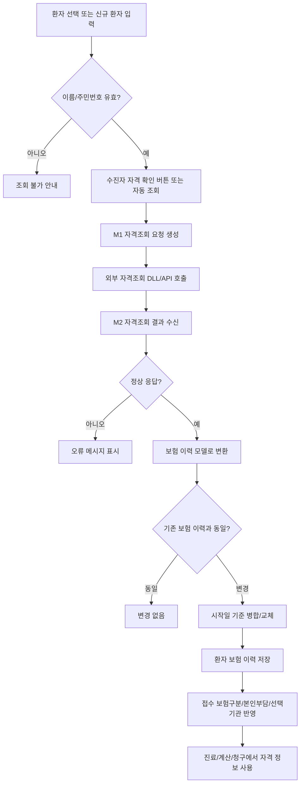
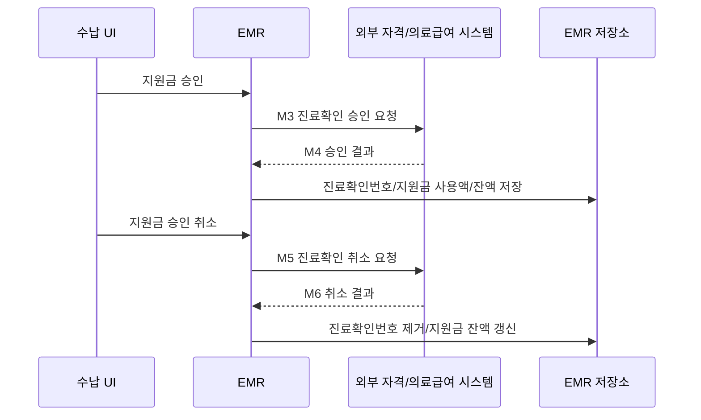
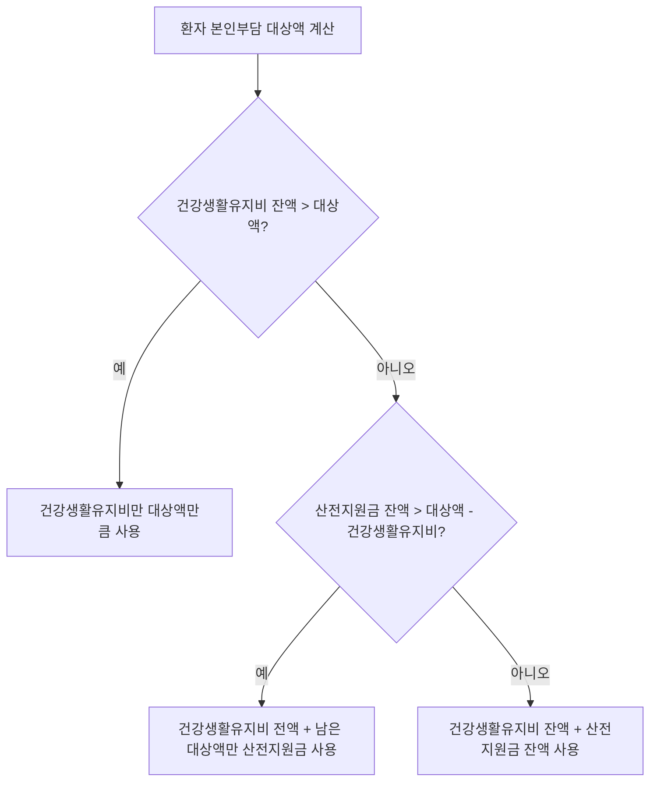
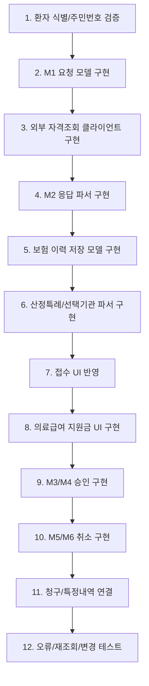

# 수진자조회 상세 도메인

## 1. 목적

수진자조회는 환자의 보험 자격을 외부 자격관리 시스템에서 확인하고, 그 결과를 EMR의 환자 보험 이력과 접수/수납/청구 기준으로 변환하는 도메인이다.

이 기능의 목적은 다음 4가지다.

| 목적 | 설명 |
|---|---|
| 보험 자격 확인 | 환자가 건강보험, 의료급여, 차상위, 일반 중 어디에 해당하는지 판단한다. |
| 접수 기준 확정 | 접수 시 사용할 보험구분, 본인부담구분, 선택기관, 특정기호를 결정한다. |
| 계산 기준 제공 | 본인부담금, 건강생활유지비, 산전지원금, 급여제한 여부를 진료비 계산에 넘긴다. |
| 청구 근거 저장 | 청구 시 필요한 수진자 자격, 의료급여 진료확인번호, 특정기호 정보를 남긴다. |

수진자조회는 단순 조회 화면이 아니다. 조회 결과가 바뀌면 환자 보험 이력이 바뀌고, 접수 보험구분이 바뀌며, 이후 진료비 계산과 청구 결과까지 달라진다.

## 2. 전체 흐름

의료급여 환자는 수납 시 별도 승인 흐름이 추가된다.

## 3. UI에서 보이는 흐름

### 접수 화면

접수 화면에는 `수진자 자격 확인` 버튼이 있다.

| UI 요소 | 역할 |
|---|---|
| 수진자 자격 확인 버튼 | 현재 환자의 이름과 주민번호로 M1 자격조회 요청을 보낸다. |
| 환자 상세 영역 | 이름, 주민번호, 주민번호 확인 여부 등 조회 전제 값을 가진다. |
| 접수 정보 영역 | 조회 후 보험구분, 본인부담구분, 선택기관, 특정기호가 반영된다. |
| 선택기관 콤보 | M2 결과가 M001/B001 등 선택기관 대상이면 선택 가능한 기관 목록을 보여준다. |
| 특정기호 입력/선택 | 산정특례 결과가 있으면 접수의 특정기호 후보가 된다. |

접수 화면에서 수진자조회가 성공하면 다음 작업이 일어난다.

| 단계 | 처리 |
|---|---|
| 1 | 환자 보험 이력 갱신 |
| 2 | 병원 옵션이 “기존 보험 사용”이 아니면 접수 보험구분을 최신 자격으로 변경 |
| 3 | 산정특례가 있으면 첫 번째 특정기호를 접수 특정기호로 제안 |
| 4 | 의료급여 M001/B001이면 선택기관 목록을 초기화하고 안내 메시지 표시 |
| 5 | M001/B001 신규 접수에서 본인부담구분이 비어 있으면 `B005`를 기본 제안 |

### 수납 화면

의료급여 수납 화면에는 지원금 관련 UI가 있다.

| UI 요소 | 역할 |
|---|---|
| 의료급여 지원금 버튼 | 건강생활유지비/산전지원금 청구액을 입력하거나 자동 계산한다. |
| 지원금 승인 | M3 요청을 보내고 M4 승인 결과로 진료확인번호를 받는다. |
| 지원금 승인 취소 | M5 요청을 보내고 M6 결과로 승인 취소를 반영한다. |
| 진료확인번호 표시 | 의료급여 청구에 필요한 번호를 보여준다. |

의료급여는 지원금 사용액이 0이어도 진료확인 승인이 필요할 수 있다. 기존 구현도 “지원금이 없어도 의료급여는 승인받아야 함”이라는 전제로 동작한다.

## 4. M1-M6 메시지 구조

| 메시지 | 방향 | 업무 의미 | 사용 시점 |
|---|---|---|---|
| M1 | EMR -> 외부 | 수진자 자격조회 요청 | 접수 전, 환자 등록/수정 후, 수동 조회 |
| M2 | 외부 -> EMR | 수진자 자격조회 결과 | 보험 이력 저장, 접수 기준 결정 |
| M3 | EMR -> 외부 | 의료급여 진료확인 승인 요청 | 의료급여 수납 시 |
| M4 | 외부 -> EMR | 의료급여 진료확인 승인 결과 | 진료확인번호/지원금 잔액 반영 |
| M5 | EMR -> 외부 | 의료급여 진료확인 취소 요청 | 승인 후 수납 취소/재계산/변경 시 |
| M6 | 외부 -> EMR | 의료급여 진료확인 취소 결과 | 진료확인번호 제거/지원금 잔액 복구 |

## 5. M1 자격조회 요청

M1은 “이 환자의 현재 보험 자격을 알려달라”는 요청이다.

### 생성 필드

| 필드 | 뜻 | 생성 규칙 |
|---|---|---|
| `sujinjaJuminNo` | 수진자 주민등록번호 | 환자 주민번호에서 하이픈을 제거해 전송한다. 기존 VB 경로는 전달받은 값을 그대로 사용한다. |
| `ykiho` | 요양기관기호 | 운영 서버는 병원 설정의 요양기관기호를 사용한다. 테스트 서버는 테스트 기관기호를 사용할 수 있다. |
| `sujinjaJuminNm` | 수진자 성명 | 환자 기본정보의 이름을 사용한다. |
| `idYN` | 주민번호 확인 여부 | 주민번호 확인 옵션이 켜져 있으면 `Y`, 아니면 `N`이다. |
| `diagDt` | 진료일자 | 신규 C# 경로는 현재일자를 넣는다. 기존 VB 경로는 필드를 명시하지 않는다. |
| `hiCardNo` | 건강보험증번호 | 필요 시 선택 입력. 현재 접수 자격조회에서는 주로 비워진다. |
| `birthDay` | 생년월일 | 필요 시 `yyMMdd` 형식. 현재 접수 자격조회에서는 주로 비워진다. |
| `clientInfo` | 화면 클라이언트 고유값 | 클라이언트 IP 등 식별값. 기존 VB 경로는 빈 값이다. |
| `msgType` | 메시지 타입 | 고정값 `M1`. |

### 요청 전 검증

| 검증 | 처리 |
|---|---|
| 이름 없음 | 조회 불가 |
| 주민번호 없음 또는 형식 오류 | 조회 불가 |
| 병원 옵션상 수진자조회 미사용 | 옵션을 존중하는 호출에서는 조회하지 않음 |
| 외부 서버 연결 불가 | 사용자에게 재시도/연결 오류 안내 |

## 6. M2 자격조회 결과

M2는 M1에 대한 응답이다. EMR은 M2 원문을 그대로 화면에 뿌리는 것이 아니라 보험 이력, 의료급여 정보, 산정특례, 선택기관, 제한정보로 정규화해 저장한다.

### 응답 필드와 저장 의미

| 필드 | 뜻 | 저장/사용 |
|---|---|---|
| `messageCode` | 응답 코드 | `IWS10001`이면 정상 자격조회로 처리한다. 그 외 코드는 오류 메시지로 변환한다. |
| `message` | 응답 메시지 | 환자 보험 이력의 조회 메시지로 보관하고, 필요 시 사용자 안내에 사용한다. |
| `sujinjaJuminNo` | 수진자 주민번호 | 조회 대상 검증용. 청구/처방전 식별 기준과 일치해야 한다. |
| `sujinjaJuminNm` | 수진자 성명 | 조회 대상 검증용. |
| `ykiho` | 요양기관기호 | 조회 수행 기관 확인용. |
| `qlfType` | 자격여부 | 보험구분 산정의 핵심값. 7은 의료급여 1종, 8은 의료급여 2종, 그 외 유효 자격은 건강보험으로 본다. |
| `qlfChwidukDt` | 자격취득일 | 보험 이력 시작일이다. 이 값이 없으면 유효한 자격으로 보지 않는다. |
| `sedaejuNm` | 세대주/가입자 성명 | 보험 이력의 가입자/세대주명으로 저장한다. |
| `protAdminSym` | 보장기관기호 또는 사업장기호 | 의료급여는 보장기관기호로 저장한다. 건강보험은 사업장 관련 참고값이다. |
| `asylmSym` | 시설기호 또는 증번호 | 건강보험이면 보험증번호로 저장한다. |
| `payRestricDt` | 급여제한일자 또는 건강보험 상실일자 | 본인부담구분에 따라 선택기관 시작일, 급여제한일, 건강보험 상실일로 해석한다. |
| `sbrdnType` | 본인부담여부 | 의료급여 본인부담구분이다. M001, B001 등 선택기관 대상 판정에 사용한다. |
| `cfhcRem` | 건강생활유지비 잔액 | 의료급여 지원금 잔액으로 저장한다. |
| `pregRemAmt` | 산전지원금 잔액 | 의료급여 산전지원금 잔액으로 저장한다. |
| `ykiho1`~`ykiho4` | 선택기관기호 1~4 | 의료급여 선택기관 목록으로 저장한다. |
| `yoyangNm1`~`yoyangNm4` | 선택기관명 1~4 | 선택기관 목록의 표시명으로 저장한다. |
| `dprtYn` | 출국자 여부 | `Y`이면 급여 제한 안내 및 건강보험 100% 접수 안내 대상이다. |
| `obstYn` | 장애 여부 | 의료급여 2종이면 2종 장애로 보정하고, 차상위 E는 F로 보정한다. |
| `obstRegDt` | 장애인 등록일자 | 장애 관련 참고 정보다. |
| `qlfRestrictCd` | 급여제한 여부 | 무자격, 체납, 사망, 이민 등 급여제한 코드로 저장한다. |
| `ntntType` | 국적구분 | 건강보험 지역가입자인 경우 국적구분으로 저장한다. |
| `mdcareHsptHsptzYn` | 요양병원 입원 여부 | 입원 중이면 진료의뢰서 안내 대상이다. |
| `mdcareHsptAdminSym` | 요양병원 기관기호 | 요양병원 입원 관련 기관기호로 저장한다. |
| `nftfDiagTgtInfo` | 비대면진료 대상정보 | 3자리 문자열로 산간벽지/장애/장기요양 대상 여부를 분리한다. |
| `slfPreprPrson` | 자립준비 청년 대상자 | 산정특례성 특수 지원 정보로 저장한다. |
| `visMcareTgtInfo` | 방문진료 본인부담 경감대상자 | 방문진료 본인부담 경감 판단에 사용한다. |

### 자격여부 판정

| `qlfType` | 의미 | EMR 보험구분 |
|---|---|---|
| 1 | 지역가입자 | 건강보험 |
| 2 | 지역세대원 | 건강보험 |
| 4 | 임의계속직장가입자 | 건강보험 |
| 5 | 직장가입자 | 건강보험 |
| 6 | 직장피부양자 | 건강보험 |
| 7 | 의료급여 1종 | 의료급여, 의료급여 종별 `1` |
| 8 | 의료급여 2종 | 의료급여, 의료급여 종별 `2` 또는 장애 시 `8` |
| 없음/무효 | 유효 자격 없음 | 일반 또는 오류/안내 대상 |

### 본인부담구분 주요 의미

| 코드 | 의미 | 접수 처리 |
|---|---|---|
| `M001` | 선택의료급여기관 적용자 1종 | 선택기관 진료의뢰서가 없으면 급여 적용 주의. 접수 시 선택기관 목록 표시. |
| `M002` | 선택의료급여기관 자발적 참여자 1종 | 선택기관 시작일을 함께 관리한다. |
| `B001` | 선택의료급여기관 적용자 2종 | 선택기관 진료의뢰서가 없으면 급여 적용 주의. 접수 시 선택기관 목록 표시. |
| `B002` | 선택의료급여기관 자발적 참여자 2종 | 선택기관 시작일을 함께 관리한다. |
| `B005` | 선택기관에서 의뢰된 자 | M001/B001 환자가 의뢰서를 가지고 온 경우 접수에서 제안된다. |
| `B006` | 선택기관에서 의뢰되어 재의뢰된 자 | 진료확인 승인 시 의뢰기관기호가 필요하다. |
| `M014` | 노숙인 진료시설 의뢰 후 제3차 기관 이용 | 진료확인 승인 시 의뢰기관기호가 필요하다. |

### 급여제한 코드

| 코드 | 의미 | 접수 안내 |
|---|---|---|
| `01` | 무자격자 또는 출국 급여정지자 | 건강보험 100% 접수 후 추후 환불 안내 대상 |
| `02` | 보험료 체납 급여제한 | 건강보험 100% 접수 안내 대상 |
| `03` | 외국인/재외국민 보험료 체납 | 건강보험 100% 접수 안내 대상 |
| `04` | 사망자 | 보험 접수 불가 또는 별도 확인 필요 |
| `05` | 국외이민자 | 보험 접수 불가 또는 별도 확인 필요 |

## 7. 산정특례/특수대상 저장 규칙

M2의 `disRegPrson*` 필드는 대부분 고정 길이 문자열이다. EMR은 이 값을 잘라서 `SpecialCase`로 저장한다.

| 원문 필드 | 의미 | 저장 코드 | 파싱 규칙 |
|---|---|---|---|
| `disRegPrson2` | 산정특례 희귀 등록대상자 | 산정특례 희귀 | 특정기호 4 + 등록번호 15 + 등록일 8 + 종료일 8 + 상병코드 10 |
| `disRegPrson3` | 차상위 대상자 | 차상위 | 특정기호 4 + 시작일 8 + 종료일 8 + 구분 1 |
| `disRegPrson4` | 산정특례 암 등록대상자 | 산정특례 암 | 특정기호 4 + 등록번호 15 + 등록일 8 + 종료일 8 + 상병코드 10 + 등록구분 1 |
| `disRegPrson5` | 산정특례 화상 등록대상자 | 산정특례 화상 | 특정기호 4 + 등록번호 15 + 등록일 8 + 종료일 8 |
| `disRegPrson9` | 산정특례 결핵 등록대상자 | 산정특례 결핵 | 특정기호 4 + 등록번호 15 + 등록일 8 + 종료일 8 |
| `disRegPrson10` | 산정특례 극희귀 등록대상자 | 산정특례 극희귀 | 특정기호 4 + 등록번호 15 + 등록일 8 + 종료일 8 + 상병코드 10 |
| `disRegPrson11` | 산정특례 상세불명희귀 | 산정특례 상세불명희귀 | 특정기호 4 + 등록번호 15 + 등록일 8 + 종료일 8 + 상병코드 10 |
| `preInfant` | 조산아/저체중아 등록대상자 | 조산아/저체중아 | 등록번호 10 + 시작일 8 + 종료일 8 |
| `disRegPrson13`~`16` | 중복암 등록대상자 2~5 | 산정특례 중복암 | 각 필드를 독립 산정특례로 저장 |
| `disRegPrson17` | 중증치매 등록대상자 | 산정특례 중증치매 | 특정기호 4 + 상병코드 10 + 등록번호 15 + 시작일 8 + 종료일 8 |
| `disRegPrson18` | 중증난치질환 | 산정특례 중증난치 | 희귀 계열과 동일 구조 |
| `disRegPrson19` | 기타염색체 이상질환 | 산정특례 기타염색체 | 희귀 계열과 동일 구조 |
| `disRegPrson20` | 잠복결핵 | 산정특례 잠복결핵 | 희귀 계열과 동일 구조 |
| `slfPreprPrson` | 자립준비 청년 대상자 | 자립준비 청년 | 특정기호 4 + 지원시작일 8 + 지원종료일 8 |

저장 시 원문 문자열도 반드시 보관해야 한다. 파싱 규칙이 바뀌거나 청구 오류가 발생했을 때 원문이 없으면 재검증이 어렵다.

## 8. 보험 이력 저장 모델

수진자조회 결과는 최소한 다음 구조로 저장해야 한다.

### Insurance

| 필드 | 뜻 | 출처 |
|---|---|---|
| `InsurnerType` | 건강보험/의료급여/일반 등 보험구분 | `qlfType` |
| `FromApplyDate` | 자격 시작일 | `qlfChwidukDt` |
| `ToApplyDate` | 자격 종료/상실/급여제한일 | `sangsilProcDt`, `payRestricDt` |
| `MemberName` | 세대주/가입자명 | `sedaejuNm` |
| `InsuranceNumber` | 건강보험 증번호 | `asylmSym` |
| `GovernmentInjuryType` | 공상/차상위/희귀지원 등 공상등 구분 | 차상위/희귀/장애 정보 |
| `InsuranceLimitType` | 급여제한 코드 | `qlfRestrictCd` |
| `IsExitCountry` | 출국자 여부 | `dprtYn` |
| `NationalityCode` | 국적구분 | `ntntType` |
| `IsMdcareHsptHsptzYn` | 요양병원 입원 여부 | `mdcareHsptHsptzYn` |
| `MdcareHsptAdminSym` | 요양병원 기관기호 | `mdcareHsptAdminSym` |
| `IsNftfSecludedPlace` | 비대면 산간벽지 대상 | `nftfDiagTgtInfo` 1번째 자리 |
| `IsNftfDisabled` | 비대면 장애 대상 | `nftfDiagTgtInfo` 2번째 자리 |
| `IsNftfLongTermCare` | 비대면 장기요양 대상 | `nftfDiagTgtInfo` 3번째 자리 |
| `VisMcareTgtInfo` | 방문진료 본인부담 경감 대상 정보 | `visMcareTgtInfo` |
| `DiabetesRegisterDate` | 당뇨병 요양비 등록일 | `disRegPrson6` |
| `DiabetesType` | 당뇨병 요양비 유형 | `diabetesCd` |
| `SelfKatheter` | 자가도뇨 카테타 대상 등록일 | `disRegPrson8` |
| `ExamineeMessage` | 조회 응답 메시지 | `message` |

### MedicalAid

| 필드 | 뜻 | 출처 |
|---|---|---|
| `AgencyCode` | 보장기관기호 | `protAdminSym` |
| `Type` | 의료급여 종별 | `qlfType`, `obstYn` |
| `PatientCostCode` | 의료급여 본인부담구분 | `sbrdnType` |
| `HalthSupportMoney` | 건강생활유지비 잔액 | `cfhcRem` |
| `PrevBirthSupportMoney` | 산전지원금 잔액 | `pregRemAmt` |
| `FromSameDrugLimiter` | 동일성분 의약품 제한 시작일 | `disRegPrson7` 앞 8자리 |
| `ToSameDrugLimiter` | 동일성분 의약품 제한 종료일 | `disRegPrson7` 뒤 8자리 |

### AppointHospital

| 필드 | 뜻 | 출처 |
|---|---|---|
| `ClassNumber` | 선택기관 차수 1~4 | `ykiho1`~`ykiho4` 순번 |
| `HospitalCode` | 선택기관기호 | `ykiho1`~`ykiho4` |
| `HospitalName` | 선택기관명 | `yoyangNm1`~`yoyangNm4` |
| `ApplyDate` | 선택기관 지정 시작일 | M001/M002/B001/B002일 때 `payRestricDt` |

### SpecialCase

| 필드 | 뜻 | 출처 |
|---|---|---|
| `SpecialCaseCode` | 산정특례/특수대상 구분 | `disRegPrson*` 종류 |
| `SpecificCode` | 청구 특정기호 | 원문 앞 4자리 등 |
| `RegisterNumber` | 등록번호 | 원문 내 등록번호 영역 |
| `FromApplyDate` | 적용 시작일 | 원문 내 시작일/등록일 |
| `ToApplyDate` | 적용 종료일 | 원문 내 종료일 |
| `DiseaseCode` | 대상 상병코드 | 원문 내 상병코드 |
| `RegisterType` | 등록구분 | 암 계열 등 일부 필드 |
| `ExamineeValue` | 원문 문자열 | M2 원문 필드 전체 |

## 9. 보험 정보가 변경될 때

수진자조회 결과가 기존 보험 이력과 완전히 같으면 저장하지 않는다. 다음 값 중 하나라도 달라지면 변경으로 본다.

| 비교 대상 | 비교 필드 |
|---|---|
| 기본 보험 | 시작일, 종료일, 보험구분, 세대주명, 증번호, 공상등 구분, 급여제한, 출국자, 국적 |
| 산정특례 | 특례구분, 시작일, 종료일, 특정기호, 상병코드, 등록구분 |
| 의료급여 | 종별, 보장기관기호, 본인부담구분, 건강생활유지비 잔액, 산전지원금 잔액, 동일성분 제한 시작일 |
| 선택기관 | 선택기관기호 목록 |

변경 처리 규칙은 다음과 같다.

| 상황 | 처리 |
|---|---|
| 기존 이력과 완전히 동일 | “변경 없음”으로 종료한다. |
| 같은 `FromApplyDate` 이력이 있음 | 기존 이력을 새 조회 결과로 교체한다. |
| 같은 `FromApplyDate` 이력이 없음 | 새 보험 이력을 추가한다. |
| 환자 ID가 아직 없음 | 메모리의 환자 보험 목록에만 반영하고, 환자 저장 시 함께 저장한다. |
| 환자 ID가 있음 | 보험 이력 병합 후 DB에 저장한다. |

중요한 점은 “현재 자격 하나만 덮어쓰기”가 아니라 “적용 시작일 기준의 이력”으로 관리해야 한다는 것이다. 진료일이 과거이면 과거 진료일 기준 보험을 써야 하고, 새 자격이 생겨도 과거 청구 근거가 사라지면 안 된다.

## 10. M3 진료확인 승인 요청

M3는 의료급여 진료 건에 대해 진료확인번호와 지원금 사용 승인을 받는 요청이다. 접수 시점이 아니라 수납 시점에 수행된다.

### 생성 필드

| 필드 | 뜻 | 생성 규칙 |
|---|---|---|
| `sujinjaJuminNo` | 수진자 주민번호 | 환자 주민번호 |
| `sujinjaJuminNm` | 수진자 성명 | 환자명 |
| `ykiho` | 요양기관기호 | 병원 설정 요양기관기호 |
| `diagType` | 진료형태 | 의원 외래는 `2` |
| `payDdCnt` | 입원일수/외래일수 | 외래는 `1` |
| `tuyakDdCnt` | 투약일수 | 원내약 최대 투약일수 |
| `selfPartBrdnAmt` | 본인일부부담금 | 환자부담금에서 건강생활유지비/산전지원금 청구액을 뺀 금액 |
| `cfhcDmdAmt` | 건강생활유지비 청구액 | 수납 화면에서 입력/자동 계산한 건강생활유지비 사용액 |
| `adminBrdnAmt` | 기관부담금 | 보험자 부담 청구액 |
| `mainSickSym` | 주상병분류기호 | 진료의 주상병 코드 |
| `diagDt` | 진료일자 | 진료일 `yyyyMMdd` |
| `prscGnoAdmin` | 처방전교부번호 | 원외처방전 번호 |
| `sbrdnType` | 본인부담여부 | 진료비 계산에 사용된 의료급여 본인부담구분 |
| `otherRequestYn` | 타기관 의뢰 여부 | 기존 구현은 `N` |
| `cfhcCfrNo` | 진료확인번호 | 장애/재처리 시 사용할 수 있으나 신규 승인은 빈 값 |
| `diagItem` | 진료과코드 | 주상병 진료과 코드 |
| `prscGnoYn` | 처방전 발급 유무 | 처방전교부번호가 있으면 `Y`, 없으면 `N` |
| `diagOutCode` | 퇴원구분코드 | 외래는 `9` |
| `pregSumAmt` | 비급여 총금액 | 진료비 중 비급여 총액 |
| `pregDmndAmt` | 산전지원금 청구액 | 수납 화면에서 입력/자동 계산한 산전지원금 사용액 |
| `diagReqYkiho` | 진료의뢰 의료급여기관기호 | `B005`, `B006`, `M014` 등 의뢰기관 필요한 경우 선택기관기호 |
| `msgType` | 메시지 타입 | 고정값 `M3` |

### 지원금 자동 계산

수납 화면은 의료급여 환자의 잔액을 기준으로 청구 가능 지원금을 자동 제안한다.

대상액은 대략 `요양급여비용총액 - 기관부담금 - 비급여총액` 기준으로 계산된다.

## 11. M4 진료확인 승인 결과

M4는 M3 승인 결과다.

| 필드 | 뜻 | 저장/사용 |
|---|---|---|
| `messageCode` | 응답 코드 | `IWS20002`이면 정상 승인으로 본다. |
| `message` | 응답 메시지 | 오류 시 사용자에게 표시한다. |
| `admType` | 승인 여부 | `03`이면 승인, `04`면 불승인이다. |
| `cfhcCfrNo` | 진료확인번호 | 앞 8자리 요양기관기호를 제외한 나머지를 진료에 저장한다. |
| `selfPartBrdnAmt` | 본인일부부담금 | 필요 시 검증용. 기존 구현은 직접 반영하지 않는다. |
| `cfhcDmdAmt` | 건강생활유지비 청구액 | 진료비 계산의 건강생활유지비 청구액으로 반영한다. |
| `cfhcRem` | 건강생활유지비 잔액 | 환자 현재 의료급여 잔액으로 갱신한다. |
| `pregDmndAmt` | 산전지원금 청구액 | 진료비 계산의 산전지원금 청구액으로 반영한다. |
| `pregRemAmt` | 산전지원금 잔액 | 환자 현재 의료급여 잔액으로 갱신한다. |

승인 후에는 `MedicalAidConfirmNumber`를 진료 건에 저장해야 한다. 이 값은 의료급여 청구 명세서와 특정내역 생성에 사용된다.

## 12. M5 진료확인 취소 요청

M5는 이미 승인받은 의료급여 진료확인을 취소하는 요청이다.

| 필드 | 뜻 | 생성 규칙 |
|---|---|---|
| `sujinjaJuminNo` | 수진자 주민번호 | 환자 주민번호 |
| `ykiho` | 요양기관기호 | 병원 설정 요양기관기호 |
| `cfhcCfrNo` | 진료확인번호 | `요양기관기호 + 저장된 진료확인번호` 형태로 전송 |
| `diagDt` | 진료일자 | 기존 승인 진료일 |
| `msgType` | 메시지 타입 | 고정값 `M5` |

취소는 수납 취소, 수납 금액 변경, 지원금 사용액 변경, 진료일/상병/처방 변경 등 승인 근거가 바뀌는 경우 먼저 수행해야 한다.

## 13. M6 진료확인 취소 결과

M6는 M5 취소 결과다.

| 필드 | 뜻 | 저장/사용 |
|---|---|---|
| `messageCode` | 응답 코드 | `IWS30003`이면 정상 취소로 본다. |
| `message` | 응답 메시지 | 오류 시 사용자에게 표시한다. |
| `cnclType` | 취소 여부 | `06`이면 취소, 기존 구현은 빈 값도 취소 성공으로 본다. |
| `cfhcCfrNo` | 진료확인번호 | 취소 대상 확인용 |
| `cfhcRem` | 건강생활유지비 잔액 | 환자 현재 의료급여 잔액으로 갱신한다. |
| `pregRemAmt` | 산전지원금 잔액 | 환자 현재 의료급여 잔액으로 갱신한다. |

정상 취소 후에는 진료의 `MedicalAidConfirmNumber`를 비워야 한다.

## 14. 왜 이렇게 구현되어 있는가

| 설계 이유 | 설명 |
|---|---|
| 보험 이력은 진료일 기준으로 달라진다 | 오늘 조회한 자격만 저장하면 과거 진료 청구가 틀어질 수 있다. |
| 의료급여는 자격조회와 진료확인이 별도다 | M1/M2는 자격 확인, M3/M4는 해당 진료 건의 지원금/확인번호 승인이다. |
| 산정특례는 청구 특정기호와 연결된다 | 특정기호가 누락되면 본인부담 계산과 청구가 달라진다. |
| 선택기관 대상자는 접수 단계에서 경고해야 한다 | 의뢰서 없이 진료하면 급여가 아니라 전액본인부담이 될 수 있다. |
| 잔액은 수납 승인/취소 때 다시 바뀐다 | M2의 잔액은 조회 시점 잔액이고, M4/M6 후 잔액이 최신값이다. |
| 원문 저장이 필요하다 | 외부 메시지 포맷이 복잡하고, 심사/청구 오류 분석 시 원문이 근거가 된다. |

## 15. 개발 구현 순서

### 개발 시 반드시 분리할 것

| 영역 | 분리 이유 |
|---|---|
| 메시지 생성 | UI와 무관하게 M1/M3/M5를 만들 수 있어야 한다. |
| 외부 통신 | DLL, HTTP API, 중계 서버 등 구현 방식이 바뀌어도 도메인 로직은 유지해야 한다. |
| 응답 파싱 | M2/M4/M6 원문을 저장 모델로 변환하는 규칙은 테스트 가능해야 한다. |
| 보험 이력 병합 | 기존 이력과 새 조회 결과 비교/병합은 화면과 분리해야 한다. |
| 접수 반영 | 조회 결과를 접수 보험구분/본인부담/특정기호로 반영하는 규칙은 명시적으로 구현해야 한다. |
| 수납 승인 | 의료급여 진료확인번호는 진료 건 단위로 관리해야 한다. |

## 16. 저장해야 하는 최소 데이터

신규 개발에서는 다음 데이터가 빠지면 안 된다.

| 구분 | 필수 데이터 |
|---|---|
| 조회 로그 | 요청일시, 요청자, 환자ID, 주민번호 식별값, 요청 메시지 타입, 응답 코드, 응답 메시지 |
| 보험 이력 | 보험구분, 시작일, 종료일, 세대주명, 증번호, 급여제한, 출국자, 국적 |
| 의료급여 | 종별, 보장기관기호, 본인부담구분, 건강생활유지비 잔액, 산전지원금 잔액 |
| 선택기관 | 차수, 기관기호, 기관명, 적용일 |
| 산정특례 | 특례구분, 특정기호, 등록번호, 시작일, 종료일, 상병코드, 원문 |
| 의료급여 승인 | 진료ID, 승인일시, 진료확인번호, 건강생활유지비 청구액/잔액, 산전지원금 청구액/잔액 |
| 의료급여 취소 | 취소일시, 취소 대상 진료확인번호, 취소 결과 코드, 취소 후 잔액 |

## 17. 오류 처리

| 상황 | 처리 |
|---|---|
| 외부 서버 연결 실패 | 접수자는 기존 보험 이력을 사용할지, 일반/100%로 접수할지 판단할 수 있어야 한다. |
| 응답 코드 비정상 | 외부 메시지를 업무용 오류 문구로 변환해 표시한다. |
| 자격취득일 없음 | 유효 보험 이력으로 저장하지 않는다. |
| 출국자/급여제한자 | 보험 접수 금지보다는 100% 접수 및 추후 환불 안내가 필요하다. |
| M3 승인 실패 | 진료확인번호를 저장하지 않고 수납 확정을 막거나 경고해야 한다. |
| M5 취소 실패 | 진료확인번호를 임의 삭제하면 안 된다. 외부 취소 성공 후 내부 상태를 바꾼다. |

## 18. 테스트 시나리오

| 시나리오 | 확인 |
|---|---|
| 건강보험 정상 자격 | 보험구분 건강보험, 자격취득일, 증번호 저장 |
| 의료급여 1종 | 의료급여 종별 1, 보장기관기호, 본인부담구분 저장 |
| 의료급여 2종 장애 | 의료급여 종별이 장애 2종으로 보정되는지 확인 |
| 선택기관 대상 M001/B001 | 접수 시 선택기관 안내와 선택기관 목록 표시 |
| 차상위 대상 | 차상위 특례 저장 및 공상등 구분 C/E/F 반영 |
| 산정특례 암/희귀/결핵 | 특정기호, 등록번호, 시작/종료일, 상병코드 저장 |
| 출국자 | 100% 접수 안내 메시지 표시 |
| 급여제한자 | 급여제한 코드 저장 및 안내 메시지 표시 |
| 요양병원 입원자 | 진료의뢰서 안내 메시지 표시 |
| 의료급여 지원금 승인 | M3/M4 후 진료확인번호와 지원금 잔액 갱신 |
| 의료급여 승인 취소 | M5/M6 후 진료확인번호 제거와 잔액 갱신 |
| 동일 자격 재조회 | 보험 이력 중복 저장 없음 |
| 동일 시작일의 내용 변경 | 기존 시작일 이력 교체 |

## 19. 개발팀 구현 체크리스트

| 체크 | 내용 |
|---|---|
| 입력 검증 | 이름/주민번호 없이는 조회하지 않는다. |
| 메시지 타입 | M1/M2/M3/M4/M5/M6 역할을 혼동하지 않는다. |
| 이력 저장 | 자격조회 결과는 환자 보험 이력으로 저장한다. |
| 원문 보존 | 산정특례/특수대상 원문 문자열을 보존한다. |
| 접수 반영 | 조회 성공 후 접수 보험구분과 본인부담구분을 갱신한다. |
| 선택기관 | M001/B001 등 선택기관 대상자는 의뢰기관 처리 UI가 있어야 한다. |
| 의료급여 승인 | 수납 전 진료확인번호 승인 상태를 확인한다. |
| 취소 우선 | 승인된 진료를 변경할 때는 외부 취소 후 재승인한다. |
| 청구 연결 | 의료급여 진료확인번호는 명세서/특정내역에 연결한다. |
| 재현성 | 조회/승인/취소 요청과 응답을 로그로 남긴다. |
