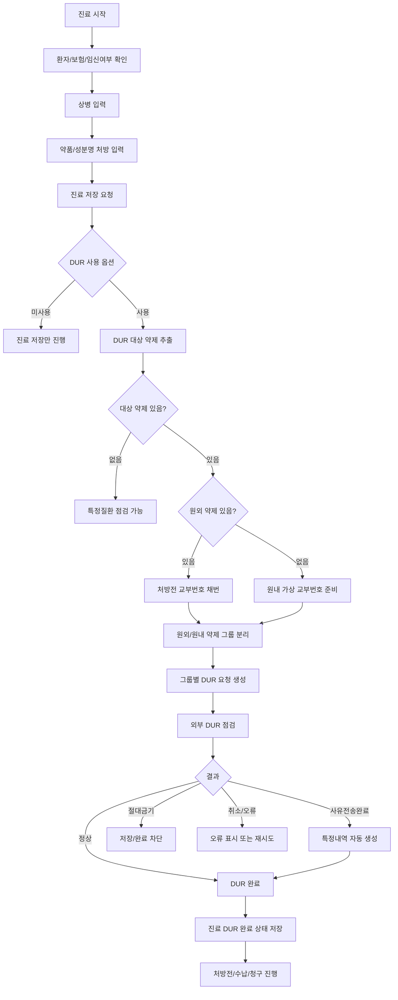
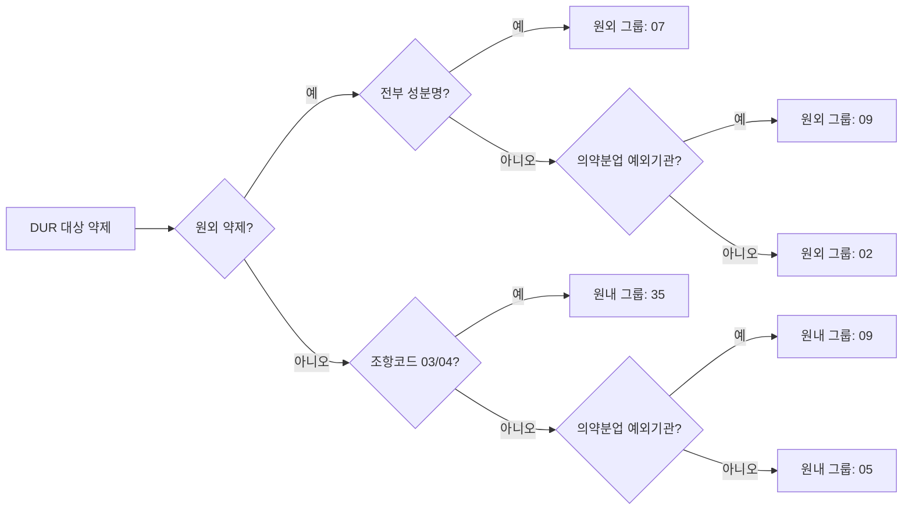
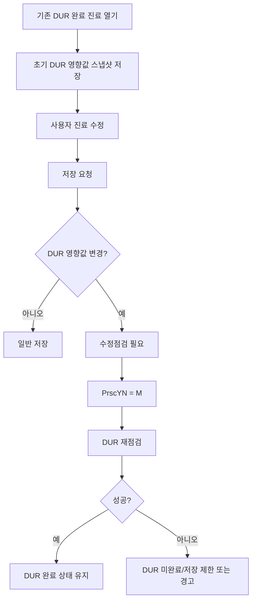
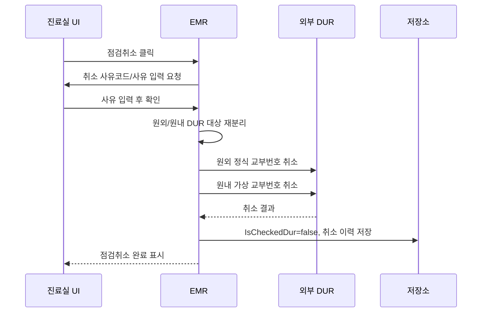
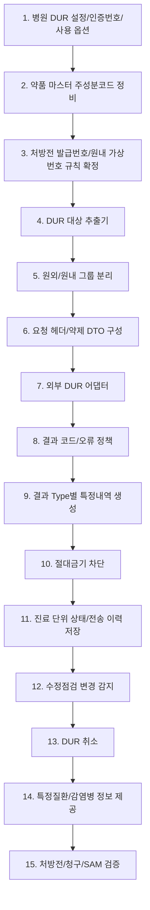

# DUR 상세 도메인

## 1. 목적

DUR은 의사가 약을 처방할 때 환자에게 위험하거나 중복될 수 있는 약제 조합을 외부 DUR 시스템으로 점검하고, 그 결과를 진료 저장, 처방전 출력, 청구 특정내역, 취소 이력에 연결하는 도메인이다.

| 목적 | 설명 |
|---|---|
| 처방 안전성 확인 | 병용금기, 연령금기, 임부금기, 안전성 경고, 중복처방을 확인한다. |
| 진료 저장 통제 | DUR 대상 약제가 있으면 점검 성공 또는 허용 가능한 결과가 있어야 진료 저장/완료를 진행한다. |
| 처방전 식별 | 원외 처방은 정식 처방전 교부번호, 원내 처방은 DUR용 가상 교부번호로 점검/취소를 연결한다. |
| 청구 사유 보관 | DUR 결과 중 사유가 필요한 항목은 청구 특정내역으로 자동 생성한다. |
| 변경 추적 | DUR 완료 후 처방, 주상병, 임신여부, 보험구분 등이 바뀌면 수정점검 대상으로 본다. |

DUR은 약품 비용 계산 기능이 아니다. 급여 약, 비급여 약, 100/100 약 모두 DUR 대상 약제이면 점검 대상이 될 수 있다.

## 2. UI에서 보이는 흐름

### 진료실 화면

| UI 요소 | 역할 |
|---|---|
| DUR 리본 그룹 | DUR 관련 작업을 모아 보여준다. |
| 수정점검후 저장 | 사용자가 직접 DUR 수정점검을 강제하고 저장한다. 실제로는 저장 시 변경 여부에 따라 자동 수정점검도 수행된다. |
| 점검취소 | 이미 DUR 점검 완료된 진료의 DUR 점검을 취소한다. 취소 사유코드와 사유 입력이 필수다. |
| 약제기준정보 | HIRA DUR 기준정보 조회 화면을 연다. 고시/약제 기준 확인 용도다. |
| 진료 목록 DUR 컬럼 | 과거 진료 또는 현재 진료의 DUR 완료 여부를 표시한다. |
| DUR 완료 아이콘 | 진료 카드/진료 이력에서 DUR 점검 완료 상태를 시각적으로 표시한다. |
| 수진자 임부 체크 | 임부금기 점검을 위해 진료의 임신 여부를 지정한다. |
| 처방전 버튼 | 원외 처방전 정보를 확인하고 처방일수, 참고사항 등을 조정한다. DUR은 이 처방전 번호를 사용한다. |

### DUR 점검 취소 창

| UI 요소 | 역할 |
|---|---|
| 사유코드 | DUR 취소 사유 코드. 기초코드 `DUR_CANCEL_TYPE`에서 선택한다. |
| 사유 | 취소 상세 사유. 비어 있으면 취소를 진행하지 않는다. |
| 확인 | 사유코드와 사유가 모두 있을 때만 DUR 취소를 요청한다. |
| 취소 | 취소 요청 없이 창을 닫는다. |

## 3. 업무 흐름

## 4. DUR을 실행하는 시점

| 시점 | 처리 |
|---|---|
| 신규 진료 저장 | DUR 대상 약제가 있으면 최초 점검을 수행한다. |
| 기존 진료 수정 저장 | 기존 DUR 완료 상태가 있고 DUR 영향 필드가 변경되면 수정점검을 수행한다. |
| 사용자가 수정점검후 저장 클릭 | 변경 여부와 무관하게 DUR 점검을 강제한다. |
| DUR 대상 약제를 삭제한 저장 | 기존 DUR 완료 진료였고 처방전 번호가 있으면 DUR 취소를 먼저 수행할 수 있다. |
| 진료 삭제 또는 점검취소 | 취소 사유를 입력받고 DUR 취소를 전송한다. |
| 접수 또는 환자 확인 | 특정질환 점검은 약제 처방 없이 환자 기준으로 수행할 수 있다. |

## 5. DUR 대상 추출

DUR은 모든 처방을 보내지 않는다. 약제 또는 성분명 처방 중 주성분코드가 정상인 항목만 대상으로 잡는다.

### 포함 조건

| 필드 | 뜻 | 규칙 |
|---|---|---|
| 처방 종류 | 약가/성분명 여부 | 약가 또는 성분명 처방이면 후보가 된다. |
| 주성분코드 | DUR 점검 기준 성분 코드 | 처방 마스터가 주성분코드를 가져야 한다. |
| 주성분코드 길이 | 코드 형식 | 9자리여야 한다. |
| 투여경로 자리 | 주성분코드 7번째 문자 | `A`, `B`, `C` 중 하나여야 한다. |
| 제형구분 자리 | 주성분코드 8~9번째 문자 | 영문 2자리여야 한다. |

### 제외 조건

| 조건 | 제외 이유 |
|---|---|
| 주성분코드 없음 | 외부 DUR이 약제를 식별할 수 없다. |
| 주성분코드 형식 오류 | DUR 전송 대상 코드로 볼 수 없다. |
| 진찰료/검사/처치 수가 단독 | 약제 안전성 점검 대상이 아니다. |
| 치료재료 단독 | 일반적으로 약제 DUR 대상이 아니다. |
| 단순 비약품 비급여 시술 | DUR 약제 점검 대상이 아니다. |

## 6. 원외/원내 분리

DUR은 같은 진료 안의 약제를 원외와 원내로 나눠 전송한다. 이유는 점검과 취소의 기준 번호가 다르기 때문이다.

| 그룹 | 기준 | 교부번호 | 처방조제유형 |
|---|---|---|---|
| 원외처방 | 환자가 약국에서 조제받는 약제 | 정식 처방전 교부번호 | 기본 `02` |
| 원외 성분명 | 원외 처방 전체가 성분명 처방 | 정식 처방전 교부번호 | `07` |
| 의약분업 예외 | 병원이 의약분업 예외기관/지역 | 정식 또는 원내 기준 번호 | `09` |
| 원내조제 | 병원에서 직접 투약/조제 | 진료일자 + 진료ID 5자리 | 기본 `05` |
| 원내 직접조제/투약 | 원내 약제 중 조항코드 `03`, `04` 존재 | 진료일자 + 진료ID 5자리 | `35` |

## 7. 처방전 교부번호 규칙

| 구분 | 번호 생성/사용 |
|---|---|
| 원외 DUR | 처방전 발급번호를 사용한다. 원외 약제가 있는데 번호가 없으면 저장 전 채번한다. |
| 원내 DUR | 실제 처방전이 없어도 DUR 취소를 위해 가상 교부번호를 만든다. |
| 가상 교부번호 | `진료일자 yyyyMMdd + 진료ID 하위 5자리` 형태로 만든다. |
| 수정점검 | 기존 점검 상태가 있으면 재점검 구분을 수정점검으로 보낸다. |
| 취소 | 최초 점검 때 사용한 교부번호와 같은 번호로 취소해야 한다. |

원외약이 완전 비급여여도 DUR 대상이면 정식 처방전 교부번호가 필요하다. 이 경우 청구금액은 만들지 않고, 처방전과 DUR 이력을 위해 번호를 사용한다.

## 8. DUR 요청 헤더 필드

| 필드 | 뜻 | 생성 규칙 |
|---|---|---|
| AdminType | 업무구분 | 처방 점검은 `M`으로 본다. |
| JuminNo | 환자 주민/외국인번호 | 환자 식별번호를 하이픈 없이 사용한다. |
| PatNm | 환자명 | 환자 기본정보 이름을 사용한다. |
| InsurerType | 보험자격구분 | 건강보험 `04`, 의료급여 `05`, 일반 `09`로 변환한다. |
| PregWmnYN | 임신여부 | 수진자 임부 체크가 true이면 `Y`, 아니면 `N`. |
| MprscIssueAdmin | 처방전 발행기관 | 병원 요양기관기호. |
| mprscGrantNo | 처방전 교부번호 | 원외는 정식 번호, 원내는 가상 번호. |
| PrscAdminName | 처방기관명 | 병원명. |
| PrscTel | 처방기관 전화번호 | 병원 전화번호 조합. |
| PrscFax | 처방기관 팩스번호 | 병원 팩스번호 조합. |
| PrscPresDt | 처방일자 | 진료일 `yyyyMMdd`. |
| PrscPresTm | 처방시간 | 진료시간 `HHmmss`. |
| PrscLicType | 면허종류 | 의원 의사 기준 `AA`. |
| DrLicNo | 의사면허번호 | 담당의 면허번호. |
| PrscName | 의사명 | 담당의 이름. |
| Dsbjt | 진료과목 | 주상병 진료과가 있으면 우선, 없으면 의사 진료과. |
| MainSick | 주상병코드 | 주상병이 있으면 전송. |
| PrscMdFee | 특정기호 | 주상병 특정기호가 있으면 전송. |
| PrscClCode | 처방조제유형 | 원외/원내/성분명/직접조제 규칙으로 결정. |
| PrscRef | 처방 참고사항 | 처방전 참고 문구를 길이 제한 후 전송. |
| PrscPeriod | 처방전 사용기간 | 처방전 사용일수. |
| AppIssueAdmin | 프로그램 공급자 코드 | 병원/업체 설정값. |
| AppIssueCode | DUR 인증번호 | 운영은 병원 DUR 인증번호, 개발서버는 테스트 인증번호. |
| PrscYN | 점검 구분 | 최초 점검 `N`, 수정점검 `M`. |

## 9. 약제 전송 필드

| 필드 | 뜻 | 생성 규칙 |
|---|---|---|
| MedicineSerialNo | 약제 순번 | 외부 결과 매칭에 사용한다. 요청 순서를 보존해야 한다. |
| 처방항목유형 | DUR 약제 유형 | 수가 `1`, 약가 `3`, 원료/성분명/자가약 `5`, 치료재료 `8`, 기타 `0`. |
| 약품코드 | 약제 코드 | 처방 마스터 코드. 성분명도 현재 구조에서는 처방 코드를 보낼 수 있다. |
| 약품명 | 약제명 | 처방 마스터명. |
| 주성분코드 | DUR 성분 코드 | 정상 형식의 9자리 코드. |
| 주성분명 | 성분명 | 성분명 처방이면 성분명을 사용한다. |
| 1회 투여량 | 1회량 | 처방 라인의 1회 투여량. |
| 1일 투여횟수 | 하루 횟수 | 처방 라인의 일투. |
| 총 투약일수 | 투약일수 | 처방 라인의 총일수. |
| 급여구분 | 급여/비급여/100분의100 | 급여 `A`, 비급여 `B`, 100/100 `C`. |
| 원외/원내구분 | 약을 어디서 조제/투약하는지 | 원외 `1`, 원내 `2`. |
| 용법 | 복약/투약 방법 | 용법 문구를 길이 제한 후 전송한다. |

## 10. 비급여 원외약 처리

수가 없이 완전 비급여 약만 원외 처방하는 경우에도 DUR 대상이면 점검한다.

| 항목 | 처리 |
|---|---|
| 병원 수납 | 약제비를 병원 수납금액에 넣지 않는다. |
| 보험청구/SAM | 청구금액을 만들지 않는다. 청구 대상 명세서가 없으면 SAM도 만들지 않는다. |
| DUR | 원외 약제 처방으로 보고 처방조제유형 `02`, 급여구분 `B`로 점검한다. |
| 처방전 | 정식 처방전 교부번호를 채번하고 비급여 약으로 출력한다. |
| 취소/수정 | 처방전 교부번호 기준으로 DUR 취소 또는 수정점검을 한다. |

## 11. 결과 코드 처리

| 외부 결과 | 의미 | EMR 처리 |
|---|---|---|
| `0` | 정상 완료 | DUR 완료로 저장한다. |
| `16023` | 사유전송완료 | 결과 사유를 읽어 특정내역을 생성하고 DUR 완료로 저장한다. |
| `16025` | 표준 결과창에서 사유전송 취소 | DUR 실패로 처리하고 저장/완료를 막는다. |
| `53008` | 계속 진행 가능한 응답으로 처리 | 현재 구현은 성공처럼 통과한다. 신규 개발에서는 메시지를 이력에 남기는 것이 좋다. |
| 계속 가능 오류 | 통신/상태상 경고 후 진행 가능 코드 | 설정에 따라 오류 상세 표시를 생략하고 진행할 수 있다. |
| 그 외 오류 | 점검 실패 | 사용자에게 오류를 표시하고 DUR 완료로 저장하지 않는다. |

계속 진행 가능 코드 예시는 `16029`, `16028`, `16004`, `16006`, `50002`, `53002`, `53004`, `53011`, `53012`, `53014`, `53008`이다. 운영에서는 코드만 저장하지 말고 외부 메시지와 사용자 진행 여부를 함께 저장해야 한다.

## 12. 결과 유형과 특정내역

| DUR 결과 유형 | 결과 Type | 처리 | 생성 특정내역 |
|---|---:|---|---|
| 병용금기 | `0` | 사유가 있으면 처방 라인 단위 사유 저장 | `JT011` |
| 연령금기 | `1` | 사유가 있으면 처방 라인 단위 사유 저장 | `JT011` |
| 안전성 | `2` | Level `C`이면 절대금기로 차단 | 없음 또는 차단 |
| 저함량 배수처방 | `5` | 사유코드/사유 저장 | `JT010` |
| 임부금기 | `6` | Level `C` 차단, Level `B`는 사유 저장 | `MT024` |
| 기타 사유성 경고 | `7` | 사유 저장, 사유코드 `P`이면 PRN도 생성 | `JT011`, `JT019` |
| 성분별 중복처방 | `8` | 사유코드/사유 저장, `P`이면 PRN도 생성 | `JT012`, `JT019` |

### 특정내역 생성 규칙

| 특정내역 | 발생 단위 | 생성값 |
|---|---|---|
| `MT024` | 명세서 단위 | `Y/약품코드9자리/임부금기 사유` |
| `JT011` | 처방 라인 단위 | 병용금기/연령금기/기타 사유 문구 |
| `JT012` | 처방 라인 단위 | `사유코드/구체적 사유` |
| `JT010` | 처방 라인 단위 | `사유코드/구체적 사유` |
| `JT019` | 처방 라인 단위 | `P` |

사유코드가 `T`이면 저장 사유코드는 `E`로 보정한다. 사유 문구는 byte 기준 길이 제한을 적용해야 한다.

## 13. 절대금기 처리

절대금기는 사유 입력으로 통과시키면 안 된다.

| 조건 | 처리 |
|---|---|
| 임부금기 Level `C` | 처방 차단. 진료 완료/저장 진행 불가. |
| 안전성 Level `C` | 처방 차단. 약 변경 후 재점검 필요. |
| 외부 결과가 차단 등급 | 사용자에게 약제와 사유를 보여주고 처방 수정 요구. |

절대금기 상태에서는 처방전 출력, 수납대기 전환, 청구 생성으로 넘어가지 않게 해야 한다.

## 14. DUR 완료 상태 저장

현재 구조는 진료 단위 `IsCheckedDur`를 저장한다. 신규 개발에서는 진료 단위 상태와 전송 이력을 분리 저장하는 것이 좋다.

### 진료 단위 상태

| 필드 | 뜻 | 저장 규칙 |
|---|---|---|
| TreatmentId | 진료 식별자 | DUR 상태의 기준 진료. |
| IsCheckedDur | DUR 완료 여부 | 그룹별 점검이 모두 성공하면 true. 취소/수정 필요 시 false. |
| DurCheckedAt | 점검 완료 일시 | 마지막 성공 점검 시각. |
| DurCheckedBy | 점검 사용자 | 점검을 수행한 사용자. |
| DurStatus | 상태 | 미사용, 대상없음, 성공, 실패, 취소, 수정점검필요. |
| LastErrorCode | 마지막 오류 코드 | 실패 또는 경고 코드. |
| LastErrorMessage | 마지막 오류 메시지 | 외부 DUR 메시지. |

### 전송 이력

| 필드 | 뜻 | 저장 규칙 |
|---|---|---|
| DurRequestId | DUR 요청 식별자 | 점검/취소 요청별로 생성. |
| TreatmentId | 진료 식별자 | 원 진료와 연결. |
| RequestType | 요청 유형 | 점검, 수정점검, 취소, 특정질환. |
| RequestGroup | 전송 그룹 | 원외, 원내, 특정질환. |
| PrescriptionClassCode | 처방조제유형 | `02`, `05`, `07`, `09`, `35`. |
| GrantNo | 교부번호 | 정식 처방전 번호 또는 가상 번호. |
| RequestAt | 요청 일시 | 외부 전송 시각. |
| ResponseAt | 응답 일시 | 외부 응답 시각. |
| ResultCode | 결과 코드 | 외부 결과 코드. |
| ResultMessage | 결과 메시지 | 외부 메시지. |
| IsSuccess | 성공 여부 | 업무상 성공 처리 여부. |
| IsResumable | 계속 진행 가능 여부 | 경고 후 진행 가능한 오류인지. |
| RawRequest | 원 요청 전문/필드 | 장애 분석용. 개인정보 보호 정책 적용 필요. |
| RawResponse | 원 응답 전문/필드 | 장애 분석용. 개인정보 보호 정책 적용 필요. |

### 약제 이력

| 필드 | 뜻 |
|---|---|
| DurRequestMedicineId | DUR 요청 약제 식별자 |
| DurRequestId | DUR 요청 식별자 |
| TreatmentPrescribeId | EMR 처방 라인 식별자 |
| MedicineSerialNo | DUR 요청 내 약제 순번 |
| DrugCode | 약품코드 |
| DrugName | 약품명 |
| MajorComponentCode | 주성분코드 |
| OneTimeDose | 1회 투여량 |
| OneDayTimes | 1일 투여횟수 |
| TotalDays | 총 투약일수 |
| PayType | 급여구분 |
| OutClinicType | 원외/원내구분 |
| UsageText | 용법 |

### 결과 이력

| 필드 | 뜻 |
|---|---|
| DurResultId | DUR 결과 식별자 |
| DurRequestId | DUR 요청 식별자 |
| MedicineSerialNo | 결과 약제 순번 |
| TreatmentPrescribeId | 연결 처방 라인 |
| ResultType | 병용금기, 임부금기, 중복처방 등 |
| ResultLevel | 주의, 경고, 절대금기 |
| ReasonCode | 외부 사유코드 |
| ReasonText | 사유 내용 |
| IsBlocking | 처방 차단 여부 |
| SpecificDetailCode | 생성 특정내역 코드 |
| SpecificDetailId | 생성 특정내역 식별자 |

## 15. 수정점검 판단

이미 DUR 완료된 진료를 수정할 때 다음 값이 바뀌면 수정점검 대상으로 본다.

| 변경 항목 | 이유 |
|---|---|
| 보험구분 | DUR 보험자격구분과 약제 급여구분이 달라질 수 있다. |
| 임신여부 | 임부금기 점검 결과가 달라진다. |
| 주상병 | 주상병 코드, 특정기호, 진료과가 DUR 헤더에 들어간다. |
| 주상병 특정기호 | 산정특례/특정기호가 DUR 헤더에 반영된다. |
| 주상병 진료과 | DUR 진료과목이 달라진다. |
| DUR 대상 약제 추가/삭제 | 요청 약제 목록 자체가 달라진다. |
| 약품코드 변경 | 약제/성분이 달라진다. |
| 급여 여부 변경 | DUR 급여구분이 달라진다. |
| 1회량, 1일횟수, 총일수 변경 | 용량/기간 점검 결과가 달라진다. |
| 원내/원외 변경 | 전송 그룹과 교부번호가 달라진다. |
| 본인부담률/PayType 변경 | 100/100, 비급여 구분이 달라질 수 있다. |

## 16. DUR 취소

DUR 취소는 진료 삭제, 처방 삭제, 처방전 회수, DUR 완료 후 대상 약제 제거, 사용자가 점검취소를 누른 경우에 필요하다.

| 취소 필드 | 뜻 | 규칙 |
|---|---|---|
| 요청구분 | DUR 업무구분 | 처방 취소는 `M`. |
| 환자식별번호 | 환자 주민/외국인번호 | 원 점검 환자와 같아야 한다. |
| 진료일자 | 원 점검 진료일 | `yyyyMMdd`. |
| 요양기관기호 | 병원 코드 | 원 점검 기관과 같아야 한다. |
| 교부번호 | 취소 대상 번호 | 원외는 정식 처방전 번호, 원내는 가상 번호. |
| 취소사유코드 | 취소 코드 | 사용자가 선택한 DUR 취소 사유. |
| 취소사유 | 상세 사유 | 사용자가 입력한 사유. |

## 17. 특정질환 점검

특정질환 점검은 약제 목록이 없어도 환자 기준으로 수행할 수 있는 DUR 부가 흐름이다.

| 필드 | 뜻 | 생성 규칙 |
|---|---|---|
| 환자식별번호 | 주민/외국인번호 | 환자 기본정보. |
| 환자명 | 환자 이름 | 환자 기본정보. |
| 요양기관기호 | 병원 코드 | 병원 설정. |
| 처방기관명 | 병원명 | 병원 설정. |
| 점검일자 | 요청일자 | 현재일 `yyyyMMdd`. |
| 프로그램 공급자 코드 | EMR 업체 코드 | 병원/업체 설정. |
| DUR 인증번호 | DUR 인증번호 | 운영/개발 환경별로 결정. |

접수 단계에서 감염병/특정질환 정보 제공을 확인해야 하는 인증 항목이 있으므로, 처방 DUR과 별도 기능으로 분리하는 것이 좋다.

## 18. 약제기준정보 조회

약제기준정보는 DUR 점검과 별개로 HIRA 기준정보 조회 화면을 여는 기능이다.

| 기능 | 사용 목적 |
|---|---|
| 약품 정보 조회 | 특정 약품 코드의 DUR/고시 기준 확인. |
| 기준정보 URL 열기 | DUR 프로그램이 제공하는 기준정보 조회 서비스 연결. |
| 운영 지원 | 처방 입력자가 경고 원인이나 약제 기준을 확인할 때 사용. |

이 기능은 진료 저장을 직접 변경하지 않는다.

## 19. 외부 프로그램/환경

| 항목 | 설명 |
|---|---|
| DUR 설치 경로 | `C:\HIRA\IHIRADUR` 기준으로 파일을 확인한다. |
| COM 객체 | 외부 DUR 클라이언트와 처방/결과 객체를 생성해 호출한다. 신규 개발은 COM이 아니어도 같은 역할의 어댑터로 감싸야 한다. |
| 관리자 권한 | COM 생성 시 권한 상승 오류가 나면 DUR 실행 권한 오류로 안내한다. |
| 인증서 자동 로그인 | DUR 버전별 자동 로그인 서비스를 찾아 실행한다. |
| 개발/운영 서버 | DUR ini의 포트로 개발서버와 실서버를 구분한다. 개발서버는 테스트 인증번호를 사용할 수 있다. |
| DUR 사용 옵션 | 꺼져 있으면 처방 점검을 건너뛰고 상태는 미사용으로 남긴다. |
| 오류 상세 옵션 | 계속 진행 가능한 오류의 상세 표시 여부를 제어한다. |

## 20. 청구와의 연결

DUR 자체는 청구 파일 생성 기능이 아니지만, 결과 사유가 있으면 청구 특정내역으로 이어진다.

| 연결 대상 | 연결 방식 |
|---|---|
| 처방 라인 | DUR 결과 약제 순번을 원 처방 라인과 매칭한다. |
| 특정내역 | `JT010`, `JT011`, `JT012`, `JT019`, `MT024`를 자동 생성한다. |
| 처방전 | 원외 처방전 발급번호는 DUR과 SAM 처방전내역의 공통 식별자가 된다. |
| SAM 청구 | DUR 사유 특정내역이 누락되면 심사불능/삭감 사유가 될 수 있다. |
| 비급여 원외약 | 청구금액은 없지만 DUR 이력과 처방전 출력 이력은 남긴다. |

## 21. 개발 순서

## 22. 스프린트 기준

| 주차 | 개발 목표 | 완료 기준 |
|---|---|---|
| 1주차 | DUR 설정과 약품 마스터 정비 | 병원 DUR 사용 여부, 인증번호, 업체코드, 주성분코드 유효성 검증 가능 |
| 2주차 | 대상 추출과 원외/원내 분리 | 약가/성분명 중 DUR 대상만 추출하고 원외/원내 그룹을 분리 |
| 3주차 | 처방전 번호와 요청 생성 | 정식 교부번호/가상 교부번호가 생성되고 헤더/약제 필드가 완성 |
| 4주차 | 외부 점검 연동 | 원외, 원내, 성분명, 직접조제 케이스가 외부 DUR으로 전송 |
| 5주차 | 결과 처리 | 정상, 사유전송완료, 취소, 오류, 절대금기 결과를 구분 |
| 6주차 | 특정내역 생성 | `JT010/JT011/JT012/JT019/MT024`가 결과 유형별로 생성 |
| 7주차 | 수정점검 | DUR 완료 진료 수정 시 영향 필드 변경을 감지하고 수정점검 수행 |
| 8주차 | 취소와 이력 | 점검취소 창, 원외/원내 취소, 취소 이력 저장 구현 |
| 9주차 | 특정질환/감염병 | 환자 기준 특정질환 점검과 접수 단계 정보 제공 연결 |
| 10주차 | 통합 검증 | 처방전 출력, 수납 진행, SAM 특정내역, 인증 테스트 케이스 검증 |

## 23. 테스트 케이스

| 케이스 | 입력 | 기대 결과 |
|---|---|---|
| DUR 미사용 | 병원 옵션 OFF | DUR 호출 없이 저장. 상태는 미사용으로 구분 |
| 대상 없음 | 진찰료만 입력 | DUR 약제 점검 없음. 필요 시 특정질환 점검 |
| 주성분코드 없음 | 약품 처방, 주성분코드 공백 | DUR 대상 제외 또는 사용자 경고 |
| 주성분코드 형식 오류 | 9자리 아님 | DUR 대상 제외 또는 코드 오류 표시 |
| 원외 급여약 | 원외 약가 처방 | 처방전 번호 채번, 처방조제유형 `02`, 급여구분 `A` |
| 원외 비급여약 단독 | 수가 없음, 비급여 원외약 | 청구금액 없음, 처방전 발행, DUR `02/B` |
| 원내 약 | 원내 약가 처방 | 가상 교부번호, 처방조제유형 `05`, 원내구분 `2` |
| 원내 직접조제 | 원내 약 + 조항코드 `03/04` | 처방조제유형 `35` |
| 성분명 원외 | 원외 전체 성분명 | 처방조제유형 `07` |
| 의약분업 예외기관 | 병원 예외 설정 ON | 처방조제유형 `09` |
| 원외+원내 혼합 | 원외약과 원내약 동시 | DUR 요청 2건 생성 |
| 임부금기 경고 | 임신여부 Y, Level B | `MT024` 생성 |
| 임부금기 절대금기 | 임신여부 Y, Level C | 저장/완료 차단 |
| 병용금기 사유 | Type 0, 사유 있음 | `JT011` 생성 |
| 연령금기 사유 | Type 1, 사유 있음 | `JT011` 생성 |
| 중복처방 | Type 8 | `JT012` 생성 |
| PRN | 사유코드 `P` | `JT019` 생성 |
| 저함량 배수 | Type 5 | `JT010` 생성 |
| 사유전송 취소 | 결과코드 `16025` | DUR 실패, 저장/완료 차단 |
| 계속 가능 오류 | `53008` 등 | 설정에 따라 경고 후 진행, 이력 저장 |
| 수정점검 | DUR 완료 후 약품 일수 변경 | `PrscYN=M`, 재점검 |
| 점검취소 원외 | 원외 처방전 번호 있음 | 정식 교부번호로 취소 |
| 점검취소 원내 | 원내 DUR 이력 있음 | 가상 교부번호로 취소 |

## 24. 구현 시 주의사항

| 주의사항 | 이유 |
|---|---|
| DUR 대상 추출은 약품코드가 아니라 주성분코드 기준으로 해야 한다. | 약품코드가 있어도 DUR 성분코드가 없으면 점검 품질이 떨어진다. |
| 원외와 원내를 한 번에 섞어 보내면 안 된다. | 취소 교부번호와 처방조제유형이 달라진다. |
| 처방전 번호는 DUR 전에 확정해야 한다. | 원외 DUR과 취소는 교부번호로 연결된다. |
| 원내 가상번호는 항상 같은 규칙으로 재생성해야 한다. | 취소 시 최초 점검 번호와 같아야 한다. |
| DUR 완료 상태만 저장하면 운영 추적이 어렵다. | 요청/응답/약제/결과 이력을 별도 저장해야 한다. |
| 수정점검 판단 필드를 명확히 고정해야 한다. | 약제나 임신여부 변경 후 과거 DUR 완료값을 재사용하면 위험하다. |
| 절대금기는 경고가 아니라 차단이다. | 사용자 사유 입력으로 통과시키면 안 된다. |
| 특정내역 자동 생성은 DUR 성공과 별개로 검증해야 한다. | 진료 화면은 통과했지만 청구 사유가 누락될 수 있다. |
| 비급여 원외약도 DUR 대상일 수 있다. | 청구금액 없음과 DUR 점검 없음은 다른 의미다. |
| 개인정보가 포함된 원문 이력은 보안 정책을 적용해야 한다. | 주민번호, 처방 약제, 상병 정보가 포함된다. |

## 25. 현재 소스 기준 확인 위치

| 영역 | 기준 파일 |
|---|---|
| DUR 서비스 인터페이스 | `Data/UBerSoft.EMR.Data/Services/IDurService.cs` |
| DUR 외부 연동/대상 추출/결과 처리 | `Data/UBerSoft.EMR.DUR/DurService.cs` |
| DUR 완료 상태 저장 API | `Data/UBerSoft.EMR.Data/Controllers/Treatements/Concreate/TreatmentController.cs` |
| DUR 상태 저장 Repository | `Data/UBerSoft.EMR.Data/Repositories/Treatments/TreatmentRepository.cs` |
| 수정점검 변경 감지 | `Windows/UBerSoft.EMR.Windows.TreatementRooms/Services/DurgCompareDirtyService.cs` |
| 진료실 DUR 버튼/저장 연동 | `Windows/UBerSoft.EMR.Windows.TreatementRooms/Commands/TreatmentRoomCommands.cs` |
| DUR 취소 창 | `Windows/UBerSoft.EMR.Windows.TreatementRooms/Views/DurCancelWindow.xaml` |
| 처방전 번호/원내외 속성 | `Data/UBerSoft.EMR.Data.ViewModels/Treatments/TreatmentPrescribeReportViewModel.cs` |
| DUR 취소 사유 기초코드 | `Data/UBerSoft.EMR.Data/Contexts/CodeContext.cs` |
| 특정내역 설명 | `Data/UBerSoft.EMR.Data/Repositories/Codes/SpecificDetailRepository.cs` |
