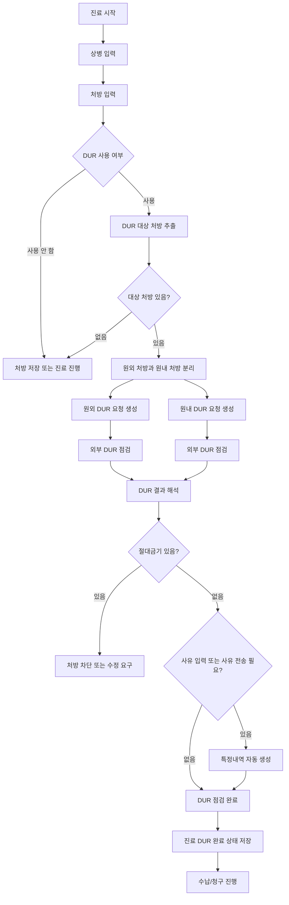
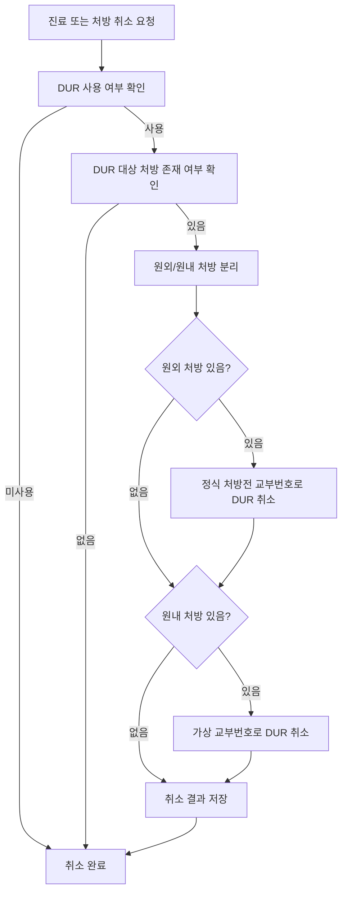
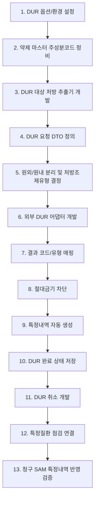

# DUR Domain

## 1. 목적

DUR은 진료 중 처방 약제의 안전성과 중복성을 점검하는 도메인이다.

EMR에서 DUR은 단순히 외부기관에 약 목록을 보내는 기능이 아니다. 진료 처방을 저장하거나 확정하기 전에 아래 항목을 점검하고, 필요한 경우 청구 특정내역까지 자동 생성해야 한다.

- 병용금기
- 연령금기
- 임부금기
- 안전성 관련 금기
- 성분별 중복처방
- 저함량 의약품 배수처방
- PRN, 필요시 투약 사유
- 처방 수정 후 재점검
- 진료 삭제 또는 처방 취소 시 DUR 점검 취소
- 필요 시 특정질환 점검

## 2. 개발 범위

DUR 개발 범위는 다음 6개로 나누어야 한다.

| 구분 | 설명 |
|---|---|
| DUR 대상 추출 | 진료 처방 중 DUR 점검 대상 약제만 선별 |
| DUR 점검 요청 생성 | 환자, 병원, 의사, 진료, 처방전, 약제 정보를 조합하여 점검 요청 구성 |
| 원외/원내 전송 분리 | 처방전 교부번호와 취소 규칙이 다르므로 원외와 원내를 분리 전송 |
| DUR 결과 처리 | 외부 점검 결과를 통과, 경고, 절대금기, 사유전송완료, 취소 등으로 해석 |
| 청구 특정내역 생성 | DUR 결과 사유를 청구에 필요한 특정내역으로 자동 생성 |
| DUR 취소 | 진료 삭제, 처방 변경 취소, 처방전 취소 시 기존 DUR 점검을 취소 전송 |

## 3. 전체 업무 흐름

## 4. DUR 대상 처방 추출 규칙

DUR은 모든 진료 행위나 재료를 대상으로 하지 않는다.

점검 대상은 원칙적으로 약제 또는 성분명 처방이다. 현재 기준으로는 처방의 청구코드보다 주성분코드가 유효한지가 더 중요하다.

### 대상 포함 조건

| 필드 | 뜻 | 규칙 |
|---|---|---|
| 처방유형 | 처방이 약가인지, 성분명인지 구분 | 약가 또는 성분명 처방이면 후보 |
| 주성분코드 | 약제의 DUR 점검 기준 성분 코드 | 유효한 주성분코드가 있어야 함 |
| 주성분코드 길이 | DUR 성분코드 형식 검증 | 9자리 |
| 투여경로 자리 | 주성분코드 7번째 자리 | `A`, `B`, `C` 중 하나 |
| 제형구분 자리 | 주성분코드 8~9번째 자리 | 영문 2자리 |

### 대상 제외 조건

| 조건 | 설명 |
|---|---|
| 주성분코드 없음 | 외부 DUR이 약제를 식별할 수 없음 |
| 주성분코드 형식 오류 | 길이, 투여경로, 제형 코드가 맞지 않음 |
| 일반 진료행위 | 진찰료, 처치, 검사 등은 DUR 약제 점검 대상 아님 |
| 치료재료 단독 | 약제 성분 점검 대상이 아님 |

## 5. DUR 요청 생성에 필요한 상위 필드

### 환자 필드

| 필드 | 뜻 | 생성/사용 규칙 |
|---|---|---|
| 환자식별번호 | 주민등록번호 또는 외국인등록번호 | 외부 DUR 환자 식별값 |
| 환자명 | 수진자 이름 | DUR 요청 필수 |
| 보험자격구분 | 건강보험, 의료급여, 일반 | DUR 보험구분 코드로 변환 |
| 임신여부 | 임부금기 점검 대상 여부 | 임신이면 `Y`, 아니면 `N` |

### 보험자격 구분 변환

| EMR 보험구분 | DUR 전송값 | 뜻 |
|---|---:|---|
| 건강보험 | `04` | 건강보험 |
| 건강보험 100% | `04` | 건강보험 자격이나 환자 전액부담 접수 |
| 의료급여 | `05` | 의료급여 |
| 일반 | `09` | 일반 |

## 6. 병원/의사 필드

| 필드 | 뜻 | 생성/사용 규칙 |
|---|---|---|
| 요양기관기호 | 병원 식별번호 | DUR 기관코드 |
| 병원명 | 처방기관명 | DUR 요청 표시 및 기록 |
| 병원 전화번호 | 처방기관 전화 | 지역번호, 국번, 번호 조합 |
| 병원 팩스번호 | 처방기관 팩스 | 지역번호, 국번, 번호 조합 |
| DUR 인증번호 | DUR 프로그램 발급/인증 번호 | 운영 서버에서는 병원별 인증번호 사용 |
| 프로그램 공급자 코드 | EMR 프로그램 공급자 식별값 | DUR 요청에 포함 |
| 의사면허종류 | 의사 면허 타입 | 의원 EMR 기준 `AA` |
| 의사면허번호 | 처방의 면허번호 | DUR 처방의 식별 |
| 의사명 | 처방의 이름 | DUR 처방의 표시 |
| 진료과목 | 주상병의 진료과 또는 의사 진료과 | 주상병 있으면 주상병 진료과 우선 |

### 개발서버/운영서버 구분

| 구분 | 규칙 |
|---|---|
| 운영서버 | 병원별 DUR 인증번호 사용 |
| 개발서버 | 외부 DUR 개발용 인증번호 사용 |
| 서버 판별 | DUR 환경 설정에서 개발 포트와 운영 포트를 구분 |

## 7. 진료/처방전 필드

| 필드 | 뜻 | 생성/사용 규칙 |
|---|---|---|
| 진료일시 | 처방 발생 일시 | 날짜 `yyyyMMdd`, 시간 `HHmmss`로 분리 |
| 처방전 교부번호 | 원외처방전 번호 | 원외처방 점검과 취소에 사용 |
| 가상 교부번호 | 원내처방 DUR 식별번호 | 원내처방은 `진료일자 + 진료ID 5자리`로 생성 |
| 처방일수 | 처방전 전체 사용일수 | DUR 처방기간 |
| 처방 참고사항 | 처방전 참고 메모 | 최대 길이 제한 후 전송 |
| 주상병 코드 | 대표 상병 | DUR 주상병 |
| 특정기호 | 산정특례 등 상병 특정기호 | 주상병에 특정기호가 있으면 포함 |
| DUR 재점검 여부 | 기존 DUR 점검 이후 수정인지 여부 | 최초 점검 `N`, 수정점검 `M` |

## 8. 원외/원내 전송 분리 규칙

DUR은 처방전 교부번호를 기준으로 점검과 취소가 연결된다. 따라서 원외처방과 원내처방이 섞여 있으면 같은 진료라도 분리 전송해야 한다.

### 전송 그룹

| 그룹 | 기준 | 교부번호 |
|---|---|---|
| 원외처방 | 환자가 약국에서 조제받는 처방 | 정식 처방전 교부번호 |
| 원내처방 | 병원에서 직접 투약/조제하는 처방 | 가상 교부번호 |

### 처방조제유형 코드

| 코드 | 뜻 | 생성 규칙 |
|---|---|---|
| `02` | 외래 원외처방 | 원외 약제 처방 |
| `05` | 외래 원내조제 | 원내 약제 처방 |
| `07` | 성분명 처방약 | 원외 처방 전체가 성분명 처방인 경우 |
| `09` | 의약분업 예외기관 외래 원내조제 | 병원이 의약분업 예외기관/지역인 경우 |
| `35` | 원내 직접 조제/투약 성격의 처방 | 원내 약제 중 조항코드가 직접 조제/투약 성격인 경우 |

### 분리 처리 순서

1. DUR 대상 전체 처방을 추출한다.
2. 원외 처방과 원내 처방으로 나눈다.
3. 원외 처방이 있으면 정식 처방전 교부번호로 DUR 점검을 보낸다.
4. 원내 처방이 있으면 가상 교부번호로 DUR 점검을 보낸다.
5. 두 요청 중 하나라도 실패하면 전체 DUR 완료 상태는 실패로 본다.

## 9. 약제 단위 전송 필드

| 필드 | 뜻 | 생성/사용 규칙 |
|---|---|---|
| 처방항목유형 | 약가, 원료약, 수가, 재료 구분 | DUR의 처방 유형 코드로 변환 |
| 약품코드 | 약제 청구코드 | 성분명 처방도 현재는 처방 코드 전송 |
| 약품명 | 약제명 | 처방 마스터명 사용 |
| 주성분코드 | DUR 점검의 핵심 성분 코드 | 9자리 유효 코드 |
| 주성분명 | 성분명 | 성분명 처방이면 성분명 사용 |
| 1회 투여량 | 한 번 투약할 양 | 처방의 1회량 |
| 1일 투여횟수 | 하루 투여 횟수 | 처방의 일투 |
| 총 투약일수 | 투약 일수 | 처방의 총일수 |
| 급여구분 | 급여, 비급여, 100/100 | DUR 급여구분 코드로 변환 |
| 원외/원내구분 | 원외처방인지 원내처방인지 | 원외 `1`, 원내 `2` |
| 용법 | 복약/투약 방법 | 최대 길이 제한 후 전송 |

### 처방항목유형 변환

| EMR 처방 성격 | DUR 전송값 | 뜻 |
|---|---:|---|
| 수가 | `1` | 진료수가 |
| 약가 | `3` | 등재 약제 |
| 원료/성분명/자가약 | `5` | 원료약 또는 성분명 |
| 치료재료 | `8` | 치료재료 |
| 기타 | `0` | 없음/미분류 |

### 급여구분 변환

| EMR 급여 상태 | DUR 전송값 | 뜻 |
|---|---|---|
| 급여 | `A` | 보험급여 |
| 비급여 | `B` | 비급여 |
| 100/100 | `C` | 환자 전액부담 급여 |

## 10. DUR 점검 결과 처리

| 결과 | 의미 | 처리 |
|---|---|---|
| 정상 완료 | DUR 점검이 통과됨 | DUR 완료 상태 저장 |
| 사유전송완료 | DUR 경고 사유가 입력/전송됨 | 특정내역 생성 후 완료 |
| 사유전송취소 | 사용자가 표준 결과창에서 사유전송 취소 | DUR 실패로 처리 |
| 절대금기 | 조제/처방하면 안 되는 금기 | 처방 저장 또는 진료 확정을 차단 |
| 외부 오류 | DUR 프로그램 오류, 인증 오류, 통신 오류 | 사용자에게 오류 표시 후 재시도 |
| 대상 없음 | 점검 대상 약제 없음 | DUR 완료로 간주 가능 |
| DUR 사용 안 함 | 병원 옵션에서 DUR 미사용 | DUR 로직을 건너뜀 |

## 11. DUR 결과 유형별 청구 특정내역 생성

DUR 결과 중 사유가 있는 항목은 청구 특정내역으로 저장해야 한다. 이 단계가 빠지면 진료 화면에서는 DUR을 통과한 것처럼 보여도 청구 파일에는 필요한 사유가 누락된다.

| DUR 결과 유형 | 뜻 | 청구 특정내역 | 발생 단위 | 생성값 |
|---|---|---|---|---|
| 임부금기 | 임부에게 주의가 필요한 약제 | `MT024` | 명세서 | `Y/약품코드/사유` |
| 병용금기 | 같이 쓰면 안 되는 약제 조합 | `JT011` | 줄번호 | 사유 |
| 연령금기 | 연령대 사용 제한 약제 | `JT011` | 줄번호 | 사유 |
| 안전성 경고 | 안전성 관련 점검 결과 | 차단 또는 경고 | 없음 또는 별도 처리 | 절대금기면 차단 |
| 성분별 중복처방 | 동일 성분 중복 처방 | `JT012` | 줄번호 | `사유코드/구체적 사유` |
| 저함량 배수처방 | 고함량 대신 저함량 여러 정 처방 | `JT010` | 줄번호 | `사유코드/구체적 사유` |
| PRN | 필요시 투약 | `JT019` | 줄번호 | `P` |

### 특정내역 생성 규칙

| 특정내역 | 규칙 |
|---|---|
| `MT024` | 임부금기 결과가 절대금기가 아니고 사유가 있으면 생성 |
| `JT011` | 병용금기, 연령금기, 일부 DUR 유형의 사유를 저장 |
| `JT012` | 성분별 중복처방 사유를 저장 |
| `JT010` | 저함량 배수처방 사유를 저장 |
| `JT019` | DUR 사유코드가 PRN이면 추가 생성 |

### 사유코드 보정

| 외부 사유코드 | 저장 사유코드 | 이유 |
|---|---|---|
| `P` | `P` | PRN, 필요시 투약 |
| `T` | `E` | 자유기재 사유로 보정 |
| 기타 | 그대로 사용 | 외부 DUR 사유코드 유지 |

### 길이 제한

| 항목 | 제한 |
|---|---|
| 병용/연령금기 사유 | 영문 400자 또는 한글 200자 수준 |
| 중복처방 사유 | 영문 200자 또는 한글 100자 수준 |
| 저함량 배수처방 사유 | 영문 200자 또는 한글 100자 수준 |
| 처방 참고사항 | 영문 200자 또는 한글 100자 수준 |
| 임부금기 사유 | 영문 200자 또는 한글 100자 수준 |

## 12. 절대금기 처리

절대금기는 사용자가 사유를 입력했더라도 진행하면 안 되는 결과로 보아야 한다.

| 유형 | 절대금기 기준 | 처리 |
|---|---|---|
| 임부금기 | 결과 등급이 절대금기 | 처방 차단 |
| 안전성 금기 | 결과 등급이 절대금기 | 처방 차단 |
| 병용/연령/기타 금기 | 외부 결과 등급이 절대금기인 경우 | 처방 차단 |

권장 UI 처리:

1. 절대금기 약제를 사용자에게 명확히 표시한다.
2. 해당 처방을 삭제하거나 대체 약제로 변경하게 한다.
3. 처방이 변경되면 DUR 수정점검으로 다시 전송한다.
4. 절대금기 상태에서는 진료 완료, 처방전 출력, 수납으로 넘어가지 않도록 한다.

## 13. DUR 완료 상태 저장

DUR 점검이 완료되면 진료 단위로 DUR 완료 여부를 저장해야 한다.

| 필드 | 뜻 | 저장 규칙 |
|---|---|---|
| DurChecked | DUR 점검 완료 여부 | 원외/원내 요청이 모두 성공하면 `true` |
| DurCheckedAt | DUR 점검 완료 일시 | 외부 점검 성공 시각 |
| DurCheckUserId | 점검 수행자 | 로그인 사용자 |
| DurCheckStatus | 점검 상태 | 성공, 실패, 취소, 대상없음 |
| DurLastErrorCode | 마지막 오류 코드 | 실패 시 저장 |
| DurLastErrorMessage | 마지막 오류 메시지 | 실패 시 저장 |
| DurRequestGroup | 원외/원내 구분 | 분리 전송 이력 저장 시 필요 |
| DurGrantNo | 처방전 교부번호 또는 가상 교부번호 | 취소 전송에 필요 |

현재 시스템은 진료 단위의 DUR 완료 여부를 별도 업데이트한다. 신규 개발에서는 진료 단위 상태만 저장하지 말고, 원외/원내 각각의 전송 이력도 남기는 것을 권장한다.

## 14. DUR 취소

DUR 취소는 진료 삭제, 처방 삭제, 처방전 회수, DUR 점검 이후 처방 변경 등에서 필요하다.

### 취소 요청 필드

| 필드 | 뜻 | 생성/사용 규칙 |
|---|---|---|
| 요청구분 | 처방 취소 요청 종류 | 처방 DUR 취소는 처방 구분으로 전송 |
| 환자식별번호 | 환자 주민/외국인번호 | 원 점검 환자와 같아야 함 |
| 진료일자 | 원 DUR 점검 진료일 | `yyyyMMdd` |
| 요양기관기호 | 원 점검 기관 | 병원 코드 |
| 교부번호 | 원외 정식 교부번호 또는 원내 가상 교부번호 | 점검 때 사용한 값과 동일해야 함 |
| 취소사유코드 | DUR 취소 사유 | 별도 코드관리 필요 |
| 취소사유 | 자유기재 사유 | 사용자가 입력 |

### 취소 규칙

| 상황 | 처리 |
|---|---|
| 원외처방 있음 | 정식 처방전 교부번호로 취소 |
| 원내처방 있음 | 점검 때 만든 가상 교부번호로 취소 |
| 교부번호 없음 | 원외처방 취소 전송 불가, 사용자 확인 필요 |
| DUR 미점검 | 취소 전송 생략 가능 |
| 취소 실패 | 진료 삭제 또는 처방 변경을 막거나 관리자 확인 대상으로 남김 |

## 15. 특정질환 점검

DUR에는 약제 점검 외에 특정질환 점검이 별도로 존재한다.

| 필드 | 뜻 | 규칙 |
|---|---|---|
| 환자식별번호 | 환자 주민/외국인번호 | 특정질환 확인 대상 |
| 환자명 | 수진자 이름 | 필수 |
| 요양기관기호 | 병원 코드 | 필수 |
| 처방기관명 | 병원명 | 필수 |
| 점검일자 | 요청일 | 현재일 기준 |
| 프로그램 공급자 코드 | EMR 공급자 코드 | 필수 |
| DUR 인증번호 | 병원 DUR 인증번호 | 운영/개발 환경별 적용 |

특정질환 점검은 처방 약제 목록이 없어도 환자 기준으로 수행할 수 있다. 피부/성형외과에서는 사용 빈도가 낮을 수 있으나, 마약류·향정신성 의약품 또는 특정 약제 처방 정책과 연결될 가능성이 있으므로 인터페이스는 분리해 두는 것이 좋다.

## 16. 마약류 의료쇼핑 방지와의 관계

DUR과 마약류 의료쇼핑 방지는 모두 처방 안전성과 관련되지만 같은 도메인으로 합치면 안 된다.

| 구분 | DUR | 마약류 의료쇼핑 방지 |
|---|---|---|
| 주 목적 | 약제 금기, 중복, 안전성 점검 | 마약류·향정신성 의약품의 과다·중복 이용 방지 |
| 기준 데이터 | DUR 약제/성분/처방 데이터 | 마약류 처방·투약 이력 및 외부 조회 결과 |
| 실행 시점 | 처방 저장/진료 완료 전 | 마약류 처방 또는 투약 전 |
| 결과 반영 | 특정내역, 처방 차단, DUR 완료 상태 | 처방 제한, 투약 제한, 별도 조회 이력 |
| 청구 영향 | 특정내역 누락 방지 | 마약류 신고/관리와 연결 |

권장 설계는 `PrescriptionSafety` 같은 상위 흐름 아래에 DUR, 마약류 의료쇼핑 방지, 마약류 신고를 각각 분리 모듈로 두는 것이다.

## 17. 저장해야 할 데이터

### 진료 단위 DUR 상태

| 필드 | 뜻 |
|---|---|
| TreatmentId | 진료 식별자 |
| PatientId | 환자 식별자 |
| TreatmentDate | 진료일자 |
| DurChecked | DUR 점검 완료 여부 |
| DurCheckedAt | 최종 점검 일시 |
| DurCheckedBy | 점검 수행자 |
| DurStatus | 대상없음, 성공, 실패, 취소, 수정점검필요 |
| LastDurErrorCode | 마지막 오류 코드 |
| LastDurErrorMessage | 마지막 오류 메시지 |

### DUR 전송 이력

| 필드 | 뜻 |
|---|---|
| DurRequestId | DUR 요청 식별자 |
| TreatmentId | 진료 식별자 |
| RequestGroup | 원외, 원내, 특정질환 |
| PrescriptionClassCode | 처방조제유형 코드 |
| GrantNo | 처방전 교부번호 또는 가상 교부번호 |
| RequestDateTime | 요청 일시 |
| ResponseDateTime | 응답 일시 |
| ResultCode | 외부 DUR 결과 코드 |
| ResultMessage | 외부 DUR 결과 메시지 |
| IsSuccess | 성공 여부 |
| IsCanceled | 취소 여부 |
| CancelReasonCode | 취소 사유 코드 |
| CancelReason | 취소 사유 |

### DUR 약제 전송 이력

| 필드 | 뜻 |
|---|---|
| DurRequestMedicineId | DUR 요청 약제 식별자 |
| DurRequestId | DUR 요청 식별자 |
| TreatmentPrescribeId | EMR 처방 식별자 |
| MedicineSerialNo | DUR 요청 내 약제 순번 |
| PrescribeType | 처방항목유형 |
| DrugCode | 약품코드 |
| DrugName | 약품명 |
| MajorComponentCode | 주성분코드 |
| MajorComponentName | 주성분명 |
| OneTimeDose | 1회 투여량 |
| OneDayTimes | 1일 투여횟수 |
| TotalDays | 총 투약일수 |
| PayType | 급여구분 |
| OutClinicType | 원외/원내구분 |
| UsageText | 용법 |

### DUR 결과 이력

| 필드 | 뜻 |
|---|---|
| DurResultId | DUR 결과 식별자 |
| DurRequestId | DUR 요청 식별자 |
| MedicineSerialNo | DUR 약제 순번 |
| TreatmentPrescribeId | 연결 처방 식별자 |
| ResultType | 병용금기, 연령금기, 임부금기, 중복처방 등 |
| ResultLevel | 경고, 주의, 절대금기 등급 |
| ReasonCode | 외부 사유코드 |
| ReasonText | 사유 내용 |
| IsBlocking | 처방 차단 여부 |
| CreatedSpecificDetailCode | 생성된 특정내역 코드 |
| CreatedSpecificDetailId | 생성된 특정내역 식별자 |

## 18. 개발 순서

## 19. 스프린트 분리 기준

| 단계 | 개발 목표 | 완료 기준 |
|---|---|---|
| 1주차 | DUR 대상 추출과 약제 필드 정비 | 주성분코드 유효성 기준으로 대상/비대상 분리 가능 |
| 2주차 | DUR 요청 생성 | 환자, 병원, 의사, 진료, 처방전, 약제 필드가 모두 채워짐 |
| 3주차 | 원외/원내 분리와 외부 연동 | 원외/원내 각각 점검 요청 가능 |
| 4주차 | 결과 처리와 절대금기 차단 | 절대금기 처방 저장 차단, 경고 결과 표시 |
| 5주차 | 특정내역 자동 생성 | `JT010/JT011/JT012/JT019/MT024` 자동 생성 |
| 6주차 | 취소/수정점검 | 처방 변경, 진료 삭제 시 기존 DUR 취소 가능 |
| 7주차 | 청구 검증 | SAM 청구 생성 시 DUR 특정내역 누락 없음 |

## 20. 테스트 케이스

| 케이스 | 입력 | 기대 결과 |
|---|---|---|
| DUR 대상 없음 | 진찰료만 있는 진료 | DUR 대상 없음, 진료 진행 가능 |
| 주성분코드 오류 | 9자리가 아닌 약제 | DUR 대상 제외 또는 오류 표시 |
| 원외 약제만 있음 | 원외 약제 1개 이상 | 처방조제유형 `02`, 정식 교부번호 사용 |
| 원내 약제만 있음 | 원내 약제 1개 이상 | 처방조제유형 `05` 또는 `35`, 가상 교부번호 사용 |
| 원외+원내 혼합 | 원외/원내 약제 동시 존재 | DUR 요청 2건 생성 |
| 성분명 원외처방 | 원외 전체가 성분명 | 처방조제유형 `07` |
| 의약분업 예외기관 | 병원 예외기관 설정 | 처방조제유형 `09` |
| 임부금기 경고 | 임신여부 `Y`, 임부금기 약제 | `MT024` 생성 또는 절대금기면 차단 |
| 병용금기 사유 | 병용금기 결과와 사유 | `JT011` 생성 |
| 중복처방 사유 | 중복처방 결과와 사유 | `JT012` 생성 |
| PRN 사유 | 사유코드 `P` | `JT019` 생성 |
| 저함량 배수처방 | 저함량 배수 결과 | `JT010` 생성 |
| 절대금기 | 결과 등급 절대금기 | 처방 저장/진료 완료 차단 |
| DUR 취소 원외 | 정식 교부번호 있음 | 정식 교부번호로 취소 전송 |
| DUR 취소 원내 | 원내처방 점검 이력 있음 | 가상 교부번호로 취소 전송 |
| 수정점검 | DUR 완료 후 처방 변경 | 수정점검 플래그로 재점검 |

## 21. 구현 시 주의사항

- DUR 점검 성공 여부와 청구 특정내역 생성 여부를 같은 것으로 보면 안 된다.
- 원외/원내를 섞어 한 번만 전송하면 취소 시 교부번호가 맞지 않을 수 있다.
- 원내 가상 교부번호는 점검과 취소에서 반드시 같은 규칙으로 생성해야 한다.
- DUR 대상 추출은 약제 청구코드가 아니라 주성분코드 유효성까지 확인해야 한다.
- DUR 결과의 약제 순번은 요청에 넣은 약제 순서와 정확히 일치해야 한다.
- 절대금기는 경고가 아니라 차단 대상이다.
- DUR 표준 결과창에서 사용자가 사유전송을 취소하면 EMR도 실패로 처리해야 한다.
- 사유가 있는 DUR 결과는 청구 특정내역으로 남겨야 한다.
- DUR 사용 옵션이 꺼져 있어도 처방/청구가 진행될 수 있으므로 상태값은 `미사용`, `대상없음`, `성공`을 구분해야 한다.
- 피부/성형외과라도 항생제, 진통제, 수면/진정 관련 약제, 향정신성 의약품이 있을 수 있으므로 DUR 흐름은 기본 진료 workflow에 포함해야 한다.

## 22. 현재 EMR 기준 근거

이 문서는 현재 EMR의 DUR 처리 흐름을 업무 규칙으로 추상화한 것이다.

| 현재 위치 | 역할 |
|---|---|
| `Data/UBerSoft.EMR.DUR` | DUR 외부 연동과 결과 처리 |
| `Data/UBerSoft.EMR.Data/Services/IDurService.cs` | DUR 점검, 취소, 특정질환 점검 인터페이스 |
| `Treatment` 도메인 | DUR 완료 상태 저장 |
| `SpecificDetail` 도메인 | DUR 결과 사유를 청구 특정내역으로 저장 |
| `PrescribeReport` 도메인 | 원외 처방전 교부번호 제공 |

