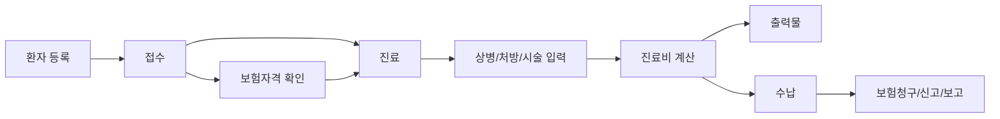
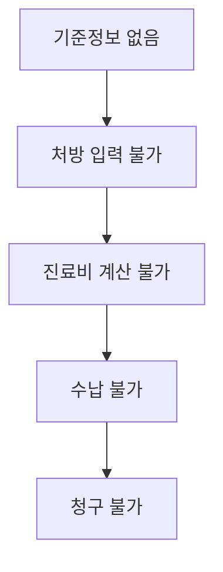

# EMR Beginner Guide

대상: EMR 업무를 처음 접하는 개발팀  
목적: 상세 도메인 문서를 읽기 전에 병원 업무 흐름과 핵심 용어를 이해한다.

## 1. EMR이 하는 일

EMR은 병원의 진료 업무를 전산화하는 시스템이다.

핵심 역할:

- 환자 정보를 관리한다.
- 환자를 접수하고 진료 대기 상태로 올린다.
- 진료 내용, 상병, 처방, 시술, 재료를 기록한다.
- 진료비를 계산한다.
- 환자에게 영수증, 처방전, 제증명 등을 출력한다.
- 보험진료는 청구 파일을 만들고 심사결과를 반영한다.
- 약 처방은 DUR 점검을 수행한다.
- 마약류는 NIMS에 신고한다.
- 비급여 항목은 보고 자료로 관리한다.

## 2. 병원 하루 업무 흐름

이 흐름은 화면 순서가 아니라 데이터가 확정되는 순서이다.

## 3. 보험진료와 비급여진료

피부/성형외과 EMR에서는 보험진료와 비급여진료를 구분해야 한다.

| 구분 | 의미 | 필요한 업무 |
|---|---|---|
| 보험진료 | 건강보험 또는 의료급여가 적용되는 진료 | 수진자조회, 본인부담 계산, DUR, 보험청구 |
| 비급여진료 | 보험이 적용되지 않고 병원 가격으로 받는 진료 | 병원 가격정책, 수납, 영수증, 비급여 보고 |
| 혼합진료 | 보험 항목과 비급여 항목이 함께 있는 진료 | 보험 계산과 비급여 수납을 함께 처리 |

개발할 때는 보험진료만 기준으로 보거나 비급여진료만 기준으로 보면 안 된다.

## 4. 단계별 업무 의미

| 단계 | 의미 | 왜 필요한가 |
|---|---|---|
| 기준정보 | 병원 설정, 공통코드, 상병, 수가, 약품, 재료, 가격 | 뒤 업무가 참조할 기준값 |
| 환자 관리 | 환자 기본정보와 고객정보 저장 | 접수와 진료의 대상 |
| 접수 | 특정 날짜에 환자를 진료 흐름에 올림 | 진료실 대기와 당일 업무 시작점 |
| 수진자조회 | 외부 시스템에서 보험자격 확인 | 보험진료 계산과 청구 기준 |
| 진료 | 의사가 환자를 보고 진료기록 생성 | 의료기록의 중심 |
| 상병 | 진단명/질병코드 | 청구와 처방 근거 |
| 처방/시술/재료 | 실제 진료 행위와 사용 항목 | 계산, 출력, 청구, 신고 기준 |
| DUR | 약 처방 안전성 점검 | 금기/중복/주의 약 검증 |
| 계산 | 환자부담금과 보험청구금 계산 | 수납과 청구의 기준 |
| 출력물 | 처방전, 영수증, 제증명 | 환자 제공 문서와 증빙 |
| 수납 | 환자가 실제 납부 | 병원 매출과 미수 관리 |
| 청구 | 보험자에게 진료비 청구 | 보험진료 비용 회수 |
| NIMS | 마약류 구매/투약/조제 신고 | 법적 신고 의무 |
| 비급여 보고 | 비급여 항목 자료 보고 | 제도상 보고 의무 |

## 5. 왜 개발 순서가 중요한가

EMR은 뒤 업무가 앞 업무 데이터를 계속 사용한다.

개발 순서:

1. 기준정보와 병원 설정
2. 환자 관리
3. 접수
4. 수진자조회
5. 진료/상병/처방
6. 진료비 계산
7. 출력물
8. 수납
9. DUR
10. 보험청구
11. 청구 결과
12. NIMS
13. 비급여 보고

청구부터 개발하면 재작업이 많아진다. 청구는 진료, 처방, 계산 결과가 안정화된 뒤 개발해야 한다.

## 6. 핵심 용어

| 용어 | 뜻 |
|---|---|
| EMR | 전자의무기록. 환자 진료기록을 관리하는 시스템 |
| 환자 | 병원에 등록된 사람 |
| 접수 | 환자를 당일 진료 흐름에 올리는 행위 |
| 수진자조회 | 환자의 보험자격을 외부기관에서 확인하는 절차 |
| 보험자격 | 건강보험, 의료급여, 일반 등 진료비 계산 기준 |
| 상병 | 진단명 또는 질병코드 |
| 처방 | 약, 수가, 재료, 시술 등 진료 항목 |
| 수가 | 보험에서 정한 의료행위 코드와 금액 기준 |
| 약가 | 약품 코드와 금액 기준 |
| 치료재료 | 진료에 사용되는 재료 코드 |
| 본인부담 | 환자가 직접 내야 하는 금액 |
| 보험청구 | 보험자에게 진료비를 청구하는 업무 |
| 명세서 | 보험청구의 기본 단위 |
| 특정기호 | 산정특례 등 특수 청구 조건을 나타내는 기호 |
| 특정내역 | 청구 시 추가로 설명해야 하는 상세정보 |
| DUR | 약 처방 안전성 점검 |
| SAM | 보험청구 파일 형식 |
| NIMS | 마약류통합관리시스템 |
| 비급여 | 보험이 적용되지 않는 진료 항목 |
| 마감 | 일정 기간의 진료/수납을 확정하는 업무 |

## 7. 초보자가 먼저 볼 문서 순서

웹 화면의 `문서 보기` 메뉴 기준으로 다음 순서로 보면 된다.

1. 입문 가이드
2. 전체 Workflow
3. 개발 가이드
4. 도메인 맵
5. 기초코드
6. 환자/접수
7. 수진자조회
8. 진료/처방
9. 진료비 계산
10. 수납
11. 출력물
12. DUR
13. SAM 청구
14. 마약류 NIMS
15. 청구SW 인증

## 8. 개발팀이 기억해야 할 기준

- 기준정보와 발생 데이터는 분리한다.
- 진료일 기준으로 보험자격, 단가, 급여 여부를 판단한다.
- 진료가 저장될 때 당시 처방명, 단가, 급여구분, 수량을 복사해 둔다.
- 수납은 계산 결과를 기준으로 한다.
- 청구는 수납이 아니라 진료/계산/보험 데이터를 기준으로 한다.
- 외부 연동 결과는 원 진료와 매칭 가능해야 한다.
- 과거 진료가 마스터 변경 때문에 바뀌면 안 된다.
