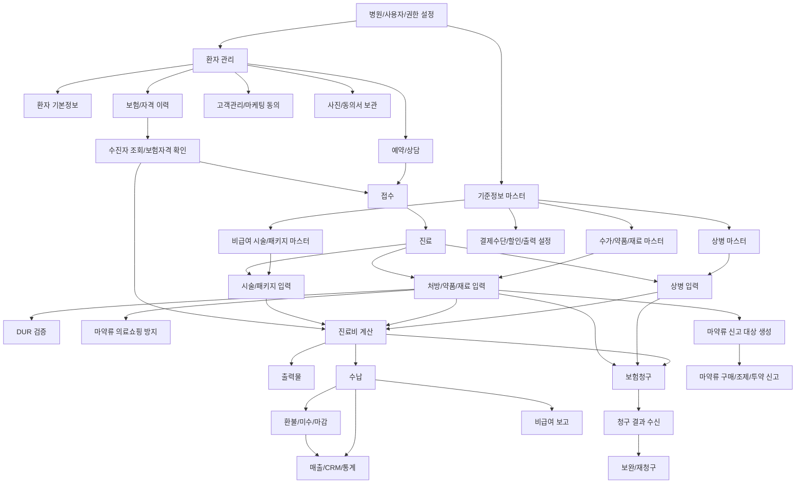
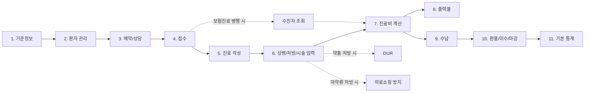
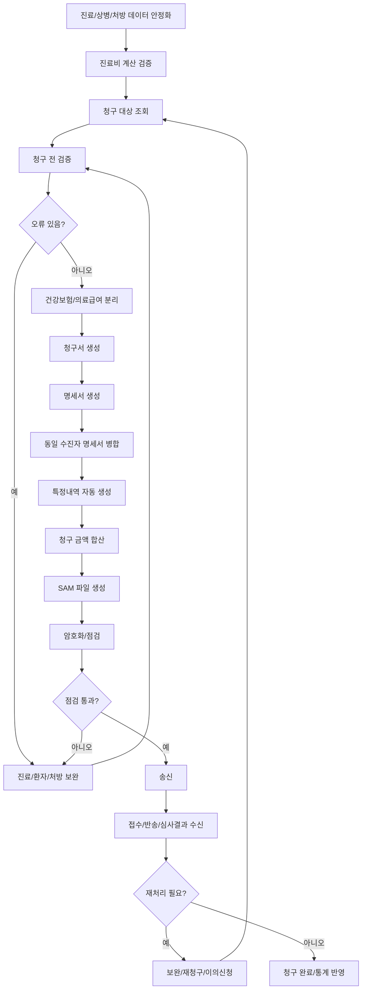
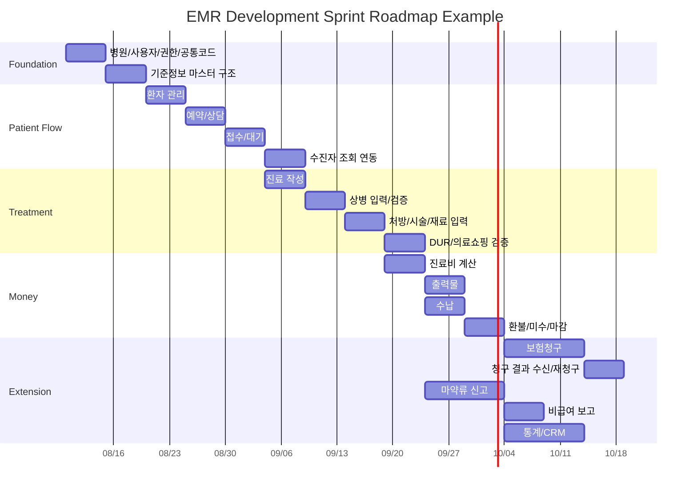
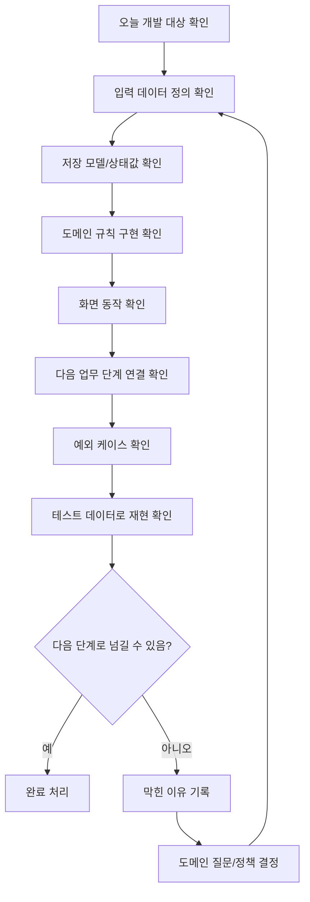

# EMR Workflow Guide

대상: 피부/성형외과 EMR 개발팀  
목적: 환자 유입부터 진료, 수납, 청구, 신고, 보고까지 빠지지 않는 업무 흐름을 정리한다.

## 1. 전체 업무 흐름

```text
기준정보/병원설정
-> 환자 관리
-> 예약/상담
-> 접수
-> 보험자격 확인
-> 진료
-> 상병/처방/시술/재료 입력
-> DUR/의료쇼핑/마약류 검증
-> 진료비 계산
-> 출력물 생성
-> 수납
-> 환불/미수/마감
-> 보험청구
-> 청구 결과 수신/재청구
-> 마약류 신고
-> 비급여 보고
-> 통계/CRM/사후관리
```

이 흐름은 화면 순서가 아니라 업무 데이터가 확정되는 순서이다. 병원 운영 방식에 따라 예약이나 상담 없이 접수부터 시작할 수 있고, 비급여 시술은 보험청구 없이 수납과 통계로 끝날 수 있다.

## 2. 기준정보와 병원 설정

EMR 업무가 시작되기 전에 필요한 기본 데이터이다.

상세 기준: `Base_Code_Domain.md`

필수 정보:

- 병원 정보: 요양기관기호, 사업자 정보, 대표자, 주소, 진료과, 종별, 약국분업 예외지역 여부.
- 사용자 정보: 의사, 직원, 권한, 면허번호, 부서, 진료실.
- 코드 정보: 보험자 유형, 진료과, 결제수단, 접수상태, 진료상태, 수납상태, 청구상태.
- 진료 마스터: 상병, 수가, 약품, 재료, 시술, 패키지, 용법, 특정기호.
- 가격 정책: 급여 단가, 비급여 가격, 패키지 가격, 적용일, 할인 가능 여부.
- 출력 설정: 영수증, 처방전, 진단서, 동의서, 라벨/바코드, 프린터.
- 인증/연동 설정: 공동인증서, HIRA 청구 프로그램, DUR, 마약류/NIMS, 수진자 조회.

개발 포인트:

- 기준정보는 발생 데이터와 분리한다.
- 가격과 급여 여부는 적용일 이력을 가져야 한다.
- 과거 진료가 마스터 변경에 의해 바뀌지 않도록 발생 데이터에 당시 값을 복사한다.

## 3. 환자 관리

환자 관리는 EMR의 시작점이다. 피부/성형외과에서는 일반 진료정보뿐 아니라 고객관리 성격이 강하다.

관리 정보:

- 기본정보: 이름, 생년월일, 성별, 주민등록번호, 연락처, 주소.
- 보험정보: 건강보험, 의료급여, 일반, 차상위, 산정특례, 적용기간.
- 고객정보: 유입경로, 담당 상담자, 관심 시술, VIP 여부, 마케팅 동의.
- 의료정보: 알레르기, 과거력, 복용약, 임신 여부, 특이사항.
- 민감자료: 사진, 동의서, 상담기록, 시술 전후 기록.

주요 흐름:

```text
환자 검색
-> 기존 환자 확인
-> 신규 환자 등록 또는 기존 정보 수정
-> 보험/자격 정보 등록
-> 상담/예약/접수로 연결
```

개발 포인트:

- 중복 환자 방지 기준이 필요하다. 예: 이름 + 생년월일 + 연락처.
- 사진, 동의서, 주민등록번호는 접근 권한과 열람 로그가 필요하다.
- 고객관리 항목은 진료기록과 분리하되 환자 기준으로 연결한다.

## 4. 예약과 상담

피부/성형외과에서는 예약과 상담이 진료 이전에 큰 비중을 가진다.

예약 정보:

- 예약일시
- 예약 유형: 상담, 진료, 시술, 수술, 경과확인.
- 담당자/담당의/시술자
- 예약실/장비/시술실
- 예약 상태: 예약, 확인, 내원, 취소, 노쇼, 변경.
- 메모와 사전 안내.

상담 정보:

- 관심 시술
- 견적
- 상담 메모
- 추천 패키지
- 상담자
- 사진/문진/동의서
- 전환 여부: 예약, 접수, 결제, 보류.

개발 포인트:

- 예약은 접수 전 단계이고, 내원 시 접수로 전환된다.
- 상담 견적은 실제 진료/수납 금액과 다를 수 있으므로 별도 데이터로 둔다.
- 상담과 진료를 같은 테이블에 섞으면 보험청구, 진료기록, CRM이 꼬일 수 있다.

## 5. 접수

접수는 환자를 특정 날짜의 병원 업무 흐름에 올리는 단계이다.

접수 시 입력 정보:

- 환자
- 내원일시
- 접수 유형: 초진, 재진, 상담, 시술, 수술, 경과확인.
- 진료 구분: 보험, 비급여, 일반, 혼합.
- 보험자 유형
- 담당 의사
- 진료실/시술실
- 접수 메모
- 예약 연결 정보
- 수진자 조회 결과
- 임신 여부, 사고/공상/보훈 등 특수 구분
- 의료급여 진료확인번호
- 의약분업 예외 또는 원내조제 관련 정보

접수 흐름:

```text
환자 선택
-> 예약 여부 확인
-> 접수 유형 선택
-> 보험/비급여 구분 선택
-> 수진자 조회
-> 자격 정보 반영
-> 담당 의사/진료실 선택
-> 대기 상태 생성
```

개발 포인트:

- 접수 정보는 진료의 기본값이 된다.
- 접수에서 선택한 담당 의사는 상병/처방의 면허번호 기본값에 영향을 준다.
- 보험자격 조회가 실패해도 접수를 허용할지 정책을 정해야 한다.
- 피부/성형에서는 상담 접수와 진료 접수를 구분해야 한다.

## 6. 수진자 조회와 보험자격 확인

수진자 조회는 환자의 보험 자격을 외부 시스템에서 확인해 진료일 기준으로 반영하는 단계이다.

확인 대상:

- 보험자 유형
- 자격 유효 여부
- 건강보험/의료급여 구분
- 차상위 여부
- 의료급여 유형
- 산정특례 정보
- 본인부담 경감 정보
- 보장기관 정보
- 선택의료급여기관 여부

흐름:

```text
환자 식별정보 입력
-> 외부 자격조회 요청
-> 응답 수신
-> 기존 보험정보와 비교
-> 진료일 기준 자격 반영
-> 접수/진료 기본 보험정보 확정
```

개발 포인트:

- 자격 정보는 조회일이 아니라 진료일 기준으로 적용해야 한다.
- 조회 결과 원문 또는 주요 응답값을 저장해야 추후 분쟁 대응이 가능하다.
- 산정특례는 상병과 함께 적용 여부가 결정되므로 자격 정보만으로 끝나지 않는다.

## 7. 진료

진료는 의사가 환자에게 실제 의료행위를 기록하는 중심 단계이다.

진료 중 다루는 정보:

- 진료 메모
- 주상병/부상병
- 처방
- 시술
- 재료
- 약품
- 원내/원외 처방
- 검사
- 사진
- 동의서
- DUR 결과
- 의료쇼핑 방지 결과
- 진료비 계산 결과

진료 흐름:

```text
대기 환자 선택
-> 진료 시작
-> 상병 입력
-> 처방/시술/재료 입력
-> DUR 및 검증
-> 진료비 계산
-> 출력물 생성
-> 진료 완료
-> 수납 대기 생성
```

개발 포인트:

- 진료 저장 전 금액 계산이 수행되어야 한다.
- 상병과 처방은 청구 근거가 되므로 누락 검증이 필요하다.
- 보험 진료와 비급여 시술이 섞일 수 있으므로 라인 단위 급여/비급여 구분이 필요하다.
- 진료 완료 후에도 수정 가능 범위와 감사 로그 정책이 필요하다.

## 8. 상병 입력

상병은 진료와 청구의 의학적 근거이다.

입력 정보:

- 상병 코드
- 주상병 여부
- 진료과
- 진료결과
- 의사 면허번호
- 특정기호
- 상해외인
- 적용 시작/종료 또는 유효기간

흐름:

```text
상병 검색
-> 성별/나이/불완전코드 검증
-> 주상병 가능 여부 확인
-> 주상병/부상병 지정
-> 환자 자격 기준 산정특례 확인
-> 특정기호 자동 또는 수동 입력
```

개발 포인트:

- 보험청구 진료는 주상병이 필요하다.
- 특정 상병은 주상병으로 사용할 수 없다.
- 산정특례는 상병, 환자 자격, 진료일이 함께 맞아야 한다.

참고 소스:

- `Services/Concrete/DiseaseToTreatmentService.cs`

## 9. 처방/시술/재료 입력

처방 라인은 금액과 청구의 핵심이다. 피부/성형외과에서는 시술과 패키지도 처방과 비슷한 역할을 한다.

입력 유형:

- 약품
- 수가/진료행위
- 치료재료
- 원료약/소모품
- 비급여 시술
- 패키지/묶음
- 검사

흐름:

```text
마스터 선택
-> 진료일 기준 가격/급여 여부 확인
-> 보험자 유형 기준 급여/비급여 결정
-> 수량/횟수/일수 입력
-> 원내/원외 구분
-> 의사 면허번호, 용법, 예외코드 세팅
-> 라인 금액 계산
-> DUR/마약류 검증 대상 반영
```

개발 포인트:

- 진료일 기준 가격을 사용한다.
- 발생 처방에는 당시 가격과 급여 여부를 저장한다.
- 원내 약품과 원외 처방전 약품은 처리 흐름이 다르다.
- 패키지는 단순 묶음 처방인지, 선결제/회차권 상품인지 구분해야 한다.

참고 소스:

- `Services/Concrete/PrescribeToTreatmentService.cs`
- `Services/Concrete/TreatmentUnionService.cs`

## 10. DUR 검증

DUR은 약품 처방 시 병용금기, 중복투약, 연령금기, 임부금기 등을 검증하는 흐름이다.

검증 대상:

- 약품 코드
- 복용량
- 투여일수
- 환자 나이/성별/임신 여부
- 기존 처방
- 병용 약품
- 금기/주의 정보

흐름:

```text
약품 처방 입력
-> DUR 요청 데이터 구성
-> 외부 DUR 검증 요청
-> 결과 수신
-> 경고/금기/사유 확인
-> 처방 유지 또는 수정
-> DUR 확인 여부 저장
```

개발 포인트:

- DUR 결과는 처방 저장 여부에 영향을 줄 수 있다.
- 금기 처방을 허용할 경우 사유 입력이 필요하다.
- DUR 확인 여부와 결과는 진료기록에 남겨야 한다.

참고:

- 현재 워크트리에는 `Data/UBerSoft.EMR.DUR/DurService.cs` 변경분이 별도로 존재한다.

## 11. 마약류 의료쇼핑 방지

마약류 처방 전 환자의 중복 처방, 과다 처방, 의료기관 쇼핑 위험을 확인하는 단계이다.

검증 대상:

- 환자 식별정보
- 마약류 의약품
- 처방일
- 투약일수
- 기존 처방 이력
- 타 기관 처방 가능성

흐름:

```text
마약류 약품 처방 입력
-> 의료쇼핑 방지 조회
-> 결과 수신
-> 위험/주의 여부 표시
-> 처방 유지 또는 수정
-> 확인 이력 저장
```

개발 포인트:

- 일반 DUR과 별도의 검증 결과로 관리하는 것이 좋다.
- 처방을 유지할 경우 사유와 확인자를 남겨야 한다.
- 마약류 신고 데이터와 연결될 수 있도록 처방 라인에 식별정보를 보존한다.

## 12. 진료비 계산

진료비 계산은 진료 중 또는 진료 완료 시 수행된다.

계산 대상:

- 급여 금액
- 비급여 금액
- 100/100 본인부담
- 100/100 미만 선별급여
- 본인부담금
- 청구액
- 장애인의료비
- 지원금
- 할인/조정 전 금액
- 수납 예정액

흐름:

```text
처방 라인 금액 계산
-> 종별가산 적용
-> 급여/비급여/100분의100 항목 분리
-> 보험 유형별 본인부담 계산
-> 산정특례/차상위/의료급여 정책 적용
-> 지원금/장애인의료비 반영
-> 청구액 계산
-> 수납 예정 금액 확정
```

개발 포인트:

- 계산은 화면이 아니라 도메인 서비스에서 수행한다.
- 계산 결과와 계산 근거를 함께 저장한다.
- 할인, 선결제 차감, 쿠폰은 보험 본인부담 계산과 분리한다.

참고 문서:

- `Docs/Patient_Cost_Domain.md`

## 13. 출력물

진료 중 또는 진료 후 생성되는 문서이다.

주요 출력물:

- 원외 처방전
- 영수증
- 진료비 세부산정내역
- 진단서
- 진료확인서
- 소견서/의뢰서
- 수술확인서
- 입퇴원확인서
- 비급여 견적서
- 시술 동의서
- 주의사항 안내문
- 약 봉투/라벨/바코드

흐름:

```text
출력 대상 선택
-> 환자/진료/수납/처방 데이터 조회
-> 서식 데이터 생성
-> QR/바코드/전자서명 반영
-> 출력 또는 파일 저장
-> 출력 이력 저장
```

개발 포인트:

- 출력물은 진료 전, 진료 후, 수납 후 발행 시점이 다르다.
- 법정 서류는 발행자, 발행일, 면허번호, 병원 정보가 중요하다.
- 피부/성형은 동의서, 시술 안내문, 견적서가 중요하다.

참고 소스:

- `Controllers/Reports/Concreate/*.cs`
- `Services/QrCodes/Concrete/QrCodeService_EDB.cs`
- `Services/OpenXmls/ViewModelToSheetService.cs`

## 14. 수납

수납은 진료비 계산 결과를 실제 결제로 확정하는 단계이다.

수납 정보:

- 진료비 총액
- 본인부담금
- 비급여 금액
- 할인
- 쿠폰/프로모션
- 예치금/선결제 차감
- 카드/현금/계좌/포인트 등 결제수단
- 미수금
- 환불 가능 금액
- 영수증 정보

흐름:

```text
수납 대기 조회
-> 진료비 계산 결과 확인
-> 할인/쿠폰/예치금 적용
-> 결제수단별 금액 입력
-> 수납 확정
-> 영수증 출력
-> 매출/마감 반영
```

개발 포인트:

- 수납은 진료비 계산 결과를 참조하지만 별도 이력으로 남긴다.
- 결제수단별 금액 합계와 수납 대상 금액이 맞아야 한다.
- 피부/성형에서는 선결제와 시술권 차감 이력이 특히 중요하다.

## 15. 환불, 미수, 마감

수납 이후에도 금액 업무는 계속된다.

환불 흐름:

```text
환불 대상 조회
-> 기존 수납/사용 이력 확인
-> 환불 가능 금액 계산
-> 환불 사유 입력
-> 환불 처리
-> 매출/마감 보정
```

미수 흐름:

```text
수납 부족 발생
-> 미수 등록
-> 재내원 또는 별도 결제
-> 미수 회수
-> 미수 잔액 갱신
```

마감 흐름:

```text
일자별 수납 조회
-> 결제수단별 합계 확인
-> 환불/취소/미수 반영
-> 일마감
-> 월마감
```

개발 포인트:

- 환불과 취소는 다르다.
- 마감 후 수정 정책이 필요하다.
- 선결제 환불은 사용 회차와 잔여금 계산이 필요하다.

## 16. 보험청구

보험청구는 진료가 끝나고 수납 또는 진료비 계산이 확정된 뒤 수행된다.

청구 전 검증:

- 보험자 유형 누락
- 주민등록번호/성명 누락
- 의료급여 보장기관/확인번호 누락
- 상병 누락
- 주상병 누락
- 성별/나이 제한 상병
- 처방 항/목 누락
- 의약분업 예외코드 누락
- 삭제 약품/수가/재료 사용
- 청구액 0 또는 금액 불일치
- 동일 수진자 중복청구 위험

청구 흐름:

```text
청구 대상 진료 조회
-> 청구 전 검증
-> 건강보험/의료급여 분리
-> 청구서 생성
-> 명세서 생성
-> 동일 수진자 명세서 병합
-> 특정내역 생성
-> 청구 금액 합산
-> SAM 파일 생성
-> 암호화
-> 점검
-> 송신
```

개발 포인트:

- 보험청구는 수납과 별도 상태를 가져야 한다.
- 명세서 병합은 금액 단순 합산이 아니라 재계산이 필요하다.
- 추가청구/누락청구/보완청구는 기존 청구와의 차이를 계산해야 한다.

참고 소스:

- `Services/InsuranceCharges/Concrete/InsuranceChargeValidater.cs`
- `Services/InsuranceCharges/Concrete/BillService.cs`
- `Services/InsuranceCharges/Concrete/SAMs/Sends/SAMSendService.cs`

## 17. 청구 결과 수신과 재청구

청구 이후에는 접수, 반송, 심사결과, 정산결과를 수신하고 후속 처리해야 한다.

수신 대상:

- 접수증
- 반송증
- 심사결과 통보서
- 정산심사내역서
- 보완자료 요청
- 이의신청 결정서
- 재심사조정청구 결정서

흐름:

```text
수신 파일 확인
-> 파일 유형 판별
-> 청구서/명세서 매칭
-> 결과 파싱
-> 반송/삭감/지급 상태 반영
-> 보완/재청구 대상 생성
```

개발 포인트:

- 결과 수신은 청구 상태 관리의 일부이다.
- 삭감/반송 사유를 진료, 처방, 명세서 단위로 추적해야 한다.
- 재청구는 신규 청구가 아니라 기존 청구 이력과 연결되어야 한다.

참고 소스:

- `Services/InsuranceCharges/Concrete/SAMs/Receives/*.cs`

## 18. 마약류 신고

마약류는 구매, 재고, 조제, 투약, 폐기, 보고 흐름이 필요하다.

신고 대상:

- 마약류 제품
- 구매 내역
- 입고/재고
- 처방/조제/투약
- 반품/폐기
- 보고 결과
- 수신 확인

흐름:

```text
마약류 제품 등록
-> 구매/입고 보고
-> 재고 반영
-> 처방/조제/투약 발생
-> 사용 보고
-> 보고 결과 수신
-> 오류 보완
```

개발 포인트:

- 마약류 처방은 일반 약품 처방보다 식별정보와 보고 상태가 중요하다.
- 바코드/RFID로 제품 식별을 자동화할 수 있다.
- 재고와 보고 데이터가 맞지 않으면 운영 리스크가 크다.

참고 소스:

- `Controllers/Narcotics/*.cs`
- `Repositories/Narcotics/*.cs`
- `Services/Narcotics/BarcodeToReportService.cs`
- `Services/Concrete/BarcodeService.cs`
- `Services/Concrete/RFIDService.cs`

## 19. 비급여 보고

비급여 보고는 매년 또는 정해진 기간에 병원의 비급여 항목과 금액을 보고하는 업무이다.

보고 대상:

- 비급여 항목
- 항목 코드/명칭
- 금액
- 진료일 또는 적용기간
- 사용 건수
- 병원 정보

흐름:

```text
보고 기간 선택
-> 비급여 진료/수납 데이터 조회
-> 보고 대상 항목 매핑
-> 금액/건수 집계
-> 보고 파일 또는 화면 데이터 생성
-> 제출 및 이력 저장
```

개발 포인트:

- 비급여 시술 마스터와 보고 항목 매핑이 필요하다.
- 할인 전 금액, 실제 수납금액, 고시금액 중 무엇을 보고할지 정책 확인이 필요하다.
- 피부/성형은 비급여 항목이 많아 마스터 관리가 중요하다.

참고 소스:

- `Controllers/State/Concreate/NonpayReportController.cs`
- `Repositories/State/NonpayReportRepository.cs`

## 20. 통계와 CRM

운영 후에는 진료와 수납 데이터가 통계와 고객관리로 이어진다.

통계:

- 일별/월별 매출
- 결제수단별 매출
- 의사/직원별 실적
- 시술별 매출
- 비급여 항목별 매출
- 신규/재진 환자
- 예약 전환율
- 상담 전환율
- 미수/환불 현황
- 청구/삭감 현황

CRM:

- 재방문 예정
- 시술 주기 알림
- 예약 리마인드
- 생일/이벤트 메시지
- 미수 안내
- 패키지 잔여 회차 안내

개발 포인트:

- 통계는 발생 데이터 기준과 수납 기준을 구분해야 한다.
- 직원 실적은 상담자, 시술자, 의사, 수납자 기준이 다를 수 있다.
- CRM 발송은 마케팅 동의 여부와 개인정보 정책을 따라야 한다.

## 21. 권한, 로그, 감사

의료정보와 개인정보를 다루므로 전 업무 흐름에 공통으로 필요하다.

필수 항목:

- 로그인/로그아웃 로그
- 환자 열람 로그
- 진료기록 수정 로그
- 수납 취소/환불 로그
- 권한 변경 로그
- 청구 생성/송신 로그
- 사진/동의서 열람 로그
- 데이터 삭제/복구 로그

개발 포인트:

- 진료기록, 사진, 동의서, 주민등록번호는 접근 로그가 필요하다.
- 수납과 청구는 수정 전후 금액을 남겨야 한다.
- 관리자 권한으로도 모든 로그를 지우지 못하게 해야 한다.

참고 소스:

- `Repositories/Logs/*.cs`
- `Controllers/Logs/Concreate/*.cs`

## 22. 빠지기 쉬운 업무 체크리스트

- 예약 변경/취소/노쇼
- 상담만 하고 진료 또는 수납 없이 종료되는 케이스
- 접수 취소
- 진료 취소
- 진료 후 처방 수정
- 수납 후 진료 수정
- 수납 취소와 환불
- 미수 발생과 회수
- 선결제 후 일부 사용
- 패키지 환불
- 보험자격 조회 실패
- DUR 경고 후 처방 유지
- 마약류 검증 경고 후 처방 유지
- 원외 처방전 재출력
- 영수증 재발행
- 진단서/확인서 발급 이력
- 청구 후 진료 수정 제한
- 반송 후 재청구
- 삭감 후 이의신청
- 비급여 보고 항목 매핑 누락
- 사진/동의서 삭제와 보관 정책
- 직원 퇴사 후 권한 회수

## 23. 개발 순서 Mermaid 다이어그램

다음 다이어그램은 개발팀에 스프린트를 줄 때 기준이 되는 개발 의존성이다. 업무 흐름 그대로 개발하면 뒤쪽 로직이 앞쪽 데이터에 막히므로, 먼저 기준정보와 핵심 발생 데이터를 안정화한 뒤 계산, 수납, 청구, 신고로 확장한다.

### 23.1 전체 개발 의존성



### 23.2 MVP 개발 흐름

MVP는 보험청구 전체가 아니라 병원이 일단 환자를 받고, 진료/시술을 기록하고, 금액을 계산하고, 수납할 수 있는 범위까지를 목표로 잡는다.



### 23.3 보험청구 확장 흐름

보험청구는 MVP 이후 확장 범위로 보는 것이 안전하다. 청구는 진료 데이터가 안정화되지 않으면 계속 재작업이 발생한다.



### 23.4 주차별 스프린트 예시

실제 일정은 개발팀 인원과 기존 공통 프레임워크 수준에 따라 조정해야 한다. 아래는 관리 기준을 잡기 위한 예시이다.



### 23.5 일별 진척 확인 루프

매일 확인할 것은 작업량이 아니라 업무 데이터가 다음 단계로 넘어갈 수 있는지이다.



일별 확인 질문:

- 오늘 만든 기능이 어떤 업무 단계에 속하는가?
- 이 단계의 필수 입력값은 무엇인가?
- 저장 후 다음 단계에서 바로 사용할 수 있는가?
- 금액, 자격, 권한, 상태값 중 아직 임시 처리된 부분이 있는가?
- 취소, 수정, 재출력, 재조회 같은 예외 흐름이 막히지 않는가?
- 테스트 데이터로 같은 결과가 반복 재현되는가?

## 24. 우선 개발 순서 요약

```text
1. 기준정보/병원설정
2. 환자 관리
3. 예약/상담
4. 접수
5. 수진자 조회/보험자격
6. 진료
7. 상병/처방/시술/재료
8. DUR/의료쇼핑/마약류 검증
9. 진료비 계산
10. 출력물
11. 수납
12. 환불/미수/마감
13. 보험청구
14. 청구 결과 수신/재청구
15. 마약류 신고
16. 비급여 보고
17. 통계/CRM
18. 권한/로그/감사 고도화
```

권장 MVP는 1번부터 12번까지이다. 보험청구, 마약류 신고, 비급여 보고는 병원 운영 요건에 따라 오픈 범위를 별도로 확정해야 한다.
