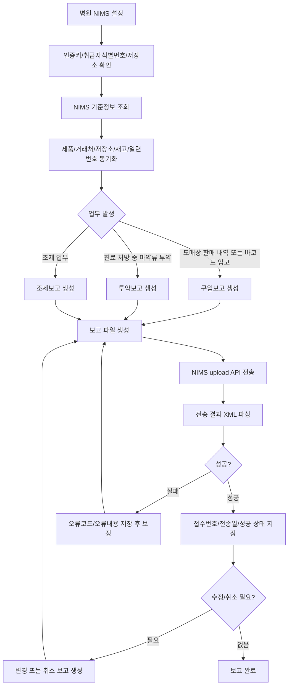
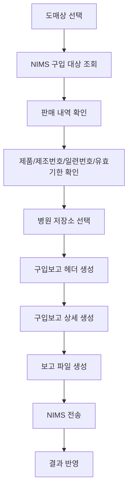
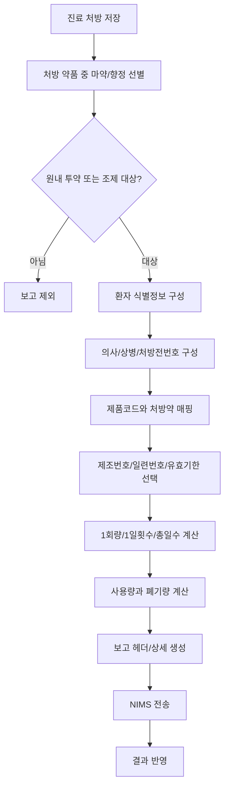
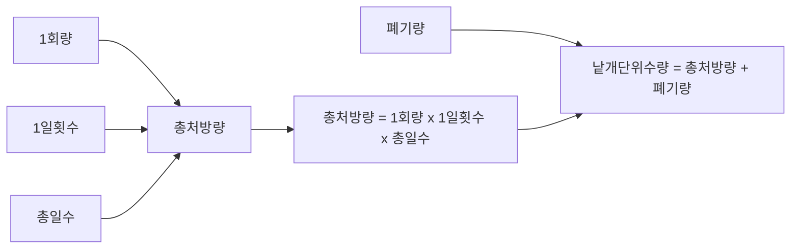
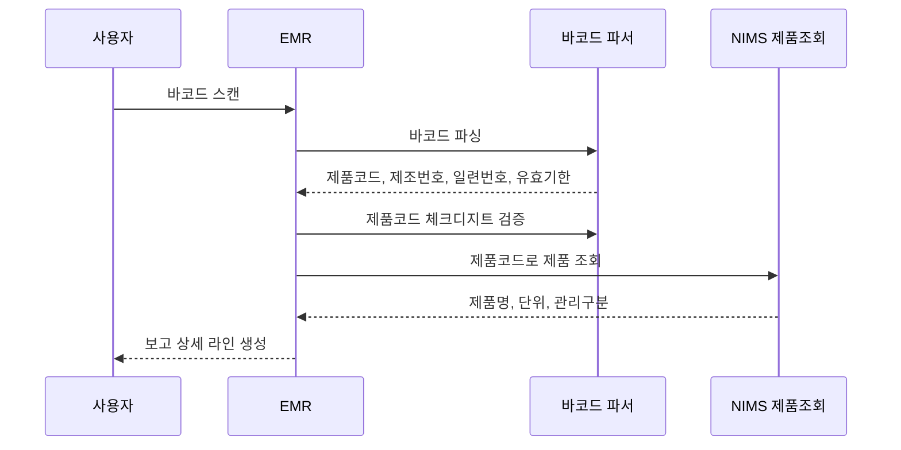
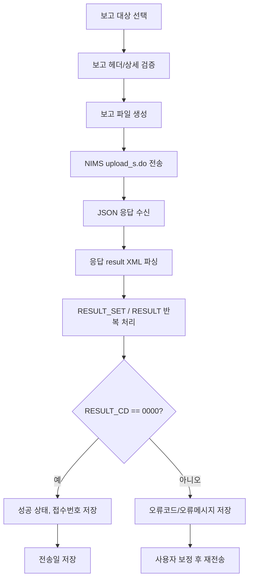
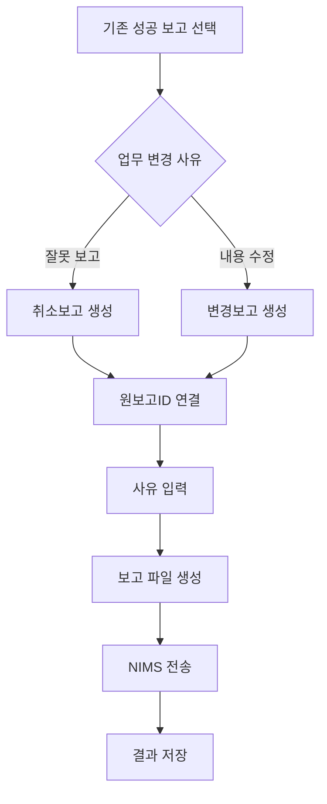
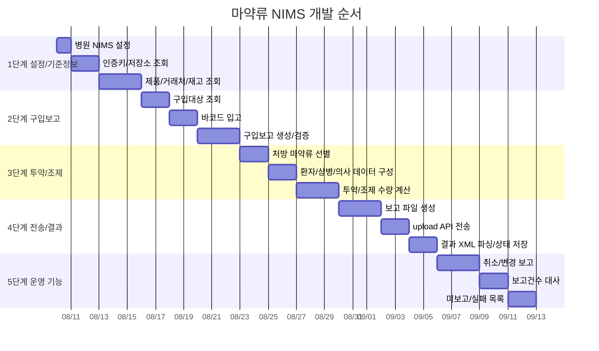

# 마약류 NIMS 도메인 분석

이 문서는 병·의원 EMR에서 마약류 구입, 투약, 조제, 보고 취소, 전송 결과 수신, NIMS 기준정보 조회를 개발언어에 종속되지 않는 형태로 정리한다.

마약류 업무는 일반 처방/청구와 다르다. 진료 처방 데이터만 있으면 끝나는 것이 아니라, NIMS가 요구하는 제품코드, 제조번호, 일련번호, 저장소, 취급일자, 환자 식별번호, 보고유형, 이동유형, 전송결과까지 별도로 관리해야 한다.

## 1. 제도 기준

식약처 안내 기준으로 병·의원은 마약류 또는 향정신성의약품을 구입, 조제, 투약한 내역을 마약류통합관리시스템에 보고해야 한다. 병·의원 주요 보고항목은 구입보고, 조제보고, 투약보고이며, 공통적으로 폐기, 양도, 양수, 기타출고, 기타입고, 저장소이동도 관리 대상이 될 수 있다.

| 기준 | 내용 |
|---|---|
| 시스템 | 마약류통합관리시스템, NIMS |
| 근거 업무 | 마약류 취급 보고 |
| 병·의원 기본 보고 | 구입보고, 조제보고, 투약보고 |
| 병·의원 확장 보고 | 폐기, 양도, 양수, 기타출고, 기타입고, 저장소이동 |
| 보고 방식 | NIMS 직접입력, EMR/재고/처방 시스템 연계보고 |
| 개발상 핵심 | 처방 데이터와 NIMS 제품/재고/일련번호 데이터를 연결해야 함 |

외부 제도와 NIMS API 명세는 변경될 수 있으므로, 실제 개발 착수 시점에는 NIMS 최신 연계 개발가이드와 테스트 인증 절차를 반드시 재확인해야 한다.

참고:

- 식품의약품안전처 마약류통합관리시스템 안내: https://www.mfds.go.kr/wpge/m_738/de010114l002.do
- 의료기관용 마약류 취급보고 제도 요약자료: https://www.kha.or.kr/kha_home/notice_list.do?articleNo=31310&attachNo=343063&mode=download

## 2. 전체 업무 범위

## 3. NIMS 연계 방식

현재 소스 기준 NIMS 연계는 두 종류로 나뉜다.

| 구분 | 목적 | 통신 방식 | 결과 |
|---|---|---|---|
| 기준정보 조회 API | 거래처, 저장소, 제품, 재고, 일련번호, 보고건수 조회 | 인증키 포함 POST | JSON 응답 |
| 보고 파일 전송 API | 구입/투약/조제 보고 파일 업로드 | 인증키 + 파일 업로드 | JSON 내부의 XML 문자열 |

## 4. 병원별 필수 설정

| 필드 | 뜻 | 사용처 | 규칙 |
|---|---|---|---|
| NIMS API 기본 URL | NIMS API 서버 주소 | 모든 NIMS API 호출 | 운영/테스트 URL을 환경별로 분리한다. |
| 인증키 | NIMS API 인증키 | 조회 API, 파일 업로드 | 병원별로 발급받아 보관한다. 만료/오류 응답을 처리해야 한다. |
| 마약류취급자 식별번호 | 병·의원 또는 취급자의 NIMS 식별번호 | 저장소 조회, 보고 헤더 | 병원 사업자/요양기관과 매칭되어야 한다. |
| 요양기관기호 | 병원 식별값 | 거래처 조회 보조 조건 | NIMS 거래처/취급자 조회에 사용할 수 있다. |
| 저장소번호 | 병원 내 마약류 저장소 번호 | 모든 상세 보고 라인 | 제품이 실제 입고/출고되는 저장소를 지정해야 한다. |

## 5. NIMS 조회 API

조회 API는 공통적으로 인증키와 페이지 번호를 보낸다. 응답은 성공/실패 헤더와 목록 본문으로 구성된다.

### 공통 요청 파라미터

| 파라미터 | 뜻 | 규칙 |
|---|---|---|
| `k` | 인증키 | 모든 NIMS 조회 API에 포함한다. |
| `pg` | 페이지 번호 | 1부터 시작한다. 응답이 종료가 아닐 때 다음 페이지를 반복 조회한다. |

### 공통 응답 필드

| 필드 | 뜻 | 규칙 |
|---|---|---|
| `RESULT_CODE` | 결과코드 | `0` 성공, `-1` 실패, `8` 인증만료, `9` 인증실패로 처리한다. |
| `RESULT_MSG` | 결과 메시지 | 사용자에게 보여줄 오류 또는 보정 안내로 저장한다. |
| `TOTAL_COUNT` | 전체 건수 | 목록 총 수량 표시와 페이징 검증에 사용한다. |
| `IS_END_YN` | 마지막 페이지 여부 | `Y`이면 조회 종료, 아니면 다음 `pg`를 조회한다. |
| `list` | 결과 목록 | API별 도메인 데이터 목록이다. |

### API 목록

| API | 목적 | 주요 파라미터 | 주요 결과 |
|---|---|---|---|
| `bsshinfo.do` | 마약류 취급업자/거래처 조회 | `fg`, `bi`, `hp`, `bn`, `bc`, `ymd` | 거래처 식별번호, 업체명, 사업자번호, 요양기관기호 |
| `placeinfo.do` | 저장소 조회 | `fg`, `bc`, `ymd` | 저장소번호, 저장소명, 주소 |
| `productinfo_kd.do` | 마약류 제품 조회 | `fg`, `p`, `fg2`, `pn` | 제품코드, 제품명, 마약/향정 구분, 중점/일반 구분, 단위 |
| `purchaseinfo_pd.do` | 구입 대상 제품 조회 | `fg`, `ymd`, `bc` | 도매상 판매 내역, 제품, 제조번호, 일련번호, 수량 |
| `stockinfo.do` | 재고 조회 | `fg`, `p`, `pg` | 저장소별 제품 재고, 기준월, 제조번호/일련번호 |
| `seqinfo.do` | 제품 일련번호 조회 | `fg`, `p`, `t` 또는 바코드 | 제품코드, 제조번호, 일련번호, 유효기한 |
| `reportcnt.do` | NIMS 접수 보고건수 조회 | `fg`, `fg2`, `fg3`, `se`, `sdt`, `edt` | 전체/신규/변경/취소 보고건수 |
| `upload_s.do` | 보고 파일 업로드 | 인증키, 보고 파일 | 보고 라인별 접수 결과 XML |

## 6. 조회 API 파라미터 의미

| 파라미터 | 뜻 | 사용 API | 규칙 |
|---|---|---|---|
| `fg` | 조회 범위 또는 검색 구분 | 대부분의 조회 API | API마다 의미가 다르므로 화면 조건에서 API별 값으로 변환한다. |
| `fg2` | 보조 조회 구분 | 제품, 보고건수 | 중점/일반 구분 또는 정상/전체 여부 등 API별 의미로 사용한다. |
| `fg3` | 조회 기준일자 구분 | 보고건수 | 보고일자 기준 또는 취급일자 기준으로 조회한다. |
| `bi` | 사업자등록번호 | 거래처 조회 | 특정 사업자 조회에 사용한다. |
| `hp` | 요양기관기호 | 거래처 조회 | 의료기관 거래처 조회 보조 조건이다. |
| `bn` | 업체명 | 거래처 조회 | 이름 검색 조건이다. |
| `bc` | 취급자식별번호 | 거래처, 저장소, 구입대상 조회 | 업체/병원/도매상 식별번호다. |
| `ymd` | 기준일자 이후 | 거래처, 저장소, 구입대상 조회 | `yyyyMMdd` 형식으로 보낸다. |
| `p` | 제품코드, 청구코드, 바코드 등 검색값 | 제품, 재고, 일련번호 | `fg` 값에 따라 의미가 달라진다. |
| `pn` | 제품명 | 제품 조회 | 제품명 검색 조건이다. |
| `t` | 제조번호 또는 일련번호 | 일련번호 조회 | `fg`에 따라 제조번호 또는 일련번호가 된다. |
| `se` | 보고구분 코드 | 보고건수 조회 | `PCM`, `PMM`, `MCM` 등. |
| `sdt` | 조회 시작일 | 보고건수 조회 | `yyyyMMdd` 형식. |
| `edt` | 조회 종료일 | 보고건수 조회 | `yyyyMMdd` 형식. |

## 7. 기준정보 저장 필드

### 거래처

| 필드 | 뜻 | 규칙 |
|---|---|---|
| 거래처 식별번호 | NIMS 취급업자 식별번호 | 구입보고 상대업체로 사용한다. |
| 업체명 | 거래처 이름 | 화면 검색/선택에 사용한다. |
| 업종 | 도매상, 의료업자 등 | 구입 가능 상대인지 확인한다. |
| 의료업자 구분 | 의료업자 구분 코드/명 | 필요 시 보고 자격 확인에 사용한다. |
| 사업자등록번호 | 업체 사업자번호 | 거래처 식별 보조값이다. |
| 대표자명 | 대표자 | 거래처 확인용이다. |
| 담당자명 | 담당자 | 오류 보정/연락용이다. |
| 요양기관기호 | 의료기관인 경우 식별값 | 거래처 검색 보조값이다. |
| 저장소 목록 | 거래처 저장소 | 구입보고 상대 저장소 선택에 사용한다. |

### 저장소

| 필드 | 뜻 | 규칙 |
|---|---|---|
| 저장소번호 | NIMS 저장소 식별번호 | 모든 보고 상세 라인에 필수다. |
| 저장소명 | 저장소 이름 | 사용자가 선택할 수 있어야 한다. |
| 기본주소 | 저장소 주소 | 검증/감사용이다. |
| 상세주소 | 저장소 상세주소 | 검증/감사용이다. |

### 제품

| 필드 | 뜻 | 규칙 |
|---|---|---|
| 제품코드 | NIMS 제품 식별코드 | 보고 상세의 제품 기준값이다. |
| 제품대표코드 | 대표 품목 코드 | 대표코드는 실제 보고 대상에서 제외될 수 있다. |
| 청구코드 | 보험 청구 코드 | 제품코드가 13자리인 경우 내부적으로 일부 자리에서 산출한다. |
| 제품명 | NIMS 제품명 | 보고/조회 화면 표시값이다. |
| 마약/향정 구분명 | 마약 또는 향정신성의약품 구분 | 처방 대상 선별과 업무 분기에 사용한다. |
| 중점/일반 구분 | 중점관리대상 또는 일반관리대상 | 중점관리대상은 일련번호 필수 검증을 강화한다. |
| 최소유통단위수량 | 제품 최소 유통 단위 수량 | 현재 구조에서는 제품 기준 기본값 1로 사용한다. |
| 최소유통단위 | 포장 단위명 | 구입보고 수량 단위 표시값이다. |
| 총낱개단위수량 | 최소유통단위 1개 안의 낱개 수량 | 투약/조제 수량 계산의 기준이다. |
| 낱개단위 | 낱개 단위명 | 투약/폐기 수량 단위 표시값이다. |
| 등록일/변경일 | NIMS 제품 등록/변경일 | 기준정보 갱신 판단에 사용한다. |

### 재고와 일련번호

| 필드 | 뜻 | 규칙 |
|---|---|---|
| 제품코드 | NIMS 제품코드 | 재고와 제품을 연결한다. |
| 제품명 | 제품명 | 화면 표시값이다. |
| 제조번호 | 로트/제조번호 | 중점관리대상과 제품 추적에 중요하다. |
| 일련번호 | 제품 개별 일련번호 | 중점관리대상은 필수로 관리한다. |
| 유효기한 | 제품 유효기한 | 입고/투약 시 유효성 확인에 사용한다. |
| 저장소번호 | 재고 저장소 | 출고될 저장소와 일치해야 한다. |
| 최소유통단위 재고수량 | 포장 단위 재고 | 재고 조회 표시용이다. |
| 낱개단위 재고수량 | 실제 사용 가능 수량 | 투약/조제 차감 기준이다. |
| 재고기준월 | NIMS 재고 기준월 | 재고 검증 시점 표시값이다. |

## 8. 보고 공통 구조

구입, 조제, 투약 보고는 공통 헤더와 상세 라인으로 구성한다.

### 보고 헤더

| 필드 | NIMS 필드 | 뜻 | 규칙 |
|---|---|---|---|
| 보고ID | `USR_RPT_ID_NO` | 사용자가 부여하는 보고 식별번호 | NIMS 전송 후 결과 매칭 키다. 중복되면 안 된다. |
| 보고구분 | `RPT_SE_CD` | 구입/조제/투약 등 업무 구분 | 병·의원은 `PCM`, `PMM`, `MCM` 중심으로 시작한다. |
| 보고유형 | `RPT_TY_CD` | 신규/취소/변경 | 신규 `0`, 취소 `1`, 변경 `2`로 관리한다. |
| 비고 | `RMK` | 취소/변경 사유 | 신규가 아닌 경우 필수다. |
| 상세건수 | `RND_DTL_RPT_CNT` | 상세 라인 수 | 파일 생성 전 실제 상세 수와 일치해야 한다. |
| 파일생성일 | `FILE_CREAT_DT` | 보고 파일 생성일 | 파일 생성 시점으로 저장한다. |
| 파일전송일 | `FILE_SND_DT` | NIMS 전송일 | 성공/실패와 관계없이 전송 시점 추적에 사용한다. |
| 취급일자 | 내부 HandleDate | 실제 구입/투약/조제일 | 미래 12개월 초과 등 비정상 날짜를 차단한다. |
| NIMS 원보고ID | 내부 참조ID | 변경/취소 대상 원보고 | 취소/변경 시 원보고와 연결한다. |
| NIMS 보고ID | 내부 전송 보고ID | NIMS 결과 매칭용 | 전송 결과 저장에 사용한다. |

### 보고 상세 공통

| 필드 | NIMS 필드 | 뜻 | 규칙 |
|---|---|---|---|
| 상세ID | `USR_RPT_LN_ID_NO` | 보고 라인 고유번호 | 보고ID 안에서뿐 아니라 기존 라인과 중복되지 않게 관리한다. |
| 저장소번호 | `STORGE_NO` | 입출고 저장소 | 필수. 병원 저장소 또는 상대 저장소를 정확히 넣는다. |
| 이동유형 | `MVMN_TY_CD` | 재고 이동의 업무 의미 | 구입, 조제, 투약, 폐기 등에 따라 자동 지정한다. |
| 제품 | `PRDUCT_CD` 등 | NIMS 제품정보 | 제품코드가 필수다. |
| 제조번호 | `MNF_NO` | 제품 제조번호 | 필수다. |
| 일련번호 | `MNF_SEQ` | 제품 일련번호 | 중점관리대상은 필수다. |
| 낱개단위수량 | `PCE_QY` | 실제 낱개 수량 | 구입보고에서는 0이어야 하고, 투약/조제는 사용량+폐기량이다. |
| 바코드/RFID | `PRD_SGTIN` | 제품 바코드 또는 RFID | 스캔 입력 시 저장한다. |
| 유효기한 | `PRD_VALID_DE` | 제품 유효기한 | 필수 검증 대상이다. |

## 9. 보고구분 코드

| 코드 | 뜻 | 병·의원 적용 |
|---|---|---|
| `PCM` | 구입 | 도매상 판매 내역 또는 직접 입고를 기준으로 보고한다. |
| `PMM` | 조제 | 조제 업무가 발생한 경우 보고한다. 약국은 기본, 병·의원도 업무 형태에 따라 필요하다. |
| `MCM` | 투약 | 병·의원 진료 중 원내 투약 마약류를 보고한다. |
| `AAR` | 폐기 | 투약/조제 후 잔량 폐기 또는 별도 폐기 시 확장 개발 대상이다. |
| `TNT` | 양도 | 기관 간 양도 발생 시 확장 개발 대상이다. |
| `TNI` | 양수 | 기관 간 양수 발생 시 확장 개발 대상이다. |
| `ETT` | 기타출고 | 일반 보고로 분류하기 어려운 출고 시 확장 개발 대상이다. |
| `ETI` | 기타입고 | 일반 보고로 분류하기 어려운 입고 시 확장 개발 대상이다. |
| `SMM` | 저장소이동 | 병원 내부 저장소 이동 시 확장 개발 대상이다. |

## 10. 이동유형 코드

| 코드 | 뜻 | 사용 보고 |
|---|---|---|
| `0201` | 구입 입고 | 구입보고 |
| `0702` | 조제 출고 | 조제보고 |
| `0705` | 조제 반납 입고 | 조제보고 취소/반납 계열 |
| `0802` | 투약 출고 | 투약보고 |
| `1102` | 폐기 출고 | 폐기보고 |
| `1170` | 폐기 재고 미차감 | 재고 차감이 발생하지 않는 폐기 |
| `1402` | 기타 출고 | 기타출고 |
| `1501` | 기타 입고 | 기타입고 |

## 11. 구입보고

구입보고는 도매상이 NIMS에 판매 보고한 내역을 병원이 확인하여 입고로 보고하는 흐름이 기본이다. 바코드 스캔으로 직접 보고 라인을 만들 수도 있다.

### 구입보고 헤더 필드

| 필드 | NIMS 필드 | 뜻 | 규칙 |
|---|---|---|---|
| 구입보고ID | `USR_RPT_ID_NO` | 구입보고 고유번호 | 임시 작성 시 음수 등 임시번호를 사용하더라도 저장 시 고유번호로 확정한다. |
| 보고구분 | `RPT_SE_CD` | 구입 | `PCM`으로 생성한다. |
| 보고유형 | `RPT_TY_CD` | 신규/취소/변경 | 최초 생성은 `0` 신규다. |
| 취급일자 | 내부 HandleDate | 실제 구입일 | 2018년 이후, 과도한 미래일자는 차단한다. |
| 상대업체 | 내부 Wholesaler | 판매 도매상 | NIMS 거래처 식별번호 기준으로 선택한다. |
| 상대저장소번호 | `OPP_STORGE_NO` | 도매상 저장소 | 도매상 저장소 목록 중 선택한다. |
| 비고 | `RMK` | 변경/취소 사유 | 신규가 아닌 경우 필수다. |

### 구입보고 상세 필드

| 필드 | NIMS 필드 | 뜻 | 규칙 |
|---|---|---|---|
| 상세ID | `USR_RPT_LN_ID_NO` | 라인 고유번호 | 중복 불가. |
| 저장소번호 | `STORGE_NO` | 병원 입고 저장소 | 필수. |
| 이동유형 | `MVMN_TY_CD` | 구입 입고 | `0201`로 생성한다. |
| 제품코드 | `PRDUCT_CD` | 구입 제품 | NIMS 제품코드 필수. |
| 제조번호 | `MNF_NO` | 제조번호 | 필수. |
| 일련번호 | `MNF_SEQ` | 일련번호 | 중점관리대상은 필수. |
| 최소유통단위수량 | `MIN_DISTB_QY` | 입고 포장 수량 | 구입보고에서는 필수이며 0이면 안 된다. |
| 낱개단위수량 | `PCE_QY` | 낱개 수량 | 구입보고에서는 0으로 보고한다. |
| 바코드/RFID | `PRD_SGTIN` | 스캔값 | 바코드 입고 시 저장한다. |
| 유효기한 | `PRD_VALID_DE` | 제품 유효기한 | 필수. |

## 12. 투약/조제 보고

투약/조제 보고는 진료 처방 중 NIMS 보고 대상인 마약류 처방을 선별해서 만든다.

### 투약/조제 헤더 필드

| 필드 | NIMS 필드 | 뜻 | 규칙 |
|---|---|---|---|
| 보고ID | `USR_RPT_ID_NO` | 투약/조제 보고 고유번호 | 전송 결과 매칭 키다. |
| 보고구분 | `RPT_SE_CD` | 투약 또는 조제 | 기본은 `MCM` 투약, 조제 업무는 `PMM`이다. |
| 보고유형 | `RPT_TY_CD` | 신규/취소/변경 | 최초 생성은 `0` 신규다. |
| 환자식별번호유형 | `MDC_PAT_ID_NO_TY_CD` | 주민번호/외국인번호/여권번호 등 | 필수. 유형별 번호 검증을 수행한다. |
| 환자식별번호 | `MDC_PAT_ID_NO` | 환자 식별번호 | 주민/외국인번호는 13자리 숫자 검증을 한다. |
| 진료ID | 내부 TreatmentId | EMR 진료 연결 | 보고 대상 진료와 연결한다. |
| 환자 | 내부 Patient | 환자 정보 | 이름, 차트번호 등 화면/감사 추적에 사용한다. |
| 의사 | 내부 Doctor | 처방/투약 의사 | 면허번호와 의사명을 보고 파일 생성에 사용한다. |
| 처방전발급번호 | `MDC_PRSC_ORD_NO` | 처방전 교부번호 | 없으면 진료ID를 대체값으로 쓰는 구조가 있으나, 신규 개발에서는 실제 발급번호 사용을 원칙으로 한다. |
| 질병분류기호 | `MDC_DISS_CODE` | 상병코드 목록 | `/` 구분으로 구성한다. 최소 1개 필수다. |

### 환자 식별번호 유형

| 코드 | 뜻 | 규칙 |
|---|---|---|
| `01` | 주민등록번호 | 13자리 숫자, 7번째 자리 국내 기준값 검증. |
| `02` | 외국인등록번호 | 13자리 숫자, 7번째 자리 외국인 기준값 검증. |
| `03` | 여권번호 | 여권번호 형식으로 저장한다. |
| `04` | 주한미군 식별번호 | SSN 또는 DoDID Number. |
| `05` | 기타 | 별도 사유/식별 기준을 둔다. |
| `06` | 무명남 | 신원확인 후 변경보고로 실제 정보 대체가 필요하다. |
| `07` | 무명녀 | 신원확인 후 변경보고로 실제 정보 대체가 필요하다. |
| `08` | 복지·보호시설 등 입소번호 | 시설 입소번호를 저장한다. |

### 투약/조제 상세 필드

| 필드 | NIMS 필드 | 뜻 | 규칙 |
|---|---|---|---|
| 상세ID | `USR_RPT_LN_ID_NO` | 라인 고유번호 | 중복 불가. |
| 진료처방ID | 내부 TreatmentPrescribeId | EMR 처방 라인 연결 | 처방 변경/삭제 시 원보고 추적에 필요하다. |
| 저장소번호 | `STORGE_NO` | 출고 저장소 | 실제 제품이 차감될 저장소다. |
| 이동유형 | `MVMN_TY_CD` | 투약/조제 출고 | 투약은 `0802`, 조제는 `0702`를 사용한다. |
| 제품코드 | `PRDUCT_CD` | NIMS 제품 | 처방 약품과 매핑된 NIMS 제품코드다. |
| 제조번호 | `MNF_NO` | 제조번호 | 필수. |
| 일련번호 | `MNF_SEQ` | 일련번호 | 중점관리대상 필수. |
| 1일횟수 | `MDC_ADE_CNT` | 하루 투약/조제 횟수 | 처방의 1일 횟수에서 가져온다. |
| 1회량 | `MDC_ONCE_QY` | 1회 투약량 | 처방 1회량에서 가져온다. |
| 총일수 | `MDC_TOT_DCNT` | 총 투약/조제 일수 | 처방 총일수에서 가져온다. |
| 총처방량 | `MDC_SUM_QY` | 실제 사용량 | `1회량 × 1일횟수 × 총일수`로 계산한다. |
| 폐기량 | `MDC_AFT_DSUSE_QY` | 투약/조제 후 폐기량 | 잔량 폐기가 있으면 입력한다. |
| 낱개단위수량 | `PCE_QY` | 재고 차감량 | `총처방량 + 폐기량`으로 계산한다. |
| 바코드/RFID | `PRD_SGTIN` | 제품 바코드 | 바코드 스캔 시 저장한다. |
| 유효기한 | `PRD_VALID_DE` | 제품 유효기한 | 필수. |

### 수량 계산 규칙

| 규칙 | 설명 |
|---|---|
| 총처방량 | 1회량, 1일횟수, 총일수를 곱한다. |
| 소수 보정 | 0.9999처럼 계산 오차로 정수에 근접하면 정수로 보정한다. |
| 낱개단위수량 | 실제 재고 차감량이므로 총처방량과 폐기량을 더한다. |
| 0 차단 | 총처방량과 낱개단위수량은 0보다 커야 한다. |
| 폐기량 | 사용 후 폐기량이 없으면 0으로 둔다. 별도 폐기보고가 필요한 업무는 확장 개발한다. |

## 13. 바코드 입력 흐름

바코드 스캔은 구입보고와 투약/조제보고 상세 생성에 모두 사용할 수 있다.

| 산출 필드 | 설명 |
|---|---|
| 제품코드 | 바코드에서 추출하고 체크디지트를 검증한다. |
| 제조번호 | 바코드에서 추출해 보고 상세에 반영한다. |
| 일련번호 | 바코드에서 추출해 중점관리대상 필수 검증에 사용한다. |
| 유효기한 | 바코드에서 추출해 보고 상세 필수값으로 저장한다. |
| 제품정보 | 제품코드로 NIMS 제품 조회 후 제품명/단위를 보강한다. |

## 14. 보고 파일 전송과 결과 처리

보고 파일은 EMR 내부에서 먼저 생성한 뒤 NIMS `upload_s.do`로 전송한다. 응답은 JSON 형태지만, 보고 결과 본문은 XML 문자열로 들어온다.

### 전송 요청

| 항목 | 뜻 | 규칙 |
|---|---|---|
| 인증키 | 병원 NIMS 인증키 | 파일 업로드 요청에 포함한다. |
| 보고 파일 | 구입/투약/조제 보고 파일 | 파일 생성 전 헤더/상세 필수값을 검증한다. |
| 전송 URL | NIMS 업로드 API | 기본 URL + `upload_s.do`로 구성한다. |

### 전송 응답

| 필드 | 뜻 | 규칙 |
|---|---|---|
| `code` | 전송 처리 코드 | `0`이어도 결과 XML 안의 실패가 있을 수 있으므로 XML을 반드시 확인한다. |
| `result` | 보고 결과 XML 문자열 | 라인별 결과를 파싱한다. |

### 결과 XML 필드

| 필드 | 뜻 | 규칙 |
|---|---|---|
| `USR_RPT_ID_NO` | 보고ID | 내부 보고ID와 매칭한다. |
| `RESULT_CD` | 보고 결과코드 | `0000`이면 성공, 그 외는 실패. |
| `RESULT_MSG` | 결과 메시지 | 성공/실패 메시지로 저장한다. |
| `RPT_RCEPT_NO` | NIMS 접수번호 | 성공 시 저장한다. |
| `ERROR_CD` | 오류코드 | 실패 시 상세 오류로 저장한다. |
| `ERROR_MSG` | 오류 메시지 | 사용자 보정 안내로 저장한다. |

## 15. 전송 상태 관리

| 상태 | 판단 기준 | 후속 처리 |
|---|---|---|
| 미전송 | 전송일 없음 | 신규 전송 가능. |
| 전송 성공 | 결과 성공 여부가 참 | 완료 표시, 접수번호 보관. |
| 전송 실패 | 결과 성공 여부가 거짓 | 오류 메시지 표시, 보정 후 신규 재전송 가능. |
| 취소 작성 | 기존 성공 보고에 취소 사유 입력 | 원보고 참조 후 취소보고 전송. |
| 변경 작성 | 기존 성공 보고에 변경 사유 입력 | 원보고 참조 후 변경보고 전송. |

신규보고는 아직 전송되지 않았거나, 신규보고가 실패한 경우 다시 보낼 수 있다. 취소/변경 보고는 비고가 필수다.

## 16. 취소와 변경

| 항목 | 규칙 |
|---|---|
| 원보고 참조 | 취소/변경 대상이 되는 기존 보고ID를 반드시 연결한다. |
| 사유 | 취소/변경은 비고 필수다. |
| 전송 후 원본 잠금 | 성공 보고는 직접 수정하지 않고 취소/변경 보고를 만든다. |
| 진료 수정 연계 | 처방 수량, 환자 식별번호, 제품/일련번호가 바뀌면 변경보고 대상이다. |
| 진료 삭제 연계 | 이미 성공 보고된 투약/조제 내역이 삭제되면 취소보고 대상이다. |

## 17. 진료/처방 도메인과 연결

| 연결 지점 | 필요한 처리 |
|---|---|
| 약품 마스터 | 약품이 마약/향정인지 식별할 수 있어야 한다. |
| 처방 입력 | 원내 투약/조제 대상 마약류를 선별한다. |
| DUR/의료쇼핑 방지 | 처방 안전성 점검과 NIMS 보고는 별도지만 같은 처방 데이터를 사용한다. |
| 처방전 발급번호 | NIMS 투약/조제 헤더의 처방전발급번호로 사용한다. |
| 상병 | 질병분류기호는 최소 1개 이상 필요하다. |
| 환자 식별번호 | 환자 유형에 맞는 식별번호를 저장하고 검증한다. |
| 의사 | 처방의 면허번호/이름을 보고 파일 생성에 사용한다. |
| 수납/청구 | NIMS 보고 성공 여부가 청구 전 필수 차단 조건인지는 병원 정책으로 정한다. 단, 감사 관점에서는 미보고 목록을 별도로 추적해야 한다. |

## 18. 개발 순서

## 19. 일별 확인 체크리스트

| 구분 | 확인사항 |
|---|---|
| 설정 | NIMS URL, 인증키, 취급자식별번호, 병원 저장소번호가 병원별로 저장되는가 |
| 조회 | 거래처, 저장소, 제품, 재고, 일련번호 API가 페이징 끝까지 조회되는가 |
| 제품 매핑 | EMR 약품과 NIMS 제품코드/청구코드가 연결되는가 |
| 바코드 | 제품코드, 제조번호, 일련번호, 유효기한이 정확히 파싱되는가 |
| 구입 | 구입보고에서 최소유통단위수량만 입력되고 낱개단위수량은 0으로 생성되는가 |
| 투약/조제 | 총처방량과 낱개단위수량 계산이 맞는가 |
| 환자 | 주민/외국인/여권/무명 환자 식별번호 유형별 검증이 되는가 |
| 파일 | 보고 헤더 건수와 상세 라인 수가 일치하는가 |
| 전송 | `upload_s.do` 응답의 JSON과 내부 XML을 모두 해석하는가 |
| 결과 | 접수번호, 성공/실패, 오류코드, 오류메시지가 보고ID에 정확히 반영되는가 |
| 취소/변경 | 성공 보고는 직접 수정하지 않고 원보고 참조로 취소/변경 보고가 생성되는가 |
| 대사 | NIMS 보고건수 조회와 EMR 전송 성공 건수가 비교되는가 |

## 20. 테스트 시나리오

| 시나리오 | 기대 결과 |
|---|---|
| 인증키 오류로 제품 조회 | 인증실패 메시지를 사용자에게 표시하고 목록을 생성하지 않는다. |
| 제품 조회 결과 100건 초과 | `IS_END_YN`이 `Y`가 될 때까지 페이지를 반복 조회한다. |
| 도매상 판매 내역으로 구입보고 생성 | 도매상, 상대 저장소, 제품, 제조번호, 수량이 자동 반영된다. |
| 바코드로 구입보고 상세 생성 | 제품코드 검증 후 제조번호/일련번호/유효기한이 채워진다. |
| 구입보고 낱개수량 입력 | 구입보고에서는 오류로 차단한다. |
| 중점관리대상 일련번호 누락 | 보고 상세 검증에서 차단한다. |
| 투약량 0 | 총처방량/낱개단위수량 오류로 차단한다. |
| 투약 후 폐기량 입력 | 낱개단위수량이 사용량+폐기량으로 계산된다. |
| 주민등록번호 13자리 미만 | 환자 식별번호 오류로 차단한다. |
| NIMS 결과 코드 `0000` | 성공, 접수번호, 전송일을 저장한다. |
| NIMS 결과 오류 포함 | 실패 상태와 오류코드/메시지를 저장한다. |
| 성공 보고 취소 | 원보고ID와 사유를 가진 취소보고가 생성된다. |
| 무명 환자 보고 후 신원 확인 | 실제 환자 식별정보로 변경보고가 생성되어야 한다. |

## 21. 구현 시 주의할 점

| 주의사항 | 이유 |
|---|---|
| NIMS 제품코드와 보험 청구코드를 혼동하지 않는다. | 청구는 EDI 코드, NIMS는 제품코드와 일련번호 중심이다. |
| 전송 성공 여부는 HTTP 성공이 아니라 NIMS 결과 XML의 라인별 결과로 판단한다. | 응답 자체가 성공이어도 보고 라인이 실패할 수 있다. |
| 취소/변경은 원보고 참조를 남긴다. | 감사와 NIMS 대사에 필요하다. |
| 중점관리대상은 일련번호 누락을 강하게 차단한다. | 제품 추적 핵심값이다. |
| 구입보고와 투약/조제보고의 수량 단위가 다르다. | 구입은 최소유통단위, 투약/조제는 낱개단위 중심이다. |
| NIMS 기준정보 조회는 운영 장애에 대비해 캐시/최근 조회값 정책이 필요하다. | 외부 API 장애 시 진료/입고 업무가 멈출 수 있다. |
| 개인정보와 인증키를 로그에 남기지 않는다. | 환자 식별번호와 NIMS 인증키는 민감정보다. |

## 22. 현재 소스 기준 확인 위치

| 영역 | 위치 |
|---|---|
| NIMS 공통 통신 | `Data/UBerSoft.EMR.Data/Repositories/Narcotics/Nims` |
| NIMS 조회 모델 | `Data/UBerSoft.EMR.Data.Models/Narcotics` |
| NIMS 조회 파라미터 | `Data/UBerSoft.EMR.Data.Models/Narcotics/ApiParameters` |
| NIMS 전송 결과 | `Data/UBerSoft.EMR.Data.Models/Narcotics/ApiResult` |
| 구입/투약/조제 보고 모델 | `Data/UBerSoft.EMR.Data.Models/Narcotics/Reports` |
| 보고 화면 검증 | `Data/UBerSoft.EMR.Data.ViewModels/Narcotics/Reports` |
| 보고 저장/취소/전송결과 반영 | `Data/UBerSoft.EMR.Data/Controllers/Narcotics`, `Data/UBerSoft.EMR.Data/Repositories/Narcotics` |
| 바코드 보고 변환 | `Data/UBerSoft.EMR.Data/Services/Narcotics/BarcodeToReportService.cs` |
