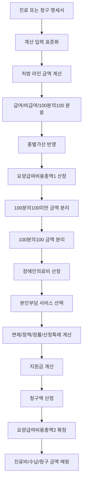
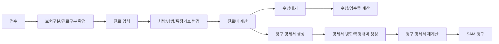
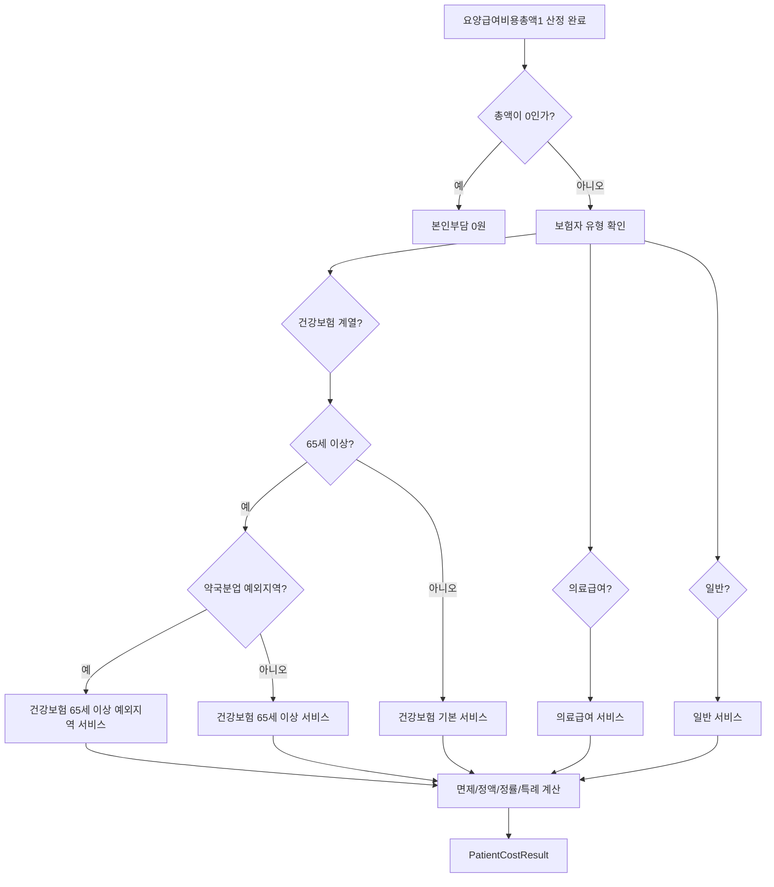
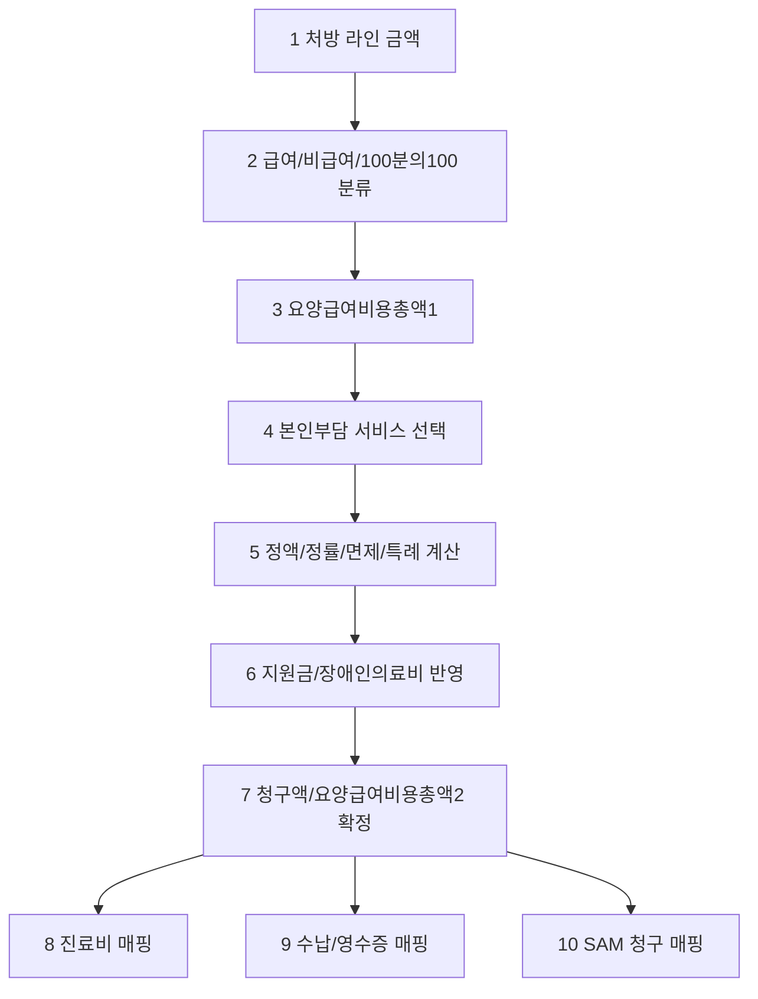
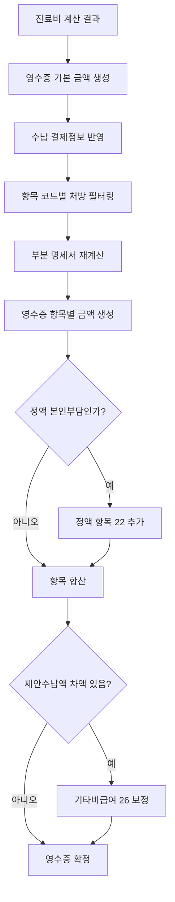
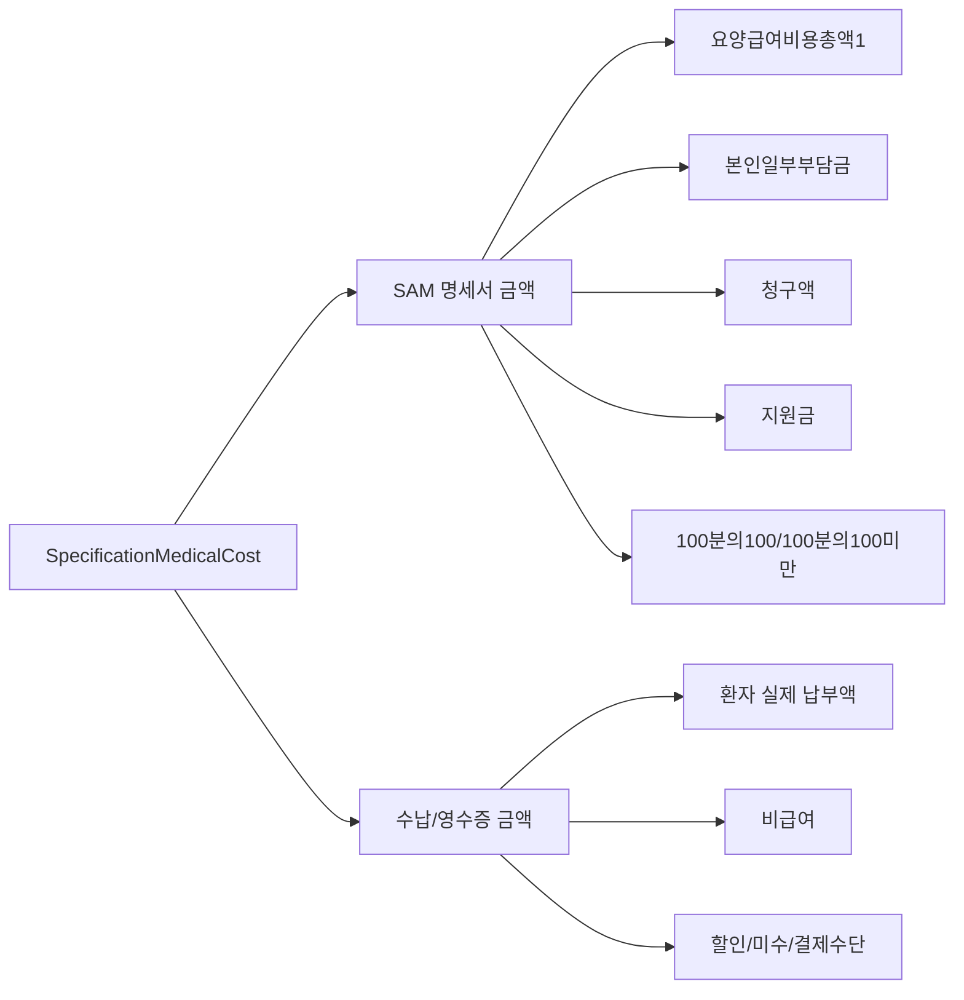

# Patient Cost Domain

대상: `Data/UBerSoft.EMR.Data`의 진료비/본인부담 계산 도메인

## 핵심 결론

진료비 계산의 중심은 `AmountService`이다. 이 서비스가 처방 라인 금액을 먼저 계산하고, 요양급여비용/본인부담/청구액/지원금 항목을 만든다. 본인부담금 자체는 `PatientCostServiceManager`가 보험 유형과 적용 조건에 맞는 계산 서비스를 찾아 위임한다.

전체 흐름:



업무상 중요한 점:

- 계산 입력은 진료 화면일 수도 있고, 이미 만들어진 청구 명세서일 수도 있다.
- 두 입력은 데이터 모양이 다르지만 금액 공식은 같아야 한다.
- 진료 저장 전 계산, 수납 계산, 청구 명세서 재계산이 서로 다른 공식을 쓰면 수납 금액과 SAM 청구 금액이 어긋난다.

## 계산 실행 시점

Patient Cost는 한 번만 계산하고 끝나는 값이 아니다. 접수, 진료, 수납, 청구 단계에서 같은 기준으로 반복 계산될 수 있어야 한다.



| 실행 시점 | 계산 목적 | 주의사항 |
|---|---|---|
| 접수 직후 | 보험구분, 진료구분 기준 준비 | 실제 금액은 처방 입력 후 확정 |
| 진료 중 | 처방 추가/삭제/수정에 따른 예상 금액 | DUR, 자동 산정 수가 이후 다시 계산 필요 |
| 진료 완료 | 수납대기 금액 확정 | 진료비 변경 시 수납대기 상태도 변경 |
| 수납 | 영수증 항목 분해와 실제 받을 금액 산정 | 할인, 지원금, 제안수납액 반영 |
| 청구 생성 | SAM 명세서 금액 생성 | 수납 영수증 금액이 아니라 청구 필드 기준 |
| 청구 수정/병합 | MT040, 특정내역, 병합 명세서 반영 | 정액 본인부담 횟수 보정 필요 |

## 재계산 트리거

아래 값이 바뀌면 기존 금액을 그대로 쓰면 안 되고 재계산해야 한다.

| 변경 데이터 | 재계산 이유 |
|---|---|
| 접수 보험구분 | 건강보험/의료급여/일반/건강보험 100% 계산 분기 변경 |
| 진료구분 | 초진/재진/진찰료X 등 기본 진찰료 코드 변경 |
| 진료일자 | 수가 적용일, 특례 적용일, 연령, 종별가산율이 달라짐 |
| 환자 보험자격 | 차상위, 의료급여, 산정특례, 급여제한 판정 변경 |
| 상병/특정기호 | 산정특례와 본인부담률 변경 |
| 처방 라인 | 금액, 급여/비급여, 100분의100, 항목 분해 변경 |
| 원내/원외 구분 | 원외 처방은 기본적으로 진료비 계산에서 제외 |
| 본인부담률 코드 | 100분의100, 100분의100미만 금액 분리 |
| 병원 종별/의료급여 여부 | 종별가산율 변경 |
| 의료급여 PatientCostCode | 의료급여 면제/정액/선택기관 판정 변경 |
| 선택기관기호 | 의료급여 선택기관 면제 판정 변경 |
| 할인/지원금/제안수납액 | 실제 수납액과 영수증 항목 변경 |
| 명세서 병합 | 정액 본인부담 발생횟수 MT040 보정 필요 |

## 입력 모델

계산은 직접 `TreatmentViewModel`에 고정되지 않고 `IAmountSource`로 추상화된다.

주요 adapter:

- `AmountSourceTreatmentAdapter`: 진료 화면의 `TreatmentViewModel` 기반 계산.
- `AmountSourceSpecificationAdapter`: 청구 명세서 `SpecificationViewModel` 기반 계산.
- `AmountTreatmentPrescribeSourceAdapter`: 진료 처방 라인 기반 금액 계산.
- `AmountSpecificationPrescribeSourceAdapter`: 명세서 처방 라인 기반 금액 계산.

업무상 의미:

- 같은 계산 로직을 진료 저장 전/후, 청구 명세서 생성/수정 시점에 재사용하려는 구조이다.
- 진료와 명세서의 데이터 모양은 다르지만, 금액 계산에 필요한 값은 `IAmountSource`, `IAmountPrescribeSource`로 통일한다.

## 처방 라인 금액

파일: `Services/Computes/Concrete/AmountService.cs`

기본 공식:

```text
라인금액 = round(단가 * 1회투여량 * 1일횟수 * 총일수)
```

세부 규칙:

- Bundle 처방은 구성 항목 계산이 아니라 Bundle 자체 가격을 사용한다.
- 원외 처방이고 퇴장방지/보전성 단가가 있는 경우, 보험 처방에 한해 일반 단가 대신 promote price를 사용한다.
- 계산 전 모든 처방 라인의 `Amount`를 갱신한 뒤 총액 항목을 만든다.

## 종별가산

파일: `AmountService.GetAmountWithHospitalTypeAddition`

처방 라인은 두 그룹으로 나뉜다.

- 종별가산 비대상: 라인 금액을 그대로 합산.
- 종별가산 대상: 라인 금액 합계에 병원 종별가산율을 곱해 합산.

종별가산율은 병원 정보의 `GetCurrentHospitalTypeAddition(treatmentDate, isMedicalAid)`에서 가져온다. 의료급여 여부와 진료일이 가산율 선택에 영향을 준다.

## 명세서 금액 항목

파일: `AmountService.CalculateSpecificationCore`

주요 항목:

- `RecuperationCostAmount1`: 요양급여비용총액1. 기본 급여 대상 금액이며 10원 미만 절사.
- `AmountUnder30/50/80/90`: 100/100 미만 중 본인부담률별 대상 금액.
- `AmountUnder100_100`: 100/100 미만 총액.
- `PatientMedicalCostUnder100_100`: 100/100 미만 본인부담금.
- `ChargeAmountUnder100_100`: 100/100 미만 청구액.
- `PatientMedicalCost`: 기본 본인일부부담금.
- `DisabledMedicalCost`: 장애인의료비.
- `SupportMoney`: 희귀난치성질환, 긴급복지, 잠복결핵 등 지원금.
- `ChargeAmount`: 청구액.
- `PatientMedicalCost100_100`: 100/100 본인부담금.
- `RecuperationCostAmount2`: 요양급여비용총액2.

특수 차감:

- 코로나 관련 코드 `AH114`, `AH214` 패턴 금액은 요양급여비용총액1 산정 전 차감한다.
- 2022-08-01 이상 2023-06-01 미만은 `AH271`, `AH273` 패턴도 추가 차감한다.

## 본인부담 서비스 선택

파일: `PatientCostServiceManager.cs`



선택 방식:

- Unity container에 등록된 모든 `IPatientCostService` 중 `IsTarget`이 true인 서비스를 찾는다.
- `ApplyDate` 내림차순으로 정렬해 가장 최신 적용일의 서비스를 사용한다.
- 요양급여비용총액1이 0이면 본인부담 계산을 하지 않고 0 처리한다.

등록된 기본 서비스:

- `Insurance_Over65`: 건강보험 65세 이상.
- `Insurance_Over65SEA`: 건강보험 65세 이상 약국분업 예외지역.
- `Insurance`: 건강보험 기본.
- `MedicalAid`: 의료급여.
- `NoInsurance`: 일반.

## 공통 본인부담 계산 구조

파일: `PatientCostServiceBase.cs`

계산 순서:

1. 의료급여 또는 차상위이고 방문진료 코드 `IA00*`가 있으면 요양급여비용총액1의 5%를 본인부담으로 계산한다.
2. 면제 조건(`Zero`)을 먼저 본다.
3. 정액 조건(`Fix`)을 계산한다.
4. 정률 조건(`Rate`)을 계산한다.
5. 정액/정률 결과를 `PatientCostResult`에 합산한다.
6. truncation 옵션에 따라 100원 또는 10원 단위 절사를 적용한다.

추가 특례:

- 2025-10-04부터 2025-10-09 사이에는 기본 정률 계산에서 `IE101`, `IE102` 처방 금액을 제외한 금액에 본인부담률을 적용한다.
- CT/MRI/PET는 `ClauseCode == "S"`이고 원내 처방인 라인으로 식별한다.

## 건강보험

파일:

- `PatientCostService_InsuranceBase.cs`
- `PatientCostService_Insurance.cs`

대상:

- 보험자 유형이 `건강보험` 또는 `건강보험_100`.
- `PatientCostService_Insurance`는 병원이 약국분업 예외지역이 아닐 때 적용된다.

기본 규칙:

- 기본 본인부담률은 30%.
- 공상 코드가 `1`이면 본인부담 면제.
- 6세 미만은 정률 계산 결과의 70%만 부담한다.
- 건강보험 계산 결과와 산정특례 계산 결과가 모두 있으면 더 낮은 본인부담 결과를 선택한다.

## 건강보험 65세 이상

파일:

- `PatientCostService_Insurance_Over65.cs`
- `PatientCostService_Insurance_Over65_SeparationExceptionArea.cs`

공통 대상:

- 나이 65세 이상.
- 보험자 유형이 건강보험 계열.

일반 지역:

- 요양급여비용총액1 15,000원 이하: 정액 1,500원.
- 2018-01-01 이후:
  - 15,000원 이하: 정률 0%.
  - 20,000원 이하: 10%.
  - 25,000원 이하: 20%.
  - 그 외: 30%.
- 2018-01-01 이전:
  - 15,000원 이하: 0%.
  - 그 외: 30%.

약국분업 예외지역:

- 15,000원 이하: 정액 1,500원.
- 2018-01-01 이전, 직접조제 약이 있고 20,000원 이하: 정액 2,100원.
- 2018-01-01 이후:
  - 15,000원 초과 20,000원 이하: 10%.
  - 20,000원 초과 25,000원 이하: 직접조제 약이 있으면 10%, 없으면 20%.
  - 25,000원 초과 30,000원 이하: 직접조제 약이 있으면 20%, 없으면 30%.
  - 그 외: 30%.

## 의료급여

파일: `PatientCostService_MedicalAid.cs`

대상:

- 보험자 유형이 `의료급여`.

면제 조건:

- 공상 코드 `1`.
- 특정기호 `V191`, `V192`.
- 의료급여 2종/6/8이고 특정기호 `F024`, `B015`이며 1세 미만.
- 의료급여 유형 `4` 행려.
- 의료급여 유형 `N` 노숙인.
- 1종 중 특정 본인부담 코드에 해당하는 경우:
  - 선택의료급여기관 관련 `M001`, `M002`, `M010`, `M009`이며 지정 병원과 일치.
  - 18세 미만.
  - `M004`, `M005`, `M007`, `M008`, `M011`, `M012`, `M013`, `M014`, `M015`, `M016`, `M017`, `M018`, `M019`.

정액 규칙:

- 1종: 원내 직접조제면 1,500원, 아니면 1,000원.
- 2종/6/8: 원내 직접조제면 1,500원, 아니면 1,000원에서 장애인의료비를 차감.

정률 규칙:

- CT/MRI/PET 원내 처방 금액에 대해:
  - 1종: 5%.
  - 2종/6/8: 15%.

절사:

- 의료급여는 본인부담 절사를 10원 단위로 처리한다.

## 일반

파일: `PatientCostService_NoInsurance.cs`

대상:

- 보험자 유형이 `일반`.

규칙:

- 요양급여비용총액1 전체를 환자 본인부담으로 계산한다.

## 산정특례

파일:

- `PatientCostSpecialCaseServiceManager.cs`
- `Services/Computes/Concrete/PatientCosts/*.cs`

적용 방식:

- 건강보험 기본 계산 후 특례 대상이면 특례 서비스를 모두 찾는다.
- 적용일이 진료일 이하인 특례가 있으면 가장 최신 적용일 서비스를 우선한다.
- 적용일 기준이 맞는 서비스가 없으면 본인부담액이 가장 낮은 결과를 선택한다.
- 건강보험 기본 결과와 특례 결과 중 더 낮은 본인부담 결과가 최종 선택된다.

대표 특례:

- `F015`, `F016`: 임신부/조산아 계열. 본인부담 5%.
- `F028`: 특정기호 F028 대상. 별도 본인부담률 적용.
- `V027`: CT/MRI/PET는 30%, 나머지는 10%로 계산.
- `V027_20200901`: 2020-09-01 이후 V027 계산 버전.
- `가정간호`: 특정기호 `V008`, `V194`, `V231`, `V293`, `V251`, `V274`, `V810`, `V801`, `V811`.
- `결핵_V000`: 특정기호 `V000`, `V231`, `V293`, `V274` 대상, 본인부담 면제.
- `잠복결핵_V010`: 특정기호 `V010` 대상, 본인부담 면제.
- `고혈압_당뇨`: 고혈압/당뇨 관련 특례 금액 분리 계산.
- `장루요루`: 장루요루 재료/진료 금액을 분리해 계산.
- `중증질환`: 차상위 여부에 따라 정액 또는 5% 정률 계산.
- `차상위`: 차상위 본인부담 경감 대상 계산.
- `희귀난치성질환`: 차상위 여부에 따라 정액 또는 10% 정률 계산, 지원금 대상이기도 하다.
- `중증치매`: 특정기호 `V810`, 희귀난치성질환 계산을 상속한다.

## 지원금

파일:

- `SupportMoneyManagerService.cs`
- `PatientCostSpecialCaseService_희귀난치성질환.cs`
- `SupportMoneyService_긴급복지.cs`
- `PatientCostSpecialCaseService_잠복결핵.cs`

적용 방식:

- `ISupportMoneyService` 중 `IsTarget`이 true인 서비스를 찾는다.
- 적용일이 가장 최신인 서비스를 선택한다.
- 지원금은 명세서 금액 계산 후 `SupportMoney` 항목에 반영된다.

등록된 지원금 유형:

- 희귀난치성질환.
- 긴급복지.
- 잠복결핵.

## 병합 명세서와 MT040

파일:

- `AmountService.GetPatientCost`
- `BillService.UnionSpecification`
- `BillService.AddMT040`

업무 규칙:

- 의료급여 또는 건강보험 차상위성 구분에서 여러 내원이 하나의 명세서로 병합될 수 있다.
- 정액 본인부담인 경우 `MT040` 본인부담금 발생횟수만큼 본인부담금을 곱한다.
- `BillService`는 병합 명세서에 `MT040` 특정내역을 추가하고, `AmountService`는 `GetMt040()` 값을 사용해 정액 본인부담을 보정한다.

## 추가 분석 후보

- 각 산정특례 파일별 세부 공식과 특정기호 매핑.
- `IAmountSource`와 ViewModel 확장 메서드에 숨어 있는 보험/나이/차상위 판정 규칙.
- 보험청구 명세서 생성 시 금액 항목이 SAM writer에 매핑되는 방식.
- 서버 API 또는 Models/ViewModels 쪽에 있는 수납 상태, 보험 자격, 특정기호 유효기간 규칙.

## 개발팀 구현 관점의 도메인 경계

Patient Cost는 단순히 환자가 낼 돈을 계산하는 기능이 아니다. 진료 처방 라인, 보험 자격, 산정특례, 100분의100 본인부담, 비급여, 지원금, 수납 영수증, SAM 청구 금액을 같은 기준으로 연결하는 도메인이다.

구현 경계:

| 영역 | 역할 | 결과 데이터 |
|---|---|---|
| 처방 라인 계산 | 수가/약가/재료대의 라인별 금액 산정 | `Prescribe.Amount` |
| 명세서 금액 계산 | 급여/100분의100/비급여/지원금/청구액 산정 | `SpecificationMedicalCost` |
| 진료비 계산 | 진료 화면과 수납에서 쓰는 환자 기준 금액 산정 | `TreatmentMedicalCost` |
| 본인부담 계산 | 보험 유형과 특례에 따른 환자부담 결정 | `PatientCostResult` |
| 수납 항목 분해 | 영수증 항목별 본인부담/공단부담/비급여 분리 | `ReceiptItem` |
| 청구 금액 매핑 | SAM 명세서/청구서 금액 필드로 전달 | `RequestItem` |

개발 순서:



## 금액 모델 필드 상세

### `TreatmentMedicalCost`

진료 1건에 붙는 금액이다. 진료실 저장, 수납, 영수증 출력에서 주로 사용한다.

| 필드 | 뜻 | 생성/유지 규칙 |
|---|---|---|
| `InsurnerType` | 진료비 계산에 적용할 보험자 유형 | 기존 진료비 값 유지. 건강보험/의료급여/일반/건강보험_100 분기 기준 |
| `IsFix` | 정액 본인부담 여부 | 본인부담 계산 결과가 정액이면 true |
| `RecuperationCostAmount` | 최종 요양급여비용 | 명세서의 `FinalRecuperationCostAmount`에서 복사 |
| `ChargeAmount` | 공단/기관 청구액 | `ChargeAmount + ChargeAmountUnder100_100 + DisabledMedicalCost` |
| `PatientMedicalCost` | 기본 본인부담 + 100분의100미만 본인부담 | `PatientMedicalCost + PatientMedicalCostUnder100_100` |
| `PatientMedicalCost100_100` | 100분의100 본인부담금 | 명세서 계산 결과에서 복사 |
| `NonPayAmount` | 비급여 금액 | 진료 처방 중 비급여 라인 합계 |
| `SupportMoney` | 지원금 | 희귀난치/긴급복지/잠복결핵 지원금 |
| `Discount` | 할인액 | 재계산 시에도 기존 값 유지 |
| `HalthSupportChargeMoney` | 건강생활유지비 등 의료급여 지원성 금액 | 의료급여이면 기존 값 유지 |
| `PrevBirthSupportChargeMoney` | 임신/출산 등 선지원성 금액 | 의료급여이면 기존 값 유지 |
| `SuggestPayMoney` | 진료실 제안 수납액 | 재계산 시 유지하며, 실제 부담액보다 크면 기타비급여로 보정 |
| `PatientCostCode` | 의료급여 본인부담 코드 | 의료급여 계산과 특정내역 `MT018` 생성에 사용 |
| `AppointHospital` | 선택의료급여기관 | 의료급여 본인부담 면제 판정에 사용 |

### `SpecificationMedicalCost`

SAM 청구 명세서에 들어가는 금액 원장이다. 청구 산출물의 기준 금액이므로 수납 금액보다 더 엄격하게 관리해야 한다.

| 필드 | 뜻 | 생성 규칙 |
|---|---|---|
| `RecuperationCostAmount1NoTruncate` | 절사 전 요양급여비용총액1 | 급여 대상 처방 합계에 종별가산 반영 후 코로나 예외 금액 차감 |
| `RecuperationCostAmount1` | 요양급여비용총액1 | 급여 대상 금액에서 10원 미만 절사 |
| `PatientMedicalCost` | 기본 본인일부부담금 | 보험 유형/특례별 본인부담 서비스 결과 |
| `DisabledMedicalCost` | 장애인의료비 | 장애인 본인부담 경감 대상이면 750원 |
| `ChargeAmount` | 기본 청구액 | `RecuperationCostAmount1 - PatientMedicalCost - DisabledMedicalCost` |
| `SupportMoney` | 지원금 | 지원금 서비스 결과 |
| `RecuperationCostAmount2` | 요양급여비용총액2 | `RecuperationCostAmount1 + PatientMedicalCost100_100`, 10원 미만 절사 |
| `PatientMedicalCost100_100` | 100분의100 본인부담금 | 원내 급여 처방 중 100분의100 코드 대상 금액 |
| `AmountUnder100_100` | 100분의100미만 총액 | 원내 급여 처방 중 선별급여/본인부담률 차등 코드 대상 금액 |
| `PatientMedicalCostUnder100_100` | 100분의100미만 본인부담금 | 30/50/80/90% 대상 금액별 계산 후 10원 미만 절사 |
| `ChargeAmountUnder100_100` | 100분의100미만 청구액 | `AmountUnder100_100 - PatientMedicalCostUnder100_100` |
| `NonPayAmount` | 비급여 금액 | 진료비/영수증용. SAM 급여 청구 금액에서는 제외 |
| `CommissionedCost` | 위탁검사료 | 심사/정산 수신 결과와 연결되는 금액 필드 |

최종 환자 수납 기준:

```text
환자부담 = PatientMedicalCost
       + PatientMedicalCostUnder100_100
       + PatientMedicalCost100_100
       + NonPayAmount
       - SupportMoney
       - Discount
       - 기타 지원성 차감
```

최종 청구 기준:

```text
청구대상 = ChargeAmount
       + ChargeAmountUnder100_100
       + DisabledMedicalCost
```

## 처방 라인 분류 규칙

라인 금액 계산 후 모든 처방은 다음 기준으로 분류된다.

| 분류 | 조건 | 금액 반영 위치 |
|---|---|---|
| 기본 급여 | `IsInsurance == true`, 원내, 본인부담률 코드 없음 | `RecuperationCostAmount1` |
| 100분의100미만 | `IsInsurance == true`, 원내, 100분의100미만 코드 | `AmountUnder30/50/80/90`, `AmountUnder100_100` |
| 100분의100 | `IsInsurance == true`, 원내, 100분의100 코드 | `PatientMedicalCost100_100` |
| 비급여 | `IsInsurance == false`, 원내 또는 묶음 | `NonPayAmount` |
| 원외 처방 | `OutClinic == true` | 기본적으로 진료비 계산 제외, 단 퇴장방지의약품 보전성 단가는 급여 산정에 포함 |
| 묶음 코드 | `IsBundle == true` | 묶음 자체 가격 사용. 하위 라인은 중복 산정 방지 |
| 치료재료 | `IsTreatmentMaterial == true` | 영수증 항목 `13`으로 별도 분해 |

라인 금액 공식:

```text
기본 라인금액 = round(단가 * round(1회량, 4) * round(1일횟수, 2) * 총일수)
묶음 라인금액 = 묶음 가격
원외 퇴장방지 보전성 약가 = 급여이고 promote price가 있으면 promote price 사용
```

종별가산:

- 종별가산 대상 처방과 비대상 처방을 분리한다.
- 종별가산 대상 합계에 병원 종별가산율을 곱한다.
- 병원 종별가산율은 진료일과 의료급여 여부를 기준으로 가져온다.
- 최종 합계는 반올림 후 필요 항목에서 10원 미만 절사한다.

## 100분의100미만 계산

100분의100미만은 일반 본인부담과 별도 필드로 관리한다. SAM에서도 별도 금액 필드가 있으므로 반드시 분리해야 한다.

| 내부 필드 | 대상 코드 | 환자부담률 |
|---|---|---:|
| `AmountUnder30` | `3`, `D` | 30% |
| `AmountUnder50` | `5`, `A` | 50% |
| `AmountUnder80` | `8`, `B` | 80% |
| `AmountUnder90` | `9`, `E` | 90% |

계산식:

```text
AmountUnder100_100 = 100분의100미만 대상 처방 총액
PatientMedicalCostUnder100_100 =
    AmountUnder30 * 0.3
  + AmountUnder50 * 0.5
  + AmountUnder80 * 0.8
  + AmountUnder90 * 0.9
ChargeAmountUnder100_100 =
    AmountUnder100_100 - PatientMedicalCostUnder100_100
```

주의:

- 대상은 원내 급여 처방만이다.
- 원외 처방은 제외한다.
- 계산 옵션이 절사 모드이면 본인부담금은 10원 미만 절사한다.

## 건강보험 본인부담 상세

대상:

- `InsurnerType`이 `건강보험` 또는 `건강보험_100`.
- 적용일 이후인 본인부담 서비스 중 가장 최신 서비스.
- 약국분업 예외지역 여부와 65세 이상 여부에 따라 서비스가 갈린다.

기본 건강보험:

| 조건 | 본인부담 |
|---|---|
| 공상 구분 `1` | 0원 |
| 기본 | 요양급여비용총액1의 30% |
| 6세 미만 | 정률 계산 결과의 70%만 부담 |
| 산정특례 대상 | 기본 계산과 특례 계산 중 더 낮은 금액 선택 |

건강보험 65세 이상, 일반 지역:

| 진료일 | 요양급여비용총액1 | 본인부담 |
|---|---:|---:|
| 공통 | 15,000원 이하 | 정액 1,500원 |
| 2018-01-01 이전 | 15,000원 이하 | 정률 0% |
| 2018-01-01 이전 | 15,000원 초과 | 30% |
| 2018-01-01 이후 | 15,000원 이하 | 정률 0% |
| 2018-01-01 이후 | 20,000원 이하 | 10% |
| 2018-01-01 이후 | 25,000원 이하 | 20% |
| 2018-01-01 이후 | 25,000원 초과 | 30% |

건강보험 65세 이상, 약국분업 예외지역:

| 진료일 | 요양급여비용총액1 | 직접조제 약 여부 | 본인부담 |
|---|---:|---|---:|
| 공통 | 15,000원 이하 | 무관 | 정액 1,500원 |
| 2018-01-01 이전 | 20,000원 이하 | 있음 | 정액 2,100원 |
| 2018-01-01 이후 | 15,000원 초과 20,000원 이하 | 무관 | 10% |
| 2018-01-01 이후 | 20,000원 초과 25,000원 이하 | 있음 | 10% |
| 2018-01-01 이후 | 20,000원 초과 25,000원 이하 | 없음 | 20% |
| 2018-01-01 이후 | 25,000원 초과 30,000원 이하 | 있음 | 20% |
| 2018-01-01 이후 | 25,000원 초과 30,000원 이하 | 없음 | 30% |
| 2018-01-01 이후 | 30,000원 초과 | 무관 | 30% |

`건강보험_100`:

- 계산 중 기본 급여와 100분의100미만 금액을 전부 `PatientMedicalCost100_100`으로 이동한다.
- `RecuperationCostAmount1`, `PatientMedicalCost`, `ChargeAmount`, `SupportMoney`, `DisabledMedicalCost`, `AmountUnder100_100` 계열은 0 처리한다.
- 결과적으로 공단 청구액 없이 환자 전액부담 성격으로 정리된다.

## 의료급여 본인부담 상세

대상:

- `InsurnerType == 의료급여`.

면제 조건:

| 조건 | 판정 |
|---|---|
| 공상 구분 `1` | 면제 |
| 특정기호 `V191`, `V192` | 면제 |
| 의료급여 2종/6/8 + 특정기호 `F024` 또는 `B015` + 1세 미만 | 면제 |
| 의료급여 유형 `4` | 행려, 면제 |
| 의료급여 유형 `N` | 노숙인, 면제 |
| 1종 + 선택의료급여기관 코드 `M001`, `M002`, `M010`, `M009` + 지정병원 일치 | 면제 |
| 1종 + 18세 미만 | 면제 |
| 1종 + `M004`, `M005`, `M007`, `M008`, `M011`~`M019` | 면제 |

정액:

| 의료급여 유형 | 직접조제 약 있음 | 직접조제 약 없음 |
|---|---:|---:|
| 1종 | 1,500원 | 1,000원 |
| 2종/6/8 | 1,500원 - 장애인의료비 | 1,000원 - 장애인의료비 |

정률:

| 대상 | 1종 | 2종/6/8 |
|---|---:|---:|
| CT/MRI/PET 원내 금액 | 5% | 15% |

절사:

- 의료급여 본인부담은 10원 단위 절사한다.

방문진료 예외:

- 의료급여 또는 차상위이고 `IA00*` 방문진료 코드가 있으면 일반 면제/정액/정률 계산 전에 요양급여비용총액1의 5%를 본인부담으로 계산한다.

## 산정특례 상세

건강보험 본인부담 계산은 기본 본인부담과 산정특례 본인부담을 모두 계산한 뒤 더 낮은 본인부담을 선택한다.

선택 규칙:

- 대상 특례 서비스 중 `IsTarget == true`인 항목을 찾는다.
- `ApplyDate <= TreatmentDate`인 서비스가 있으면 적용일이 가장 최신인 서비스를 우선한다.
- 적용일 기준으로 고르기 어려운 경우 환자부담이 가장 낮은 결과를 선택한다.

| 특례 | 적용일 | 대상 조건 | 계산 규칙 |
|---|---:|---|---|
| `F015/F016` | 2017-01-01 | 특정기호 `F015`, `F016` | 요양급여비용총액1의 5% |
| `F028` | 2023-12-01 | 특정기호 `F028` | 요양급여비용총액1의 14% |
| `V027` | 2016-01-01 | 특정기호 `V027` | CT/MRI/PET 30% + 나머지 20% |
| `V027_20200901` | 2020-09-01 | 특정기호 `V027` | CT/MRI/PET 제외 금액의 30%, CT/MRI/PET는 계산에서 제외 |
| 가정간호 | 2016-01-01 | `V008`, `V194`, `V231`, `V293`, `V251`, `V274`, `V810`, `V801`, `V811` | CT/MRI/PET 30% + 나머지 20% |
| 결핵 `V000` | 2016-07-01 | `V000`, `V231`, `V293`, `V274` | 본인부담 0원 |
| 잠복결핵 `V010` | 2021-07-01 | 특정기호 `V010` | 본인부담 0원 |
| 고혈압/당뇨 | 2012-12-01 | 주상병 `I10*` 또는 `E11*` + 재진 진찰료 `AA250*` | 진찰료 20% + 나머지 30% |
| 장루요루 | 2016-01-01 | 급여, 일반 본인부담 대상, 항코드 `T` | 장루요루 대상 20% + 나머지 기본 본인부담률 |
| 중증질환 | 2016-01-01 | 중증질환 특정기호군 | 일반은 5%, 차상위는 정액 + CT/MRI/PET 5% |
| 희귀난치성질환 | 2016-01-01 | 희귀 산정특례 특정기호군 | 일반은 10%, 차상위는 정액 + CT/MRI/PET 10% |
| 중증치매 | 2017-10-01 | 특정기호 `V810` | 희귀난치성질환 계산 상속 |
| 차상위 | 2016-01-01 | 건강보험 차상위 | 정액 1,000/1,500원 - 장애인의료비, CT/MRI/PET는 14% 또는 특례별 5/10% |

특례 개발 주의:

- `HasSpecificCode`는 진료 화면에서는 상병의 특정기호를 보고, 청구 명세서에서는 `MT002` 특정내역을 본다.
- 따라서 진료 계산과 청구 명세서 재계산이 같은 결과가 나오려면 특정기호가 명세서 특정내역으로 정확히 생성되어야 한다.
- 6세 미만 70% 경감은 일반 건강보험 정률에는 적용되지만, 희귀난치성질환 특례는 `isNoApply6Year`로 제외한다.

## 지원금 상세

지원금은 본인부담을 0으로 만드는 것이 아니라, 계산된 본인부담 중 실제 환자에게 받지 않을 금액을 `SupportMoney`에 기록하는 구조이다.

| 지원금 | 대상 | 지원금 산정 |
|---|---|---|
| 긴급복지 | 건강보험 계열 + 공상등 구분 `G` | `PatientMedicalCost` |
| 희귀난치성질환 | 건강보험 + 공상등 구분 `H` | `PatientMedicalCost` |
| 잠복결핵 지원 | 건강보험 계열, 차상위 아님, 특정기호 `F009` 또는 `F010` | `PatientMedicalCost + PatientMedicalCostUnder100_100` |

주의:

- 100분의100, 비급여, 선별급여 일부는 지원 대상에서 제외되는 규칙이 있다.
- 지원금은 청구액 계산 후 환자 수납액에서 차감되는 성격이다.
- SAM에는 `SupportMoney` 필드로 전달되므로 수납에서 임의로 없애면 청구 금액과 불일치한다.

## 수납/영수증 항목 분해

파일: `AmountReceiptService`

영수증은 명세서 금액을 그대로 한 줄로 보여주지 않고 항목 코드별로 분해한다.



| 영수증 항목 코드 | 의미 | 분류 기준 |
|---:|---|---|
| `1` | 진찰료 | 항코드 `01` |
| `2` | 입원료 | 항코드 `02` |
| `4` | 투약 및 조제료 행위료 | 항코드 `03`, 행위 |
| `5` | 투약 및 조제료 약품비 | 항코드 `03`, 약품 |
| `6` | 주사료 행위료 | 항코드 `04`, 목코드 `01`, 행위 |
| `7` | 주사료 약품비 | 항코드 `04`, 약품 |
| `8` | 마취료 | 항코드 `05` |
| `9` | 처치 및 수술료 | 항코드 `08` 또는 `T` |
| `10` | 검사료 | 항코드 `09`, `EB*` 초음파 제외 |
| `20` | 초음파 진단료 | 항코드 `09`, 코드 `EB*` |
| `11` | 영상진단료 | 항코드 `10`, 목코드 `01` |
| `12` | 방사선치료료 | 항코드 `10`, 목코드 `02` |
| `13` | 치료재료대 | 치료재료 |
| `14` | 재활 및 물리치료료 | 항코드 `06` |
| `15` | 정신요법료 | 항코드 `07` |
| `16` | 전혈 및 혈액성분제제료 | 항코드 `04`, 목코드 `99` |
| `17` | CT 진단료 | 항코드 `S`, 목코드 `01` |
| `18` | MRI 진단료 | 항코드 `S`, 목코드 `02` |
| `19` | PET 진단료 | 항코드 `S`, 목코드 `03` |
| `22` | 65세 이상 등 정액 | 정액 본인부담 별도 항목 |
| `24` | 제증명 수수료 | 항코드 `99`, 목코드 `98` |
| `26` | 기타 비급여 | 묶음 비급여, 제안 수납액 보정 |

분해 방식:

- 먼저 전체 명세서 본인부담 결과에서 정률 전용 서비스를 만든다.
- 항목 코드별로 처방을 필터링해 부분 명세서를 다시 계산한다.
- 각 항목에 `PatientMedicalCost`, `ChargeMoney`, `PatientMedicalCost_100_100`, `NonPayMoney`를 채운다.
- 정액 본인부담이면 `22` 항목을 추가하고, 이미 분해된 항목 금액을 제외한 잔여 청구액을 맞춘다.
- `SuggestPayMoney`가 기존 환자부담보다 크면 차액을 `26` 기타비급여로 추가한다.

## 자동 산정 수가와 비용 영향

파일: `MedicalCostService`

진료비 계산 전에 자동으로 추가될 수 있는 수가가 있다. 이 수가들이 빠지면 본인부담과 청구액이 동시에 틀어진다.

| 자동 산정 | 조건 | 생성 코드 |
|---|---|---|
| 의약품관리료 | 원내 급여 약품 존재 | `AL400`, `AL801`, `AL8xx` |
| 주사수기료 | 원내 급여 주사 약품에 연결 수기료 존재 | `KK010`, `KK020`, `KK054`, `KK051`, `KK052`, `KK053` 계열 |
| 조제/복약지도료 | 의약분업 예외 코드가 있고 원내 약품 존재 | `J5xxx`, `J5500`, `J5600` |
| 위탁검사관리료 | 위탁검사 대상 코드 | `OneDay = 1.1`로 조정 |

진찰료 선택:

- 최근 방문 이력 기준으로 초진/재진 코드를 선택한다.
- 30일 초과 방문이면 초진 성격으로 본다.
- 야간/공휴/토요/심야/6세 미만 조건은 계산 코드에 반영된다.
- 2017-07-01 이후 버전에서는 일부 연령 계산 코드가 변경된다.

## 코로나/특정 기간 예외

요양급여비용총액1 산정 전 다음 금액을 차감한다.

| 기간 | 대상 코드 | 처리 |
|---|---|---|
| 공통 | `AH114`, `AH214` 패턴 | `RecuperationCostAmount1NoTruncate`에서 차감 |
| 2022-08-01 이상 2023-06-01 미만 | `AH271`, `AH273` 패턴 | 추가 차감 |

수납 총액 예외:

- 2021-01-01 이상 2022-05-03 이하이며 `AH234*`가 있으면 수납해야 할 금액을 0으로 처리한다.
- 2022-05-03 이상 2023-06-01 미만이며 `AH271`, `AH273` 패턴이 있으면 수납해야 할 금액을 0으로 처리한다.
- 2022-07-11 이전에만 적용되는 예외로 구현되어 있다.

## 청구 명세서 병합과 본인부담

의료급여와 건강보험 차상위는 여러 내원이 하나의 명세서로 병합될 수 있다. 이때 정액 본인부담은 단순 1회분이 아니라 본인부담금 발생횟수만큼 곱해야 한다.

규칙:

- 병합 대상 명세서에 `MT040` 특정내역을 추가한다.
- `AmountService.GetPatientCost`는 의료급여 또는 건강보험 차상위이고 정액 본인부담이면 `GetMt040()` 값을 곱한다.
- 따라서 청구 명세서 병합 로직과 비용 계산 로직은 분리해서 구현하면 안 된다.

## SAM 청구 금액 매핑

Patient Cost 결과는 SAM의 `RequestItem`에 들어간다.



| Patient Cost 필드 | SAM 의미 |
|---|---|
| `RecuperationCostAmount1` | 요양급여비용총액1 |
| `PatientMedicalCost` | 본인일부부담금 |
| `PatientMedicalCostOver` | 본인부담상한액 초과금 |
| `ChargeAmount` | 청구액 |
| `SupportMoney` | 지원금 |
| `DisabledMedicalCost` | 장애인의료비 |
| `RecuperationCostAmount2` | 요양급여비용총액2 |
| `PatientMedicalCost100_100` | 100분의100 본인부담금 |
| `AmountUnder100_100` | 100분의100미만 총액 |
| `PatientMedicalCostUnder100_100` | 100분의100미만 본인부담금 |
| `ChargeAmountUnder100_100` | 100분의100미만 청구액 |

개발팀 체크포인트:

- 화면 수납 금액만 맞으면 안 된다. SAM 명세서 금액 필드까지 동시에 맞아야 한다.
- 비급여는 영수증에는 필요하지만 보험청구 급여 금액에는 들어가면 안 된다.
- 100분의100과 100분의100미만은 환자가 낸다는 점은 비슷하지만 청구 필드가 다르다.
- 지원금은 환자 수납액을 줄이지만 청구 산출물에는 별도 필드로 남는다.

## 필수 테스트 케이스

최소한 다음 케이스는 개발 초기에 자동 테스트 또는 계산 검증 시트로 고정해야 한다.

| 케이스 | 검증 내용 |
|---|---|
| 건강보험 일반 30% | 기본 급여 처방의 본인부담/청구액 |
| 건강보험 6세 미만 | 30% 계산 후 70% 부담 적용 |
| 건강보험 65세 이상 15,000원 이하 | 정액 1,500원 및 영수증 `22` 항목 |
| 건강보험 65세 이상 20,000/25,000 경계 | 10/20/30% 구간 |
| 약국분업 예외지역 65세 이상 | 직접조제 약 여부별 구간 |
| 의료급여 1종 | 1,000/1,500원 정액 |
| 의료급여 2종 장애인 | 장애인의료비 750원 차감 |
| 의료급여 면제자 | 공상/노숙인/행려/선택의료급여기관 |
| 차상위 | 정액 + CT/MRI/PET 정률 |
| 산정특례 F015/F016 | 5% 계산 |
| 산정특례 V027 | 적용일 전후 계산 차이 |
| 결핵/잠복결핵 | 본인부담 0원 |
| 100분의100 | `PatientMedicalCost100_100` 분리 |
| 100분의100미만 | 30/50/80/90% 분리 |
| 비급여 묶음 | 하위 라인 중복 산정 방지 |
| 원외 퇴장방지의약품 | promote price 반영 |
| `SuggestPayMoney` | 차액 기타비급여 반영 |
| 명세서 병합 `MT040` | 정액 본인부담 횟수 보정 |

## 개발 우선순위

1. 처방 라인 금액 계산과 급여/비급여/100분의100 분류를 먼저 고정한다.
2. 건강보험 일반, 일반 비보험, 의료급여 기본 정액을 먼저 구현한다.
3. 65세 이상과 약국분업 예외지역을 붙인다.
4. 산정특례는 특정기호 기반으로 플러그인형 계산 서비스로 분리한다.
5. 지원금은 본인부담 계산 뒤 별도 서비스로 분리한다.
6. 수납 영수증 항목 분해를 마지막에 붙인다.
7. SAM 청구 금액 매핑 검증을 별도 테스트로 잠근다.

## 보강 확인 결과

이번 재검토 기준으로 큰 계산 축은 이미 문서에 들어가 있다.

| 축 | 포함 여부 | 보강 내용 |
|---|---|---|
| 처방 라인 금액 | 포함 | 계산 실행 시점과 재계산 트리거 추가 |
| 종별가산 | 포함 | 전체 흐름 다이어그램에서 위치 명확화 |
| 건강보험/65세 이상 | 포함 | 본인부담 서비스 선택 다이어그램 추가 |
| 의료급여 | 포함 | 접수의 PatientCostCode, AppointHospital 변경 시 재계산 필요 명시 |
| 산정특례 | 포함 | 진료 계산과 청구 명세서 재계산의 특정기호 기준 차이 유지 |
| 지원금 | 포함 | 수납/청구 분기 다이어그램에서 별도 필드로 유지 |
| 수납/영수증 | 포함 | 영수증 항목 분해 다이어그램 추가 |
| SAM 청구 | 포함 | 수납 금액과 청구 금액이 갈라지는 다이어그램 추가 |

추가로 개발팀에 반드시 강조할 점:

- Patient Cost는 화면 표시용 금액 계산이 아니라 청구 산출물 생성 규칙이다.
- 같은 진료라도 수납용 금액과 SAM 청구용 금액은 목적이 다르다.
- 할인, 미수, 결제수단은 수납 도메인 값이고, 보험청구 금액 자체를 바꾸면 안 된다.
- 비급여와 100분의100은 환자가 부담한다는 점은 비슷하지만 SAM에서 들어가는 위치가 다르다.
- 접수 보험구분이나 진료구분이 바뀌면 기존 계산 결과는 폐기하고 다시 계산해야 한다.
