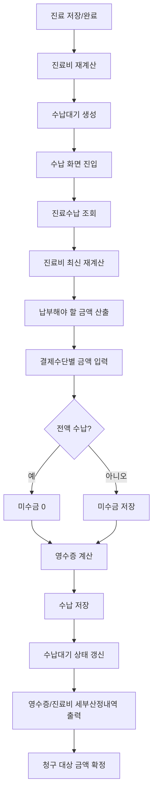
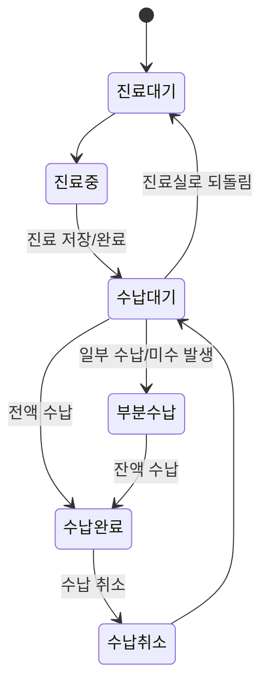
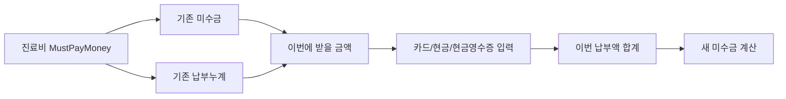
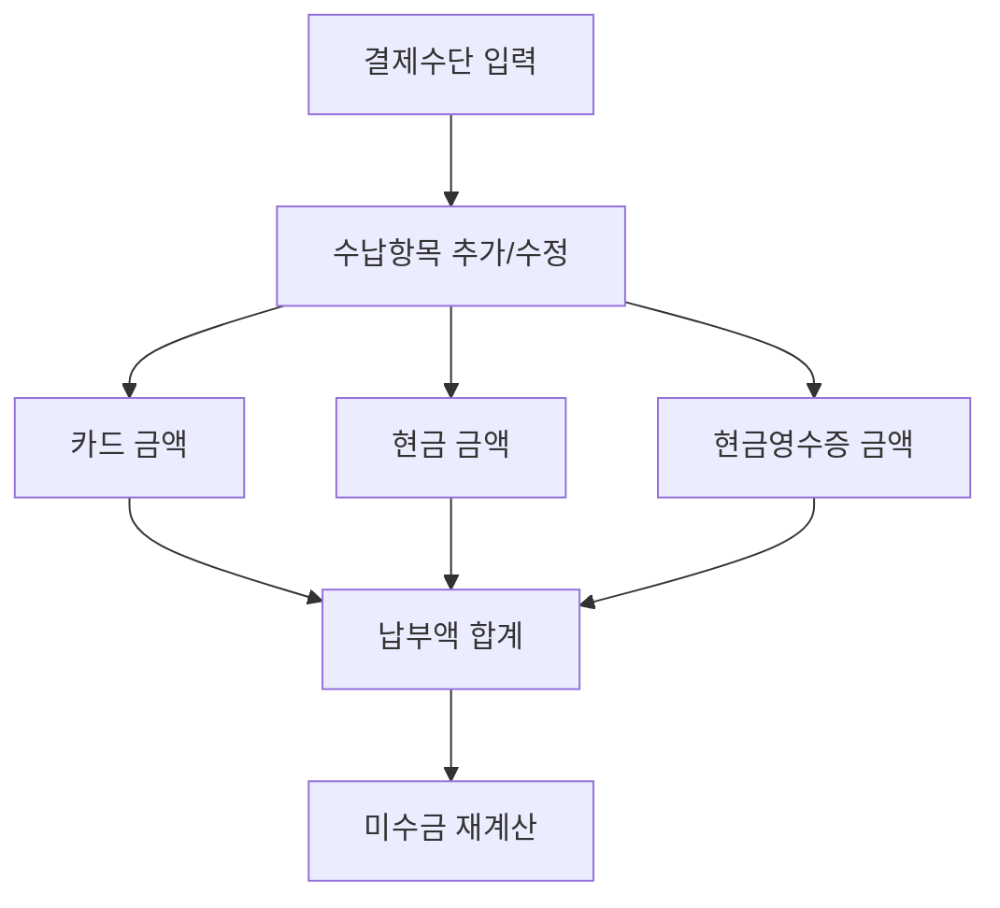
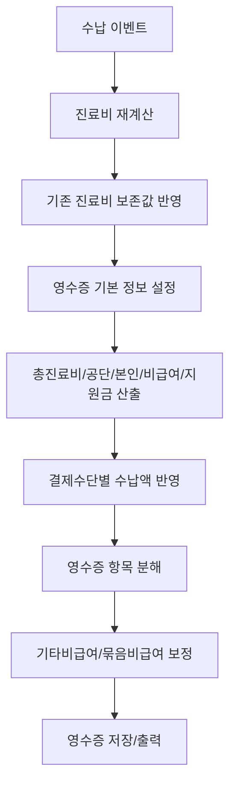
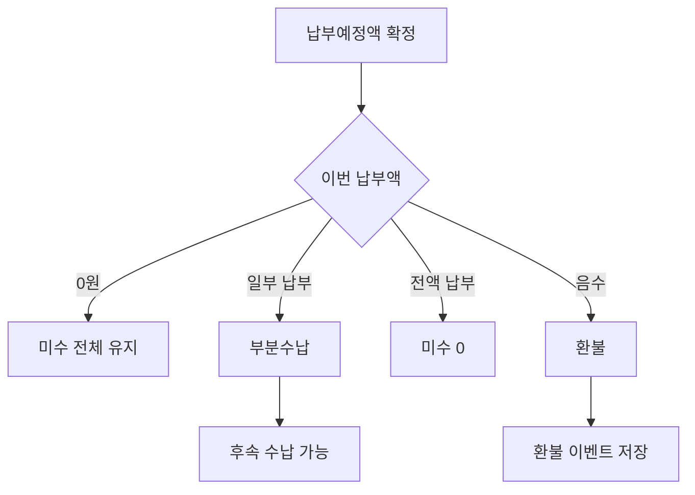
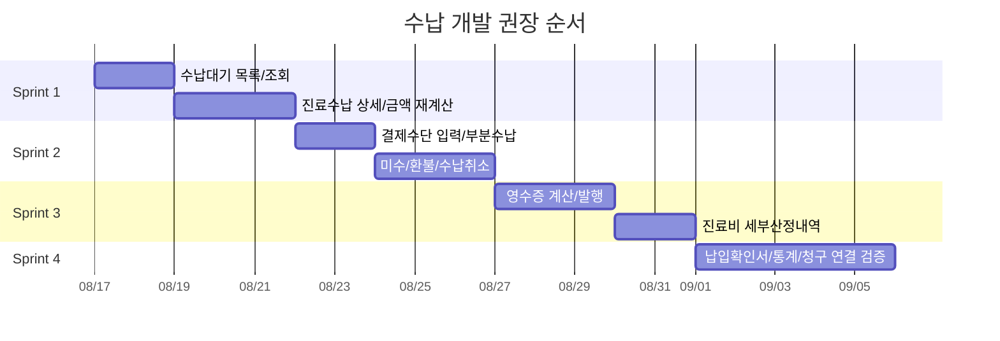

# 수납 도메인 분석

이 문서는 진료 완료 후 수납대기, 실제 수납, 미수/환불, 영수증, 진료비 세부산정내역, 청구 전 금액 확정 흐름을 개발언어에 종속되지 않는 업무 규칙으로 정리한다.

## 1. 도메인 위치

수납은 진료에서 계산된 환자 부담금을 실제 납부 이벤트로 확정하는 단계다. 단순 결제 기능이 아니라, 환자에게 받은 금액과 청구에 사용할 금액 스냅샷을 분리해서 관리해야 한다.

| 단위 | 의미 | 역할 |
|---|---|---|
| 수납대기 | 진료 완료 후 수납해야 할 진료 건 요약 | 접수/진료 상태와 수납 화면을 연결 |
| 진료수납 | 특정 진료에 연결된 전체 수납 상태 | 납부해야 할 금액, 납부 누계, 미수, 환불, 영수증 묶음 |
| 수납 이벤트 | 실제 돈을 받은 1회 행위 | 카드/현금/현금영수증 등 결제수단별 금액 저장 |
| 수납 항목 | 결제수단별 금액 | 카드, 현금, 현금영수증, 계좌이체 등 |
| 영수증 | 수납 이벤트의 출력/증빙 데이터 | 환자 교부, 재발행, 진료비 납입확인서 |
| 영수증 항목 | 진료비를 영수증 법정 항목으로 분해한 내역 | 진찰료, 투약료, 주사료, 검사료 등 |

## 2. 전체 업무 흐름

## 3. 수납대기

수납대기는 진료 완료 후 접수창/수납창에서 보여지는 대기 목록이다. 진료 전체를 다시 열기 전에도 필요한 최소 금액과 상태를 보여준다.

| 필드 | 뜻 | 업무 규칙 |
|---|---|---|
| 환자 | 수납 대상 환자 | 차트번호, 이름, 보험 확인에 사용한다. |
| 진료ID | 수납 대상 진료 식별자 | 수납대기의 기본 키 역할을 한다. |
| 진료일자 | 수납 대상 진료일 | 영수증, 진료비 확인서, 청구 기준일이 된다. |
| 수납메모 | 수납창에서 볼 내부 메모 | 환자 교부 문서 메모와 분리한다. |
| 접수시간 | 원래 접수된 시간 | 대기 순서와 상태 전환에 사용한다. |
| 대기유형 | 수납대기 상태 | 수납 전/완료/취소/재진료 이동 같은 상태를 표현한다. |
| 보험구분 | 건강보험, 의료급여, 일반 등 | 목록 표시와 수납 기준 금액 확인에 사용한다. |
| 순번 | 수납대기 표시 순서 | 접수 순서/진료 완료 순서 기준으로 정렬한다. |
| 진료실 | 진료가 끝난 방/부서 | 수납 목록 필터와 진료과목 보정에 사용한다. |
| 납부예정액 | 최종 납부해야 할 금액 요약 | 진료비 재계산 전 목록 표시용으로 사용한다. |
| 납부액 | 이미 납부한 금액 요약 | 부분수납 후 목록 표시용이다. |
| 진료의사 | 진료 담당 의사 | 목록 표시와 부서 판단 보조값이다. |
| 수납ID | 마지막 또는 현재 수납 식별자 | 재수납/부분수납 조회에 사용한다. |
| 수납항목 | 결제수단별 요약 | 카드 외 n건처럼 목록 표시를 만든다. |

### 수납대기 상태 전환

| 처리 | 규칙 |
|---|---|
| 진료 완료 | 진료 저장 시 수납대기를 생성하거나 갱신한다. |
| 진료실 되돌림 | 수납대기 건을 다시 진료대기로 이동할 수 있다. |
| 수납 취소 | 수납 완료 상태를 취소하고 수납대기를 되살릴 수 있어야 한다. |
| 부분수납 | 미수금이 남으면 수납대기 또는 부분수납 상태를 유지한다. |

## 4. 진료수납

진료수납은 한 진료에 대한 수납 전체 상태다. 여러 번 나누어 받을 수 있으므로 수납 이벤트 목록과 누계 금액을 함께 가진다.

| 필드 | 뜻 | 업무 규칙 |
|---|---|---|
| 진료 | 수납 대상 진료 전체 | 수납 화면 진입 시 진료비를 다시 계산한다. |
| 수납 이벤트 목록 | 실제 수납/환불 이벤트들 | 부분수납, 추가수납, 환불을 모두 포함한다. |
| 최종 납부예정액 | 환자가 최종적으로 내야 할 금액 | 진료비 계산 결과의 납부금액과 일치해야 한다. |
| 납부누계 | 수납 이벤트의 납부금액 합계 | 카드/현금/현금영수증 합계가 이벤트별 납부액이 된다. |
| 미수금 | 아직 받지 않은 금액 | 마지막 저장된 수납 이벤트의 미수금이 현재 미수금 기준이다. |
| 환불금액 | 환자에게 돌려준 금액 | 납부액이 음수인 수납 이벤트로 표현한다. |
| 영수증 | 수납 이벤트에 대응하는 증빙 | 저장/출력/재발행 기준이다. |

### 납부금 계산

| 계산값 | 산식/의미 |
|---|---|
| 최종 납부예정액 | 진료비 계산 결과의 환자 납부금액 |
| 납부누계 | 모든 수납 이벤트의 납부액 합계 |
| 이번 납부 가능액 | 최종 납부예정액 - 기존 미수금 - 기존 납부누계 |
| 새 미수금 | 최종 납부예정액 - 이번까지의 납부누계 |
| 전액 수납 | 새 미수금이 0인 상태 |
| 부분 수납 | 새 미수금이 0보다 큰 상태 |
| 환불 | 납부액이 음수인 수납 이벤트 |

## 5. 수납 이벤트

수납 이벤트는 실제 돈의 이동 1회다. 같은 진료에 여러 수납 이벤트가 붙을 수 있고, 각 이벤트마다 영수증이 붙는다.

| 필드 | 뜻 | 업무 규칙 |
|---|---|---|
| 수납ID | 수납 이벤트 식별자 | 저장 후 확정된다. |
| 수납일시 | 실제 수납한 일시 | 미래 일자는 입력할 수 없다. |
| 납부액 | 결제수단별 금액 합계 | 카드 + 현금 + 현금영수증으로 계산한다. |
| 기존 납부액 | 이번 수납 전 이미 받은 금액 | 부분수납 계산에 사용한다. |
| 미수금 | 이번 수납 후 남은 금액 | 후속 수납의 기준이 된다. |
| 수납메모 | 내부 수납 메모 | 영수증 메모와 분리한다. |
| 영수증메모 | 영수증에 출력할 메모 | 영수증 계산 시 메모에 반영한다. |
| 수납항목 | 결제수단별 금액 | 금액이 0보다 큰 항목만 저장한다. |
| 영수증 | 해당 수납 이벤트의 증빙 | 수납 저장 시 같이 저장한다. |

### 수납 이벤트 유형

| 유형 | 판단 | 처리 |
|---|---|---|
| 수납 | 납부액이 0 이상 | 수납일이 미래가 아니어야 한다. |
| 환불 | 납부액이 0보다 작음 | 미수/납부예정액 표시를 비워 별도 환불 이벤트로 취급한다. |

## 6. 결제수단

| 결제수단 | 저장 방식 | 비고 |
|---|---|---|
| 카드 | 수납항목 코드 카드 + 금액 | 납부액 합계에 포함 |
| 현금 | 수납항목 코드 현금 + 금액 | 현금영수증과 구분 |
| 현금영수증 | 수납항목 코드 현금영수증 + 금액 | 신분확인번호/승인번호를 영수증에 저장 |
| 계좌이체 | 수납항목 코드 계좌이체 + 금액 | 목록 표시에는 존재하나 실제 입력/정산 구현 범위를 확인해야 한다. |

## 7. 영수증

영수증은 수납 이벤트를 환자에게 증빙할 수 있도록 진료비를 다시 계산해 고정한 결과물이다. 수납액만 저장하면 안 되고, 진료비 산정 내역과 결제수단 금액이 함께 저장되어야 한다.

| 필드 | 뜻 | 업무 규칙 |
|---|---|---|
| 진료ID | 영수증이 연결된 진료 | 재발행/조회 기준이다. |
| 진료일자 | 실제 진료일 | 진료비 확인서와 청구 기준일이다. |
| 수납ID | 연결된 수납 이벤트 | 수납 이벤트별 영수증을 구분한다. |
| 수납일자 | 실제 수납일자 | 영수증 수납일 표시값이다. |
| 환자 | 환자 차트번호/이름 | 영수증 출력용이다. |
| 발급일자 | 영수증 발행일 | 영수증 번호의 앞부분이다. |
| 영수증번호 | 발급일자별 일련번호 | 발행 시 확정된다. |
| 영수증 식별번호 | 발급일자-일련번호 | 예: `YYYYMM-00001` 또는 발급일 문자열 + 5자리 번호 |
| 보험구분 | 건강보험/의료급여/일반 등 | 영수증 표시와 금액 분류에 사용한다. |
| 진료기간 | 시작/종료 진료일 | 외래 1건이면 같은 날짜다. |
| 야간/공휴 여부 | 야간/공휴 가산 여부 | 영수증 표시 또는 검증에 사용한다. |
| 진료과목 | 주상병 진료과 또는 설정 기준 진료과 | 주상병이 없으면 의사/진료실 설정으로 보정한다. |
| 총진료비 | 요양급여비용 총액 | 보험/비급여 포함 진료비 총액이다. |
| 공단부담금 | 보험자 청구액 | 청구 금액과 연결된다. |
| 본인부담금 | 환자가 부담하는 급여 본인부담 | 100분의100 미만 본인부담을 합산할 수 있다. |
| 100분의100 본인부담 | 전액본인부담 금액 | 별도 표시한다. |
| 비급여 | 비급여 금액 | 일반/비급여 처방 금액이다. |
| 지원금 | 건강생활유지비, 산전지원 등 지원금 | 실제 납부액에서 차감된다. |
| 할인액 | 병원 할인액 | 최종 납부액 산정에 반영한다. |
| 건강생활유지비 청구액 | 의료급여 지원금 사용액 | 의료급여 영수증/청구에 사용한다. |
| 산전지원금 청구액 | 임신/출산 지원금 사용액 | 지원금 잔액 관리와 연결된다. |
| 이전 납부액 | 이번 수납 전 납부액 | 부분수납 영수증에 필요하다. |
| 납부예정액 | 환자가 최종 내야 할 금액 | 진료비 계산 결과와 일치해야 한다. |
| 이번 납부액 | 이번 수납 이벤트 금액 | 결제수단 합계와 같아야 한다. |
| 카드/현금/현금영수증 금액 | 결제수단별 금액 | 정산과 영수증 표시 기준이다. |
| 미수금 | 이번 수납 후 남은 금액 | 부분수납 재방문 기준이다. |
| 현금영수증 신분확인번호 | 현금영수증 식별번호 | 현금영수증 발행 시 필요하다. |
| 현금영수증 승인번호 | 현금영수증 승인 결과 번호 | 발행 결과를 저장한다. |
| 발행일시 | 실제 영수증 생성 시각 | 재발행/감사 추적에 사용한다. |
| 영수증 항목 목록 | 진료비 세부 항목 | 법정 영수증 분류별 금액이다. |

## 8. 영수증 계산 규칙

| 규칙 | 설명 |
|---|---|
| 수납 시점 재계산 | 진료수납 조회/저장 시 진료비를 최신 기준으로 다시 계산한다. |
| 진료비 보존값 | 할인, 제안금액, 지원금 등 수납에 영향을 주는 기존 값을 유지한다. |
| 진료과목 결정 | 주상병 진료과를 우선 사용하고, 없으면 의사 진료과 또는 진료실 진료과를 사용한다. |
| 납부예정액 | 기본은 진료비의 최종 납부금액이다. 일부 과거 코로나/재택치료 수가는 예외적으로 0 처리한다. |
| 제안금액 보정 | 진료실 제안금액이 있으면 원 납부액과 할인 차액을 기타비급여로 보정한다. |
| 묶음 비급여 보정 | 묶음코드 자체에 비급여 금액이 있으면 영수증 항목에 별도 합산한다. |
| 통합영수증 | 여러 수납 이벤트를 합산해 카드/현금/현금영수증, 납부액, 최종 미수금을 만든다. |

## 9. 영수증 항목 분류

영수증 항목은 처방의 항번호/목번호/처방종류를 영수증 표시 항목으로 변환한다.

| 영수증 코드 | 항목명 | 생성 기준 |
|---|---|---|
| 1 | 진찰료 | 항 01 |
| 2 | 입원료 | 항 02 |
| 4 | 투약 및 조제료 행위료 | 항 03 중 수가 |
| 5 | 투약 및 조제료 약품비 | 항 03 중 약품 |
| 6 | 주사료 행위료 | 항 04 목 01 중 수가 |
| 7 | 주사료 약품비 | 항 04 중 약품 |
| 8 | 마취료 | 항 05 |
| 9 | 처치 및 수술료 | 항 08 또는 T |
| 10 | 검사료 | 항 09 중 초음파 제외 |
| 11 | 영상진단료 | 항 10 목 01 |
| 12 | 방사선치료료 | 항 10 목 02 |
| 13 | 치료재료대 | 치료재료 처방 |
| 14 | 재활 및 물리치료료 | 항 06 |
| 15 | 정신요법료 | 항 07 |
| 16 | 전혈 및 혈액성분제제료 | 항 04 목 99 |
| 17 | CT 진단료 | 항 S 목 01 |
| 18 | MRI 진단료 | 항 S 목 02 |
| 19 | PET 진단료 | 항 S 목 03 |
| 20 | 초음파 진단료 | 항 09 중 EB 코드 |
| 22 | 정액 본인부담 | 65세 이상 등 정액 산정 케이스 |
| 24 | 제증명 수수료 | 항 99 목 98 |
| 26 | 기타 비급여 | 제안금액 차액, 기타 비급여, 묶음 비급여 |

| 항목별 금액 | 뜻 |
|---|---|
| 본인부담금 | 해당 항목의 급여 본인부담 |
| 공단부담금 | 해당 항목의 청구액 |
| 100분의100 본인부담 | 해당 항목의 전액본인부담 |
| 한방/기타 부담금 | 별도 항목 부담금 |
| 비급여 | 해당 항목의 비급여 금액 |

## 10. 미수/부분수납/환불

| 상황 | 처리 |
|---|---|
| 전액 수납 | 미수금 0, 수납완료 상태로 전환 |
| 부분 수납 | 받은 금액만 수납 이벤트 저장, 남은 금액을 미수로 유지 |
| 후속 수납 | 이전 수납 이벤트의 미수금을 기준으로 받을 금액 계산 |
| 환불 | 음수 납부 이벤트로 저장하고 별도 환불 일자를 관리 |
| 수납 취소 | 수납 상태를 취소하고 수납대기 상태로 되돌린다. |

## 11. 출력물

| 출력물 | 데이터 소스 | 설명 |
|---|---|---|
| 영수증 | 영수증 + 영수증 항목 | 수납 이벤트별 환자 교부 증빙 |
| 통합 영수증 | 여러 수납 이벤트 합산 영수증 | 부분수납이 여러 번 있었을 때 전체 납부 내역 출력 |
| 진료비 세부산정내역 | 진료 처방 라인별 산정 결과 | 환자에게 세부 진료비를 설명하는 출력 |
| 진료비 납입확인서 | 수납/영수증 집계 | 기간별 납부 증빙 |

## 12. 청구와의 관계

수납은 청구 금액을 새로 만드는 단계가 아니라, 진료에서 계산된 금액을 실제 환자 납부 관점으로 확정하는 단계다.

| 연결 지점 | 설명 |
|---|---|
| 공단부담금 | 청구 명세서의 청구액과 일치해야 한다. |
| 본인부담금 | 환자가 납부해야 하는 급여 본인부담이다. |
| 비급여 | 청구 대상은 아니지만 영수증/비급여 보고에 중요하다. |
| 할인 | 청구 금액에는 영향을 주면 안 되고 환자 납부액에만 반영되어야 한다. |
| 지원금 | 의료급여/임신출산 지원금은 환자 실납부액과 잔액 관리에 영향을 준다. |
| 영수증 번호 | 청구 파일 필드는 아니지만 회계/증빙/환자 문의 대응의 기준이 된다. |

## 13. 개발 순서

| 우선순위 | 개발 범위 | 완료 기준 |
|---|---|---|
| 1 | 수납대기 생성/조회 | 진료 완료 후 수납대기 목록에 환자와 납부예정액이 표시된다. |
| 2 | 진료수납 조회 | 진료, 수납 이벤트, 영수증, 미수금이 한 화면에 구성된다. |
| 3 | 금액 재계산 | 수납 화면 진입 시 진료비가 최신 기준으로 재계산된다. |
| 4 | 결제수단 입력 | 카드/현금/현금영수증 금액 합계가 납부액이 된다. |
| 5 | 부분수납/미수 | 일부 납부 후 미수금이 남고 후속 수납이 가능하다. |
| 6 | 환불/취소 | 음수 수납 이벤트와 수납 취소 상태 전환을 처리한다. |
| 7 | 영수증 | 수납 이벤트별 영수증 번호와 항목별 금액이 생성된다. |
| 8 | 출력/증빙 | 영수증, 통합영수증, 진료비 세부산정내역, 납입확인서가 조회된다. |

## 14. 일별 확인 체크리스트

| 확인 항목 | 확인 내용 |
|---|---|
| 수납대기 | 진료 완료 후 수납대기가 생성되는가 |
| 금액 일치 | 진료비의 최종 납부금액과 수납대기 납부예정액이 맞는가 |
| 수납 상세 | 진료수납 조회 시 진료비가 재계산되고 미수금이 맞는가 |
| 결제수단 | 카드/현금/현금영수증 입력 합계가 납부액이 되는가 |
| 부분수납 | 일부 납부 후 미수금이 남고 후속 수납이 가능한가 |
| 전액수납 | 미수금 0이 되면 수납완료로 전환되는가 |
| 환불 | 음수 납부 이벤트가 환불로 표시되는가 |
| 수납취소 | 수납 취소 후 수납대기 상태가 복구되는가 |
| 영수증 | 발급일자, 영수증번호, 수납ID, 결제수단 금액이 맞는가 |
| 영수증 항목 | 진료 처방이 영수증 법정 항목으로 정확히 분해되는가 |
| 의료급여 | 건강생활유지비/산전지원금/승인번호가 영수증에 반영되는가 |
| 청구 연결 | 수납 후에도 청구 금액이 진료 명세서 금액과 일치하는가 |

## 15. 테스트 시나리오

| 시나리오 | 기대 결과 |
|---|---|
| 건강보험 진료 전액 수납 | 납부액=최종 납부예정액, 미수금 0, 영수증 생성 |
| 일반 진료 카드+현금 분할 | 카드/현금 항목이 각각 저장되고 합계가 납부액 |
| 현금영수증 수납 | 현금영수증 금액과 신분확인번호/승인번호 저장 |
| 일부 수납 | 납부액만 저장되고 남은 금액이 미수금 |
| 미수 후 추가 수납 | 이전 미수금을 기준으로 잔액 수납 |
| 환불 | 음수 수납 이벤트로 저장되고 환불로 분류 |
| 수납일 미래 입력 | 입력 차단 또는 검증 오류 |
| 묶음 비급여 진료 | 기타비급여 항목에 묶음 금액 반영 |
| 65세 이상 정액 케이스 | 정액 본인부담 항목 22 생성 |
| 초음파 코드 포함 | 검사료가 아니라 초음파 진단료 20으로 분리 |
| 수납 취소 | 수납완료가 취소되고 수납대기 복구 |

## 16. 구현 시 주의할 점

| 주의점 | 이유 |
|---|---|
| 수납 화면 진입 시 진료비를 다시 계산해야 한다 | 진료 저장 이후 코드/할인/지원금 보정이 반영될 수 있다. |
| 수납액과 영수증 금액을 분리해야 한다 | 수납액은 돈의 이동이고, 영수증 금액은 진료비 산정 증빙이다. |
| 결제수단 합계와 납부액이 항상 같아야 한다 | 정산 오류를 막기 위한 기본 불변식이다. |
| 부분수납은 수납 이벤트 누계로 봐야 한다 | 진료당 수납이 여러 번 발생할 수 있다. |
| 환불은 삭제가 아니라 음수 이벤트로 남기는 것이 안전하다 | 회계/감사 추적이 가능하다. |
| 할인은 청구액을 줄이면 안 된다 | 보험 청구 금액과 환자 실납부액은 분리되어야 한다. |
| 영수증 항목 분류는 처방 항/목 코드와 연결해야 한다 | 환자 출력물과 법정 서식의 항목이 맞아야 한다. |
| 수납 취소 후 진료/청구 상태를 확인해야 한다 | 이미 청구된 진료의 수납 취소는 별도 통제가 필요하다. |

## 17. 현재 소스 기준 확인 위치

| 영역 | 기준 파일 |
|---|---|
| 수납대기 모델 | `Data/UBerSoft.EMR.Data.Models/ReceptionDesk/WaitReceivePay.cs` |
| 진료수납 모델 | `Data/UBerSoft.EMR.Data.Models/ReceptionDesk/TreatmentReceivePay.cs` |
| 수납 이벤트 모델 | `Data/UBerSoft.EMR.Data.Models/ReceptionDesk/ReceivePay.cs` |
| 수납 항목 모델 | `Data/UBerSoft.EMR.Data.Models/ReceptionDesk/ReceivePayItem.cs` |
| 수납대기 화면 규칙 | `Data/UBerSoft.EMR.Data.ViewModels/ReceptionDesk/WaitReceivePayViewModel.cs` |
| 진료수납 화면 규칙 | `Data/UBerSoft.EMR.Data.ViewModels/ReceptionDesk/TreatmentReceivePayViewModel.cs` |
| 수납 이벤트 화면 규칙 | `Data/UBerSoft.EMR.Data.ViewModels/ReceptionDesk/ReceivePayViewModel.cs` |
| 영수증 모델 | `Data/UBerSoft.EMR.Data.Models/Reports/Receipt.cs` |
| 영수증 항목 모델 | `Data/UBerSoft.EMR.Data.Models/Reports/ReceiptItem.cs` |
| 영수증 계산 | `Data/UBerSoft.EMR.Data/Services/Computes/Concrete/AmountReceiptService.cs` |
| 진료수납 저장/조회 | `Data/UBerSoft.EMR.Data/Controllers/ReceptionDesk/Concreate/TreatmentReceivePayController.cs` |
| 수납대기 상태 전환 | `Data/UBerSoft.EMR.Data/Controllers/ReceptionDesk/Concreate/WaitReceivePayController.cs` |
| 영수증 조회/삭제 | `Data/UBerSoft.EMR.Data/Controllers/Reports/Concreate/ReceiptController.cs` |

