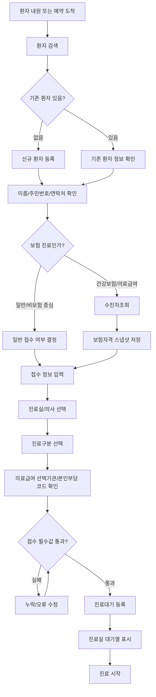
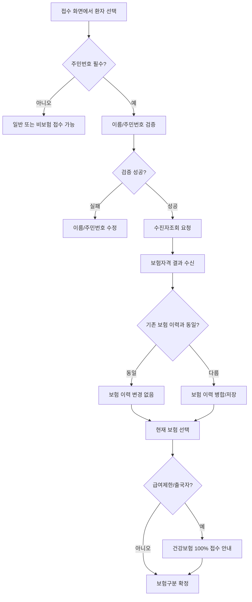
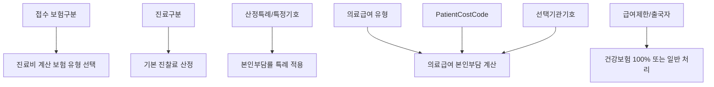
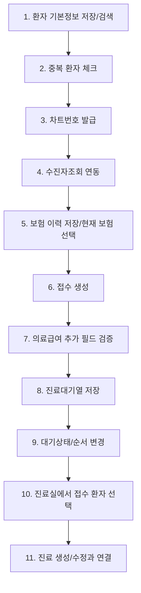

# Reception Domain

## 1. 목적

접수는 EMR 업무의 시작점이다.

접수 도메인의 목적은 환자 기본정보와 보험자격 정보를 확인한 뒤, 특정 진료일에 어떤 의사/진료실에서 어떤 보험구분과 진료구분으로 진료를 볼지 확정하고 진료대기열에 올리는 것이다.

접수가 정확하지 않으면 이후 도메인이 모두 흔들린다.

- 수진자조회 결과가 틀리면 환자부담금 계산이 틀린다.
- 접수 보험구분이 틀리면 청구 명세서가 틀린다.
- 진료구분이 틀리면 초진/재진 진찰료가 틀린다.
- 진료실/의사 지정이 틀리면 대기열과 진료기록 담당자가 틀린다.
- 의료급여 선택기관 정보가 누락되면 계산/청구에서 오류가 난다.

## 2. 접수의 업무 범위

| 구분 | 설명 |
|---|---|
| 환자 검색 | 이름, 차트번호, 주민번호, 휴대폰, CRM 연동 ID 등으로 기존 환자 조회 |
| 환자 등록 | 신규 환자의 기본 인적사항과 고객관리 정보를 저장 |
| 보험자격 확인 | 수진자조회로 건강보험, 의료급여, 차상위, 산정특례, 급여제한 정보를 확인 |
| 접수 생성 | 진료일시, 진료실, 의사, 보험구분, 진료구분, 접수상태를 확정 |
| 대기열 관리 | 진료대기, 진료중, 보류, 진료완료 상태와 순서를 관리 |
| 진료실 인계 | 접수 데이터를 진료실에서 진료 생성/조회의 기준으로 사용 |

## 3. 전체 흐름

## 4. 환자 데이터

환자 데이터는 접수 전에 먼저 정리되어야 한다. 피부/성형외과에서는 보험진료뿐 아니라 상담, 시술, 미용, 재방문 관리가 많기 때문에 고객관리 정보도 환자 기본정보와 같이 관리해야 한다.

### 환자 식별 필드

| 필드 | 뜻 | 저장/사용 규칙 |
|---|---|---|
| PatientId | 환자 내부 식별자 | 시스템 내부 PK |
| ChartNumber | 차트번호 | 병원별 환자 차트 식별자, 필요 시 자동 발급 |
| Name | 환자명 | 필수, 앞뒤 공백 제거 |
| NickName | 고객 표시명/별칭 | 현재 구조상 필수 검증 대상, 이름과 별도 관리 가능 |
| ResidentNumber1 | 주민번호 앞 6자리 | 주민번호 필수 환자는 필수 |
| ResidentNumber2 | 주민번호 뒤 7자리 | 주민번호 필수 환자는 필수 |
| ResidentNumber | 주민번호 전체 | 수진자조회, DUR, 청구, 처방전에서 사용 |
| IsMandatoryResidentNumber | 주민번호 필수 여부 | 미용/상담 고객처럼 주민번호가 없을 수 있는 경우 false 가능 |
| IsForeigner | 외국인 여부 | 주민번호 뒤 첫 자리 검증 규칙이 달라짐 |
| PassportNumber | 여권번호 | 외국인 또는 주민번호 대체 식별 보조 |
| BirthDay | 생년월일 | 주민번호 입력 시 자동 계산 가능 |
| Sex | 성별 | 주민번호로 계산 |
| Age | 나이 | 진료일 또는 접수일 기준으로 계산 |

### 주민번호 검증 규칙

| 조건 | 규칙 |
|---|---|
| 주민번호 필수 환자 | 이름, 주민번호 앞 6자리, 뒤 7자리 필요 |
| 주민번호 선택 환자 | 주민번호 필수 검증 생략 가능 |
| 내국인 | 주민번호 뒤 첫 자리 `1`, `2`, `3`, `4`, `9`, `0` 허용 |
| 외국인 | 주민번호 뒤 첫 자리 `5`, `6`, `7`, `8` 허용 |
| 수진자조회 | 이름과 13자리 주민번호가 정상이어야 가능 |

## 5. 연락처/주소/고객관리 필드

| 필드 | 뜻 | 사용처 |
|---|---|---|
| CellPhone | 휴대폰번호 | 예약 안내, 문자, 본인 확인 |
| HomePhone | 자택전화 | 보조 연락 |
| HomePostCode | 우편번호 | 영수증/문서/고객관리 |
| HomeAddress | 주소 | 증명서, 우편, 고객관리 |
| Email | 이메일 | 안내/문서 발송, 형식 검증 |
| IsReceiveText | 일반 문자 수신 여부 | 문자 발송 동의 |
| IsReceiveEventText | 이벤트 문자 수신 여부 | 마케팅/이벤트 안내 동의 |
| Grade | 고객등급 | 피부/성형외과 고객관리 |
| Job | 직업 | 고객관리/상담 참고 |
| Area | 국가/지역 | 지역 분석, 외국인 고객 관리 |
| VisitRoute | 내원경로 | 광고, 소개, 검색, 재방문 등 유입 분석 |
| Consultant | 상담자 | 상담/CRM 담당자 |
| RecommanderId | 추천인 환자 ID | 소개 고객 관리 |
| RecommanderName | 추천인명 | 소개 고객 관리 |
| Memo | 환자 메모 | 접수/진료/상담 공통 참고 |
| Memo2 | 추가 메모 | 내부 관리 |
| SpecialItem | 특이사항 | 알레르기, 주의, VIP, 민감 고객 등 |
| LastVisitDate | 마지막 내원일 | 초진/재진 판단, 고객 응대 |
| SyncSource | 외부 연동 출처 | CRM, 예약앱 등 |
| CrmPatientId | 외부 CRM 환자 ID | 외부 고객 DB와 매칭 |

## 6. 보험자격 데이터

접수 시 보험 진료로 진행하려면 수진자조회 결과를 환자의 보험 이력으로 저장해야 한다.

접수는 “현재 보험자격” 하나만 쓰는 것이 아니라, 접수일 기준으로 적용 가능한 보험 이력 중 가장 최근 시작일의 보험을 사용한다.

| 필드 | 뜻 | 접수에서의 사용 |
|---|---|---|
| InsurnerType | 보험구분 | 건강보험, 의료급여, 일반, 건강보험 100% 결정 |
| FromApplyDate | 자격 적용 시작일 | 접수일 기준 보험 선택 |
| ToApplyDate | 자격 종료일 | 표시/참고. 급여제한자는 종료일이 있어도 건강보험으로 선택될 수 있음 |
| MemberName | 세대주/가입자명 | 청구 |
| InsuranceNumber | 건강보험증 번호 | 청구 |
| GovernmentInjuryType | 공상 등 구분/차상위 구분 | 본인부담 계산, 청구 |
| InsuranceLimitType | 급여제한 코드 | 접수 시 건강보험 100% 안내 |
| IsExitCountry | 출국자 여부 | 접수 시 건강보험 100% 안내 |
| MedicalAid | 의료급여 상세 | 본인부담 코드, 선택기관, 건강생활유지비 |
| SpecialCases | 산정특례/차상위/희귀/암/결핵 등 | 진료비 계산, 청구 특정기호 |
| ExamineeMessage | 수진자조회 메시지 | 접수자 안내 |

### 접수일 기준 보험 선택 규칙

1. 환자의 보험 이력 중 `FromApplyDate <= 접수일시`인 항목을 찾는다.
2. 시작일이 가장 최근인 보험을 현재 보험으로 사용한다.
3. 없으면 일반/무보험으로 본다.
4. `ToApplyDate`만으로 제외하지 않는다. 급여제한 또는 무자격 건강보험이 종료일을 가진 상태로 들어올 수 있기 때문이다.

## 7. 수진자조회와 접수 연결

### 조회 후 접수 안내 메시지

| 상황 | 접수 안내 |
|---|---|
| 정상 건강보험 | 건강보험으로 접수 가능 |
| 의료급여 | 의료급여 유형, 선택기관, 본인부담코드 확인 |
| 출국자 | 건강보험 100%로 접수 후 환불 가능성 안내 |
| 급여제한자 | 건강보험 100% 접수 안내 |
| 요양병원 입원 중 | 진료의뢰서 없으면 전액부담 안내 |
| 자격 없음 | 일반 또는 건강보험 100% 여부를 접수자가 판단 |

## 8. 접수 데이터

접수 데이터는 “환자를 진료실 대기열에 올리는 스냅샷”이다. 환자 원장 데이터와 별도로, 접수 시점의 보험구분, 진료실, 의사, 진료구분을 저장해야 한다.

| 필드 | 뜻 | 저장/사용 규칙 |
|---|---|---|
| Patient | 환자 | 접수 대상 환자 |
| ReceiveTime | 접수시간 | 실제 접수 시각 또는 예약 도착 처리 시각 |
| TreatmentDate | 진료일시 | 진료 생성 후 연결되는 진료일시 |
| Room | 진료실 | 접수 필수 |
| Doctor | 진료의사 | 병원 옵션에 따라 필수 |
| WaitType | 대기상태 | 기본 `진료대기` |
| VisitType | 진료구분 | 신환, 초진, 재진 등 |
| InsurnerType | 접수 보험구분 | 건강보험, 의료급여, 일반, 건강보험 100% |
| SpecificCode | 특정기호 | 산정특례 등 필요 시 접수에서 선택/표시 |
| IsPregnant | 임신여부 | DUR 임부금기, 진료 참고 |
| PatientCostCode | 의료급여 본인부담/선택기관 관련 코드 | 의료급여 선택기관 대상자 필수 가능 |
| AppointHospital | 선택기관기호 | 특정 의료급여 본인부담코드에서 필수 |
| Message | 접수메모 | 진료실 전달 메시지 |
| IsEmergency | 응급 표시 | 대기열 우선순위/표시 |
| Ordinal | 대기 순서 | 진료대기열 정렬 |
| TreatmentId | 연결 진료 ID | 진료가 생성되면 연결 |
| CreateUser | 접수 등록자 | 접수 처리 직원 |
| IsNew | 신규 접수/신규 환자 여부 | 신규 환자 접수 처리 구분 |

## 9. 접수 생성 기본값

| 항목 | 기본값/생성 규칙 |
|---|---|
| 접수시간 | 현재 시각 또는 사용자가 지정한 접수시각 |
| 진료실 | 환자 담당의사의 진료실 또는 이전 진료실/의사 정보 |
| 대기상태 | 진료대기 |
| 임신여부 | 의료급여 임신 관련 자격이면 자동 true 가능 |
| 보험구분 | 선택한 보험자격 기준 |
| 급여제한 건강보험 | 건강보험 100%로 전환 |
| 병원 옵션상 일반접수 | 보험자격과 무관하게 일반으로 접수 |
| 진료구분 | 환자 기존 내원 정보가 없으면 신환, 있으면 저장된 내원구분 사용 |
| 신규 환자 | 환자 저장과 접수를 한 번에 처리 |

## 10. 진료구분

진료구분은 기본진찰료 산정과 연결된다.

| 진료구분 | 뜻 | 계산 영향 |
|---|---|---|
| 진찰료X | 기본 진찰료 산정하지 않음 | 시술/상담 중심 진료에서 사용 가능 |
| 초진 | 해당 기준상 초진 | 초진 진찰료 산정 |
| 재진 | 재방문/동일 상병 등 기준상 재진 | 재진 진찰료 산정 |
| 신환 | 병원에 처음 등록된 환자 | 초기 접수 기본값 |
| 물리치료 | 물리치료 목적 내원 | 관련 기본수가 산정 |
| 보호자대리내원 | 보호자만 내원 | 별도 진찰료 기준 |
| 만성질환 | 고혈압/당뇨 등 만성질환 관리 | 관련 기본수가 산정 |

개발 시 주의할 점:

- 신환과 초진은 같은 말이 아니다.
- 신환은 병원 고객관리 기준의 신규 환자 성격이고, 초진/재진은 수가 산정 기준에 가깝다.
- 접수 화면에서는 사용자가 최종 진료구분을 수정할 수 있어야 한다.

## 11. 대기상태

| 상태 | 뜻 | 사용 시점 |
|---|---|---|
| 진료대기 | 접수 완료 후 진료실 대기 | 접수 기본 상태 |
| 진료중 | 진료실에서 환자를 선택하여 진료 시작 | 진료실 점유/선택 표시 |
| 보류 | 환자가 잠시 대기 제외됨 | 검사, 상담, 자리비움, 확인 필요 |
| 진료완료 | 진료가 완료됨 | 수납대기로 이동 |

접수 화면에서는 일반적으로 `진료완료`를 직접 선택하지 않도록 한다. 진료완료는 진료실에서 진료가 끝난 뒤 상태 전환되는 값이다.

### 대기열 순서 관리

| 기능 | 설명 |
|---|---|
| 위로 이동 | 같은 진료실 대기열에서 순서를 앞당김 |
| 아래로 이동 | 같은 진료실 대기열에서 순서를 뒤로 보냄 |
| 맨 위로 이동 | 우선 진료 대상 처리 |
| 맨 아래로 이동 | 대기 순서 후순위 처리 |
| 보류 처리 | 대기 순서에서 사실상 제외 |
| 응급 표시 | 별도 강조, 우선순위 판단 |

## 12. 필수 검증

### 환자 필수 검증

| 필드 | 필수 조건 |
|---|---|
| 환자명 | 항상 필수 |
| 고객 표시명/별칭 | 현재 기준 필수 |
| 주민번호 앞자리 | 주민번호 필수 환자일 때 필수, 6자리 |
| 주민번호 뒷자리 | 주민번호 필수 환자일 때 필수, 7자리 |
| 이메일 | 입력된 경우 이메일 형식 검증 |
| 보험정보 | 보험 접수일 때 접수일 기준 현재 보험정보 검증 |

### 접수 필수 검증

| 필드 | 필수 조건 |
|---|---|
| 진료실 | 필수 |
| 대기상태 | 필수 |
| 진료의사 | 병원 옵션에서 접수 시 의사 선택을 사용하면 필수 |
| 의료급여 본인부담코드 | 의료급여 선택기관 대상 코드가 있는 경우 필수 |
| 선택기관기호 | 특정 본인부담코드에서 필수 |

### 의료급여 추가 검증

| 조건 | 추가 필수값 |
|---|---|
| 수진자조회 결과 본인부담코드가 `M001` 또는 `B001` | 접수의 PatientCostCode 필수 |
| 접수 PatientCostCode가 `B005`, `B006`, `M014` | AppointHospital 필수 |
| 보험구분이 의료급여가 아님 | 위 의료급여 추가 검증 생략 |

## 13. 기존 환자 접수와 신규 환자 접수

### 기존 환자 접수

1. 환자를 검색한다.
2. 환자 기본정보와 연락처를 확인한다.
3. 필요한 경우 수진자조회를 한다.
4. 보험 이력이 바뀌었으면 병합 저장한다.
5. 접수 정보를 생성한다.
6. 접수만 바뀌었는지, 환자정보/보험정보도 바뀌었는지 구분하여 저장한다.

### 신규 환자 접수

1. 신규 환자 기본정보를 입력한다.
2. 차트번호를 발급하거나 저장 시 자동 발급한다.
3. 주민번호가 있으면 수진자조회를 한다.
4. 보험정보를 함께 생성한다.
5. 신규 환자 저장과 접수 등록을 하나의 업무로 처리한다.

신규 환자 접수는 환자 저장과 접수 저장이 함께 성공해야 한다. 둘 중 하나만 성공하면 중복 환자나 접수 누락이 생길 수 있으므로 트랜잭션으로 묶는 것이 좋다.

## 14. 중복 환자 방지

| 기준 | 설명 |
|---|---|
| 주민번호 중복 | 같은 병원 내 같은 주민번호 환자 존재 여부 확인 |
| 휴대폰 검색 | 기존 고객 재등록 방지 |
| CRM 환자 ID | 외부 상담/예약 시스템과 연결된 환자 중복 방지 |
| 이름+생년월일 | 주민번호 미입력 환자의 보조 중복 탐지 |

중복 환자가 의심되면 신규 등록보다 기존 환자 병합 또는 기존 환자 접수를 우선해야 한다.

## 15. 접수 후 진료실 인계 데이터

진료실은 접수 데이터를 기준으로 진료를 시작한다.

| 데이터 | 진료실에서의 사용 |
|---|---|
| 환자 기본정보 | 환자 식별, 나이, 성별, 메모 확인 |
| 접수시간 | 오늘 접수 여부, 대기 순서 |
| 진료실/의사 | 진료 담당자와 대기열 필터 |
| 진료구분 | 기본 진찰료 산정 기준 |
| 보험구분 | 진료비 계산 기준 |
| 현재 보험자격 | 산정특례, 차상위, 의료급여, 급여제한 판단 |
| 임신여부 | DUR 임부금기, 진료 참고 |
| 접수메모 | 진료실 전달 사항 |
| 응급표시 | 우선 진료 판단 |

## 16. 접수와 PatientCost 연결

접수는 진료비 계산에 직접 영향을 준다.

## 17. 접수와 청구 연결

| 접수 데이터 | 청구 영향 |
|---|---|
| 접수 보험구분 | 명세서 보험자 종별 |
| 의료급여 유형 | 의료급여 명세서 구분 |
| 본인부담코드 | 의료급여 특정내역/본인부담 산정 |
| 선택기관기호 | 의료급여 선택기관 관련 청구 |
| 진료구분 | 기본 진찰료 코드 |
| 특정기호 | 산정특례 특정기호 |
| 환자 주민번호/성명 | 청구 수진자 식별 |
| 진료의사/진료과 | 명세서 진료과목, 의사 정보 |

## 18. 접수 취소/변경

| 상황 | 처리 |
|---|---|
| 진료 시작 전 접수 취소 | 진료대기에서 삭제 |
| 진료 시작 후 접수 변경 | 진료정보, 계산정보와 영향 범위 확인 필요 |
| 보험구분 변경 | 진료비 재계산 필요 |
| 진료구분 변경 | 기본 진찰료 재산정 필요 |
| 진료실/의사 변경 | 대기열 이동 및 진료 담당자 변경 |
| 의료급여 코드 변경 | PatientCost와 청구 검증 재수행 |

진료가 이미 생성된 뒤 접수를 바꾸는 경우에는 단순 접수 수정이 아니라 진료/계산/수납/청구 영향까지 확인해야 한다.

## 19. 개발 순서

## 20. 스프린트 기준

| 단계 | 개발 목표 | 완료 기준 |
|---|---|---|
| 1주차 | 환자 등록/검색 | 이름, 주민번호, 휴대폰, 차트번호로 환자 관리 가능 |
| 2주차 | 수진자조회 접수 연결 | 조회 결과가 보험 이력으로 저장되고 접수에 반영 |
| 3주차 | 접수 생성 | 진료실, 의사, 보험구분, 진료구분으로 접수 가능 |
| 4주차 | 대기열 관리 | 진료대기/진료중/보류 상태와 순서 변경 가능 |
| 5주차 | 의료급여/특례 검증 | PatientCostCode, 선택기관기호, 특정기호가 계산으로 연결 |
| 6주차 | 진료실 인계 | 진료실에서 접수 환자를 선택해 진료 시작 가능 |

## 21. 테스트 케이스

| 케이스 | 입력 | 기대 결과 |
|---|---|---|
| 신규 환자 일반 접수 | 이름, 연락처만 입력 | 일반 접수 생성, 진료대기 등록 |
| 신규 환자 보험 접수 | 이름, 주민번호 입력 후 수진자조회 | 보험 이력 저장 후 건강보험/의료급여 접수 |
| 주민번호 없는 고객 | 주민번호 필수 해제 | 수진자조회 없이 일반 접수 가능 |
| 내국인 주민번호 오류 | 뒤 첫 자리 `5` 입력 | 내국인 주민번호 오류 |
| 외국인 주민번호 오류 | 외국인인데 뒤 첫 자리 `1` 입력 | 외국인 주민번호 오류 |
| 출국자 조회 | 수진자조회 결과 출국자 | 건강보험 100% 접수 안내 |
| 급여제한자 조회 | 급여제한 코드 존재 | 건강보험 100% 접수 안내 |
| 의료급여 선택기관 대상 | M001/B001 대상 | PatientCostCode 필수 |
| 의뢰 선택기관 코드 | B005/B006/M014 | AppointHospital 필수 |
| 진료실 누락 | Room 없음 | 접수 저장 불가 |
| 의사 선택 옵션 사용 | Doctor 없음 | 접수 저장 불가 |
| 접수 후 보류 | WaitType 보류 | 대기 순서에서 후순위/제외 표시 |
| 보험구분 변경 | 건강보험에서 일반으로 변경 | 이후 진료비 재계산 대상 |
| 오늘 이미 접수한 환자 | 같은 환자 재접수 | 기존 오늘 접수 확인 후 중복 접수 방지 |

## 22. 구현 시 주의사항

- 접수는 환자 원장 데이터와 접수 스냅샷 데이터를 구분해야 한다.
- 수진자조회 결과를 화면 표시만 하고 저장하지 않으면 계산/청구에서 사용할 수 없다.
- 접수일 기준 현재 보험을 선택해야 하며, 단순히 최신 보험 하나만 쓰면 과거 진료 수정에서 오류가 난다.
- 건강보험 급여제한/출국자는 건강보험 100% 접수 안내가 필요하다.
- 병원 옵션에 따라 모든 접수를 일반으로 강제할 수 있어야 한다.
- 의료급여 선택기관 관련 코드는 접수 단계에서 받아야 진료비 계산과 청구가 이어진다.
- 신환, 초진, 재진은 업무 의미가 다르므로 개발팀이 같은 값으로 합치면 안 된다.
- 접수 변경은 진료, 계산, 수납, 청구에 영향을 줄 수 있으므로 변경 시점별 정책이 필요하다.
- 피부/성형외과는 보험진료와 비보험/상담/시술 고객이 섞이므로 주민번호 필수 여부와 일반 접수 흐름을 반드시 열어두어야 한다.

## 23. 현재 EMR 기준 근거

이 문서는 현재 EMR의 접수 흐름을 업무 규칙으로 추상화한 것이다.

| 현재 위치 | 역할 |
|---|---|
| `Patient` | 환자 기본정보, 보험 이력, 고객관리 정보 |
| `WaitTreatment` | 접수 및 진료대기 데이터 |
| `WaitTreatmentController.Create` | 환자/보험 기준 접수 기본값 생성 |
| `PatientViewModel.ConfirmExamineeTask` | 수진자조회 후 보험 이력 병합 |
| `PatientViewModel.GetInsurance` | 접수일 기준 현재 보험 선택 |
| `WaitTreatmentViewModel.Validate` | 접수 필수값과 의료급여 추가 검증 |
| `WaitTreatmentRepository` | 접수 저장, 대기상태/순서 변경 |

