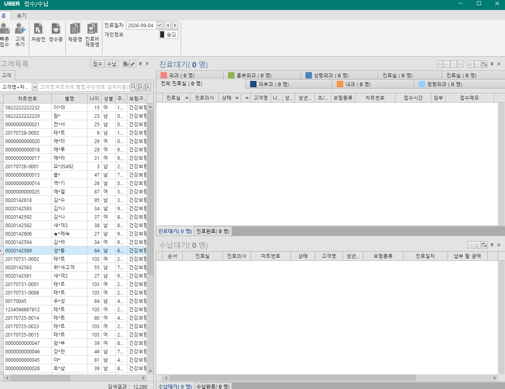
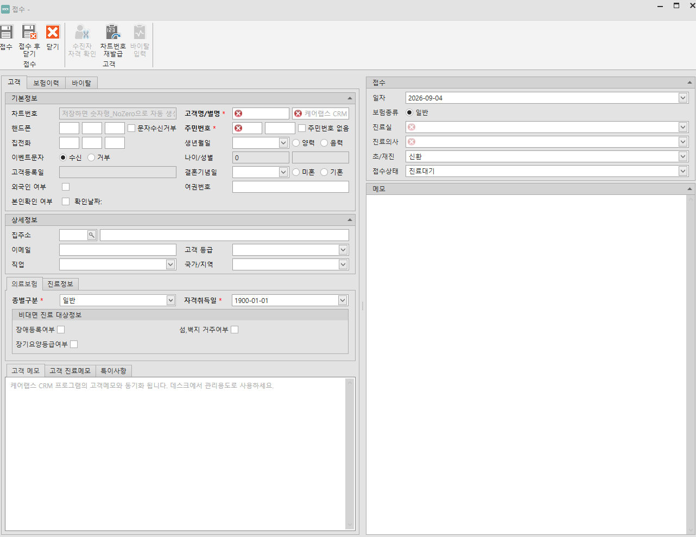
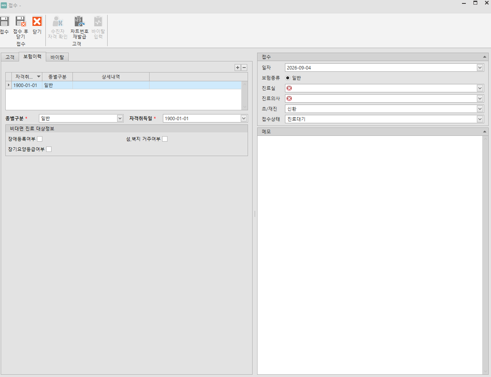

# 접수/수납 화면 개발 요구사항

목적: 접수/수납 화면 스크린샷 기준으로 청구 S/W 개발에 필요한 화면 구성, 필드, 기능, 필수 여부를 정리한다.

필수 기준:

| 구분   | 기준                                           |
| ------ | ---------------------------------------------- |
| 필수   | 접수, 진료대기, 수납대기, 청구자료 생성에 필요 |
| 조건부 | 병원 운영 방식이나 보험종류에 따라 필요        |
| 비필수 | 핵심 업무 없이도 운영 가능                     |

## 1. 접수/수납 대기

### 1.1 화면 개요

| 항목               | 내용                                               |
| ------------------ | -------------------------------------------------- |
| 화면명             | 접수/수납                                          |
| 목적               | 환자 검색, 접수 등록, 진료대기 관리, 수납대기 관리 |
| 사용 시점          | 데스크에서 환자 내원/수납 처리 시                  |
| 청구 S/W 필수 여부 | 필수                                               |
| 주요 영향          | 진료 시작, 수납 시작, 청구 명세서 생성 기준        |

### 1.2 상단 기능

| 기능           | 필수 여부 | 설명                         |
| -------------- | --------- | ---------------------------- |
| 빠른 접수      | 필수      | 신규 고객 등록 후 바로 접수  |
| 고객 추가      | 필수      | 고객 신규 등록               |
| 처방전         | 조건부    | 발행 처방전 관리             |
| 영수증         | 필수      | 발행 영수증 관리             |
| 제증명         | 조건부    | 진단서/확인서 등 제증명 관리 |
| 진료비 제증명  | 조건부    | 진료비 관련 증명서 출력      |
| 진료일자       | 필수      | 대기 목록 조회 기준일        |
| 이전/다음 일자 | 필수      | 조회일 이동                  |
| 개인정보 숨김  | 필수      | 개인정보 마스킹 표시         |

### 1.3 좌측 고객목록

| 항목             | 필수 여부 | 설명                                         |
| ---------------- | --------- | -------------------------------------------- |
| 검색조건         | 필수      | 고객명, 차트번호, 별명, 주민번호 앞자리 검색 |
| 검색어           | 필수      | 환자 식별 검색어                             |
| 접수 버튼        | 필수      | 선택 고객 접수 등록                          |
| 수납 버튼        | 조건부    | 선택 고객의 미수/진료건 수납                 |
| 차트번호 재발급  | 조건부    | 차트번호 새로 발급                           |
| 고객 탭          | 필수      | 고객 검색 목록                               |
| 예약 탭          | 비필수    | 예약자 목록                                  |
| 고객 정보 탭     | 조건부    | 선택 고객 요약정보                           |
| 최근 진료정보 탭 | 조건부    | 선택 고객 최근 진료 내역                     |

### 1.4 고객목록 필드

| 필드     | 뜻                               | 필수 여부 |
| -------- | -------------------------------- | --------- |
| 차트번호 | 환자 식별 번호                   | 필수      |
| 별명     | 환자 별칭                        | 조건부    |
| 나이     | 환자 나이                        | 필수      |
| 성별     | 환자 성별                        | 필수      |
| 주민번호 | 주민등록번호 일부 또는 마스킹 값 | 필수      |
| 보험구분 | 현재 보험 종류                   | 필수      |

### 1.5 진료대기 영역

| 항목          | 필수 여부 | 설명                                              |
| ------------- | --------- | ------------------------------------------------- |
| 진료대기 건수 | 필수      | 현재 진료대기 환자 수                             |
| 진료실별 탭   | 필수      | 외과, 홍부외과, 성형외과, 피부과 등 진료실별 분류 |
| 전체 진료실   | 필수      | 모든 진료실 대기 환자                             |
| 진료완료 탭   | 필수      | 진료 완료 후 수납대기 전 상태 확인                |
| 접수 수정     | 필수      | 선택 접수 건 수정                                 |
| 새로고침      | 필수      | 대기 목록 재조회                                  |

### 1.6 진료대기 목록 필드

| 필드     | 뜻                          | 필수 여부 |
| -------- | --------------------------- | --------- |
| 진료순   | 진료 대기 순서              | 필수      |
| 진료의사 | 담당 의사                   | 조건부    |
| 상태     | 진료대기/보류/진료완료 상태 | 필수      |
| 고객명   | 환자 이름                   | 필수      |
| 나이     | 환자 나이                   | 필수      |
| 성별     | 환자 성별                   | 필수      |
| 생년월일 | 환자 생년월일               | 필수      |
| 초/재진  | 초진/재진 구분              | 필수      |
| 보험종류 | 접수 보험 종류              | 필수      |
| 차트번호 | 환자 식별 번호              | 필수      |
| 접수시간 | 접수한 시각                 | 필수      |
| 임부     | 임부 여부                   | 조건부    |
| 접수메모 | 데스크 접수 메모            | 조건부    |

### 1.7 수납대기 영역

| 항목          | 필수 여부 | 설명                       |
| ------------- | --------- | -------------------------- |
| 수납대기 건수 | 필수      | 수납해야 할 진료 건수      |
| 수납완료 탭   | 필수      | 수납 완료 건 확인          |
| 수납 버튼     | 필수      | 선택 진료건 수납 화면 진입 |
| 새로고침      | 필수      | 수납대기 목록 재조회       |

### 1.8 수납대기 목록 필드

| 필드         | 뜻                     | 필수 여부 |
| ------------ | ---------------------- | --------- |
| 순서         | 수납대기 순서          | 필수      |
| 진료실       | 진료가 끝난 진료실     | 조건부    |
| 진료의사     | 담당 의사              | 조건부    |
| 차트번호     | 환자 식별 번호         | 필수      |
| 상태         | 수납대기/수납완료 상태 | 필수      |
| 고객명       | 환자 이름              | 필수      |
| 생년월일     | 환자 생년월일          | 필수      |
| 보험종류     | 진료 보험 종류         | 필수      |
| 진료일자     | 진료일                 | 필수      |
| 납부 할 금액 | 환자가 납부할 금액     | 필수      |

### 1.9 상태 흐름

| 순서 | 상태      | 설명                                     |
| ---- | --------- | ---------------------------------------- |
| 1    | 고객 선택 | 기존 환자 선택 또는 신규 환자 등록       |
| 2    | 접수 등록 | 보험종류, 진료실, 초/재진, 접수상태 저장 |
| 3    | 진료대기  | 진료실 대기 목록에 표시                  |
| 4    | 진료중    | 진료실에서 차트 작성                     |
| 5    | 진료완료  | 진료 저장 후 수납대기로 이동             |
| 6    | 수납대기  | 계산된 납부금액 확인                     |
| 7    | 수납완료  | 수납 저장, 영수증 출력 가능              |

### 1.10 개발 기준

| 항목                | 필수 여부 | 완료 기준                               |
| ------------------- | --------- | --------------------------------------- |
| 환자 검색           | 필수      | 차트번호/이름/주민번호 일부로 검색 가능 |
| 접수 생성           | 필수      | 선택 환자를 진료대기 목록에 올림        |
| 당일 중복 접수 확인 | 필수      | 대기/진료완료 건이 있으면 확인 메시지   |
| 1일 2회 방문 처리   | 조건부    | 당일 진료가 있으면 2회 방문 여부 선택   |
| 진료실별 대기 분류  | 필수      | 진료실 탭별 건수와 목록 표시            |
| 수납대기 이동       | 필수      | 진료 완료 후 수납대기 목록 표시         |
| 실시간 갱신         | 조건부    | 다른 PC 접수/수납 변경 반영             |
| 개인정보 숨김       | 필수      | 주민번호/연락처 등 마스킹 가능          |

## 2. 접수 등록 - 고객 탭

### 2.1 화면 개요

| 항목               | 내용                                 |
| ------------------ | ------------------------------------ |
| 화면명             | 접수                                 |
| 탭                 | 고객                                 |
| 목적               | 환자 기본정보와 접수정보를 함께 입력 |
| 청구 S/W 필수 여부 | 필수                                 |
| 주요 영향          | 환자 식별, 보험자격, 진료대기 생성   |

### 2.2 상단 기능

| 기능             | 필수 여부 | 설명                              |
| ---------------- | --------- | --------------------------------- |
| 접수             | 필수      | 저장 후 진료대기 목록에 등록      |
| 접수 후 닫기     | 필수      | 저장 후 창 닫기                   |
| 닫기             | 필수      | 저장하지 않고 닫기                |
| 수진자 자격 확인 | 필수      | 심평원 수진자조회로 보험자격 확인 |
| 차트번호 재발급  | 조건부    | 차트번호 재발급                   |
| 바이탈 입력      | 조건부    | 환자 바이탈 정보 입력             |

### 2.3 환자 기본정보 필드

| 필드          | 뜻                    | 필수 여부 | 설명                       |
| ------------- | --------------------- | --------- | -------------------------- |
| 차트번호      | 환자 식별 번호        | 필수      | 저장 시 자동 생성 가능     |
| 고객명/별명   | 환자 이름/별명        | 필수      | 고객명은 필수              |
| 핸드폰        | 휴대전화 번호         | 조건부    | 문자수신/연락              |
| 집전화        | 집 전화번호           | 비필수    | 보조 연락처                |
| 문자수신거부  | 문자 발송 제외 여부   | 조건부    | CRM/문자 발송 제어         |
| 주민번호      | 주민등록번호          | 필수      | 보험자격조회/청구 식별     |
| 주민번호 없음 | 주민번호 미보유 여부  | 조건부    | 외국인/예외 환자           |
| 이벤트문자    | 이벤트 문자 수신/거부 | 조건부    | 마케팅 문자 구분           |
| 생년월일      | 생년월일              | 필수      | 주민번호에서 산출 가능     |
| 양력/음력     | 생일 기준             | 비필수    | 생일 관리                  |
| 나이/성별     | 나이와 성별           | 필수      | 주민번호/생년월일에서 산출 |
| 고객등록일    | 최초 등록일           | 필수      | 자동 입력                  |
| 결혼기념일    | 결혼기념일            | 비필수    | CRM 용도                   |
| 외국인 여부   | 외국인 환자 여부      | 조건부    | 주민번호/보험 예외 처리    |
| 여권번호      | 여권 번호             | 조건부    | 외국인 식별                |
| 본인확인 여부 | 본인확인 수행 여부    | 조건부    | 본인확인일자와 같이 저장   |
| 확인날짜      | 본인확인 날짜         | 조건부    | 본인확인 시 저장           |

### 2.4 환자 상세정보 필드

| 필드      | 뜻             | 필수 여부 |
| --------- | -------------- | --------- |
| 집주소    | 환자 주소      | 조건부    |
| 이메일    | 이메일 주소    | 비필수    |
| 직업      | 직업           | 비필수    |
| 고객 등급 | 고객 등급      | 비필수    |
| 국가/지역 | 국가 또는 지역 | 조건부    |

### 2.5 의료보험 필드

| 필드                        | 뜻                        | 필수 여부 | 설명                    |
| --------------------------- | ------------------------- | --------- | ----------------------- |
| 종별구분                    | 건강보험/의료급여/일반 등 | 필수      | 접수 보험종류 기본값    |
| 가입자 성명                 | 보험 가입자 이름          | 조건부    | 수진자조회 결과 반영    |
| 공상 등 구분                | 공상/보훈 등 구분         | 조건부    | 청구 구분에 영향        |
| 국적구분                    | 내국인/외국인 구분        | 조건부    | 보험자격 예외           |
| 자격취득일                  | 보험 자격 취득일          | 필수      | 수진자조회 결과 반영    |
| 증번호                      | 건강보험증 번호           | 조건부    | 과거 보험 정보          |
| 급여제한                    | 급여 제한 여부            | 조건부    | 접수 보험종류 변경 필요 |
| 장루요루 장애               | 장루/요루 장애 여부       | 조건부    | 본인부담 특례           |
| 요양병원 입원 여부          | 요양병원 입원 여부        | 조건부    | 급여 제한 판단          |
| 요양병원 입원 요양기관 기호 | 입원 기관 기호            | 조건부    | 급여 제한 판단          |
| 장애등록여부                | 장애 등록 여부            | 조건부    | 비대면 진료 대상        |
| 섬,복지 거주여부            | 섬/벽지 거주 여부         | 조건부    | 비대면 진료 대상        |
| 장기요양등급여부            | 장기요양등급 여부         | 조건부    | 비대면 진료 대상        |

### 2.6 메모 탭

| 탭            | 뜻                   | 필수 여부 |
| ------------- | -------------------- | --------- |
| 고객 메모     | 환자 일반 메모       | 조건부    |
| 고객 진료메모 | 진료실 참고 메모     | 조건부    |
| 특이사항      | 알레르기/주의사항 등 | 조건부    |

### 2.7 접수 필드

| 필드          | 뜻                      | 필수 여부 | 규칙                                    |
| ------------- | ----------------------- | --------- | --------------------------------------- |
| 일자          | 접수/진료 기준일        | 필수      | 신규 접수 시 수정 가능                  |
| 보험종류      | 이번 접수에 적용할 보험 | 필수      | 건강보험, 건강보험-100%, 의료급여, 일반 |
| 진료실        | 대기시킬 진료실         | 필수      | 진료대기 탭 분류 기준                   |
| 진료의사      | 담당 의사               | 조건부    | 병원 설정에서 사용 시 표시              |
| 초/재진       | 초진/재진 구분          | 필수      | 진료비 산정 기준                        |
| 접수상태      | 진료대기/보류 등        | 필수      | 대기 목록 상태                          |
| 메모          | 접수 메모               | 조건부    | 진료실/데스크 공유                      |
| 본인부담 여부 | 의료급여 본인부담 코드  | 조건부    | 의료급여 접수 시 사용                   |
| 선택기관 기호 | 의료급여 선택기관       | 조건부    | 선택의료급여기관 대상                   |
| 수진자 임부   | 임부 여부               | 조건부    | DUR 임부금기 점검                       |

### 2.8 보험종류 선택 규칙

| 선택값        | 청구 여부 | 설명                                     |
| ------------- | --------- | ---------------------------------------- |
| 건강보험      | 청구      | 건강보험 급여 청구                       |
| 건강보험-100% | 청구 제외 | 건강보험 기준으로 계산하되 전액 본인부담 |
| 의료급여      | 청구      | 의료급여 청구                            |
| 일반          | 청구 제외 | 비급여/일반 수납 기준                    |

### 2.9 저장 규칙

| 규칙                 | 필수 여부 | 설명                                              |
| -------------------- | --------- | ------------------------------------------------- |
| 환자정보 먼저 확정   | 필수      | 차트번호, 이름, 주민번호 또는 예외값 필요         |
| 보험정보 확정        | 필수      | 접수 보험종류 선택 전 현재 보험 확인              |
| 수진자조회 결과 반영 | 필수      | 자격취득일, 종별구분, 급여제한 등 갱신            |
| 접수 생성            | 필수      | 환자 + 접수일 + 진료실 + 보험종류로 진료대기 생성 |
| 메모 저장            | 조건부    | 접수메모는 진료실에서 확인 가능                   |
| 임부 저장            | 조건부    | 접수 당시 DUR 점검 조건으로 전달                  |

## 3. 접수 등록 - 보험이력 탭

### 3.1 화면 개요

| 항목               | 내용                                    |
| ------------------ | --------------------------------------- |
| 화면명             | 접수                                    |
| 탭                 | 보험이력                                |
| 목적               | 환자의 보험 자격 이력을 확인/수정       |
| 청구 S/W 필수 여부 | 필수                                    |
| 주요 영향          | 보험종류 선택, 본인부담, 청구 가능 여부 |

### 3.2 보험이력 목록 필드

| 필드       | 뜻                               | 필수 여부 |
| ---------- | -------------------------------- | --------- |
| 자격취득일 | 보험 자격 시작일                 | 필수      |
| 종별구분   | 건강보험/의료급여/일반 등        | 필수      |
| 상세내역   | 수진자조회 또는 사용자 입력 상세 | 조건부    |

### 3.3 보험 상세 필드

| 필드             | 뜻                    | 필수 여부 |
| ---------------- | --------------------- | --------- |
| 종별구분         | 보험 종류             | 필수      |
| 자격취득일       | 보험 자격 시작일      | 필수      |
| 장애등록여부     | 비대면 진료 대상 판단 | 조건부    |
| 섬,복지 거주여부 | 비대면 진료 대상 판단 | 조건부    |
| 장기요양등급여부 | 비대면 진료 대상 판단 | 조건부    |

### 3.4 처리 규칙

| 규칙                 | 필수 여부 | 설명                                               |
| -------------------- | --------- | -------------------------------------------------- |
| 최신 보험이력 사용   | 필수      | 접수일 기준 가장 최신 자격을 기본 보험으로 사용    |
| 수진자조회 결과 저장 | 필수      | 조회 결과가 기존 정보와 다르면 이력 추가 또는 갱신 |
| 일반 접수 가능       | 필수      | 보험자격이 없어도 일반 접수 가능                   |
| 급여제한자 처리      | 필수      | 건강보험-100% 또는 일반 접수 안내                  |
| 의료급여 부가정보    | 조건부    | 본인부담 여부, 선택기관 기호 확인 필요             |

## 4. 접수 등록 - 바이탈

### 4.1 입력 필드

| 필드     | 뜻            | 필수 여부 |
| -------- | ------------- | --------- |
| 적용일자 | 바이탈 측정일 | 필수      |
| 키       | 신장          | 조건부    |
| 체중     | 체중          | 조건부    |
| 체온     | 체온          | 조건부    |
| 맥박수   | 맥박          | 조건부    |
| 호흡수   | 호흡수        | 조건부    |
| 혈압(고) | 수축기 혈압   | 조건부    |
| 혈압(저) | 이완기 혈압   | 조건부    |

### 4.2 처리 규칙

| 규칙             | 필수 여부 | 설명                             |
| ---------------- | --------- | -------------------------------- |
| 접수 중 입력     | 조건부    | 접수창에서 바이탈 입력 가능      |
| 진료실 공유      | 조건부    | 진료실에서 같은 바이탈 정보 확인 |
| 진료일 기준 관리 | 조건부    | 적용일자로 과거/당일 측정값 구분 |

## 5. 예외 처리

| 상황                      | 처리                                     | 필수 여부 |
| ------------------------- | ---------------------------------------- | --------- |
| 고객명 없음               | 접수 저장 차단                           | 필수      |
| 차트번호 없음             | 자동 생성 또는 저장 차단                 | 필수      |
| 주민번호 없음             | 주민번호 없음 체크 또는 일반/외국인 처리 | 필수      |
| 보험종류 없음             | 접수 저장 차단                           | 필수      |
| 진료실 없음               | 접수 저장 차단                           | 필수      |
| 초/재진 없음              | 접수 저장 차단                           | 필수      |
| 접수상태 없음             | 기본값 진료대기                          | 필수      |
| 같은 날 대기 중 접수 존재 | 추가 접수 여부 확인                      | 필수      |
| 같은 날 진료 완료 건 존재 | 1일 2회 방문 여부 확인                   | 조건부    |
| 수진자조회 실패           | 기존 보험정보 유지, 수동 접수 허용       | 필수      |
| 급여제한자                | 건강보험-100% 또는 일반 접수 안내        | 필수      |
| 의료급여 선택기관 필요    | 선택기관 기호 없으면 청구 전 오류        | 조건부    |
| 임부 여부 미확인          | DUR 임부금기 점검 전 확인                | 조건부    |
