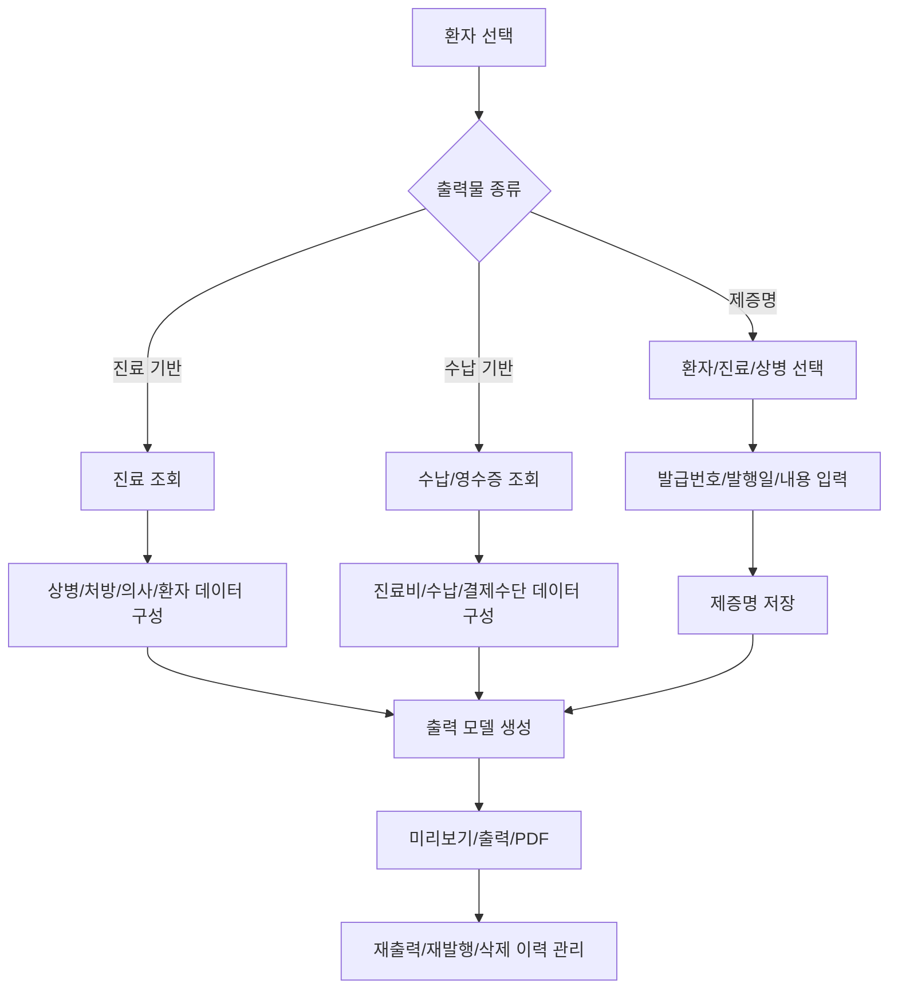
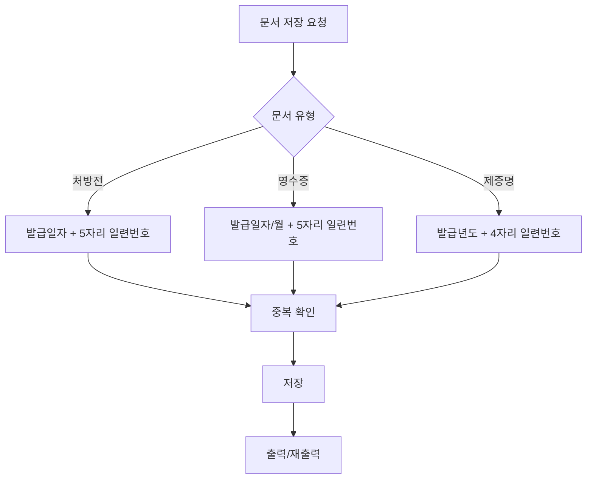
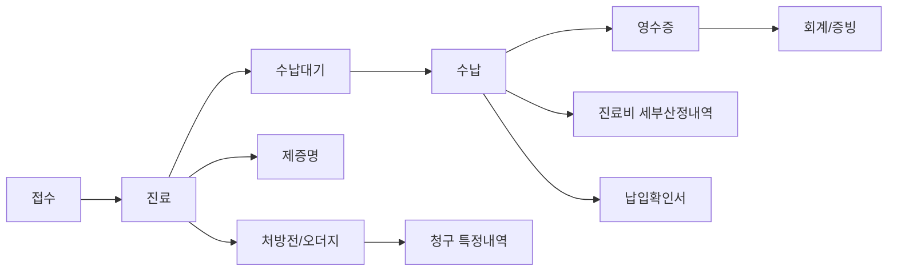
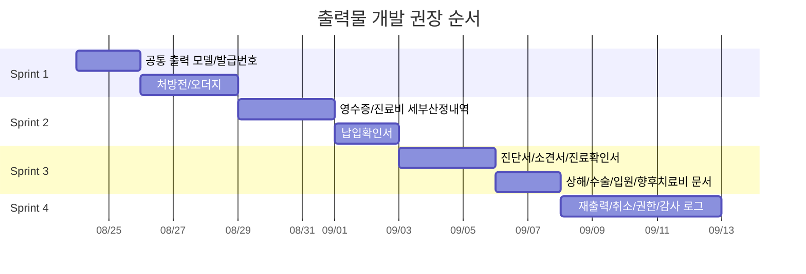

# 출력물 도메인 분석

이 문서는 진료, 처방, 수납 이후 생성되는 출력물과 제증명 문서의 업무 흐름, 저장 필드, 발급번호, 재출력/취소 기준을 개발언어에 종속되지 않는 형태로 정리한다.

## 1. 출력물 분류

출력물은 크게 자동 산출형과 저장 발급형으로 나뉜다.

| 분류 | 출력물 | 특징 |
|---|---|---|
| 진료 기반 자동 산출 | 오더지, 처방전, 영문처방전 | 진료의 상병/처방/의사/환자 정보를 기준으로 생성 |
| 수납 기반 자동 산출 | 영수증, 통합영수증, 진료비 세부산정내역, 진료비 납입확인서 | 수납 이벤트와 진료비 계산 결과를 기준으로 생성 |
| 저장 발급형 제증명 | 진단서, 상해진단서, 소견서, 진료의뢰서, 진료확인서, 입원확인서, 수술확인서, 향후치료비추정서 | 발급번호를 갖고 저장/재발행/삭제 이력이 필요 |
| 통계/보고 출력 | 비급여 보고, 마약류 보고, 청구 결과 출력 | 별도 보고 도메인과 연결 |

## 2. 전체 흐름

## 3. 공통 제증명 필드

진단서류 계열은 공통적으로 발급번호와 환자/의사 정보를 갖는다.

| 필드 | 뜻 | 업무 규칙 |
|---|---|---|
| 발급년도 | 제증명 발급 연도 | 발급번호 앞부분으로 사용한다. |
| 발급번호 | 해당 연도 내 일련번호 | 저장 시 확정하고 중복되면 안 된다. |
| 문서번호 | 발급년도-발급번호 | 예: `2026-0001` 형식으로 표시한다. |
| 환자 | 문서 대상 환자 | 진료에 묶인 문서는 환자 변경을 제한한다. |
| 의사 | 발급 의사 | 면허번호, 진료과, 서명/직인 출력에 사용한다. |
| 내용 | 치료소견, 비고, 의뢰 내용 등 | 문서별 본문 영역에 출력한다. |
| 발행일시 | 실제 발행/저장 시각 | 재발행/감사 추적 기준이다. |
| 진료ID | 연결된 진료 | 진료 기반 문서에서 사용한다. |
| 상병 목록 | 출력할 상병 | 주상병 우선, 부상병은 순번대로 출력한다. |
| 변경검증값 | 저장 충돌 방지값 | 동시 수정 방지에 사용한다. |

## 4. 진료 기반 출력물

### 처방전

처방전은 진료 처방 중 원외 약품과 처방전에 표시해야 하는 일부 원내 주사약을 기준으로 만든다. 자세한 처방전 발급번호 규칙은 `Treatment_Prescription_Domain.md`를 기준으로 한다.

| 필드 | 뜻 | 업무 규칙 |
|---|---|---|
| 처방전ID | 처방전 식별자 | 저장 후 발급 여부 판단에 사용한다. |
| 처방전발급번호 | 발급일자 8자리 + 일련번호 5자리 | DUR, 청구 특정내역, 출력물에서 공통 식별자로 사용한다. |
| 환자 | 이름, 주민번호 등 | 처방전 본문과 QR에 사용한다. |
| 상병 | 분류기호, 상병명 | 설정에 따라 표시 여부가 달라진다. |
| 의사 | 성명, 면허번호 | 처방전 필수 출력 정보다. |
| 처방 목록 | 약품명, 1회량, 1일횟수, 총일수, 용법 | 원외 약품과 표시 대상 원내 주사만 포함한다. |
| 보험 정보 | 보험구분, 의료급여 종별, 보험증번호, 의료급여기관기호 | 처방전/청구 연계 정보다. |
| 조제 참고사항 | 자동/사용자 참고 문구 | 약국 전달 문구로 출력한다. |
| QR 코드 | 처방전 전자 데이터 | 약품, 주사, 용법, 발급번호를 포함한다. |

### 오더지

오더지는 진료실 또는 원무/간호에서 당일 진료 내용을 확인하기 위한 출력물이다.

| 필드 | 뜻 | 업무 규칙 |
|---|---|---|
| 진료일 | 출력 대상 진료일 | 오더지 제목/정렬 기준이다. |
| 환자 | 차트번호, 이름, 성별, 나이 | 접수/시행 부서 확인용이다. |
| 증상 | 진료기록의 증상/메모 | 필요 시 출력한다. |
| 상병 | 주상병명 중심 | 진료 내용 확인용이다. |
| 원내 처방 | 병원 내부 시행/투약 처방 | 원내 영역에 출력한다. |
| 원외 처방 | 약국 조제 처방 | 원외 영역에 출력한다. |
| 원외교부번호 | 처방전 발급번호 | 발급된 처방전이 있으면 표시한다. |

## 5. 수납 기반 출력물

### 영수증

영수증은 수납 이벤트별 출력물이다. 수납액, 결제수단, 진료비 항목 분류가 함께 들어가야 한다.

| 필드 | 뜻 | 업무 규칙 |
|---|---|---|
| 영수증번호 | 발급일자별 일련번호 | 발행 시 확정한다. |
| 수납ID | 해당 수납 이벤트 | 부분수납이면 이벤트별 영수증이 생긴다. |
| 진료비 | 총진료비, 공단부담금, 본인부담금, 비급여 | 수납 시점 재계산 결과를 사용한다. |
| 결제수단 | 카드, 현금, 현금영수증 | 합계가 이번 납부액과 같아야 한다. |
| 미수금 | 이번 수납 후 남은 금액 | 부분수납 표시 기준이다. |
| 영수증 항목 | 진찰료, 투약료, 주사료, 검사료 등 | 법정 항목 분류로 출력한다. |

### 진료비 세부산정내역

| 필드 | 뜻 | 업무 규칙 |
|---|---|---|
| 진료ID | 대상 진료 | 진료 처방 라인을 기준으로 생성한다. |
| 환자 | 차트번호, 이름 | 출력 대상 식별 |
| 진료기간 | 시작/종료일 | 외래는 보통 같은 날짜다. |
| 보험구분 | 건강보험/의료급여/일반 | 비용 계산 기준 표시 |
| 진료비 | 본인부담/공단부담/비급여/지원금 | 수납 계산 서비스와 동일 기준 |
| 처방별 산정내역 | 처방명, 단가, 횟수, 일수, 금액, 본인부담, 청구액 | 환자 설명용 세부 항목 |
| 기타비급여 | 제안금액 차액, 묶음 비급여 | 별도 기타비급여로 보정한다. |

### 진료비 납입확인서

| 필드 | 뜻 | 업무 규칙 |
|---|---|---|
| 환자 | 대상 환자 | 기간별 조회 기준 |
| 진료ID/수납ID | 증빙 대상 | 진료 기준 또는 수납 기준으로 조회 가능해야 한다. |
| 진료일 | 납입 대상 진료일 | 기간 합산 기준 |
| 진료비 | 계산된 진료비 스냅샷 | 납입확인서 금액 표시 |
| 카드/현금/현금영수증 | 납부 수단별 금액 | 세액/연말정산 증빙에 중요 |

## 6. 제증명 문서별 필드

| 문서 | 주요 고유 필드 | 설명 |
|---|---|---|
| 진단서 | 발병일, 진단일, 용도, 비고, 임상적 추정, 최종진단, 발병일 미상, 입원일, 퇴원일 | 일반 진단 사실 증명 |
| 상해진단서 | 발병일, 진단일, 진료기간, 상해원인, 상해부위, 상해소견, 입원필요, 수술여부, 합병증 가능성, 활동 가능, 식사 가능 | 상해/보험 제출용 |
| 소견서 | 발병일, 진단일, 용도, 비고, 임상적 추정, 최종진단, 발병일 미상 | 의학적 소견 전달 |
| 진료의뢰서 | 진료 시작일, 진료 종료일, 내용 | 타 의료기관 의뢰용 |
| 진료확인서 | 진료기간, 실진료일, 용도, 진료과목, 입원일, 퇴원일, 입원기간 | 내원/진료 사실 증명 |
| 입원확인서 | 발병일, 진료기간, 진료일수, 입원 여부, 입원 서식 유형, 임상적 추정/최종진단 | 입원 사실 증명 |
| 수술확인서 | 발병일, 진단일, 진료기간, 수술코드, 용도, 비고 | 수술 사실 증명 |
| 향후치료비추정서 | 용도, 비고, 소요금액 | 예정 치료비 추정 |
| 영문처방전 | 환자, 의사, 진료, 영문 약품명, 발급년도/번호 | 외국어 처방 증빙 |

## 7. 발급번호 규칙

| 문서 | 번호 형식 | 규칙 |
|---|---|---|
| 처방전 | `YYYYMMDD00001` | 발급일자 8자리 + 일련번호 5자리 |
| 영수증 | `발급일자-00001` | 수납 이벤트별 발행 시 확정 |
| 제증명 | `YYYY-0001` | 발급년도 + 4자리 번호 |
| 영문처방전 | 제증명 번호 체계 | 발급년도/번호를 별도 보관 |

## 8. 출력물 생성 시점

| 시점 | 가능 출력물 |
|---|---|
| 진료 중 | 오더지, 임시 처방전, 진료기록 출력 |
| 진료 저장 후 | 확정 처방전, 오더지, 제증명 |
| 수납 후 | 영수증, 진료비 세부산정내역, 납입확인서 |
| 기간 조회 | 납입확인서, 진료비 내역, 통계/보고 출력 |

## 9. 재출력/수정/삭제

| 처리 | 규칙 |
|---|---|
| 재출력 | 기존 발급번호를 유지한다. 출력 횟수나 재출력 로그가 필요할 수 있다. |
| 수정 후 재발행 | 기존 번호를 유지할지 새 번호를 발급할지 문서 유형별 정책을 정해야 한다. |
| 삭제 | 발급번호가 있는 문서는 물리 삭제보다 취소 상태 관리가 안전하다. |
| 진료 연결 문서 수정 | 원 진료의 환자/상병/의사 변경과 충돌하지 않도록 확인한다. |
| 수납 취소 후 영수증 | 수납 이벤트가 취소되면 영수증도 취소 또는 재발행 상태가 되어야 한다. |
| 처방 변경 후 처방전 | 약품 처방 변경 시 처방전/DUR/청구 특정내역을 재검증해야 한다. |

## 10. 개발 순서

| 우선순위 | 개발 범위 | 완료 기준 |
|---|---|---|
| 1 | 공통 발급번호 | 처방전, 영수증, 제증명의 번호 체계를 분리 구현 |
| 2 | 처방전 | 진료 처방 기준 출력 대상 약품과 QR 데이터 생성 |
| 3 | 영수증 | 수납 이벤트별 금액/결제수단/항목 분류 출력 |
| 4 | 진료비 세부산정내역 | 처방 라인별 금액과 본인/공단/비급여 분해 |
| 5 | 납입확인서 | 기간별 수납/진료비 합산 |
| 6 | 기본 제증명 | 진단서, 소견서, 진료확인서 |
| 7 | 확장 제증명 | 상해진단서, 수술확인서, 입원확인서, 향후치료비추정서 |
| 8 | 운영 기능 | 재출력, 취소, 삭제 제한, 권한, 감사 로그 |

## 11. 일별 확인 체크리스트

| 확인 항목 | 확인 내용 |
|---|---|
| 발급번호 | 문서 유형별 번호가 중복 없이 생성되는가 |
| 환자 정보 | 출력물의 환자와 진료/수납 환자가 일치하는가 |
| 의사 정보 | 의사명, 면허번호, 진료과가 정확한가 |
| 상병 | 주상병/부상병 순서와 표시 여부가 맞는가 |
| 처방전 | 원외 약품, 표시 대상 원내 주사, 처방일수, 사용기간이 맞는가 |
| QR | 처방전 발급번호와 약품 데이터가 QR에 반영되는가 |
| 영수증 | 수납액, 결제수단, 미수금, 영수증 항목이 맞는가 |
| 세부산정내역 | 처방 라인별 금액과 영수증 항목 합계가 맞는가 |
| 제증명 | 발병일/진단일/용도/내용/비고 등 문서별 필수값이 저장되는가 |
| 재출력 | 기존 번호 유지 여부와 출력 로그 정책이 맞는가 |
| 취소/삭제 | 수납취소, 진료수정, 문서삭제 시 연결 문서 상태가 맞는가 |

## 12. 테스트 시나리오

| 시나리오 | 기대 결과 |
|---|---|
| 원외 약 처방전 발행 | 발급번호 13자리, 약품 목록, 의사 면허번호, QR 생성 |
| 원내 주사 표시 처방전 | 원내 주사라도 표시 대상이면 처방전에 포함 |
| 처방 변경 후 재출력 | DUR/처방전 번호/청구 특정내역 재검증 필요 |
| 수납 후 영수증 출력 | 수납ID, 영수증번호, 결제수단별 금액 일치 |
| 부분수납 영수증 | 이번 납부액과 남은 미수금 표시 |
| 통합영수증 | 여러 수납 이벤트 합산 금액 표시 |
| 진단서 발급 | 발급년도-번호, 환자, 의사, 상병, 발병일/진단일 저장 |
| 상해진단서 발급 | 상해원인/부위/소견과 활동/식사 가능 여부 저장 |
| 수술확인서 발급 | 수술코드와 진료기간 저장 |
| 영수증 삭제/취소 | 수납 상태와 영수증 상태가 같이 검증됨 |

## 13. 구현 시 주의할 점

| 주의점 | 이유 |
|---|---|
| 출력물은 원본 데이터의 단순 화면이 아니다 | 발급 시점의 스냅샷과 번호가 증빙 효력을 가진다. |
| 문서 유형별 번호 체계를 섞으면 안 된다 | 처방전, 영수증, 제증명의 번호 형식과 사용처가 다르다. |
| 진료 연결 문서는 환자 변경을 제한해야 한다 | 진료와 문서의 환자가 달라지면 법적 문제가 생긴다. |
| 수납 취소 시 영수증 상태도 함께 봐야 한다 | 취소된 수납의 영수증이 유효하면 회계 오류가 난다. |
| 처방전 발급번호는 청구와 연결된다 | 특정내역과 SAM 청구 오류로 이어질 수 있다. |
| 제증명 삭제는 취소 이력으로 남기는 것이 안전하다 | 발급번호 공백과 감사 추적 문제가 생긴다. |
| 출력 템플릿과 데이터 모델을 분리해야 한다 | 같은 데이터가 A4, 영수프린터, PDF 등 여러 형태로 출력된다. |

## 14. 현재 소스 기준 확인 위치

| 영역 | 기준 파일 |
|---|---|
| 제증명 공통 모델 | `Data/UBerSoft.EMR.Data.Models/Reports/ReportBaseCore.cs` |
| 진료 연결 제증명 공통 모델 | `Data/UBerSoft.EMR.Data.Models/Reports/ReportBase.cs` |
| 제증명 공통 화면 규칙 | `Data/UBerSoft.EMR.Data.ViewModels/Reports/ReportViewModelBaseCore.cs` |
| 상병 포함 제증명 화면 규칙 | `Data/UBerSoft.EMR.Data.ViewModels/Reports/ReportViewModelBase.cs` |
| 처방전 출력 모델 | `Data/UBerSoft.EMR.Data.Models/Reports/PrescribeReport.cs` |
| 처방전 화면 규칙 | `Data/UBerSoft.EMR.Data.ViewModels/Reports/PrescribeReportViewModel.cs` |
| 오더지 출력 | `Data/UBerSoft.EMR.Data/Services/OrderReports/Concrete/OrderReportService.cs` |
| 처방전 QR | `Data/UBerSoft.EMR.Data/Services/QrCodes/Concrete/QrCodeService_EDB.cs` |
| 영수증 | `Data/UBerSoft.EMR.Data.Models/Reports/Receipt.cs` |
| 진료비 세부산정내역 | `Data/UBerSoft.EMR.Data.Models/Reports/MedicalCostSpecification.cs` |
| 진료비 납입확인서 | `Data/UBerSoft.EMR.Data.Models/Reports/ConfirmationOfPayment.cs` |
| 진단서 | `Data/UBerSoft.EMR.Data.Models/Reports/DiagnosisReport.cs` |
| 상해진단서 | `Data/UBerSoft.EMR.Data.Models/Reports/DiagnosisOfInjuryReport.cs` |
| 소견서 | `Data/UBerSoft.EMR.Data.Models/Reports/MedicalReferralReport.cs` |
| 진료의뢰서 | `Data/UBerSoft.EMR.Data.Models/Reports/MedicalRequestReport.cs` |
| 진료확인서 | `Data/UBerSoft.EMR.Data.Models/Reports/MedicalConfirmationReport.cs` |
| 입원확인서 | `Data/UBerSoft.EMR.Data.Models/Reports/HospitalizationReport.cs` |
| 수술확인서 | `Data/UBerSoft.EMR.Data.Models/Reports/SurgeryReport.cs` |
| 향후치료비추정서 | `Data/UBerSoft.EMR.Data.Models/Reports/EstimatedTreatmentCostReport.cs` |

