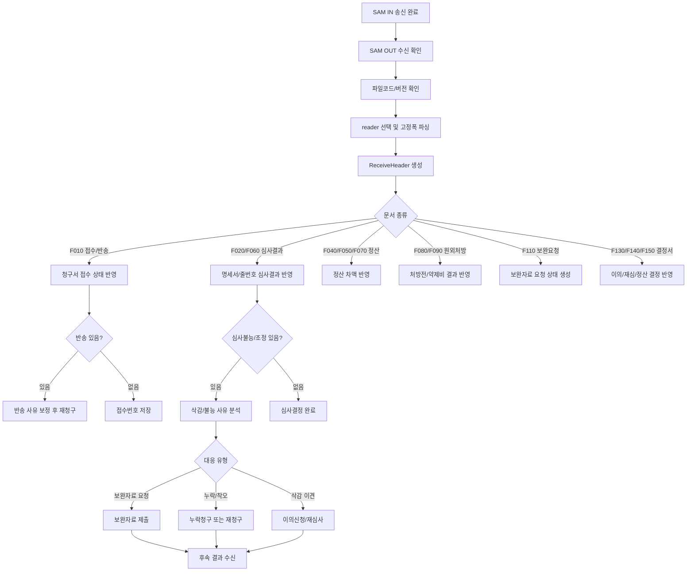
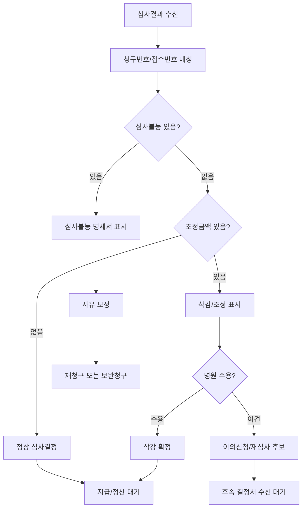
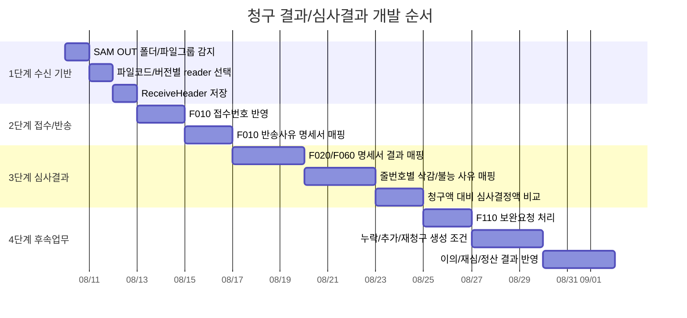

# SAM Claim File Domain

대상: 보험청구 SAM IN/OUT 파일 생성 및 수신 결과 처리  
기준 소스:

- `Data/UBerSoft.EMR.Data/Services/InsuranceCharges/Concrete/BillService.cs`
- `Data/UBerSoft.EMR.Data/Services/InsuranceCharges/Concrete/SAMs/Sends/*.cs`
- `Data/UBerSoft.EMR.Data/Services/InsuranceCharges/Concrete/SAMs/Receives/*.cs`
- `Data/UBerSoft.EMR.Data.Models/InsuranceCharges/Sends/*.cs`

## 1. 목적

SAM 파일은 EMR에서 만든 보험청구 데이터를 HIRA DDMD 청구 프로그램이 요구하는 고정폭 텍스트 형식으로 내보내고, 심평원/중계센터에서 내려온 결과 파일을 다시 읽어 EMR 청구 상태와 심사 결과로 반영하기 위한 산출물이다.

이 문서는 개발팀이 최종 SAM 산출물이 요구하는 입력/출력 필드와 생성 규칙을 이해할 수 있도록 `IN(생성)`과 `OUT(결과 불러오기)`으로 나누어 정리한다.

## 2. 전체 구조

```text
청구 대상 진료
-> 건강보험/의료급여 분리
-> 청구서 Bill 생성
-> 명세서 Specification 생성
-> 상병/진료내역/처방전/특정내역 생성
-> SAM IN 파일 .GHP 생성
-> enc.exe 암호화
-> examsnd.exe 점검/송신
-> SAM OUT 파일 수신
-> 파일 코드/버전별 reader 선택
-> 접수/반송/심사/정산/재청구 결과 파싱
```

## 3. 건강보험과 의료급여 분리 규칙

파일: `BillService.CreateBills`

청구서 생성 시 진료 목록은 `Treatment.MedicalCost.InsurnerType` 기준으로 나뉜다.

| 구분 | 대상 조건 | 청구서 서식 | 명세서 서식 | 보험자종별 코드 | 설명 |
|---|---|---:|---:|---:|---|
| 건강보험 | `InsurnerTypes.건강보험` | `H010` | `H021` | `4` | 건강보험 요양급여비용 심사청구서 |
| 의료급여 | `InsurnerTypes.의료급여` | `H011` | `H031` | `1` | 의료급여비용 심사청구서, 1차 진료 기준 |

생성 규칙:

- 건강보험 진료가 있으면 건강보험 청구서 1건을 만든다.
- 의료급여 진료가 있으면 의료급여 청구서 1건을 만든다.
- 두 유형이 모두 있으면 청구번호를 2개 발급받아 각각 생성한다.
- 청구번호는 `IBillController.GetMaxBillCode(treatmentYM, count)`에서 발급받는다.
- 명세서 일련번호는 `00001`부터 증가한다.

## 4. SAM IN 파일 생성 위치와 파일명

파일: `SAMSendService.cs`

| 항목 | 값/규칙 |
|---|---|
| 생성 폴더 | `C:\hira\DDMD\sam\in` |
| 파일명 | `{BillCode}.GHP` |
| 인코딩 | `Encoding.Default` |
| 파일 생성 후 처리 | `C:\hira\DDMD\bin\enc.exe` 실행 |
| 점검/송신 | `C:\hira\DDMD\bin\examsnd.exe` 실행 |
| 암호화 결과 확인 | `EncResult.txt` 마지막/첫 결과 코드 확인 |
| 점검 결과 확인 | `ExamResult.txt` 마지막 결과 코드 확인 |

상시점검 규칙:

- 데모 사이트, 개발 서버, 요양기관기호가 `0000`으로 시작하는 병원은 상시점검 파일로 생성한다.
- 상시점검 writer는 작성자명을 `상시점검`으로 바꾼다.
- 개발서버에서는 요양기관기호를 테스트용 `12350796`으로 대체한다.

## 5. SAM IN 레코드 구성

현재 writer는 `SAMBillService_091`이 기본이다. `091`은 `090`을 상속하고, `090`은 `089`를 상속한다.

| 레코드 | 내역구분 | 생성 메서드 | 의미 |
|---|---:|---|---|
| 청구서 | 없음 | `Create_BillInternal` | 청구서 헤더와 총금액 |
| 명세서 | `A` | `Create_SpecificationInternal` | 수진자, 보험, 청구금액, 내원/요양급여일수 |
| 상병 | `B` | `Create_Specification_Disease` | 주상병/부상병/배제상병 |
| 진료내역 | `C` | `Create_Specification_Treatment` | 원내 급여 처방/수가/재료 및 퇴장방지 사용장려비 |
| 처방전 | `D` | `Create_Specification_PrescribeReport` | 원외 약품 처방전 내역 |
| 특정내역 | `E` | `Create_Specification_SpecificDetail` | 명세서/줄번호/처방전 단위 특정내역 |

## 6. IN 청구서 레코드 필드

생성 메서드: `SAMBillService_089.Create_BillInternal`

| 순서 | 필드명 | 길이/형식 | 의미 | 생성 규칙 |
|---:|---|---|---|---|
| 1 | Bill.Version | 3, 문자 | 청구서 서식 버전 | 기본 `091` |
| 2 | Specification.Version | 3, 문자 | 명세서 서식 버전 | 첫 명세서 버전 사용 |
| 3 | BillCode | 10, 문자 | 청구번호 | `GetMaxBillCode`에서 발급 |
| 4 | BillFormCode | 4, 문자 | 청구서 서식번호 | 건강보험 `H010`, 의료급여 `H011` |
| 5 | TreatmentAgencyCode | 8, 문자 | 요양기관기호 | 병원 코드, 상시점검 개발서버는 테스트 코드 |
| 6 | ReceiveAgency | 1, 문자 | 수신기관 | 고정 `1` |
| 7 | InsurerType.Code | 1, 문자 | 보험자 종별 | 건강보험 `4`, 의료급여 `1` |
| 8 | ChargeType | 1, 문자 | 청구구분 | 원청구 외 `1`, `2`만 기록, 그 외 공백 |
| 9 | UnitType.Code | 1, 문자 | 청구단위 | 월단위/주단위 코드 |
| 10 | TreatmentType | 1, 문자 | 진료구분 | 기본 `1`, 의과 |
| 11 | TreatmentFieldType | 1, 문자 | 진료분야 | 현재 공백 |
| 12 | TreatmentType2 | 1, 문자 | 진료형태 | 기본 `2`, 의과 외래 |
| 13 | TreatmentYM | 6, 문자 | 진료년월 | 첫 진료일 `yyyyMM` |
| 14 | SpecificationCount | 6, 숫자 | 명세서 건수 | 병합 후 명세서 수 |
| 15 | RecuperationCostAmount1 | 12, 숫자 | 요양급여비용총액1 | 명세서 합계 |
| 16 | PatientMedicalCost | 12, 숫자 | 본인일부부담금 | 명세서 합계 |
| 17 | PatientMedicalCostOver | 12, 숫자 | 본인부담상한액 초과금 | 현재 보통 0 |
| 18 | ChargeAmount | 12, 숫자 | 청구액 | 명세서 합계 |
| 19 | SupportMoney | 12, 숫자 | 지원금 | 희귀난치/긴급복지 등 지원금 합계 |
| 20 | DisabledMedicalCost | 12, 숫자 | 장애인의료비 | 명세서 합계 |
| 21 | RecuperationCostAmount2 | 12, 숫자 | 요양급여비용총액2 | 명세서 합계 |
| 22 | VeteransChargeAmount | 12, 숫자 | 보훈청구액 | 보훈 대상 합계 |
| 23 | PatientMedicalCost100_100 | 12, 숫자 | 100/100 본인부담금 총액 | 명세서 합계 |
| 24 | VeteransPatientMedicalCost | 12, 숫자 | 보훈 본인일부부담금 | 명세서 합계 |
| 25 | AmountUnder100_100 | 12, 숫자 | 100/100 미만 총액 | 명세서 합계 |
| 26 | PatientMedicalCostUnder100_100 | 12, 숫자 | 100/100 미만 본인부담금 | 명세서 합계 |
| 27 | ChargeAmountUnder100_100 | 12, 숫자 | 100/100 미만 청구액 | 명세서 합계 |
| 28 | VeteransChargeAmountUnder100_100 | 12, 숫자 | 100/100 미만 보훈청구액 | 명세서 합계 |
| 29 | 차등수가 코드1 | 4.2, 숫자 | 차등수가 | 현재 0 |
| 30 | 차등수가 코드2 | 2.2, 숫자 | 차등수가 | 현재 0 |
| 31 | 차등수가 코드3 | 1.7, 숫자 | 차등수가 | 현재 0 |
| 32 | 차등수가 금액 | 12, 숫자 | 차등수가 금액 | 현재 0 |
| 33 | ChargeDate | 8, 문자 | 청구일자 | 파일 생성일 `yyyyMMdd` |
| 34 | RepresentativeName | 20, 문자 | 대표자명 | 병원 대표자 |
| 35 | WriterName | 20, 문자 | 작성자명 | 병원 청구 작성자, 상시점검은 `상시점검` |
| 36 | WriterBirthDay | 13, 문자 | 작성자 생년월일 | 병원 설정값 |
| 37 | ApplicationConfirmNumber | 35, 문자 | 검사승인번호 | 병원 설정값 |
| 38 | ProxyChargeCode | 5, 문자 | 대행청구단체 기호 | 병원 대행청구 사용 시 설정 |
| 39 | Note | 1750, 문자 | 참조란 | 청구서 메모 |

## 7. IN 명세서 A 레코드 필드

생성 메서드: `SAMBillService_089.Create_SpecificationInternal`

| 순서 | 필드명 | 길이/형식 | 의미 | 생성 규칙 |
|---:|---|---|---|---|
| 1 | BillCode | 10 | 청구번호 | 상위 청구서 번호 |
| 2 | Sequence | 5 | 명세서 일련번호 | `00001`부터 증가, 병합 후 재부여 |
| 3 | DetailType | 1 | 내역구분 | 고정 `A` |
| 4 | SpecificationFormCode | 4 | 명세서 서식번호 | 건강보험 `H021`, 의료급여 `H031` |
| 5 | TreatmentAgencyCode | 8 | 요양기관기호 | 청구서와 동일 |
| 6 | MedicalAidAgencyCode | 11 | 보장기관기호 | 의료급여만 보험정보에서 세팅 |
| 7 | MedicalAidType.Code | 1 | 의료급여 종별 | 의료급여만 세팅 |
| 8 | GovernmentInjuryType.Code | 1 | 공상등 구분 | 보험 자격/차상위/희귀 기준으로 생성 |
| 9 | FixRateType | 1 | 정액/정률 구분 | 현재 공백 |
| 10 | ChargeType.Code | 1 | 보완/누락 청구구분 | 원청구가 아니면 세팅 |
| 11 | ChargeType.ReceiveNumber | 7 | 접수번호 | 추가/보완/누락청구 시 사용 |
| 12 | ChargeType.SpecificationSequence | 5 | 원 명세서 일련번호 | 추가/보완/누락청구 시 사용 |
| 13 | ChargeType.ReasonCode | 2 | 보완청구 사유코드 | 보완청구 시 사용 |
| 14 | 빈값 | 8 | 예비 | 공백 |
| 15 | Examinee.MemberName | 20 | 세대주 성명 | 보험정보 |
| 16 | Examinee.InsuranceNumber | 20 | 증번호/보험증 번호 | 보험정보 |
| 17 | Examinee.Name | 20 | 수진자 성명 | 환자정보 |
| 18 | Examinee.ResidentNumber | 13 | 수진자 주민번호 | 환자정보 |
| 19 | RecuperationDays | 3 | 요양급여일수 | 원내 처방 기준 최대 투약일수, 일부 외인 시 0 |
| 20 | VisitDays | 3 | 총내원일수 | 기본 1, 특정 상해외인 H/F/I/N/Q는 0 |
| 21 | 빈값 | 31 | 예비 | 공백 |
| 22 | 입원경로 | 2 | 입원경로 | 외래 중심이라 공백 |
| 23 | TreatmentResult.Code | 1 | 진료결과 | 주상병 진료결과, 없으면 `1` |
| 24 | RequestItem.RecuperationCostAmount1 | 10 | 요양급여비용총액1 | 진료비 계산 결과 |
| 25 | RequestItem.PatientMedicalCost | 10 | 본인일부부담금 | 진료비 계산 결과 |
| 26 | RequestItem.PatientMedicalCostOver | 10 | 본인부담상한액 초과금 | 현재 대체로 0 |
| 27 | RequestItem.ChargeAmount | 10 | 청구액 | 진료비 계산 결과 |
| 28 | RequestItem.SupportMoney | 10 | 지원금 | 진료비 계산 결과 |
| 29 | RequestItem.DisabledMedicalCost | 10 | 장애인의료비 | 진료비 계산 결과 |
| 30 | 대불금 | 10 | 대불금 | 현재 0 |
| 31 | RequestItem.RecuperationCostAmount2 | 10 | 요양급여비용총액2 | 진료비 계산 결과 |
| 32 | RequestItem.VeteransChargeAmount | 10 | 보훈청구액 | 진료비 계산 결과 |
| 33 | 빈값 | 20 | 예비 | 공백 |
| 34 | RequestItem.PatientMedicalCost100_100 | 10 | 100/100 본인부담금 | 진료비 계산 결과 |
| 35 | RequestItem.VeteransPatientMedicalCost | 10 | 보훈 본인부담금 | 진료비 계산 결과 |
| 36 | RequestItem.AmountUnder100_100 | 10 | 100/100 미만 총액 | 진료비 계산 결과 |
| 37 | RequestItem.PatientMedicalCostUnder100_100 | 10 | 100/100 미만 본인부담금 | 진료비 계산 결과 |
| 38 | RequestItem.ChargeAmountUnder100_100 | 10 | 100/100 미만 청구액 | 진료비 계산 결과 |
| 39 | RequestItem.VeteransChargeAmountUnder100_100 | 10 | 100/100 미만 보훈청구액 | 진료비 계산 결과 |

## 8. IN 상병 B 레코드 필드

생성 메서드: `Create_Specification_Disease`

| 순서 | 필드명 | 길이/형식 | 의미 | 생성 규칙 |
|---:|---|---|---|---|
| 1 | BillCode | 10 | 청구번호 | 상위 청구서 |
| 2 | SpecificationSequence | 5 | 명세서 일련번호 | 상위 명세서 |
| 3 | DetailType | 1 | 내역구분 | 고정 `B` |
| 4 | DiseaseDivisionType | 1 | 상병분류구분 | 주상병 `1`, 부상병 `2`, 배제상병 `3` |
| 5 | DiseaseCode | 6 | 상병분류기호 | 진료 상병 코드 |
| 6 | Department.Code | 2 | 진료과목 | 진료 상병 진료과 |
| 7 | 빈값 | 2 | 예비 | 공백 |
| 8 | VisitDate | 8 | 내원일자 | 진료일 `yyyyMMdd` |
| 9 | 고정값 | 1 | 사용구분 | 고정 `1` |
| 10 | LicenseNumber | 10 | 면허번호 | 주상병만, 상병 면허번호 없으면 담당의 면허번호 |
| 11 | 빈값 | 32 | 예비 | 공백 |

상병 생성 규칙:

- 주상병, 일반 상병, 배제상병 순서로 정렬한다.
- 같은 상병코드는 중복 생성하지 않는다.
- 주상병만 면허번호를 기록한다.

## 9. IN 진료내역 C 레코드 필드

생성 메서드: `SAMBillService_091.Create_Specification_Treatment`

| 순서 | 필드명 | 길이/형식 | 의미 | 생성 규칙 |
|---:|---|---|---|---|
| 1 | BillCode | 10 | 청구번호 | 상위 청구서 |
| 2 | SpecificationSequence | 5 | 명세서 일련번호 | 상위 명세서 |
| 3 | DetailType | 1 | 내역구분 | 고정 `C` |
| 4 | ClauseCode.Code | 2 | 항번호 | 처방 항번호, 본인부담률 코드면 보험청구용 항번호로 변환 |
| 5 | ItemCode.Code | 2 | 목번호 | 처방 목번호, 본인부담률 코드면 약품/재료/행위별 `01/02/03` |
| 6 | LineNumber | 4 | 줄번호 | 원내 급여 처방 순번 |
| 7 | PrescribeType | 1 | 코드구분 | 약품/수가/재료 등 유형, SelfDrug는 `4`로 변환 |
| 8 | PrescribeCode | 9 | 진료 코드 | 처방 마스터 코드 |
| 9 | Price | 10.2 | 단가 | `091`부터 정수부 10자리, 이전 `089`는 8자리 |
| 10 | OneDay | 5.2 | 1일 투여횟수 | 소수 2자리 |
| 11 | TotalDays | 3 | 총투약일수 | 처방 총일수 |
| 12 | OneTime | 5.4 | 1회 투약량 | 소수 4자리 |
| 13 | Amount | 10 | 금액 | 라인 금액 |
| 14 | 빈값 | 20 | 예비 | 공백 |
| 15 | ChangeDate | 8 | 변경일 | 있으면 `yyyyMMdd` |
| 16 | 고정값 | 1 | 사용구분 | 고정 `1` |
| 17 | LicenseNumber | 100 | 면허번호 | 필수 면허번호 대상이면 담당의 면허번호 보완 |
| 18 | 빈값 | 32 | 예비 | 공백 |

C 레코드 대상:

- 원내(`!OutClinic`)이고 급여(`IsInsurance`)인 처방.
- 원외 약품 중 퇴장방지의약품 사용장려비 청구 대상은 별도 C 레코드로 추가한다.

면허번호 필수 보완 규칙:

- 진료행위 중 항번호 `01` 기본진료료, `05` 마취료는 면허번호 필수.
- 항번호 `09` 검사료는 위탁검사가 아니면 면허번호 필수.
- 처방 라인 면허번호가 비어 있으면 담당의 면허번호로 보완한다.

## 10. IN 처방전 D 레코드 필드

생성 메서드: `Create_Specification_PrescribeReport`

| 순서 | 필드명 | 길이/형식 | 의미 | 생성 규칙 |
|---:|---|---|---|---|
| 1 | BillCode | 10 | 청구번호 | 상위 청구서 |
| 2 | SpecificationSequence | 5 | 명세서 일련번호 | 상위 명세서 |
| 3 | DetailType | 1 | 내역구분 | 고정 `D` |
| 4 | IssuedNumber | 13 | 처방전 발급번호 | 진료 처방전 번호 |
| 5 | PrescribeDays | 3 | 처방일수 | 처방전 일수 |
| 6 | 고정값 | 2 | 예비/구분 | 현재 0 |
| 7 | LineNumber | 4 | 줄번호 | 원외 약품 순번 |
| 8 | PrescribeType | 1 | 코드구분 | 약품/원료약/일반명 계열 |
| 9 | DrugCode | 9 | 약품 코드 | 처방 약품 코드 |
| 10 | OneTime | 5.4 | 1회 투약량 | 소수 4자리 |
| 11 | OneDay | 2 | 1일 투약횟수 | 정수 |
| 12 | TotalDays | 3 | 총투약일수 | 처방 총일수 |
| 13 | PatientPayCode | 1 | 본인부담률 구분코드 | `090`부터 추가, 선별/100/비급여 등 본인부담률 코드 |

D 레코드 대상:

- 원외(`OutClinic`)이고 약품(`IsDrug`)인 처방.

본인부담률 코드:

- 처방 PayType이 본인부담률 코드이면 보험청구용 코드로 변환한다.
- 주석상 코드 의미:
  - `A`: 50%
  - `B`: 80%
  - `D`: 30%
  - `E`: 90%
  - `U`: 건강보험/의료급여 100/100
  - `V`: 보훈 등 100/100
  - `W`: 비급여

## 11. IN 특정내역 E 레코드 필드

생성 메서드: `Create_Specification_SpecificDetail`

| 순서 | 필드명 | 길이/형식 | 의미 | 생성 규칙 |
|---:|---|---|---|---|
| 1 | BillCode | 10 | 청구번호 | 상위 청구서 |
| 2 | SpecificationSequence | 5 | 명세서 일련번호 | 상위 명세서 |
| 3 | DetailType | 1 | 내역구분 | 고정 `E` |
| 4 | SpecificCodeType.Code | 1 | 발생단위 구분 | 명세서/줄번호/처방전 단위 |
| 5 | PrescribeReportIssuedNumber | 13 | 처방전 발급번호 | 처방전 단위이면 세팅 |
| 6 | LineNumber | 4 | 줄번호 | 줄번호 단위이면 세팅 |
| 7 | SpecificCode | 5 | 특정내역 코드 | 예: `MT002`, `JS002` |
| 8 | SpecificDetail | 700 | 특정내역 | 코드별 상세값 |

발생단위 규칙:

- `1`: 명세서 단위.
- `2`: 진료내역 줄번호 단위.
- `3`: 처방내역 줄번호 단위.
- `4`: 처방전 단위.
- 수동 특정내역이 줄번호 단위(`2`/`3`)이면 원내/원외 여부에 따라 `2` 또는 `3`으로 재결정한다.
- 처방전 단위(`3`/`4`)이면 처방전 발급번호를 기록한다.

자동 생성되는 주요 특정내역:

| 코드 | 뜻 | 생성 조건/값 |
|---|---|---|
| `MS001` | 원내투약일수 | 원내 경구/외용 약품이 있으면 최대 총일수 3자리 |
| `MS002` | 원내투약일수 | 원내 주사 약품이 있으면 최대 총일수 3자리 |
| `MT001` | 상해외인 | 주상병의 상해외인 코드 |
| `MT002` | 특정기호 | 주상병 특정기호, 방문진료 `IA00*` 있으면 `S017` 추가 |
| `MT014` | 산정특례 등록번호 | 중증/희귀/결핵/잠복결핵 대상이고 등록번호가 있으면 기록 |
| `MT018` | 의료급여 본인부담 구분코드 | 의료급여 본인부담 코드 |
| `MT019` | 의료급여 진료확인번호 | 의료급여 진료확인번호 |
| `MT020` | 원내직접조제 | 의료급여/차상위성 조건에서 원내직접조제 최대일수 |
| `MT028` | 산정특례 대상 세부 상병명 | 대상 상병 코드/명칭을 `상병코드/상병명` 형식 |
| `MT043` | 코로나 한시 특정내역 | 2022-07-11 이전 특정 코로나 관련 코드 조건 |
| `MT051` | 조산아 등록번호 | 조산아 특정기호 대상 등록번호 |
| `MT052` | 중증치매 | `V810`, `V811` 대상 |
| `MX999` | 기타 | 명세서 메모 또는 코로나 재택치료 메모 |
| `JS002` | 줄번호 단위 예외의약품 | 원내 약품 예외코드 또는 퇴장방지 `99` |
| `JS005`~`JS008` | 위탁/공동이용/개방/의뢰 | 위탁검사 수탁기관 코드/의뢰일자 |
| `JS010` | 야간/응급 가산 | 야간/응급 코드 대상, 진료일시 |
| `JT999` | 선별급여 처방전 | 원외 선별급여 약품, 본인부담률 3자리 |
| `JS013` | 초음파 | 수동 특정내역 detail에 처방코드 앞 5자리를 format 적용 |

## 12. 명세서 병합 생성 규칙

파일: `BillService.UnionSpecification`

동일 수진자 명세서는 다음 기준으로 그룹화하여 병합한다.

```text
보험증번호 + 세대주명 + 수진자명 + 주민번호 + 내원일 + 주상병 진료과
```

병합 제외:

- 그룹 내 명세서 중 상해외인 특정내역 `MT001`이 있으면 병합하지 않는다.

병합 시 처리:

- 진찰료가 있는 명세서만 주상병을 유지하고, 그 외 명세서 주상병은 부상병으로 전환한다.
- 상병은 중복 상병코드를 제외하고 합친다.
- 진료내역/처방전은 줄번호를 재부여한다.
- 줄번호 단위 특정내역도 새 줄번호에 맞춰 이동한다.
- 의료급여 또는 차상위성 구분이면 `MT040` 본인부담 발생횟수를 추가한다.
- 금액은 단순 합산하지 않고 `AmountService.CalculateSpecification`으로 재계산한다.

## 13. 추가/누락/보완 청구 생성 규칙

파일: `BillService.SubtractBill`

추가청구/누락청구는 기존 청구서와 현재 청구서를 비교한다.

규칙:

- 보험자종별이 다르면 비교하지 않는다.
- 같은 `TreatmentId`의 명세서를 찾아 금액과 처방을 차감한다.
- 기존 청구와 완전히 같은 처방/처방전은 제거한다.
- 수량/횟수/일수 차이가 있으면 차이만 남긴다.
- 남은 처방이 없고 청구액이 0 이하이면 명세서를 제거한다.
- 추가청구이면 원 명세서 일련번호와 접수번호를 `SpecificationChargeType`에 기록한다.
- 최종 청구서 금액과 명세서 순번을 다시 계산한다.

## 14. SAM OUT 수신 구조

파일: `SAMReceiveService.cs`

| 항목 | 값/규칙 |
|---|---|
| 수신 폴더 | `C:\hira\DDMD\sam\out` |
| 파일 그룹 기준 | 확장자를 제외한 파일명이 4자리인 파일 묶음 |
| 버전 판별 | `{code}.1` 파일 첫 3바이트 |
| reader 선택 | `{파일코드},{버전}` 이름으로 Unity resolve |
| 인코딩 | `Encoding.Default` |
| 최종 모델 | `ReceiveHeaderViewModel`의 `ReceiveData`에 문서별 모델 저장 |

수신 reader 등록 목록:

| 파일코드/버전 | 의미 |
|---|---|
| `F010,062` | 접수/반송증 |
| `F020,088`, `F020,091` | 요양급여비용 심사결과통보서 |
| `F060,089`, `F060,091` | 의료급여비용 심사결과통보서 |
| `F110,M` | 보완자료 요청 내역서 |
| `F090,088`, `F090,090` | 원외처방약제비 심사결과통보서 |
| `F080,088`, `F080,090` | 원외처방약제비 심사결과 추가 통보서 |
| `F040,088`, `F040,091` | 요양급여비용 정산심사내역서 |
| `F050,089`, `F050,091` | 의료급여비용 정산심사내역서 |
| `F070,088`, `F070,090` | 원외처방약제비 정산심사내역서 |
| `F130,085` | 이의신청 결정서 |
| `F140,085` | 재심사조정청구 결정서 |
| `F150,085` | 정산심사 결정서 |

## 15. OUT F010 접수/반송증 상세 필드

reader: `F010_062_ReceiveService`

필수 파일:

- `F010.1`
- `F010.2`
- `F010.3`

`F010.1`: 문서 헤더

| 위치 | 길이 | 필드명 | 뜻 |
|---:|---:|---|---|
| 1 | 3 | Version | 버전 |
| 4 | 1 | RequestType.Code | 요청/문서 구분 |
| 5 | 8 | ReceiveDate | 접수일자 |
| 17 | 8 | RecuperationAgencyCode | 요양기관기호 |
| 25 | 2 | AreaInsuranceReviewAgency.Code | 심사평가원 지원 코드 |
| 27 | 3500 | Note | 비고 |

`F010.2`: 접수/반송 청구서 단위

| 위치 | 길이 | 필드명 | 뜻 |
|---:|---:|---|---|
| 1 | 1 | RequestType.Code | 요청/문서 구분 |
| 2 | 8 | ReceiveDate | 접수일자 |
| 10 | 3 | FillingReceiptType.Code | 접수증 유형 |
| 13 | 7 | ReceiveNumber | 접수번호 |
| 20 | 1 | InsurerType.Code | 보험자종별 |
| 21 | 12 | NoticeNumber | 통보서 번호 |
| 33 | 8 | CommissionedAgencyCode | 수탁/대행 기관기호 |
| 41 | 1 | ReceiveType.Code | 접수/반송 구분 |
| 42 | 6 | Count | 명세서 건수 |
| 48 | 12 | ChargeAmount | 청구액 |
| 60 | 6 | TreatmentYM | 진료년월 |
| 66 | 1 | ChargeType.Code | 청구구분 |

`F010.3`: 명세서별 반송/사유

| 위치 | 길이 | 필드명 | 뜻 |
|---:|---:|---|---|
| 10 | 12 | NoticeNumber | 통보서 번호 |
| 22 | 5 | SpecificationSequence | 명세서 일련번호 |
| 27 | 70 | ReasonCode.Code | 반송/오류 사유 |
| 97 | 35 | Note | 비고 |

## 16. OUT F020 건강보험 심사결과 상세 필드군

reader: `F020_091_ReceiveService`는 `F020_088_ReceiveService`를 상속하고, `F020.3`, `F020.8`의 단가 길이만 091 규격으로 확장한다.

필수 파일:

- `F020.1`, `F020.2`, `F020.3`, `F020.4`, `F020.5`, `F020.6`, `F020.8`, `F020.9`
- 코드에서는 총 9개 파일 존재를 검사한다.

`F020.1`: 통보서 헤더

| 위치 | 길이 | 필드명 | 뜻 |
|---:|---:|---|---|
| 1 | 3 | Version | 버전 |
| 4 | 8 | ClassNumber | 분류번호 |
| 16 | 8 | NoticeDate | 통보일자 |
| 24 | 8 | RecuperationAgencyCode | 요양기관기호 |
| 32 | 2 | AreaInsuranceReviewAgency.Code | 심평원 지원 |
| 34 | 7 | ReceiveNumber | 접수번호 |
| 41 | 5 | BundleNumber | 묶음번호 |
| 46 | 3 | FillingReceiptSequence | 접수일련번호 |
| 49 | 10 | BillCode | 청구번호 |
| 59 | 8 | FromTreatmentDate | 진료시작일 |
| 67 | 8 | ToTreatmentDate | 진료종료일 |
| 75 | 1 | InsurerType.Code | 보험자종별 |
| 76 | 35 | Sender | 발신자 |
| 111 | 35 | HandleDivision | 담당부서 |
| 146 | 35 | HandlerName | 담당자 |
| 181 | 20 | Telephone | 전화번호 |
| 201 | 1750 | Note | 비고 |

`F020.2`: 명세서별 청구/심사 결정

핵심 필드:

- 명세서 식별: `SpecificationSequence`, `ExamineeName`, `InsuranceNumber`.
- 환급/추가금: `Refund.*`, `Addition.*`, `RefundAmount`, `AdditionAmount`.
- 청구사항: `RequestItem.*`.
- 심사결정사항: `ReviewResultItem.*`.
- 내원/요양급여일수: `VisitDays`, `RecuperationDays`.
- 처방전 수: `PrescribesReportCount`.
- 처리정보: `HandleGroup`, `SpecificCode`, `DiseaseCode`, `Note`.

대표 금액 필드:

| 필드명 | 뜻 |
|---|---|
| RequestItem.RecuperationCostAmount1 | 청구한 요양급여비용총액1 |
| RequestItem.PatientMedicalCost | 청구한 본인일부부담금 |
| RequestItem.ChargeAmount | 청구액 |
| RequestItem.SupportMoney | 지원금 |
| RequestItem.DisabledMedicalCost | 장애인의료비 |
| RequestItem.RecuperationCostAmount2 | 청구한 요양급여비용총액2 |
| RequestItem.PatientMedicalCost100_100 | 100/100 본인부담금 |
| RequestItem.AmountUnder100_100 | 100/100 미만 총액 |
| ReviewResultItem.RecuperationCostAmount1 | 심사결정 요양급여비용총액1 |
| ReviewResultItem.PatientMedicalCost | 심사결정 본인부담금 |
| ReviewResultItem.ChargeAmount | 심사결정 보험자부담/청구 인정액 |
| ReviewResultItem.ReviewCost | 심사조정액 |
| ReviewResultItem.CommissionedCost | 위탁검사 비용 |

`F020.3`: 진료내역 심사결과

| 위치 | 길이 | 필드명 | 뜻 |
|---:|---:|---|---|
| 34 | 5 | SpecificationSequence | 명세서 일련번호 |
| 39 | 4 | LineNumber | 줄번호 |
| 44 | 9 | Code | 진료/처방 코드 |
| 53 | 10.2 | Price | 단가, 091 기준 |
| 65 | 5.2 | OneDay | 1일 횟수 |
| 72 | 3 | TotalDays | 총일수 |
| 75 | 5.4 | OneTime | 1회량 |
| 104 | 2 | ReasonCode.Code | 조정사유 |
| 106 | 2 | ReasonDetailCode.Code | 세부사유 |
| 108 | 2 | InabilityReasonCode.Code | 심사불능 사유 |
| 110 | 10 | ModifyMoney | 조정금액 |
| 122 | 1750 | Note | 비고 |

`F020.4`: 청구서 총액 대 심사결정 총액

필드군:

- 청구 명세서 건수와 청구 금액 합계.
- 심사결정 건수와 심사결정 금액 합계.
- 환급/추가 금액.
- 심사불능 건수/금액.
- 조정 건수/금액.

`F020.5`: 위탁검사 내역

| 필드명 | 뜻 |
|---|---|
| SpecificationSequence | 명세서 일련번호 |
| LineNumber | 줄번호 |
| ConsignmentCode | 수탁기관기호 |
| CommissionedCost | 위탁검사 비용 |
| Note | 비고 |

`F020.6`: 원외 처방전 심사결과

| 필드명 | 뜻 |
|---|---|
| SpecificationSequence | 명세서 일련번호 |
| PrescribeReportIssuedNumber | 처방전 발급번호 |
| LineNumber | 처방전 줄번호 |
| AcceptCount | 인정 수량 |
| ReasonCode.Code | 사유코드 |
| Note | 비고 |

`F020.8`: 진료내역 조정 상세

- `F020.3`과 유사하지만 조정사유 3자리와 조정 후 코드/단가/수량/금액을 읽는다.
- 091 기준 단가는 10.2 자리이다.

`F020.9`: 처방전 조정 상세

- 처방전 발급번호, 줄번호, 조정사유, 인정수량, 비고를 읽는다.

## 17. OUT F060 의료급여 심사결과 상세 필드군

reader: `F060_091_ReceiveService`

F060은 의료급여 심사결과이며 F020과 구조는 유사하지만 의료급여 전용 필드가 추가된다.

필수 파일:

- `F060.1`, `F060.2`, `F060.3`, `F060.4`, `F060.6`, `F060.7`, `F060.8`
- 코드에서는 총 8개 파일 존재를 검사한다.

의료급여 명세서 전용 필드:

| 필드명 | 뜻 |
|---|---|
| SecurityAgencyCode | 보장기관기호 |
| HouseHolderName | 세대주명 |
| MedicalAidType.Code | 의료급여 종별 |
| ExamineeResidentNumber | 수진자 주민번호 |
| MedicalAidDivition.Code | 의료급여 구분 |
| PatientMedicalCostCode | 의료급여 본인부담 코드 |
| DirectMadicine | 원내직접조제 관련 일수/값 |
| InsteadMoney | 대불금 |
| ConfirmExamineeCount | 수진자 확인 관련 건수 |

F060.3/F060.7의 091 변경:

- 진료내역 단가 필드는 091에서 10.2 자리로 확장된다.
- 조정 상세도 091에서 10.2 자리 단가를 읽는다.

## 18. OUT 정산/재심/이의신청 파일군

| 파일코드 | 문서 | 핵심 처리 |
|---|---|---|
| `F040` | 건강보험 정산심사내역서 | 이전 심사결정사항과 정산심사결정사항을 비교, 진료내역/본인부담 조정 |
| `F050` | 의료급여 정산심사내역서 | F040과 유사, 의료급여 전용 식별자 사용 |
| `F070` | 원외처방약제비 정산심사내역서 | 원외처방 약제비 정산 결과 |
| `F080` | 원외처방약제비 심사결과 추가 통보서 | 원외처방 추가 심사 결과 |
| `F090` | 원외처방약제비 심사결과통보서 | 원외처방 심사 결과 |
| `F110` | 보완자료 요청내역서 | 보완자료 요청 정보 |
| `F130` | 이의신청 결정서 | 이의신청 결정 결과 |
| `F140` | 재심사조정청구 결정서 | 재심사조정청구 결정 결과 |
| `F150` | 정산심사 결정서 | 정산심사 결정 결과 |

정산 파일의 핵심 필드군:

- 정산 연결번호.
- 정산 일련번호.
- 명세서 일련번호.
- 줄번호.
- 이전 심사결정 사유/코드/단가/수량/금액.
- 정산 심사결정 사유/코드/단가/수량/금액.
- 비고.

## 19. 개발 시 구현 기준

### IN 생성 구현 기준

- 고정폭 레코드 writer를 명시적으로 둔다.
- 레코드별 필드 순서를 테스트로 고정한다.
- 숫자/문자 정렬, zero padding, 소수 자리 처리를 공통 helper로 처리한다.
- 건강보험/의료급여 분리는 청구서 생성 전에 끝낸다.
- 진료비 계산 결과를 명세서 `RequestItem`으로 복사한 뒤 SAM을 만든다.
- 명세서 병합 후에는 반드시 금액을 재계산한다.
- 추가/누락/보완 청구는 기존 청구와 비교해 차이만 생성한다.

### OUT 수신 구현 기준

- 파일명 4자리 코드와 버전으로 reader를 선택한다.
- 파일 묶음 개수 검사를 먼저 한다.
- 수신 파일은 고정폭 position 기반으로 파싱한다.
- 청구번호, 접수번호, 명세서 일련번호, 줄번호를 기준으로 기존 청구 데이터와 매칭한다.
- 원문 파일 또는 파싱 전 텍스트를 보관하는 정책이 필요하다.
- 반송/삭감/심사불능/보완요청은 진료, 명세서, 처방 줄번호 단위로 추적할 수 있어야 한다.

## 20. 개발팀에 보여줘야 할 최종 산출물 관점

SAM IN이 요구하는 최종 데이터는 단순 청구 금액이 아니라 다음 묶음이다.

```text
청구서 총괄
-> 명세서별 수진자/보험/금액
-> 명세서별 상병
-> 명세서별 원내 급여 진료내역
-> 명세서별 원외 처방전 내역
-> 명세서/줄번호/처방전별 특정내역
```

SAM OUT이 돌려주는 최종 데이터는 다음 묶음이다.

```text
접수/반송 여부
-> 명세서별 심사결정 금액
-> 줄번호별 조정/삭감/심사불능 사유
-> 처방전별 인정수량/조정사유
-> 청구서 총액 대비 결정 총액
-> 보완/재청구/이의신청 필요 여부
```

따라서 새 시스템에서 SAM을 구현하려면 먼저 다음 데이터가 안정적으로 존재해야 한다.

- 환자 식별정보.
- 진료일 기준 보험자격.
- 주상병과 특정기호.
- 원내/원외 처방 구분.
- 처방 라인별 코드, 단가, 수량, 일수, 금액.
- 본인부담/청구액 계산 결과.
- 처방전 발급번호.
- 명세서별 특정내역.
- 청구번호와 명세서 일련번호.

## 21. 청구 결과/심사결과 운영 흐름

SAM OUT 수신은 단순 파일 읽기가 아니라 청구 업무 상태를 다음 단계로 이동시키는 작업이다.



## 22. 수신문서 공통 관리 필드

모든 OUT 문서는 수신 헤더를 먼저 만들고, 실제 문서 본문을 1건 연결한다.

| 필드 | 뜻 | 업무 규칙 |
|---|---|---|
| 문서코드 | `F010`, `F020` 등 수신문서 종류 | 파일명 4자리 코드로 결정한다. |
| 수신헤더ID | EMR 내부 수신문서 식별자 | 같은 문서를 중복 저장하지 않도록 문서별 PK와 함께 관리한다. |
| 청구구분 | 실청구, 사전점검, 청구 S/W 검사, 개발서버 | 운영/테스트 결과를 섞지 않는다. |
| 수신일시 | EMR이 파일을 읽은 시각 | 업무 처리일과 감사 추적 기준이다. |
| 데이터센터 도착일시 | 중계센터 도착 시각 | 데이터센터 연계 수신 시 중복 수신 방지 기준이다. |
| 수신본문 | 실제 파싱된 통보서 | 문서코드별 모델로 저장한다. |
| 생성일시 | EMR 저장 시각 | 재수신/중복 처리 판단에 사용한다. |

문서 중복 판단은 문서별 고유키로 처리한다. 예를 들어 접수/반송증은 신청구분과 접수일자, 청구서 단위는 통보번호, 심사결과는 심사차수/접수번호/묶음번호/청구서일련번호/청구번호 조합을 사용한다.

## 23. 접수/반송증 업무 반영

`F010`은 청구 파일이 심사기관에 접수되었는지, 또는 접수 전에 반송되었는지를 알려준다.

| 파일 | 단위 | 핵심 필드 | 업무 반영 |
|---|---|---|---|
| `F010.1` | 문서 헤더 | 신청구분, 접수일자, 요양기관기호, 지원, 참조 | 수신 문서의 기본 정보로 저장한다. |
| `F010.2` | 청구서 단위 | 접수/반송 구분, 접수번호, 보험자종별, 통보번호, 접수구분, 건수, 청구액, 진료년월, 청구구분 | 청구서의 접수번호와 접수/반송 상태를 반영한다. |
| `F010.3` | 명세서 단위 | 명세서 일련번호, 사유코드, 비고 | 반송된 명세서의 사유를 저장하고 재청구 보정 대상에 올린다. |

| 상태 | 판단 기준 | 후속 처리 |
|---|---|---|
| 접수완료 | `F010.2` 접수/반송 구분이 접수 | 청구서에 접수번호를 저장하고 심사결과 수신 대기 상태로 둔다. |
| 반송 | `F010.2` 접수/반송 구분이 반송 | `F010.3` 사유코드를 명세서별로 매핑하고 보정 후 재청구한다. |
| 일부 반송 | 청구서 또는 명세서 일부만 사유가 내려옴 | 접수된 건과 반송된 건을 분리해 처리한다. |

반송은 심사결과가 아니라 접수 이전 오류에 가깝다. 따라서 삭감/이의신청으로 처리하지 말고, 원청구 자료를 보정한 뒤 재송신 또는 재청구 흐름으로 보내야 한다.

## 24. 심사결과 업무 반영

건강보험 심사결과는 `F020`, 의료급여 심사결과는 `F060`으로 수신된다. 구조는 유사하지만 의료급여에는 보장기관, 세대주, 의료급여 종별, 대불금, 수진자 확인 관련 필드가 추가된다.

### 심사결과 헤더

| 필드 | 뜻 | 업무 규칙 |
|---|---|---|
| 서식버전 | 심사결과 서식 버전 | reader 선택 및 필드 길이 판단에 사용한다. |
| 심사차수 | 심사 차수 | 같은 접수번호라도 차수가 다르면 별도 결과로 관리한다. |
| 통보일자 | 심사결과 통보일 | 결과 확정일이다. |
| 요양기관기호 | 병원 식별값 | 청구 병원과 일치해야 한다. |
| 지원 | 심사 지원 | 지역/기관별 수신 관리에 사용한다. |
| 접수번호 | F010에서 받은 접수번호 | 원청구와 매칭하는 핵심 키다. |
| 묶음번호 | 심사 묶음 번호 | 심사결과 문서 식별에 사용한다. |
| 청구서일련번호 | 청구서 단위 식별 | 청구서 매칭에 사용한다. |
| 청구번호 | EMR 청구번호 | 내부 청구서와 직접 연결한다. |
| 진료기간 | 심사 대상 진료 시작/종료일 | 청구 진료기간 검증에 사용한다. |
| 담당부/담당자/전화번호 | 심사 담당 정보 | 보완, 이의신청 문의에 사용한다. |

### 명세서 단위 심사결과

| 필드 | 뜻 | 업무 규칙 |
|---|---|---|
| 명세서 일련번호 | 청구 당시 명세서 번호 | 개별 진료/환자와 매칭한다. |
| 수진자성명 | 수진자 이름 | 매칭 검증 보조값이다. |
| 진료형태 | 입원/외래 등 | 원청구와 비교한다. |
| 증번호 | 보험증 또는 의료급여 증번호 | 수진자 자격 오류 분석에 사용한다. |
| 청구사항 | EMR이 청구한 금액 묶음 | 심사결정사항과 비교한다. |
| 심사결정사항 | 심사기관이 인정한 금액 묶음 | 지급 예상액, 삭감액 산정에 사용한다. |
| 정액/정률 구분 | 본인부담 산정 방식 | 환급/추가부담 판단에 사용한다. |
| 초진/재진 금액과 횟수 | 진찰료 심사 결과 | 진찰료 삭감 분석에 사용한다. |
| 내원일수/요양급여일수 | 심사 인정 일수 | 청구 일수 오류 분석에 사용한다. |
| 처방전 발행횟수 | 심사 인정 처방전 수 | 원외처방 결과와 연결한다. |
| 요양개시일 | 진료 개시일 | 원청구 진료일과 비교한다. |
| 주상병분류기호 | 심사 기준 상병 | 상병 누락/착오 분석에 사용한다. |
| 비고 | 명세서 비고 | 심사기관 설명을 보관한다. |

### 줄번호 단위 조정/삭감

| 필드 | 뜻 | 업무 규칙 |
|---|---|---|
| 명세서 일련번호 | 어느 명세서의 줄인지 | 진료/환자 매칭 기준이다. |
| 줄번호 | 청구 진료내역 줄번호 | 처방/수가 라인과 매칭한다. |
| 순번 | 같은 줄 안의 순번 | 동일 줄 다건을 구분한다. |
| 코드 | 수가/약품/재료 코드 | 조정 대상 항목이다. |
| 단가 | 조정 대상 단가 | 원청구 단가와 비교한다. |
| 1회량/1일횟수/총일수 | 약제/처방 수량 정보 | 수량 조정 분석에 사용한다. |
| 조정사유코드 | 삭감 또는 조정 사유 | 삭감 유형 분류 기준이다. |
| 조정상세사유코드 | 세부 조정 사유 | 재청구/이의신청 판단에 사용한다. |
| 심사불능사유코드 | 심사불능 사유 | 재청구 우선 보정 대상이다. |
| 조정금액 | 삭감 또는 조정 금액 | 회계/미수/삭감 통계에 반영한다. |
| 비고 | 조정내역 설명 | 사용자 확인용이다. |

### 청구서 합계

| 필드 | 뜻 | 업무 규칙 |
|---|---|---|
| 청구사항 명세서건수 | 청구한 명세서 수 | 원청구 건수와 비교한다. |
| 청구사항 금액 | 청구 총액/본인부담/보험자부담 등 | 심사결정사항과 비교한다. |
| 심사결정건수 | 심사 인정 명세서 수 | 심사불능 제외 건수다. |
| 심사결정금액 | 인정된 지급 기준 금액 | 지급 예상액으로 사용한다. |
| 심사불능건수 | 심사불능 명세서 수 | 재청구 대상이다. |
| 심사불능금액 | 심사불능 금액 합계 | 미지급 예상액이다. |
| 조정건수 | 삭감/조정 라인 수 | 삭감 분석 대상이다. |
| 조정금액 | 삭감/조정 금액 합계 | 수익 차감 또는 이의신청 대상 산정에 사용한다. |

## 25. 심사결과 상태 판정 규칙



| 판정 | 조건 | 업무 상태 |
|---|---|---|
| 정상 심사결정 | 심사불능 0, 조정금액 0 | 지급/정산 대기 |
| 일부 조정 | 조정건수 또는 조정금액 존재 | 삭감 검토 |
| 심사불능 | 심사불능건수 존재 또는 라인별 심사불능사유 존재 | 보정 후 재청구 |
| 본인부담률 변경 | 처방/진료내역 본인부담률 변경사항 존재 | 환자 환급/추가부담 검토 |
| 처방전 조정 | 처방전 인정횟수/사유 존재 | 처방전 발급번호 기준 검토 |
| 보완 필요 | `F110` 보완자료 요청 수신 | 보완자료 제출 |
| 이의/재심 후보 | 병원이 삭감에 동의하지 않음 | 이의신청 또는 재심사조정청구 |

## 26. 보완자료 요청과 보완청구

`F110`은 보완자료 요청내역서다. 이는 단순 반송과 다르며, 심사기관이 특정 자료를 요청한 상태다.

| 파일 | 단위 | 주요 필드 | 업무 반영 |
|---|---|---|---|
| `F110.1` | 보완요청 헤더 | 통보번호, 요양기관기호, 담당부, 참조 | 보완 요청 건 생성 |
| `F110.2` | 요청 품목/안내 | 신청번호, 통보서 구분, 줄번호, 안내사항, 품목코드, 품명, 요청내역, 구입량 | 어떤 품목/통보서에 문제가 있는지 표시 |
| `F110.3` | 요청 자료 종류 | 신청번호, 통보서 구분, 줄번호, 자료요청 구분 | 제출해야 할 증빙 자료 종류 생성 |

| 자료요청 구분 | 뜻 | 준비 자료 |
|---|---|---|
| `7B1` | 세금계산서 | 매입 세금계산서 |
| `7B2` | 거래명세표 | 거래명세표 |
| `7B3` | 수입면장 | 수입 관련 증빙 |
| `7BE` | 기타 | 심사기관 요청 자료 |

보완청구 처리 규칙:

- 보완요청 통보번호를 원청구와 연결한다.
- 신청번호, 줄번호, 품목코드를 기준으로 보완 대상 항목을 찾는다.
- 요청 자료를 준비한 뒤 보완자료 제출내역서를 생성한다.
- 보완청구 사유코드, 원 접수번호, 원 명세서 일련번호를 청구 데이터에 반영한다.
- 보완자료 제출 후에는 후속 심사결과를 다시 수신해 상태를 갱신한다.

## 27. 누락청구/추가청구/재청구 구분

| 구분 | 발생 상황 | 생성 기준 | 원청구 참조 |
|---|---|---|---|
| 재청구 | 접수 반송 또는 심사불능으로 기존 청구를 다시 내야 함 | 오류 보정 후 전체 또는 해당 명세서 재생성 | 접수번호/명세서 일련번호/반송 사유 |
| 누락청구 | 원래 청구했어야 하나 빠진 진료/처방이 뒤늦게 발견됨 | 기존 청구서와 현재 청구대상을 비교해 빠진 명세서/내역만 생성 | 원 청구번호 또는 접수번호 |
| 추가청구 | 이미 청구한 건에 추가 청구분이 발생 | 기존 청구 대비 추가분만 생성 | 원 접수번호/명세서 일련번호 |
| 보완청구 | 심사기관이 자료 보완을 요청함 | `F110` 요청자료에 대응하는 제출내역 생성 | 보완요청 통보번호/신청번호 |

개발 규칙:

- 원청구와 후속청구를 별도 청구번호로 관리하되 연결관계를 유지한다.
- 후속청구에는 원 접수번호와 원 명세서 일련번호가 필요하다.
- 누락/추가/보완/재청구는 청구구분과 사유코드가 다르므로 한 화면에서 같은 기능처럼 처리하면 안 된다.
- 이미 심사결정된 원청구 데이터를 직접 수정하지 않고, 보정 사유와 후속 청구 이력을 남긴다.

## 28. 정산/이의신청/재심사 결과

정산과 후속 결정서는 심사결과 이후의 조정 내역이다.

| 파일코드 | 문서 | 업무 의미 |
|---|---|---|
| `F040` | 요양급여비용 정산심사내역서 | 건강보험 정산 결과. 이전 심사결정과 정산심사결정 차이를 반영한다. |
| `F050` | 의료급여비용 정산심사내역서 | 의료급여 정산 결과. 의료급여 전용 식별값과 함께 관리한다. |
| `F070` | 원외처방약제비 정산심사내역서 | 원외처방 약제비 정산 차액을 반영한다. |
| `F130` | 이의신청 결정서 | 병원 이의신청에 대한 결정 결과다. |
| `F140` | 재심사조정청구 결정서 | 재심사조정청구 결과다. |
| `F150` | 정산심사 결정서 | 정산심사 결정 결과다. |

정산 결과에서 반드시 저장해야 할 값:

| 필드 | 뜻 | 업무 규칙 |
|---|---|---|
| 정산심사차수 | 정산 차수 | 같은 접수번호 내 반복 정산을 구분한다. |
| 정산연번 | 정산 연결번호 | 정산 상세들을 묶는 키다. |
| 정산일련번호 | 정산 라인 식별 | 라인별 중복 방지에 사용한다. |
| 명세서 일련번호 | 원 명세서 | 환자/진료 매칭 기준이다. |
| 환급/환수 구분 | 정산 유형 | 환급, 환수, 환수+환급을 구분한다. |
| 이전 심사결정사항 | 기존 인정 금액 | 차액 산정 기준이다. |
| 정산 심사결정사항 | 정산 후 인정 금액 | 최종 반영 금액이다. |
| 정산 차액 | 이전 대비 차이 | 회계 반영 대상이다. |
| 줄번호별 조정 | 특정 처방/수가 조정 | 원 처방 라인과 연결한다. |

## 29. 원외처방약제비 결과

원외처방 관련 결과는 일반 진료비 심사결과와 별도로 내려올 수 있다.

| 파일코드 | 문서 | 핵심 매칭 키 |
|---|---|---|
| `F090` | 원외처방약제비 심사결과통보서 | 처방전 발급번호, 명세서 일련번호, 줄번호 |
| `F080` | 원외처방약제비 심사결과 추가 통보서 | 처방전 발급번호, 명세서 일련번호, 줄번호 |
| `F070` | 원외처방약제비 정산심사내역서 | 처방전 발급번호, 정산연번, 줄번호 |

처리 규칙:

- 처방전 발급번호는 EMR 처방전, DUR, 청구 특정내역과 같은 번호여야 한다.
- 인정횟수, 조정사유, 조정금액을 처방전 단위로 표시한다.
- 원외 약제비 결과는 수납 금액을 직접 바꾸기보다 청구/심사 운영 통계와 이의신청 판단에 사용한다.

## 30. 개발 순서와 확인 항목



| 구분 | 확인사항 |
|---|---|
| 수신 | 파일 묶음 개수가 문서별 규칙과 맞지 않으면 오류로 중단하는가 |
| 매칭 | 청구번호, 접수번호, 명세서 일련번호, 줄번호로 원청구와 연결되는가 |
| 접수 | F010 접수번호가 청구서에 반영되는가 |
| 반송 | F010 반송 사유가 명세서별로 표시되는가 |
| 심사결과 | 청구사항과 심사결정사항의 차이가 계산되는가 |
| 삭감 | 조정사유/상세사유/조정금액이 줄번호별로 보이는가 |
| 심사불능 | 심사불능 사유가 재청구 보정목록으로 이동하는가 |
| 보완 | F110 요청자료 종류별로 제출 준비 상태가 생성되는가 |
| 누락/추가 | 원청구 대비 차이만 후속청구로 생성되는가 |
| 정산 | 이전 결정금액과 정산 결정금액의 차액이 반영되는가 |

## 31. 테스트 시나리오

| 시나리오 | 기대 결과 |
|---|---|
| `F010.1~3` 정상 수신 | 접수번호가 청구서에 저장되고 접수완료 상태가 된다. |
| `F010` 반송 수신 | 반송 사유가 명세서 일련번호별로 저장되고 재청구 보정 대상이 된다. |
| `F020` 정상 심사결과 수신 | 명세서별 심사결정액과 청구서 합계가 저장된다. |
| `F020` 줄번호 조정 수신 | 처방/수가 라인에 조정사유와 조정금액이 연결된다. |
| `F020` 심사불능 수신 | 심사불능 명세서가 재청구 후보로 표시된다. |
| `F060` 의료급여 결과 수신 | 보장기관/세대주/의료급여 전용 필드가 함께 저장된다. |
| `F110` 보완자료 요청 수신 | 요청번호, 요청자료 종류, 품목이 보완자료 준비 목록에 생성된다. |
| `F090` 원외처방 결과 수신 | 처방전 발급번호 기준으로 조정/인정횟수가 표시된다. |
| `F040/F050` 정산 수신 | 이전 결정액과 정산 결정액 차액이 계산된다. |
| 같은 수신문서 재수신 | 문서별 PK로 중복 저장을 차단하거나 갱신 정책을 따른다. |
