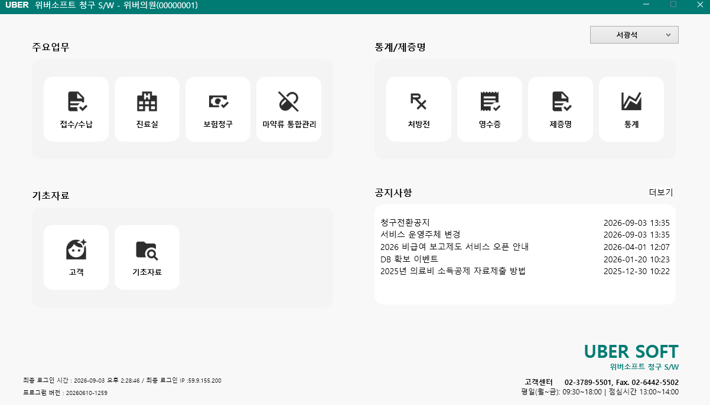
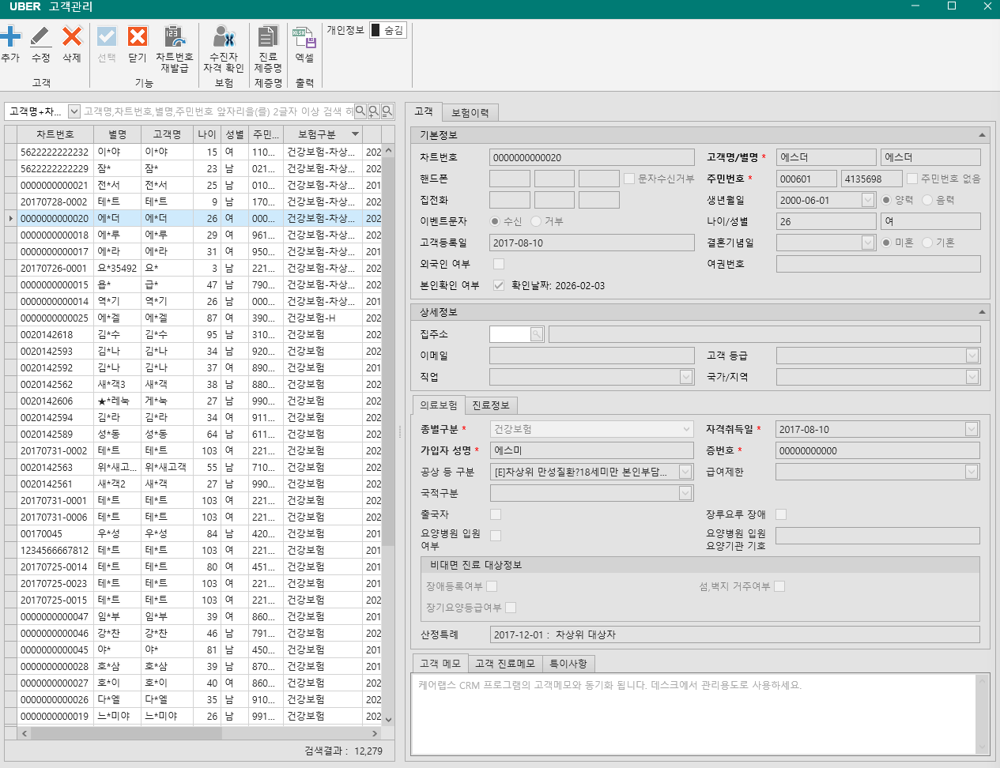
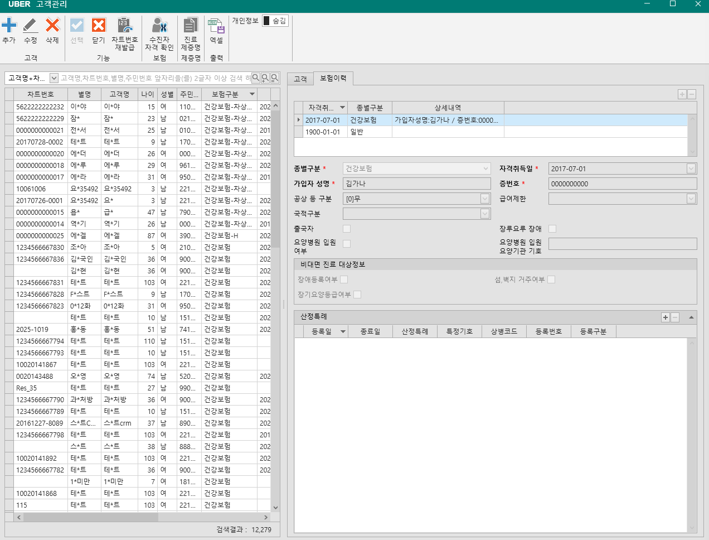

# 화면별 개발 요구사항

목적: 화면 스크린샷 기준으로 청구 S/W 개발에 필요한 화면 구성, 필드, 기능, 필수 여부를 정리한다.

작성 방식: 짧게 쓴다. 화면에 보이는 항목과 개발에 필요한 데이터만 쓴다.

필수 기준:

| 구분 | 기준 |
| --- | --- |
| 필수 | 청구 S/W 기본 업무, 청구자료 생성, 접수/진료/수납, 권한, 운영 식별에 필요 |
| 조건부 | 병원 운영 방식이나 계약 기능에 따라 필요 |
| 비필수 | 청구 S/W 핵심 기능 없이도 운영 가능 |

## 1. 메인 화면

### 1.1 화면 개요

| 항목 | 내용 |
| --- | --- |
| 화면명 | 메인 화면 |
| 화면 목적 | 로그인 후 주요 업무 화면으로 이동 |
| 사용 시점 | 로그인 성공 직후 |
| 청구 S/W 필수 여부 | 필수 |
| 이유 | 접수, 진료, 수납, 보험청구, 기초자료로 진입하는 시작 화면 |

### 1.2 화면 진입 조건

| 조건 | 필수 여부 | 설명 |
| --- | --- | --- |
| 로그인 완료 | 필수 | 사용자 인증 성공 후 진입 |
| 병원 선택 완료 | 필수 | 요양기관기호와 병원명이 확정되어야 함 |
| 권한 로딩 완료 | 필수 | 메뉴별 접근 가능 여부 판단 |
| 프로그램 설정 로딩 | 필수 | 버전, 병원 설정, 보험청구 설정 확인 |
| 공지사항 조회 | 조건부 | 실패해도 메인 진입은 가능 |

### 1.3 상단 타이틀 영역

| 표시 항목 | 예시 | 필수 여부 | 설명 |
| --- | --- | --- | --- |
| 프로그램명 | 위버소프트 청구 S/W | 필수 | 청구 S/W 프로그램 식별명 |
| 병원명 | 위버의원 | 필수 | 현재 로그인한 병원명 |
| 요양기관기호 | 00000001 | 필수 | 청구자료 생성 기준 기관 코드 |

개발 규칙:

| 규칙 | 필수 여부 |
| --- | --- |
| 타이틀은 `프로그램명 - 병원명(요양기관기호)` 형식 | 필수 |
| 요양기관기호가 없으면 보험청구 메뉴 진입 차단 | 필수 |
| 병원명이 없으면 로그인 또는 병원 설정 오류로 처리 | 필수 |

### 1.4 사용자 메뉴 영역

| 표시 항목 | 예시 | 필수 여부 | 설명 |
| --- | --- | --- | --- |
| 로그인 사용자명 | 서광석 | 필수 | 현재 작업 사용자 |
| 로그아웃 | 메뉴 항목 | 필수 | 세션 종료 |
| 비밀번호 변경 | 메뉴 항목 | 조건부 | 자체 계정 관리 시 필요 |
| PC인증 | 관리자 메뉴 | 조건부 | 청구/DUR/수진자조회 PC 인증 관리 |
| PC인증 해제 | 관리자 메뉴 | 조건부 | 인증 PC 해제 |

개발 규칙:

| 규칙 | 필수 여부 |
| --- | --- |
| 사용자명은 로그인 계정 기준으로 표시 | 필수 |
| 관리자 전용 메뉴는 관리자에게만 표시 | 필수 |
| 로그아웃 시 캐시와 세션 정보 삭제 | 필수 |
| 로그아웃 후 로그인 화면으로 이동 | 필수 |

### 1.5 주요업무 메뉴

| 메뉴 | 필수 여부 | 이동 화면 | 설명 |
| --- | --- | --- | --- |
| 접수/수납 | 필수 | 접수/수납 화면 | 환자 접수, 대기, 수납, 환불 처리 |
| 진료실 | 필수 | 진료실 화면 | 진료기록, 상병, 처방, DUR, 계산 |
| 보험청구 | 필수 | 보험청구 화면 | 청구자료 집계, 오류점검, SAM 생성/수신 |
| 마약류 통합관리 | 조건부 | 마약류 관리 화면 | NIMS 구매/투약/조제 보고 |

개발 규칙:

| 규칙 | 필수 여부 |
| --- | --- |
| 메뉴 클릭 전 권한 확인 | 필수 |
| 권한이 없으면 진입 차단 | 필수 |
| 화면 이동 중 로딩 상태 표시 | 조건부 |
| 메뉴명은 권한 코드와 연결 | 필수 |

### 1.6 통계/제증명 메뉴

| 메뉴 | 필수 여부 | 이동 화면 | 설명 |
| --- | --- | --- | --- |
| 처방전 | 필수 | 처방전 출력 화면 | 원외처방전 조회/출력 |
| 영수증 | 필수 | 영수증 출력 화면 | 진료비 영수증 조회/출력 |
| 제증명 | 조건부 | 제증명 통합 화면 | 진단서, 확인서, 의뢰서 등 |
| 통계 | 조건부 | 통계 화면 | 수납, 처방, 비급여 보고용 집계 |

청구 S/W 기준:

| 항목 | 필수 여부 | 이유 |
| --- | --- | --- |
| 처방전 | 필수 | 원외처방 발생 시 출력 필요 |
| 영수증 | 필수 | 수납 완료 후 환자 제공 필요 |
| 제증명 | 조건부 | 인증 핵심보다 병원 운영 기능 |
| 통계 | 조건부 | 비급여 보고, 마감, 경영 자료에 필요 |

### 1.7 기초자료 메뉴

| 메뉴 | 필수 여부 | 이동 화면 | 설명 |
| --- | --- | --- | --- |
| 고객 | 필수 | 환자/고객 관리 화면 | 환자 등록, 수정, 보험정보 관리 |
| 기초자료 | 필수 | 기초자료 관리 화면 | 병원, 사용자, 권한, 수가, 약가, 상병, 용법 관리 |

개발 규칙:

| 규칙 | 필수 여부 |
| --- | --- |
| 고객 메뉴에서 환자 기본정보 관리 | 필수 |
| 기초자료 메뉴에서 청구 기준자료 관리 | 필수 |
| 기초자료 접근은 권한 필요 | 필수 |

### 1.8 공지사항 영역

| 표시 항목 | 예시 | 필수 여부 | 설명 |
| --- | --- | --- | --- |
| 공지 제목 | 청구전환공지 | 조건부 | 운영 공지 제목 |
| 공지 일시 | 2026-09-03 13:35 | 조건부 | 공지 등록 또는 표시 일시 |
| 더보기 | 더보기 | 조건부 | 공지사항 목록 화면 이동 |

개발 규칙:

| 규칙 | 필수 여부 |
| --- | --- |
| 최신 공지 일부만 메인에 표시 | 조건부 |
| 공지 클릭 시 상세 표시 | 조건부 |
| 공지 조회 실패 시 메인 업무 사용은 가능해야 함 | 필수 |
| 공지가 없으면 빈 영역 또는 안내 문구 표시 | 조건부 |

### 1.9 하단 운영 정보

| 표시 항목 | 예시 | 필수 여부 | 설명 |
| --- | --- | --- | --- |
| 최종 로그인 시간 | 2026-09-03 오후 2:28:46 | 필수 | 보안 확인용 |
| 최종 로그인 IP | 59.9.155.200 | 필수 | 접속 이력 확인용 |
| 프로그램 버전 | 20260610-1259 | 필수 | 장애 대응, 인증 버전 식별 |
| 고객센터 전화 | 02-3789-5501 | 비필수 | 업체 안내 |
| 고객센터 팩스 | 02-6442-5502 | 비필수 | 업체 안내 |
| 운영 시간 | 평일 09:30~18:00 | 비필수 | 업체 안내 |
| 업체 로고 | UBER SOFT | 비필수 | 브랜드 표시 |

개발 규칙:

| 규칙 | 필수 여부 |
| --- | --- |
| 로그인 시간과 IP는 실제 로그인 이력 기준 | 필수 |
| 프로그램 버전은 빌드 또는 배포 버전 기준 | 필수 |
| 버전은 청구 S/W 인증 버전 추적에 사용 | 필수 |

### 1.10 데모 모드 안내

| 항목 | 필수 여부 | 설명 |
| --- | --- | --- |
| 데모 사용 여부 | 조건부 | 데모 병원일 때만 표시 |
| 제한 안내 | 조건부 | 수진자조회, DUR, EDI 송수신 제한 안내 |

개발 규칙:

| 규칙 | 필수 여부 |
| --- | --- |
| 데모 병원은 외부 연계 기능 차단 | 필수 |
| 실사용 병원은 데모 안내 숨김 | 필수 |

### 1.11 메뉴 데이터 필드

| 필드 | 필수 여부 | 설명 |
| --- | --- | --- |
| MenuId | 필수 | 메뉴 권한과 화면 이동에 쓰는 식별자 |
| Title | 필수 | 화면에 표시할 메뉴명 |
| Group | 필수 | 메뉴 묶음명 |
| GroupColor | 비필수 | 메뉴 그룹 배경색 |
| Image | 비필수 | 기본 아이콘 |
| ImageHover | 비필수 | 마우스 오버 아이콘 |
| TargetScreen | 필수 | 클릭 시 열 화면 |
| RequiredAuth | 필수 | 접근 권한 코드 |
| IsVisible | 필수 | 권한/설정에 따른 표시 여부 |
| SortOrder | 조건부 | 표시 순서가 바뀔 수 있으면 필요 |

### 1.12 공지사항 데이터 필드

| 필드 | 필수 여부 | 설명 |
| --- | --- | --- |
| NoticeId | 필수 | 공지 식별자 |
| Title | 필수 | 공지 제목 |
| NoticeDate | 필수 | 공지 표시 일시 |
| Content | 조건부 | 상세 내용 |
| Url | 조건부 | 외부 공지 링크 |
| TotalCount | 조건부 | 페이징 표시용 전체 건수 |
| IsPopup | 조건부 | 팝업 공지 여부 |
| IsVisible | 필수 | 노출 여부 |

### 1.13 사용자/병원 데이터 필드

| 필드 | 필수 여부 | 설명 |
| --- | --- | --- |
| UserId | 필수 | 로그인 사용자 식별자 |
| UserName | 필수 | 로그인 사용자명 |
| RoleIds | 필수 | 사용자 권한 목록 |
| IsAdministrator | 필수 | 관리자 메뉴 표시 여부 |
| HospitalCode | 필수 | 요양기관기호 |
| HospitalName | 필수 | 병원명 |
| IsDemoSite | 조건부 | 데모 병원 여부 |
| LoginTime | 필수 | 최종 로그인 시간 |
| RemoteIpAddress | 필수 | 최종 로그인 IP |
| ProgramVersion | 필수 | 프로그램 버전 |

### 1.14 권한 체크

| 메뉴 | 권한 필요 | 없을 때 처리 |
| --- | --- | --- |
| 접수/수납 | 필요 | 접근 차단 |
| 진료실 | 필요 | 접근 차단 |
| 보험청구 | 필요 | 접근 차단 |
| 마약류 통합관리 | 필요 | 접근 차단 |
| 처방전 | 필요 | 접근 차단 |
| 영수증 | 필요 | 접근 차단 |
| 제증명 | 필요 | 접근 차단 |
| 통계 | 필요 | 접근 차단 |
| 고객 | 필요 | 접근 차단 |
| 기초자료 | 필요 | 접근 차단 |

### 1.15 청구 S/W 완성 기준

| 항목 | 필수 여부 | 완료 기준 |
| --- | --- | --- |
| 로그인 후 메인 진입 | 필수 | 병원/사용자/권한이 로딩됨 |
| 메뉴 표시 | 필수 | 업무 그룹별 메뉴가 보임 |
| 메뉴 권한 확인 | 필수 | 권한 없는 메뉴 진입 불가 |
| 접수/수납 이동 | 필수 | 접수/수납 화면 열림 |
| 진료실 이동 | 필수 | 진료실 화면 열림 |
| 보험청구 이동 | 필수 | 보험청구 화면 열림 |
| 처방전 이동 | 필수 | 처방전 화면 열림 |
| 영수증 이동 | 필수 | 영수증 화면 열림 |
| 고객 이동 | 필수 | 환자/고객 화면 열림 |
| 기초자료 이동 | 필수 | 기초자료 화면 열림 |
| 프로그램 버전 표시 | 필수 | 화면 하단에 버전 표시 |
| 로그인 이력 표시 | 필수 | 시간/IP 표시 |
| 공지사항 표시 | 조건부 | 조회 가능 시 표시 |
| 업체 안내 표시 | 비필수 | 없어도 청구 기능 영향 없음 |

### 1.16 개발 순서

| 순서 | 작업 | 필수 여부 |
| --- | --- | --- |
| 1 | 로그인 결과에서 사용자/병원 정보 확정 | 필수 |
| 2 | 권한 목록 조회 | 필수 |
| 3 | 메인 메뉴 목록 구성 | 필수 |
| 4 | 권한 기준으로 메뉴 표시/차단 | 필수 |
| 5 | 메뉴 클릭 시 대상 화면 연결 | 필수 |
| 6 | 로그인 시간/IP/버전 표시 | 필수 |
| 7 | 공지사항 조회/표시 | 조건부 |
| 8 | 고객센터/로고 표시 | 비필수 |

### 1.17 예외 처리

| 상황 | 처리 | 필수 여부 |
| --- | --- | --- |
| 사용자 권한 없음 | 메뉴 진입 차단 메시지 | 필수 |
| 대상 화면 없음 | 지원하지 않는 모듈 메시지 | 필수 |
| 공지 조회 실패 | 메인 화면은 계속 사용 | 필수 |
| 병원 정보 없음 | 로그인 또는 설정 오류 처리 | 필수 |
| 요양기관기호 없음 | 보험청구 기능 차단 | 필수 |
| 외부 연계 데모 제한 | 수진자조회/DUR/EDI 차단 | 필수 |

## 2. 고객 관리

### 2.1 화면 개요

| 항목 | 내용 |
| --- | --- |
| 화면명 | 고객 관리 |
| 화면 목적 | 환자 기본정보, 보험자격, 산정특례, 메모 관리 |
| 사용 시점 | 접수 전, 접수 중, 청구 오류 수정 시 |
| 청구 S/W 필수 여부 | 필수 |
| 이유 | 수진자조회, 접수, 진료, 본인부담 계산, 보험청구 명세서의 기준 데이터 |

### 2.2 화면 구성

| 영역 | 필수 여부 | 설명 |
| --- | --- | --- |
| 상단 기능 버튼 | 필수 | 추가, 수정, 삭제, 닫기, 수진자 자격 확인 |
| 좌측 고객 목록 | 필수 | 환자 검색/선택 |
| 우측 고객 상세 | 필수 | 선택 환자 정보 표시/수정 |
| 고객 탭 | 필수 | 기본정보, 상세정보, 현재 보험정보 |
| 보험이력 탭 | 필수 | 자격취득일별 보험 이력 관리 |
| 개인정보 숨김 | 필수 | 주민번호/전화번호 등 마스킹 제어 |

### 2.3 상단 기능 버튼

| 버튼 | 필수 여부 | 기능 |
| --- | --- | --- |
| 추가 | 필수 | 신규 고객 등록 |
| 수정 | 필수 | 선택 고객 수정 모드 전환 |
| 삭제 | 필수 | 선택 고객 삭제 또는 사용중지 |
| 선택 | 조건부 | 팝업/선택 모드에서 고객 선택 |
| 닫기 | 필수 | 고객관리 창 닫기 |
| 차트번호 재발급 | 조건부 | 선택 고객 차트번호 재발급 |
| 수진자 자격 확인 | 필수 | 건강보험/의료급여 자격조회 실행 |
| 진료 제증명 | 조건부 | 선택 고객의 진료 제증명 출력 |
| 엑셀 | 비필수 | 고객 목록 엑셀 출력 |
| 개인정보 숨김 | 필수 | 개인정보 마스킹 표시 전환 |

개발 규칙:

| 규칙 | 필수 여부 |
| --- | --- |
| 추가/수정/삭제는 고객 권한 필요 | 필수 |
| 수진자 자격 확인은 주민번호와 고객명이 있어야 실행 | 필수 |
| 차트번호 재발급은 기존 진료/수납 연결을 유지해야 함 | 필수 |
| 삭제는 청구/진료 이력이 있으면 물리삭제 금지 | 필수 |
| 개인정보 숨김은 권한 없는 사용자에게 강제 적용 | 필수 |

### 2.4 고객 검색 영역

| 항목 | 필수 여부 | 설명 |
| --- | --- | --- |
| 검색조건 | 필수 | 고객명, 차트번호, 별명, 주민번호 앞자리, 휴대폰 뒷자리 |
| 검색어 | 필수 | 2글자 이상 검색 기준 사용 |
| 검색 버튼 | 필수 | 조건 검색 실행 |
| 결과 건수 | 필수 | 검색 결과 전체 건수 표시 |

개발 규칙:

| 규칙 | 필수 여부 |
| --- | --- |
| 개인정보 검색은 마스킹 표시와 별개로 내부 원본값 기준 검색 | 필수 |
| 주민번호 검색은 앞자리 검색만 허용하는 방향 권장 | 필수 |
| 휴대폰 검색은 뒷 4자리 검색 지원 | 필수 |
| 검색 결과는 페이징 처리 | 필수 |

### 2.5 고객 목록 컬럼

| 컬럼 | 필수 여부 | 설명 |
| --- | --- | --- |
| 차트번호 | 필수 | 병원 내 환자 식별 번호 |
| 별명 | 조건부 | CRM 또는 병원 내부 표시명 |
| 고객명 | 필수 | 환자 성명 |
| 나이 | 필수 | 생년월일/주민번호 기준 계산 |
| 성별 | 필수 | 주민번호 또는 직접 입력 기준 |
| 주민번호 | 필수 | 마스킹 표시 |
| 보험구분 | 필수 | 현재 적용 보험 종류 |
| 내원일 | 조건부 | 마지막 내원일 |
| CRM 연동 | 조건부 | 외부 CRM 동기화 여부 |
| 핸드폰 | 조건부 | 마스킹 표시 |
| 고객메모 | 조건부 | 관리 메모 요약 |

### 2.6 고객 기본정보 필드

| 필드 | 필수 여부 | 설명 |
| --- | --- | --- |
| 차트번호 | 필수 | 환자 고유번호. 자동채번 또는 직접입력 |
| 고객명 | 필수 | 수진자조회와 청구 명세서 수진자명 기준 |
| 별명 | 조건부 | CRM 이름 또는 병원 표시명 |
| 주민번호 앞자리 | 필수 | 생년월일/자격조회 기준 |
| 주민번호 뒷자리 | 필수 | 성별/자격조회/청구 기준 |
| 주민번호 없음 | 조건부 | 외국인/임시고객 등 예외 처리 |
| 핸드폰 | 조건부 | 연락처. 문자 수신에도 사용 |
| 문자수신거부 | 조건부 | 일반 안내 문자 수신 거부 |
| 집전화 | 비필수 | 보조 연락처 |
| 이벤트문자 | 비필수 | 마케팅 문자 수신 여부 |
| 고객등록일 | 필수 | 고객 최초 등록일 |
| 외국인 여부 | 조건부 | 외국인 환자 구분 |
| 본인확인 여부 | 필수 | 본인확인 수행 여부 |
| 확인날짜 | 필수 | 본인확인 완료일 |
| 생년월일 | 필수 | 나이 계산, 출력물 표시 |
| 양력/음력 | 비필수 | 생일 관리용 |
| 나이 | 필수 | 진료/본인부담 계산 참고 |
| 성별 | 필수 | DUR/진료/청구 참고 |
| 결혼기념일 | 비필수 | CRM성 정보 |
| 미혼/기혼 | 비필수 | CRM성 정보 |
| 여권번호 | 조건부 | 외국인 환자 식별 보조 |

개발 규칙:

| 규칙 | 필수 여부 |
| --- | --- |
| 고객명, 주민번호는 수진자조회 요청값 | 필수 |
| 주민번호가 없으면 보험청구 대상 처리 제한 | 필수 |
| 나이와 성별은 주민번호 또는 생년월일 기준 자동 계산 | 필수 |
| 차트번호는 중복 불가 | 필수 |
| 개인정보는 저장 시 암호화 또는 보호 대상 | 필수 |

### 2.7 상세정보 필드

| 필드 | 필수 여부 | 설명 |
| --- | --- | --- |
| 집주소 우편번호 | 비필수 | 주소 검색 결과 |
| 집주소 | 비필수 | 환자 주소 |
| 이메일 | 비필수 | 보조 연락처 |
| 직업 | 비필수 | CRM/통계용 |
| 고객 등급 | 조건부 | 병원 고객 분류 |
| 국가/지역 | 조건부 | 외국인/지역 통계 |

### 2.8 현재 의료보험 필드

| 필드 | 필수 여부 | 설명 |
| --- | --- | --- |
| 종별구분 | 필수 | 건강보험, 의료급여, 일반 등 보험 구분 |
| 자격취득일 | 필수 | 해당 보험자격 시작일 |
| 가입자 성명 | 필수 | 건강보험 가입자명. 의료급여는 세대주명 |
| 증번호 | 필수 | 건강보험 증번호 또는 의료급여 시설기호 |
| 공상 등 구분 | 필수 | 차상위, 보훈, 공상 등 청구 구분 |
| 급여제한 | 필수 | 무자격, 체납, 사망, 출국 등 제한 |
| 국적구분 | 조건부 | 내국인/외국인/재외국민 |
| 출국자 | 조건부 | 출국자는 급여 제한 가능 |
| 장루요루 장애 | 조건부 | 치료재료 본인부담 계산에 사용 |
| 요양병원 입원 여부 | 조건부 | 비대면/청구 제한 확인 |
| 요양병원 입원 요양기관 기호 | 조건부 | 입원 요양병원 기호 |
| 비대면 장애등록여부 | 조건부 | 비대면 진료 대상정보 |
| 비대면 섬/벽지 거주여부 | 조건부 | 비대면 진료 대상정보 |
| 비대면 장기요양등급여부 | 조건부 | 비대면 진료 대상정보 |
| 산정특례 | 조건부 | 현재 적용 산정특례 요약 |
| 선택기관 | 조건부 | 의료급여 선택기관 요약 |

청구 규칙:

| 규칙 | 필수 여부 |
| --- | --- |
| 진료일 기준으로 적용 가능한 보험이력 1건을 선택 | 필수 |
| 건강보험/의료급여는 보험구분, 자격취득일, 가입자명, 증번호 필요 | 필수 |
| 일반/비급여 진료는 보험청구 대상에서 제외 가능 | 필수 |
| 급여제한이 있으면 보험청구 전 오류 또는 경고 | 필수 |

### 2.9 보험이력 목록

| 컬럼 | 필수 여부 | 설명 |
| --- | --- | --- |
| 자격취득일 | 필수 | 보험자격 시작일 |
| 종별구분 | 필수 | 보험 종류 |
| 상세내역 | 조건부 | 수진자조회 결과 요약 |

개발 규칙:

| 규칙 | 필수 여부 |
| --- | --- |
| 보험이력은 여러 건 저장 가능 | 필수 |
| 기본 정렬은 자격취득일 내림차순 | 필수 |
| 진료일보다 이전의 가장 최신 보험이력을 사용 | 필수 |
| 보험이력 삭제 시 해당 이력을 참조하는 진료가 있으면 제한 | 필수 |
| 수진자조회 결과가 기존 이력과 다르면 변경 확인 후 반영 | 필수 |

### 2.10 보험이력 상세 필드

| 필드 | 필수 여부 | 설명 |
| --- | --- | --- |
| 종별구분 | 필수 | 보험 종류 |
| 자격취득일 | 필수 | 보험자격 시작일 |
| 가입자 성명 | 필수 | 가입자/세대주명 |
| 증번호 | 필수 | 보험증번호 |
| 공상 등 구분 | 필수 | 청구 구분 |
| 급여제한 | 필수 | 급여 제한 사유 |
| 국적구분 | 조건부 | 외국인/재외국민 구분 |
| 출국자 | 조건부 | 급여 제한 판단 |
| 요양병원 입원 여부 | 조건부 | 요양병원 입원 상태 |
| 요양병원 입원 요양기관 기호 | 조건부 | 입원 기관 기호 |
| 장루요루 장애 | 조건부 | 본인부담 특례 계산 |
| 비대면 진료 대상정보 | 조건부 | 비대면 진료 가능 조건 |

### 2.11 의료급여 추가 필드

| 필드 | 필수 여부 | 설명 |
| --- | --- | --- |
| 의료급여 종별구분 | 필수 | 1종, 2종, 행려, 노숙인 등 |
| 보장기관 | 필수 | 보장기관기호 |
| 세대주 | 필수 | 의료급여 세대주명 |
| 시설기호 | 조건부 | 보장시설/노숙인시설 기호 |
| 건강생활비 | 조건부 | 의료급여 건강생활유지비 잔액 |
| 산전지원금 | 조건부 | 산전지원금 잔액 |
| 본인부담 | 조건부 | 의료급여 본인부담 산정특례 코드 |
| 선택기관 | 조건부 | 선택의료급여기관 목록 |

### 2.12 산정특례 목록

| 컬럼 | 필수 여부 | 설명 |
| --- | --- | --- |
| 등록일 | 필수 | 산정특례 시작일 |
| 종료일 | 조건부 | 산정특례 종료일 |
| 산정특례 | 필수 | 본인부담 산정특례 구분 |
| 특정기호 | 필수 | 청구 명세서 특정기호 |
| 상병코드 | 조건부 | 산정특례 대상 상병 |
| 등록번호 | 조건부 | 산정특례 등록번호 |
| 등록구분 | 조건부 | 산정특례 등록 구분 |

개발 규칙:

| 규칙 | 필수 여부 |
| --- | --- |
| 산정특례는 보험이력 하위 데이터 | 필수 |
| 진료일 기준 유효기간 안의 산정특례만 적용 | 필수 |
| 특정기호는 청구 명세서에 전달 | 필수 |
| 산정특례가 본인부담 계산에 영향을 주면 계산 전에 확정 | 필수 |

### 2.13 진료정보 필드

| 필드 | 필수 여부 | 설명 |
| --- | --- | --- |
| 담당의사 | 조건부 | 기본 진료의사 |
| 내원경로 | 비필수 | 유입 경로 |
| 상담자 | 비필수 | 상담 담당자 |
| 소개자 | 비필수 | 추천 고객 |

### 2.14 메모 필드

| 필드 | 필수 여부 | 설명 |
| --- | --- | --- |
| 고객 메모 | 조건부 | 데스크/CRM 관리 메모 |
| 고객 진료메모 | 조건부 | 진료실에서 참고할 환자 메모 |
| 특이사항 | 조건부 | 알레르기, 주의사항 등 중요 안내 |

개발 규칙:

| 규칙 | 필수 여부 |
| --- | --- |
| 특이사항은 접수/진료 화면에서도 확인 가능해야 함 | 조건부 |
| 고객 진료메모는 진료실에서 누적 확인 가능해야 함 | 조건부 |
| 메모는 줄바꿈 저장 가능 | 조건부 |

### 2.15 저장 데이터

| 데이터 | 필수 여부 | 설명 |
| --- | --- | --- |
| Patient | 필수 | 환자 기본정보 |
| PatientInsurance | 필수 | 보험자격 이력 |
| PatientInsuranceMedicalAid | 조건부 | 의료급여 상세 |
| PatientInsuranceSpecialCase | 조건부 | 산정특례 |
| PatientInsuranceMedicalAidAppointHospital | 조건부 | 의료급여 선택기관 |
| PatientChartNumber | 필수 | 차트번호 채번/이력 |
| PatientVital | 비필수 | 바이탈 별도 화면 |
| PatientSurgery | 비필수 | 수술 이력 별도 화면 |

### 2.16 수진자조회 연계

| 항목 | 필수 여부 | 설명 |
| --- | --- | --- |
| 요청값 | 필수 | 고객명, 주민번호 |
| 수신값 | 필수 | 보험구분, 자격취득일, 가입자명, 증번호, 공상 등 구분, 급여제한 |
| 의료급여 수신값 | 조건부 | 보장기관, 의료급여 종별, 선택기관, 본인부담 코드 |
| 산정특례 수신값 | 조건부 | 특정기호, 등록일, 종료일, 상병코드, 등록번호 |
| 변경 확인 | 필수 | 기존 보험정보와 수신정보가 다르면 사용자 확인 후 저장 |

### 2.17 청구 S/W 완성 기준

| 항목 | 필수 여부 | 완료 기준 |
| --- | --- | --- |
| 고객 검색 | 필수 | 이름/차트번호/주민번호/전화번호 검색 가능 |
| 고객 등록 | 필수 | 필수 기본정보 저장 가능 |
| 고객 수정 | 필수 | 개인정보/보험정보 수정 가능 |
| 고객 삭제 | 필수 | 이력 있는 고객 물리삭제 방지 |
| 개인정보 마스킹 | 필수 | 권한별 주민번호/전화번호 숨김 가능 |
| 보험이력 관리 | 필수 | 자격취득일별 복수 이력 저장 |
| 수진자조회 반영 | 필수 | 조회 결과를 보험이력에 저장 |
| 산정특례 관리 | 필수 | 보험이력별 산정특례 저장 |
| 진료일 기준 보험 선택 | 필수 | 접수/진료/청구에서 동일 기준 사용 |
| 청구 명세서 환자정보 생성 | 필수 | 수진자명, 주민번호, 보험증번호, 종별구분 생성 가능 |

### 2.18 개발 순서

| 순서 | 작업 | 필수 여부 |
| --- | --- | --- |
| 1 | 환자 기본정보 저장 구조 구현 | 필수 |
| 2 | 차트번호 채번/중복검사 구현 | 필수 |
| 3 | 고객 검색/목록 구현 | 필수 |
| 4 | 개인정보 마스킹/권한 구현 | 필수 |
| 5 | 보험이력 저장 구조 구현 | 필수 |
| 6 | 의료급여 상세 구조 구현 | 조건부 |
| 7 | 산정특례 구조 구현 | 필수 |
| 8 | 수진자조회 결과 반영 구현 | 필수 |
| 9 | 접수/진료에서 현재 보험이력 조회 구현 | 필수 |
| 10 | 청구 명세서 환자정보 매핑 구현 | 필수 |
| 11 | CRM성 정보 구현 | 비필수 |
| 12 | 엑셀 출력 구현 | 비필수 |

### 2.19 예외 처리

| 상황 | 처리 | 필수 여부 |
| --- | --- | --- |
| 고객명 없음 | 저장 차단 | 필수 |
| 주민번호 없음 | 보험청구 대상이면 저장/접수 제한 | 필수 |
| 차트번호 중복 | 저장 차단 | 필수 |
| 보험이력 없음 | 보험진료 접수 제한 | 필수 |
| 진료일에 맞는 보험이력 없음 | 접수/청구 오류 | 필수 |
| 수진자조회 결과 불일치 | 변경 확인 후 반영 | 필수 |
| 급여제한 대상 | 보험청구 전 경고 또는 차단 | 필수 |
| 권한 없는 개인정보 조회 | 마스킹 강제 | 필수 |
| 진료/수납 이력 있는 고객 삭제 | 물리삭제 금지 | 필수 |
## 3. 기초자료 화면

기초자료 화면은 별도 문서에서 관리한다.

| 문서 | 내용 |
| --- | --- |
| 기초자료 화면 개발 요구사항 | 상병관리, 사용자 약가 관리, 사용자 수가 관리 등 기초자료 화면별 필드/기능/필수 여부 |
