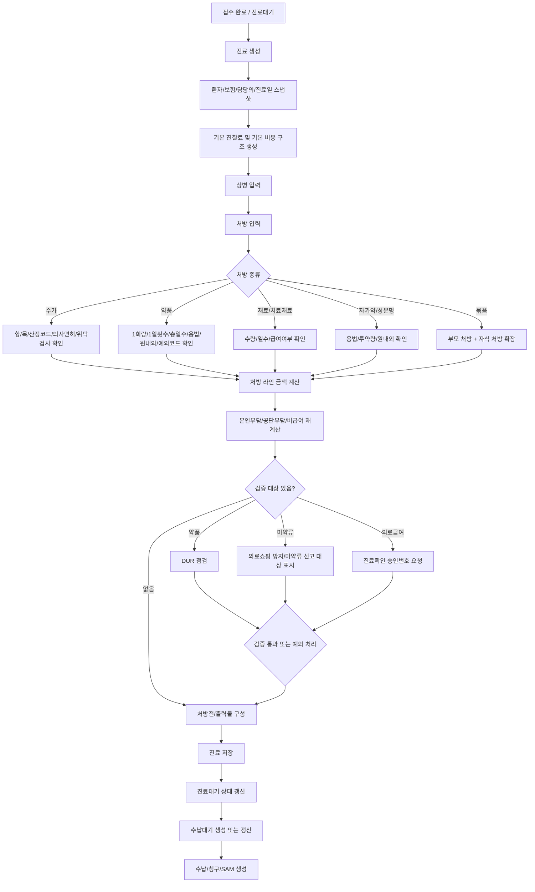
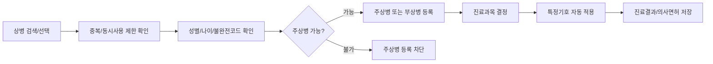
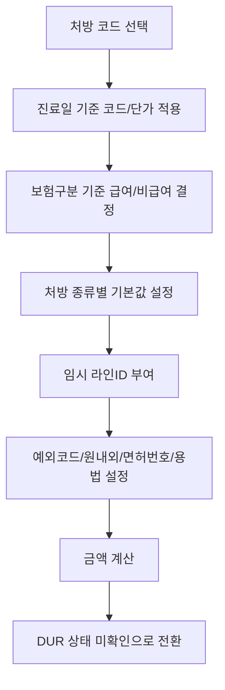
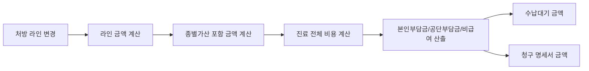
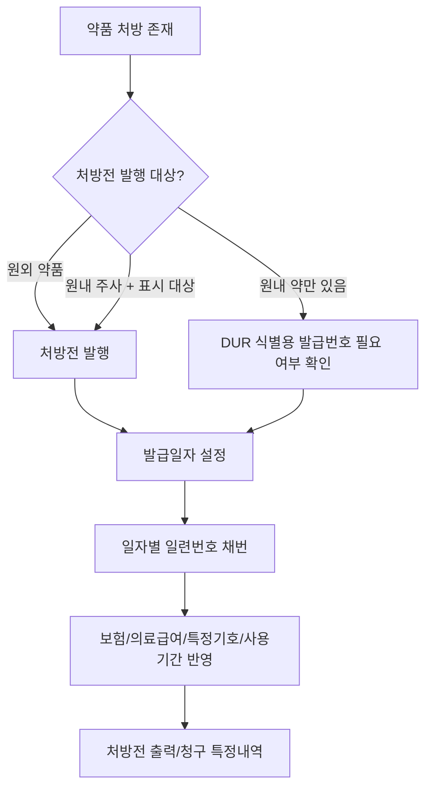
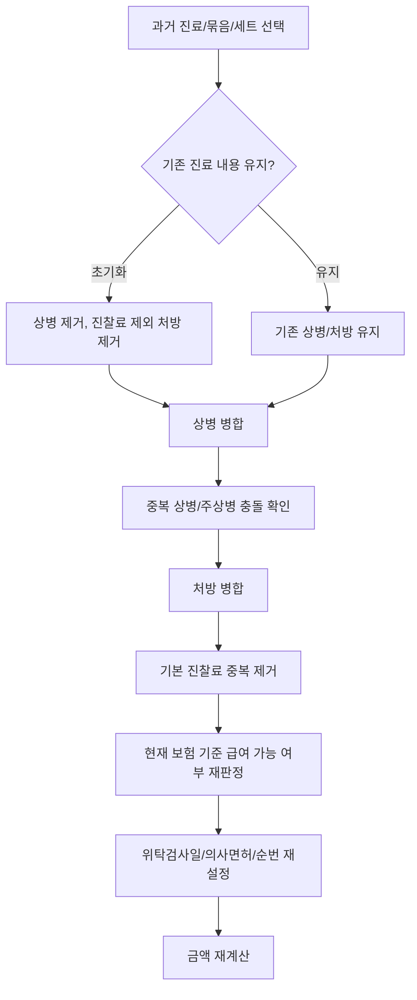
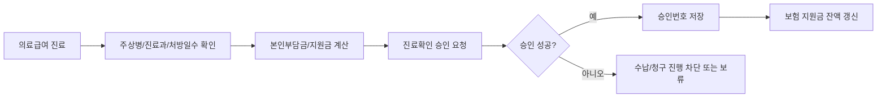
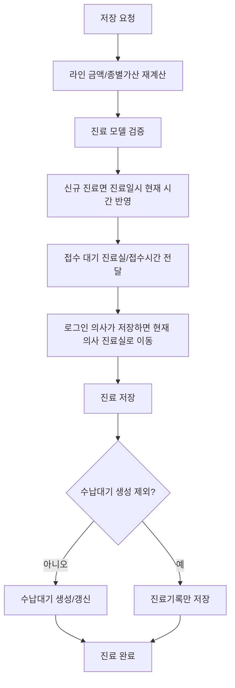
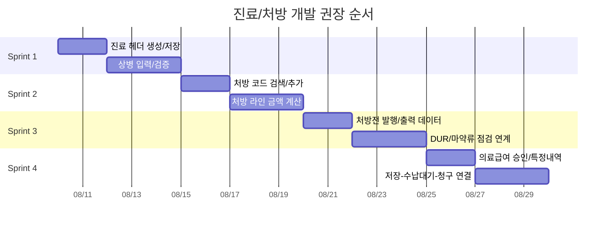

# 진료/처방 도메인 분석

이 문서는 접수 이후 진료실에서 발생하는 진료기록, 상병, 처방, 처방전, DUR/마약류 연계, 비용 계산, 수납 대기 전환까지의 업무 로직을 개발언어에 종속되지 않는 형태로 정리한다.

## 1. 도메인 위치

진료/처방은 EMR의 중심 트랜잭션이다. 접수에서 생성된 대기 환자가 진료실로 넘어오면, 진료 도메인은 다음 결과물을 만든다.

| 결과물 | 의미 | 후속 사용처 |
|---|---|---|
| 진료 헤더 | 환자, 진료일시, 담당의, 보험구분, 진료구분, 증상/메모를 묶는 진료 단위 | 수납, 청구, 출력물, 통계 |
| 상병 | 해당 진료의 주상병/부상병/배제상병 | 비용 산정, 의료급여 승인, 청구 명세서 |
| 처방 | 수가, 약품, 재료, 자가약, 성분명, 묶음코드 등 진료행위 라인 | DUR, 마약류 점검, 비용계산, 처방전, 청구 |
| 처방전 | 원외 약품/일부 원내 주사약을 약국/환자용 출력물로 구성 | 출력, DUR 식별번호, 청구 특정내역 |
| 특정내역 | 명세서 단위 또는 처방 라인 단위의 보충 청구 정보 | SAM 청구 파일 |
| 비용 스냅샷 | 진료 당시 보험/본인부담/공단부담/비급여/지원금 계산 결과 | 수납, 영수증, 청구 |

## 2. 전체 업무 흐름

## 3. 진료 생성 규칙

| 단계 | 규칙 |
|---|---|
| 진료 시작 | 접수 대기 환자를 선택하면 해당 환자, 담당의, 진료일자를 기준으로 진료 1건을 만든다. |
| 보험구분 선택 | 접수/환자 보험에서 진료일 기준 유효한 보험을 가져온다. 별도 보험구분이 지정되면 그 값을 우선한다. |
| 진료일시 | 신규 진료는 선택한 진료일의 날짜에 현재 시간을 붙여 저장한다. |
| 청구 여부 | 건강보험/의료급여이면 기본적으로 청구 대상이다. 일반 진료는 청구 대상이 아니다. |
| 비용 초기화 | 보험구분이 결정되면 비용 구조와 본인부담 계산 기준을 만든다. |
| 담당의 | 접수 담당의가 있으면 그 담당의를 우선 사용하고, 없으면 로그인한 의사 정보를 사용한다. |

## 4. 진료 헤더 저장 필드

| 필드 | 뜻 | 업무 규칙 |
|---|---|---|
| 진료ID | 진료 1건의 식별자 | 신규 저장 전에는 비어 있고 저장 후 확정된다. |
| 환자 | 진료 대상 환자 | 접수 환자와 일치해야 한다. |
| 담당의 | 실제 진료를 본 의사 | 처방 수가와 상병의 면허번호 기본값으로 사용된다. |
| 진료일시 | 진료가 발생한 날짜/시간 | 청구, 처방전 발급일, 보험 자격 기준일이 된다. |
| 증상 | 환자 호소 증상/진료 내용 | 진료기록과 일부 출력물에 사용된다. |
| 진료 메모 | 내부 메모 | 청구 데이터와 분리해서 관리한다. |
| 명세서 메모 | 청구 명세서 보충 메모 | 청구 생성 시 명세서 단위 메모로 사용될 수 있다. |
| 상병 목록 | 주상병/부상병/배제상병 | 최소 주상병 1개가 필요하다. |
| 처방 목록 | 수가/약품/재료 등 라인 | 비용, DUR, 처방전, 청구의 핵심 입력이다. |
| 특정내역 목록 | 명세서 단위 특정내역 | 청구 시 특정내역 레코드로 변환된다. |
| 의료급여 승인번호 | 의료급여 진료확인 승인번호 | 의료급여 청구 명세서에 포함된다. |
| 임신 여부 | 임신 관련 산정/지원 판단 | 환자 성별과 보험/상병/수가 조건에 따라 활성화한다. |
| DUR 확인 여부 | 마지막 처방 상태에 대한 DUR 완료 여부 | 약 처방 변경 시 재확인이 필요하다. |
| 청구 여부 | 보험 진료라도 청구에서 제외할지 여부 | 건강보험/의료급여에서만 의미가 있다. |
| 진료구분 | 신환, 초진, 재진, 물리치료, 만성질환 등 | 기본 진찰료 수가와 맞아야 한다. |
| 작성자 | 진료를 생성한 사용자 | 수정 권한 판단에 사용된다. |
| 접수 진료실 | 접수 당시 대기실/진료실 | 대기 상태 전환에 사용된다. |
| 변경검증값 | 저장 충돌/변경 여부 확인용 값 | 동시 수정 방지에 사용한다. |

## 5. 상병 도메인

상병은 단순 진단명 저장이 아니라 청구의 기준이다. 특히 주상병은 의료급여 승인, 특정기호, 진료결과, 면허번호의 기준이 된다.

| 필드 | 뜻 | 업무 규칙 |
|---|---|---|
| 상병코드 | 표준 질병코드 | 중복 등록을 막아야 한다. |
| 사용자 상병코드 | 병원에서 검색/표시하는 코드 | 사용자가 임시 입력 후 다른 행으로 이동하면 실제 코드로 원복한다. |
| 상병명 | 질병명 | 출력/청구 검증에 사용된다. |
| 주상병 여부 | 해당 진료의 대표 상병 | 1건 이상 필요하며, 주상병 불가 코드는 주상병으로 저장할 수 없다. |
| 배제상병 여부 | 청구에서 제외할 상병 | 주상병으로 설정하면 배제상병은 해제한다. |
| 진료과목 | 상병에 적용할 진료과 | 진료실 설정, 의사 설정, 병원 기본값 순으로 결정한다. |
| 특정기호 | 산정특례 등 특정기호 | 주상병에만 유지하고 부상병 저장 시 제거한다. |
| 상해외인 | 상해 원인 코드 | 주상병에만 유지한다. |
| 진료결과 | 계속, 이송, 회송, 사망, 치료종결 등 | 주상병 필수값이다. 기본은 계속이다. |
| 의사면허번호 | 주된 의사의 면허번호 | 주상병에만 유지한다. |
| 순번 | 명세서 상병 순서 | 주상병을 선두 기준으로 정렬한다. |

### 상병 추가 검증

| 검증 | 처리 |
|---|---|
| 동일 상병 중복 | 저장/추가 차단 |
| 동시에 사용할 수 없는 상병 조합 | 경고 메시지 표시 |
| 불완전 상병코드 | 경고 메시지 표시 |
| 주상병 불가 코드 | 주상병 등록 차단 |
| 법정감염병 코드 | 감염병 분류 경고 |
| 성별 제한 | 환자 성별과 다르면 차단 |
| 나이 제한 | 진료일 기준 환자 나이와 맞지 않으면 차단 |
| 보험 특례 | 환자 보험의 특례와 상병이 맞으면 주상병 특정기호 자동 적용 |

## 6. 처방 라인 도메인

처방 라인은 진료에서 가장 많은 업무 규칙이 몰리는 단위다. 한 라인이 비용계산, DUR, 처방전 출력, 청구 항/목, 특정내역, 마약류 신고까지 이어진다.

### 처방 종류

| 종류 | 의미 | 주요 규칙 |
|---|---|---|
| 수가 | 진찰료, 검사료, 처치료 등 의료행위 | 항/목, 산정코드, 의사면허번호, 종별가산, 위탁검사 여부가 중요하다. |
| 약품 | 원내/원외 약, 내복/외용/주사 | 투약량, 횟수, 일수, 용법, DUR, 처방전, 예외코드가 중요하다. |
| 성분명 | 성분명 처방 | 원외 처방으로 취급하며 약품 처방전/DUR 대상으로 본다. |
| 재료 | 약품성 재료 또는 일반 재료 | 수량/일수/급여여부를 비용계산에 반영한다. |
| 치료재료 | 치료재료 코드 | 치료재료 산정 및 본인부담률 판단에 사용한다. |
| 자가약 | 환자가 가져온 약 | 원내로 취급하며 투약량/용법을 저장한다. |
| 묶음코드 | 여러 처방을 한 번에 추가하는 세트 | 부모 처방과 자식 처방 관계를 유지한다. |

### 처방 라인 저장 필드

| 필드 | 뜻 | 업무 규칙 |
|---|---|---|
| 처방라인ID | 진료 내 처방 라인 식별자 | 저장 전 임시 식별자가 필요하다. 코드 자체는 식별자가 될 수 없다. |
| 처방코드 | 수가/약품/재료/묶음 코드 | 진료일 기준 유효한 코드와 단가를 사용한다. |
| 사용자 처방코드 | 병원 검색/표시용 코드 | 편집 중 이탈 시 실제 처방코드로 원복한다. |
| 처방명 | 표시명 | 병원 사용자명 또는 진료 중 수정명을 출력에 사용한다. |
| 급여 여부 | 급여/비급여 구분 | 일반 진료는 기본 비급여, 건강보험/의료급여는 코드의 급여 가능 여부를 따른다. |
| 본인부담률 | 100/100, 90, 80, 50, 30 등 | 급여이지만 별도 본인부담률이 있으면 금액계산과 청구에 반영한다. |
| 단가 | 진료일 기준 적용 단가 | 급여는 급여가, 비급여는 비급여가, 위탁검사는 수탁기관 단가를 사용할 수 있다. |
| 1회 투약량 | 1회에 투여하는 양 | 약품에서 주로 사용한다. 변경 시 금액 재계산한다. |
| 1일 횟수 | 하루 투여/실시 횟수 | 약품, 수가, 재료 모두 사용할 수 있다. 변경 시 금액 재계산한다. |
| 총일수 | 투약/실시 총 일수 | 약품, 치료재료, 위탁검사 수가에서 사용한다. |
| 용법 | 복용/사용 방법 | 약품, 성분명, 재료, 자가약에서 사용한다. |
| 원외 여부 | 원외 처방인지 여부 | 수가는 항상 원내, 약품은 코드/사용자 선택에 따라 원내외가 갈린다. |
| 약품 예외코드 | 의약분업 예외 코드 | 원내 약품 또는 특정 약품 예외에 사용한다. 원외 전환 시 제거한다. |
| 항번호 | 청구 항 분류 | 명세서 처방 레코드의 항 분류가 된다. |
| 목번호 | 청구 목 분류 | 명세서 처방 레코드의 목 분류가 된다. |
| 산정코드 | 수가 산정 세부 코드 | 수가 처방에서만 입력 가능하다. |
| 의사면허번호 | 처방/시행 의사 면허번호 | 수가 추가 시 담당의 면허번호가 기본값이다. |
| 위탁검사일 | 검사를 외부 수탁기관에 의뢰한 날짜 | 위탁검사 금액 및 청구 특정내역에 영향을 준다. |
| 수탁기관기호 | 외부 검사기관 코드 | 병원 코드와 다르면 위탁검사로 본다. |
| 라인 특정내역 | 처방 라인 단위 특정내역 | 청구에서 해당 처방 라인에 붙는다. |
| 금액 | 기본 산출 금액 | 수량/횟수/일수/단가로 계산한다. |
| 종별가산 포함 금액 | 종별가산 반영 후 금액 | 급여 수가이고 종별가산 대상일 때 사용한다. |
| 묶음 부모ID | 묶음코드 부모 처방 식별자 | 묶음 자식 처방은 부모와 함께 관리한다. |
| 수납계산 방식 | 수납 금액 산정 시 제외/포함 방식 | 값이 수납없음이면 환자 수납금액에서 제외한다. |
| 처방전 표시 여부 | 원내 주사 등 처방전에 표시할지 여부 | 원내 주사라도 표시 대상이면 처방전에 포함한다. |
| 마약류 구분 | 마약류 신고/점검 대상 구분 | 마약류 신고 도메인과 연계한다. |
| 마약류 결과코드 | 마약류 점검/신고 결과 | 의료쇼핑 방지 또는 신고 결과를 저장한다. |

## 7. 처방 추가 규칙

| 처방 종류 | 기본값/생성 규칙 |
|---|---|
| 약품 | 코드에 등록된 1회량, 1일횟수, 총일수, 용법, 원내외, 처방전 표시 여부를 가져온다. 원내 주사제이고 예외코드가 없으면 약품 예외코드 52를 기본 부여한다. |
| 수가 | 코드의 1일횟수, 총일수, 항/목을 가져오고 담당의 면허번호를 넣는다. 검사료 계열이 위탁기관을 갖고 있으면 위탁검사 처리한다. |
| 치료재료 | 1일횟수와 총일수를 가져온다. |
| 재료 | 원내로 취급하고 1회량, 1일횟수, 총일수, 용법을 가져온다. |
| 성분명 | 원외로 취급하고 1회량, 1일횟수, 총일수, 용법을 가져온다. |
| 자가약 | 원내로 취급하고 1회량, 1일횟수, 총일수, 용법을 가져온다. |
| 묶음코드 | 부모 라인을 만들고 내부 처방을 자식 라인으로 확장한다. 부모 묶음에 비급여 금액이 있으면 자식 금액은 0으로 처리할 수 있다. |

### 급여/비급여 결정

| 조건 | 결과 |
|---|---|
| 진료 보험구분이 일반 | 모든 처방은 기본 비급여 |
| 건강보험/의료급여 + 코드가 급여 | 급여 처방 |
| 건강보험/의료급여 + 코드가 비급여 | 비급여 처방 |
| 코드에 별도 본인부담률 존재 | 급여 처방이되 본인부담률 코드를 별도로 저장 |
| 진료일 기준 급여 불가 | 비급여 전환 또는 경고 |

## 8. 금액 계산 연결

처방 라인 금액은 진료 저장 전에 반드시 최신 상태여야 한다. 저장 직전 전체 처방에 대해 금액과 종별가산 포함 금액을 다시 계산한다.

| 재계산 트리거 | 재계산 대상 |
|---|---|
| 처방 추가/삭제 | 라인 금액, 진료 전체 비용, DUR 상태 |
| 투약량/횟수/일수 변경 | 라인 금액, 처방전 일수, DUR 상태 |
| 급여/비급여 변경 | 단가, 본인부담률, 진료 전체 비용 |
| 원내/원외 변경 | 처방전 대상, DUR 요청 구분, 비용 |
| 위탁검사 변경 | 단가, 종별가산, 청구 위탁 정보 |
| 묶음코드 확장/삭제 | 부모/자식 금액, 수납 제외 여부 |
| 보험구분 변경 | 전체 처방 급여 재판정, 비용 전체 재계산 |

## 9. 처방전 도메인

처방전은 원외 약품이 있을 때 발행된다. 단, 원내 약만 있더라도 DUR 점검을 위해 처방전 발급번호가 필요한 경우가 있어 발급번호 관리는 약품 존재 여부와 분리해서 봐야 한다.

| 필드 | 뜻 | 업무 규칙 |
|---|---|---|
| 처방전ID | 처방전 식별자 | 저장 후 발급 여부 판단에 사용한다. |
| 발급일자 | 처방전 교부일 | 기본은 진료일 날짜다. 진료일이 바뀌면 번호를 재발급해야 한다. |
| 발급일련번호 | 발급일자별 순번 | 저장 시 서버/저장소에서 확정한다. |
| 처방전발급번호 | 발급일자 8자리 + 일련번호 5자리 | 예: `YYYYMMDD00001`. 청구와 출력에서 사용한다. |
| 처방일수 | 처방 약품의 최대 투약일수 | 원외/표시 대상 약품 중 최대 총일수를 자동값으로 한다. 사용자가 수정하면 수정값을 우선한다. |
| 사용기간 | 처방전 유효기간 | 병원 설정값을 기본 적용한다. |
| 상병 표시 여부 | 처방전에 상병을 표시할지 여부 | 병원 설정값을 기본 적용한다. |
| 조제 참고사항 | 약국 전달 참고 문구 | 자동 생성 문구와 사용자 문구를 합친다. |
| 보험구분 | 처방전의 보험 유형 | 진료 비용의 보험구분과 일치시킨다. |
| 의료급여 종별 | 의료급여 1종/2종 등 | 환자 보험 자격에서 가져온다. |
| 공상 등 구분 | 공상/보훈 등 구분 | 환자 보험 자격에서 가져온다. |
| 급여제한 | 급여 제한 구분 | 환자 보험 자격에서 가져온다. |
| 보험증번호 | 건강보험 보험증번호 | 건강보험/100분의100 본인부담에서 사용한다. |
| 의료급여기관기호 | 의료급여 보장기관 기호 | 의료급여에서 사용한다. |
| 특정기호 | 주상병 특정기호 | 처방전과 청구 특정내역에 반영한다. |
| 기타 여부/문구 | 일반/100분의100 등 보험 외 표시 | 건강보험/의료급여가 아니면 처방전에 기타 문구를 표시한다. |

## 10. 의약분업 예외코드

| 단위 | 의미 | 규칙 |
|---|---|---|
| 진료 단위 예외코드 | 지역/환자/기타 사유 등 진료 전체 예외 | 입력되어 있으면 처방 라인별 예외를 별도로 선택하지 않아도 된다. |
| 약품 라인 예외코드 | 특정 약품에 대한 예외 | 약품 라인에만 사용한다. |
| 원외 처방 | 약국 조제 대상 | 원외로 바뀌면 라인 예외코드를 제거한다. |
| 원내 약품 | 병원 조제/투약 대상 | 예외코드 또는 원내 사유가 필요할 수 있다. |
| 원내 주사 | 병원 투약 주사 | 기본 예외코드 52가 자동 적용될 수 있다. |

## 11. 위탁검사

위탁검사는 수가 처방의 특수 케이스다. 병원 내부에서 시행하지 않고 외부 수탁기관에 의뢰하면 단가, 종별가산, 청구 정보가 달라진다.

| 필드 | 뜻 | 규칙 |
|---|---|---|
| 수탁기관기호 | 외부 검사기관 코드 | 병원 코드와 다르고 비어 있지 않으면 위탁검사로 본다. |
| 위탁검사일 | 의뢰일 | 기본적으로 진료일을 사용한다. |
| 위탁수가 코드 | 질가산/수탁기관 조건 반영 코드 | 수탁기관 정보에 따라 최종 수가 코드가 바뀔 수 있다. |
| 단가 | 수탁기관 기준 단가 | 일반 수가 단가 대신 위탁 단가를 사용할 수 있다. |
| 종별가산 | 병원 종별가산 | 위탁검사는 종별가산 제외 대상이 될 수 있다. |

## 12. 묶음/반복 처방

묶음코드와 과거 진료 복사는 피부/성형외과에서도 자주 쓰이는 생산성 기능이다. 다만 단순 복사가 아니라 현재 진료일, 보험, 담당의 기준으로 재판정해야 한다.

| 규칙 | 설명 |
|---|---|
| 기존 진찰료 보호 | 기존 진료를 초기화해도 기본 진찰료는 유지할 수 있다. |
| 기본 진찰료 중복 제거 | 복사 대상에 진찰료가 있어도 현재 진료에 이미 있으면 추가하지 않는다. |
| 주상병 충돌 처리 | 현재 진료에 주상병이 있으면 복사된 주상병은 부상병으로 낮춘다. |
| 상병 중복 제거 | 동일 상병은 중복 추가하지 않는다. |
| 급여 재판정 | 과거에는 급여였어도 현재 진료일 기준 급여 불가이면 비급여 전환/경고한다. |
| 일반 진료 전환 | 현재 보험구분이 일반이면 복사된 처방도 비급여로 전환한다. |
| 묶음 부모/자식 연결 | 묶음 부모ID를 유지하고 자식 처방은 수납없음 처리할 수 있다. |
| 위탁검사 재처리 | 복사된 위탁검사는 현재 진료일 기준으로 위탁일과 질가산 코드를 다시 확인한다. |

## 13. DUR/마약류 연계

| 구분 | 연계 방식 |
|---|---|
| DUR 대상 | 약품, 성분명, 일부 재료/자가약 중 DUR 대상 코드를 추출한다. |
| DUR 시점 | 진료 저장 전 또는 처방 확정 전 수행한다. |
| DUR 완료 표시 | 현재 처방 상태에 대한 DUR이 완료되면 진료에 완료 여부를 저장한다. |
| 처방 변경 | 약품 추가/삭제/용량/일수/원내외 변경 시 DUR 완료 상태를 해제하고 재점검한다. |
| DUR 취소 | 저장된 진료의 DUR 완료 상태를 취소할 수 있어야 한다. |
| 마약류 의료쇼핑 방지 | 마약류 처방이 있으면 환자/약품/투약정보를 기준으로 별도 점검한다. |
| 마약류 신고 | 처방 라인에 마약류 구분과 결과코드를 남겨 구매/투약/조제 신고와 연결한다. |

자세한 DUR 전문 생성과 결과 처리 규칙은 `DUR_Domain.md`를 기준으로 한다.

## 14. 의료급여 진료확인 승인

의료급여 진료는 수납/청구 전에 진료확인 승인번호가 필요할 수 있다.

| 입력 | 뜻 |
|---|---|
| 수진자 주민번호/성명 | 의료급여 수급자 식별 |
| 진료일 | 승인 기준일 |
| 주상병 코드 | 의료급여 승인 기준 상병 |
| 진료과목 | 승인 기준 진료과 |
| 원내 약 최대 투약일수 | 의료급여 승인 요청의 투약일수 |
| 환자 부담 예정액 | 지원금 제외 후 실제 부담 예정액 |
| 건강생활유지비/출산전진료비 | 지원금 차감 정보 |
| 비급여 금액 | 승인 요청 시 비급여 정보 |
| 본인부담코드 | 의료급여 본인부담 특례 코드 |
| 선택병의원 | 선택병의원 대상 코드인 경우 병원 정보 |
| 처방전 발급번호 | 처방전이 있는 경우 식별번호 |

| 결과 | 저장/사용 |
|---|---|
| 승인번호 | 진료에 저장하고 청구 명세서에는 병원기호를 제외한 승인번호 형태로 변환한다. |
| 지원금 잔액 | 환자 보험 자격의 건강생활유지비/출산전진료비 잔액을 갱신한다. |
| 실패 사유 | 사용자에게 표시하고 수납/청구 진행 여부를 결정한다. |

## 15. 진료 저장과 상태 전환

진료 저장은 기록 저장만이 아니다. 저장 직전에 비용을 재계산하고, 접수 대기와 수납 대기를 함께 갱신한다.

| 저장 요소 | 규칙 |
|---|---|
| 금액 재계산 | 저장 직전 모든 처방 라인의 금액과 종별가산을 다시 산출한다. |
| 진료 검증 | 환자, 담당의, 진료일, 주상병, 처방 필수값, 비용 구조를 검증한다. |
| 대기 정보 | 접수 대기의 기존 진료실, 새 진료실, 접수시간을 같이 넘긴다. |
| 의사 로그인 | 로그인 사용자가 의사이면 해당 의사의 진료실을 새 진료실로 본다. |
| 수납대기 제외 저장 | 임시 저장 또는 수납 제외 옵션이면 수납대기 생성 없이 저장할 수 있다. |
| 수납대기 생성 | 최종 저장이면 계산된 비용을 기준으로 수납대기를 생성/갱신한다. |

## 16. 개발 순서

| 우선순위 | 개발 범위 | 완료 기준 |
|---|---|---|
| 1 | 접수 환자로 진료 생성 | 환자, 보험, 담당의, 진료일, 기본 비용구조가 생성된다. |
| 2 | 상병 입력 | 주상병/부상병/배제상병, 진료과, 특정기호, 진료결과가 저장된다. |
| 3 | 처방 입력 | 수가/약품/재료/묶음 처방이 라인으로 추가되고 순번이 유지된다. |
| 4 | 처방 금액 | 수량/횟수/일수/급여/본인부담률/위탁검사/묶음 금액이 계산된다. |
| 5 | 처방전 | 발급일자, 발급번호, 처방일수, 사용기간, 출력 대상 약품이 구성된다. |
| 6 | 검증 연계 | DUR, 마약류 의료쇼핑 방지, 의료급여 승인번호가 진료 저장 전에 확인된다. |
| 7 | 저장/상태 전환 | 진료 저장 후 수납대기가 만들어지고 청구 입력으로 사용할 수 있다. |
| 8 | 반복/묶음 처방 | 과거 진료/세트 처방을 현재 진료일과 보험 기준으로 재판정해 병합한다. |

## 17. 일별 확인 체크리스트

| 일일 확인 항목 | 확인 내용 |
|---|---|
| 진료 생성 | 접수 환자를 열었을 때 환자/보험/담당의/진료일이 맞는가 |
| 보험 변경 | 건강보험, 의료급여, 일반 전환 시 처방 급여와 비용이 재계산되는가 |
| 상병 | 주상병 필수, 중복 상병, 성별/나이 제한, 특정기호 자동 적용이 동작하는가 |
| 처방 추가 | 수가/약품/재료/자가약/성분명/묶음별 기본값이 맞는가 |
| 원내외 | 원외 전환 시 예외코드가 제거되고 처방전 대상이 되는가 |
| 금액 | 1회량/1일횟수/총일수/급여 변경 시 라인 금액과 전체 비용이 바뀌는가 |
| 처방전 | 발급번호 형식, 사용기간, 처방일수, 출력 대상 약품이 맞는가 |
| DUR | 약품 변경 후 DUR 미확인 상태가 되고 재점검 후 완료 상태가 되는가 |
| 의료급여 | 승인번호 저장, 지원금 잔액 반영, 청구용 승인번호 변환이 맞는가 |
| 저장 | 저장 후 진료대기/수납대기 상태가 올바르게 바뀌는가 |

## 18. 테스트 시나리오

| 시나리오 | 기대 결과 |
|---|---|
| 건강보험 초진 + 주상병 + 진찰료만 저장 | 진료구분 초진, 청구 대상, 수납대기 생성 |
| 일반 진료 + 급여 수가 추가 | 처방은 비급여로 저장되고 청구 대상 아님 |
| 약품 원외 처방 추가 | 처방전 발급 대상, DUR 대상, 원외 약품 금액 규칙 적용 |
| 원내 주사제 추가 | 약품 예외코드 기본값 확인, 필요 시 처방전 표시 가능 |
| 처방 일수 변경 | 라인 금액, 처방전 처방일수, DUR 상태 변경 |
| 의료급여 + 주상병 + 원내약 | 원내 약 최대일수로 승인 요청, 승인번호 저장 |
| 묶음코드 추가 | 부모/자식 관계 유지, 자식 수납없음 또는 금액 0 규칙 확인 |
| 과거 진료 복사 | 중복 진찰료 제거, 보험 재판정, 상병 중복 제거 |
| 위탁검사 추가 | 수탁기관/위탁일/위탁 단가/종별가산 제외 여부 확인 |
| 진료 저장 후 수납 | 수납대기 금액과 진료 비용 스냅샷 일치 |

## 19. 구현 시 주의할 점

| 주의점 | 이유 |
|---|---|
| 처방코드를 라인 식별자로 쓰면 안 된다 | 같은 처방코드가 한 진료에 여러 번 들어갈 수 있다. |
| 진료일 기준 코드/단가를 사용해야 한다 | 수가와 약가는 적용일자에 따라 달라진다. |
| 보험구분 변경 시 전체 처방을 재판정해야 한다 | 일반/보험 전환에 따라 급여 여부와 본인부담률이 달라진다. |
| 주상병 필드는 부상병에 남기면 안 된다 | 특정기호, 진료결과, 면허번호가 부상병에 남으면 청구 오류가 난다. |
| 저장 직전 금액 재계산이 필요하다 | 화면 표시 금액과 저장 금액이 달라지는 것을 막는다. |
| DUR 완료 여부는 처방 상태와 묶여야 한다 | 약품 변경 후 과거 DUR 완료값을 그대로 쓰면 안 된다. |
| 처방전 발급번호는 청구와 출력에 모두 쓰인다 | 번호 재발급 조건과 저장 시점을 명확히 해야 한다. |
| 의료급여 승인번호는 병원기호 포함/제외 형태를 구분해야 한다 | 화면 표시와 청구 명세서 저장 형식이 다를 수 있다. |

## 20. 현재 소스 기준 확인 위치

| 영역 | 기준 파일 |
|---|---|
| 진료 헤더 모델 | `Data/UBerSoft.EMR.Data.Models/Treatments/Treatment.cs` |
| 처방 라인 모델 | `Data/UBerSoft.EMR.Data.Models/Treatments/TreatmentPrescribe.cs` |
| 상병 모델 | `Data/UBerSoft.EMR.Data.Models/Treatments/TreatmentDisease.cs` |
| 처방전 모델 | `Data/UBerSoft.EMR.Data.Models/Treatments/TreatmentPrescribeReport.cs` |
| 진료 저장/의료급여 승인/DUR 상태 | `Data/UBerSoft.EMR.Data/Controllers/Treatements/Concreate/TreatmentController.cs` |
| 처방 라인 업무 규칙 | `Data/UBerSoft.EMR.Data.ViewModels/Treatments/TreatmentPrescribeViewModel.cs` |
| 상병 업무 규칙 | `Data/UBerSoft.EMR.Data.ViewModels/Treatments/TreatmentDiseaseViewModel.cs` |
| 처방전 업무 규칙 | `Data/UBerSoft.EMR.Data.ViewModels/Treatments/TreatmentPrescribeReportViewModel.cs` |
| 처방 추가 변환 | `Data/UBerSoft.EMR.Data/Services/Concrete/PrescribeToTreatmentService.cs` |
| 상병 추가 변환 | `Data/UBerSoft.EMR.Data/Services/Concrete/DiseaseToTreatmentService.cs` |
| 과거/묶음 진료 병합 | `Data/UBerSoft.EMR.Data/Services/Concrete/TreatmentUnionService.cs` |

